# Groth16 from first principles — Installment 2: Optimizations and the trusted-setup ceremony

> **Installment 2 of 5.** In [Installment 1](zkp-from-first-principles.md) we built the entire Groth16 pipeline from first principles: R1CS → QAP → trusted setup → proof → pairing check, walking a tiny 5-constraint `SumOfProducts` circuit through 16 printable binaries. Along the way we deliberately leaned on the *dev* ceremony — fixed, deterministic scalars — so that every intermediate value is reproducible.
>
> The dev pipeline is correct, but it is also **slow, memory-hungry, single-party, and capped at 14 constraints**. This installment replaces each bottleneck with a production technique, and it does so the way the codebase actually grew: **one implementation at a time**, from the monomial baseline (Implementation 1) through the FFT engine (2), Pippenger MSM (3), the Circom adapter (4), on-the-fly QAP (5), sparse matrices (6), and h-query compression (7). Each section explains the bottleneck in plain words, shows the fix, and then hands you the exact CLI commands to see the difference for yourself — with real before/after numbers.
>
> After the sprint we turn to the production **trusted-setup ceremony** — why the scalars must be secret, how a known `τ` becomes a forgery factory, and how a multi-party MPC ceremony keeps `τ` unknown forever (this part is already written below). We close by surveying the landscape beyond Groth16 and where this stack goes next.
>
> We're writing this document the same way we built the code: **section by section.** Right now you're reading through Implementations 2 through 7 in full. Each section is self-contained, so you can jump in anywhere.

---

## Table of Contents

**Part One — the optimization sprint**

- [How to follow along](#how-to-follow-along)
- [The baseline: Implementation 1 — dense monomial](#the-baseline-implementation-1--dense-monomial)
- [The optimization sprint](#the-optimization-sprint)
- [Implementation 2 — FFT: polynomial arithmetic, O(n²) → O(n log n)](#implementation-2--fft)
  - [A first real circuit: Poseidon](#a-first-real-circuit-poseidon)
  - [Try it on a slightly bigger circuit](#try-it-on-a-slightly-bigger-circuit)
- [Implementation 3 — Pippenger MSM](#implementation-3--pippenger-msm)
- [Implementation 4 — the Circom adapter](#implementation-4--the-circom-adapter)
- [Implementation 5 — Full proving key + on-the-fly QAP](#implementation-5--full-proving-key--on-the-fly-qap)
- [Implementation 6 — sparse matrices](#implementation-6--sparse-matrices)
- [Implementation 7 — h-query scalar compression + parallel proof assembly](#implementation-7--h-query-scalar-compression--parallel-proof-assembly)

**Part Two — the trusted-setup ceremony**

- [The trusted-setup ceremony](#the-trusted-setup-ceremony)
  - [Why the scalars must be secret and random](#why-the-scalars-must-be-secret-and-random)
- [The scalars and who must not know them](#the-scalars-and-who-must-not-know-them)
- [The ceremony in our repository](#the-ceremony-in-our-repository)

- [Nova vs Groth16 — the folding trick, up close](#nova-vs-groth16--the-folding-trick-up-close)
- [The landscape beyond Groth16 — where Nova fits](#the-landscape-beyond-groth16--where-nova-fits)
- [Farewell — and what's next](#farewell--and-whats-next)

---

## How to follow along

Everything runs from the existing repository. You need:

- **Rust** (stable) for the two CLIs and the `groth16-prover` binaries.
- **circom** and **snarkjs** — but only if you want to compile a circuit yourself. For most of this tutorial the circuit is already compiled, so this is optional.

Three crates, three jobs:

| Where | What it is | What you'll run |
|-------|-----------|-----------------|
| `groth16-prover/` | The library + the didactic binaries | `benchmark_provers`, `print_qap_engines`, and friends |
| `clis/trusted-setup/` | The ceremony CLI (`trusted-setup`) | `ceremony-dev`, later `phase2` |
| `clis/groth16/` | The proving CLI (`groth16`) | `prove`, `verify`, `export-vk` |

Build them once, up front (a few minutes with `--release`):

```bash
cd groth16-prover && cargo build --release --features bins
cd clis/trusted-setup   && cargo build --release
cd clis/groth16         && cargo build --release
```

The tutorial circuit is the same 5-constraint `SumOfProducts` we met in Installment 1 — you'll find it (already compiled, plus a ready witness) in the repo:

```bash
cd circom/SumOfProducts
ls           # input.json, sum_of_products.r1cs, witness.wtns, ...
```

From here on, "your terminal" means `cd`'d to the directory shown in each snippet. If you prefer to see every intermediate quantity, keep the `print_*` binaries from Installment 1 handy — do **not** delete that `groth16-prover/target` directory, or you'll have to rebuild it.

> **A note on numbers.** Times in this document come from two sources: the reference benchmark tables in `groth16-prover/README.md`, and measurements taken on a mid-range laptop. Absolute numbers will differ on your machine — what matters are the *shapes*: which configurations are faster, and *why*. We'll always tell you which is which.

> **A note on the format.** Every implementation section follows the same beat: a one-sentence **goal**, the **bottleneck** in plain words, **the idea** (with a diagram whenever a picture helps more than prose), the **code change**, a **try-it-yourself** drill you can run in a few minutes, and finally what the change buys you at scale. The figures are mermaid diagrams — they render inline here on GitHub, so what you read is what the code does.

---

## The baseline: Implementation 1 — dense monomial

Installment 1 shipped a working prover we here call **Implementation 1**: the `DenseQapEngine` (every polynomial is a plain coefficient vector, built by *Lagrange interpolation* at the constraint points) driving the `NaiveProver` (every group operation one point at a time). Nothing about it is wrong. It just doesn't *scale*.

Three things are expensive, and each bites harder as the circuit grows:

1. **QAP construction is O(n²).** To build a single `u_s(x)` we solve a Lagrange interpolation over `n` constraint points — and we do that for every one of the `m` wires. Building the whole QAP is `O(n · m)` field operations. For 5 constraints that's nothing. For 79,000 (a Blake2b-224 hash) it's billions. For 4 million (an Ed25519 signature) it's effectively impossible.

2. **Polynomial arithmetic is O(n²).** Multiplying `l(x) · r(x)` with schoolbook (dense) multiplication is quadratic in the degree. Dividing `l·r − o` by the target polynomial is long division — also quadratic. The quotient `h(x)` alone, for a 4-million-constraint circuit, would take roughly 16 *trillion* field multiplications.

3. **Proof assembly is O(n) scalar-multiplies.** Each commitment `A, B, C` is built by adding up hundreds of thousands of curve points, one scalar multiplication at a time — the `NaiveProver` never batches.

The first two are what Implementation 2 attacks. The third waits for Implementation 3.

There's a fourth, humiliating ceiling that makes the point without any math: **the dense engine refuses to build a QAP for more than 14 constraints.**

```rust
// clis/trusted-setup/src/engine.rs — DenseQapEngine::build_qap
assert!(n_constraints >= 1 && n_constraints <= 14,
    "DenseQapEngine supports 1-14 constraints, got {}", n_constraints);
```

Try it yourself — point the dense engine at a real circuit:

```bash
cd circom/PoseidonMerkle
groth16 prove --circuit poseidon_merkle_depth2.r1cs \
              --witness witness.wtns \
              --engine dense --out /tmp/x.proof
```

(That circuit has 1,911 constraints.) The output is a hard panic:

```
thread 'main' panicked at .../src/engine.rs:72:9:
DenseQapEngine supports 1-14 constraints, got 1911
```

The 14-constraint cap is not a lazy engineer's shortcut — it is an honest admission that the dense representation is a teaching tool. Lagrange interpolation at `{0, 1, …, n−1}` and schoolbook polynomial math are the *definition* of Groth16; they are just not an *implementation* of it that anyone can afford past a handful of gates. Keep that cap in mind — it's the reason the first real optimization exists at all.

So the shape of the fix is clear before we write any code: **stop doing polynomial algebra in coefficient form, and stop using `{0, 1, …, n−1}` as our playground.** That is exactly what the next section does.

---

## The optimization sprint

The codebase organizes its growth into a ladder of implementations. Each rung keeps the *same protocol* — the same R1CS, the same QAP identity `l(x)·r(x) − o(x) = h(x)·T(x)`, the same Groth16 proof shape, the same pairing check — and only swaps the machinery underneath. That is the whole trick: the cryptography never changes, so we are free to make it fast.

| Impl | Engine | Prover | What it fixes | Status |
|------|--------|--------|---------------|--------|
| 1 | `DenseQapEngine` | `NaiveProver` | Baseline: Lagrange + dense polynomials + scalar-by-scalar MSM | [done] Installment 1 |
| 2 | `FftQapEngine` | `NaiveProver` | Polynomial ops O(n²) → O(n log n); unlocks any circuit size | [done] **this section** |
| 3 | `FftQapEngine` | `PippengerProver` | Proof assembly O(n) → O(n log n) batched MSM | [done] **this section** |
| 4 | Circom adapter `.r1cs`/`.wtns` | — | Consume real circuits instead of hard-coded matrices | [done] **this section** |
| 5 | Full proving key + on-the-fly QAP | — | Drops the per-proof QAP, makes a ceremony meaningful | [done] this section |
| 6 | Sparse matrices | — | Memory O(n²) → O(#non-zero entries) | [done] this section |
| 7 | h-query scalar compression | — | Cuts proving-key size & drops the h MSM | [done] this section |

The same seven rungs, pictured as a ladder — every rung below feeds the one above:

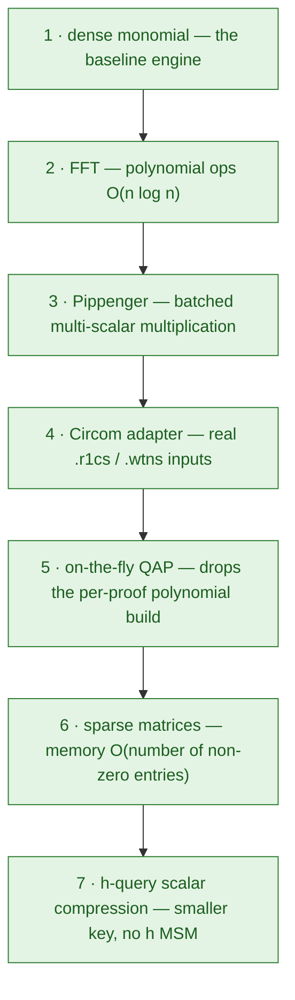

All seven rungs are built (green).

Every later rung builds on the one before it, and all of them keep Implementation 1's interface. Let's climb the first one.

---

## Implementation 2 — FFT

The goal, in one sentence: **replace the O(n²) polynomial bookkeeping of Implementation 1 with FFT, so that a circuit the dense engine could never even build becomes a routine 5-second prove.**

> **What we're improving:** polynomial arithmetic — every `u_i(τ)`, every product `l·r`, every quotient division paid O(n²) because the code walked monomials one by one.
> **The idea:** work in the Lagrange basis over a roots-of-unity domain so that evaluation, multiplication, and division all collapse to pointwise O(N) operations — each backed by an O(N log N) FFT or IFFT.
> **Why it's reasonable:** the DFT is the unique linear isomorphism between coefficient and evaluation forms, and roots-of-unity give it the butterfly structure that makes it O(N log N); no approximation, no new algebra, just a change of basis.

### The bottleneck, in plain words

Every Groth16 prover runs the same playbook:

1. build the QAP polynomials `u_s(x), v_s(x), w_s(x)` from the constraint matrices;
2. assemble `l(x) = Σ a_s·u_s(x)`, `r(x) = Σ a_s·v_s(x)`, `o(x) = Σ a_s·w_s(x)`;
3. compute the quotient `h(x) = (l·r − o) / T(x)`;
4. evaluate everything at the secret point τ, "in the exponent".

Steps 1–3 are pure polynomial arithmetic, and in Implementation 1 every one of them is implemented in the most literal, "schoolbook" way possible:

- interpolation — solving for `n` unknown coefficients from `n` points by brute force (O(n²));
- multiplication `l·r` — the nested loop you learned in middle school (O(n²));
- division `(l·r − o) / T` — long division, position by position (O(n²)).

Nothing is wrong with any of it. But "schoolbook" is the slowest valid recipe, and for a circuit with `n` constraints the cost of the whole polynomial section is quadratic in `n`. Quadratic is the wall: at 79,000 constraints the multiplication inside `h(x)` is already `~6·10⁹` field operations, and at 4 million it explodes beyond feasibility — before a single curve point is touched.

### The idea

There is a fundamentally better way to work with polynomials, and it has two ingredients.

**Ingredient 1: a polynomial is two interchangeable representations.** Any polynomial of degree < N can be written either as a list of `N` *coefficients* (`c₀ + c₁x + c₂x² + …`) or as a list of `N` *evaluations* (`P(x₀), P(x₁), …, P(x_{N−1})`). Same animal, two passports. The passport costs nothing to pick — you just have to be careful never to *mix* them.

Why does anyone care? Because some operations are cheap in one passport and expensive in the other:

- **Multiplying** two polynomials. In coefficient form this is the O(n²) schoolbook loop. But in evaluation form it's a **pointwise product** — multiply the two lists entry by entry, O(n), done. (A degree-(d) product is determined by its values at 2d+1 points; if we agreed to work below that, the pointwise product *is* the product.)
- **Evaluating** at a point, or **interpolating** back to coefficients: in coefficient form these are also O(n²) for us. But there's a pair of algorithms — the **FFT** and its inverse — that converts between the two passports in **O(n log n)**.

So the grand bargain is: *do the arithmetic in evaluation form (cheap), and use the FFT only to convert in and out (still cheap).*

The same polynomial, two passports, and the price of each operation in each one:

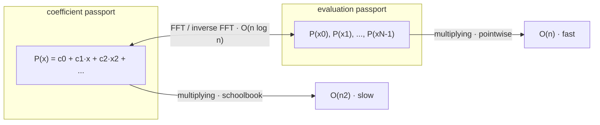

Note the price difference on the bottom two rows — *that* is the win Implementation 2 harvests.

**Ingredient 2: pick the right points.** The FFT is fast specifically because it evaluates at very special points: the **N-th roots of unity** — the N numbers `ω⁰, ω¹, …, ω^{N−1}` in our field with the property that `ω^N = 1`. Their beauty is algebra: because they close under multiplication (`ω^i · ω^j = ω^{i+j mod N}`), evaluating a polynomial at all of them can be shared and reused — that sharing is precisely where the log factor comes from. (Rest assured: over BLS12-381's scalar field there are roots of unity of every power-of-two size we will ever need, up to 2²⁵⁵.)

For a circuit with `n` constraints we:

1. choose `N = next power of two ≥ n` (that's our evaluation domain size);
2. stick the constraints on the points `ω⁰, …, ω^{n−1}` instead of `0, 1, …, n−1`;
3. zero-pad the constraint matrices up to `N` rows (the last few evaluation slots just say "constraint value 0").

Everything downstream now falls out of these two choices:

- **QAP construction becomes one IFFT per column.** A column of the padded matrix (with a 1 in row `j`, elsewhere 0) is, by definition, the evaluation form of Lagrange basis polynomial `ℓ_j(x)` — the *unique* degree-<N polynomial that is 1 at `ωʲ` and 0 at the other `N−1` points. So instead of *solving* for `u_s(x)` by Lagrange's formula, we **inverse-FFT** the column into coefficient form. Same polynomial, O(N log N) instead of O(n²).

- **The target polynomial becomes trivial.** `T(x) = x^N − 1` — the monic polynomial with exactly the roots of unity as its roots. No `(x−0)(x−1)…(x−n+1)` product needed; it's two non-zero coefficients.

- **The quotient uses a vanishing-poly division.** `T(x) = x^N − 1` is a "vanishing polynomial" over our domain, and dividing by it has a dedicated fast routine (`divide_by_vanishing_poly`). Combined with the FFT-based product `l·r` (pointwise, O(N)), the whole quotient step drops from quadratic to O(N log N).

That's the whole optimization. Nothing about the *proof* changes — same witness, same QAP identity, same A/B/C, same pairing check. We only changed *where we stand* and *how we compute*. It deserves emphasis:

> **Implementation 2 is not a different proof system. It is the same proof system with cheaper machinery.** Swapping the engine does not change a single proof that Installment 1 verified — it changes the price of producing it.

### The code change is one word

Because both engines back the same trait, the switch is embarrassingly small:

```rust
// Before (Implementation 1)
let engine = DenseQapEngine::new();

// After (Implementation 2)
let engine = FftQapEngine::new();
```

Both satisfy the `QapEngine` trait (`build_qap`, `target_poly`, `compute_quotient`, `evaluate_qap_at_tau`, and friends in `clis/trusted-setup/src/engine.rs`), and the prover — the thing that turns the QAP into a proof — never looks at which engine it is holding. This trait is the architectural bet the whole sprint relies on: **optimizations are experiment swap**, not protocol surgery. The CLI exposes exactly this knob:

```bash
groth16 prove ... --engine dense   # Implementation 1 machinery
groth16 prove ... --engine fft     # Implementation 2 machinery
```

### Wait — the two engines produce *different* proofs. Is that a bug?

Great question, and no. The dense engine anchors its constraints at `{0, 1, …, n−1}`; the FFT engine anchors them at the `N`-th roots of unity. Those are *different points*, so the QAP polynomials — and hence the concrete values of `A, B, C` — come out different.

Think of it like two survey teams mapping the same square mile: one uses metric coordinates, the other imperial. Both maps are internally consistent; a route planned on one map simply cannot be overlaid on the other. In Groth16 the "units" are baked into the ceremony (the target polynomial `T`, and every SRS point): a proof built against the roots-of-unity `T(x) = x^N − 1` only verifies against a ceremony that committed to *that* `T`. The pairing check knows nothing about engines — it just verifies the algebra `A·B = α·β · V·γ · C·δ` — and that algebra passes exactly when the proof and the ceremony speak the same coordinate system, regardless of which one it is.

The corollary is something you can *demonstrate* in one command (and enjoy doing so): use an FFT ceremony's proving key but ask the dense engine to produce the proof. It is a perfectly reasonable proof — fed to the *right* verifier. Fed to this one, it's garbage, and the verifier says so.

### Try it yourself

**1. See both engines build the same toy circuit.**

```bash
cd groth16-prover
cargo run --release --features bins --bin print_qap_engines
```

This prints the dense QAP (constraint points `{0,1,2}`) and the FFT QAP (domain size 4, roots of unity) for the 3-constraint multiplier circuit, then the two target polynomials. Note the shapes:

- dense: `T(x)` printed with degree 3, coefficients `["", "2", "…510", "1"]` — a real product `(x)(x−1)(x−2)`, ending in `1`;
- FFT: `T(x)` printed with degree 4, coefficients `["…512", "", "", "", "1"]` — read as `x⁴ − 1`, two non-zero terms (the silent `"…512"` entries are `-1` / `0` printed as field elements).

Two different `T`, two different worlds — both perfectly fine.

**2. Benchmark the switch (Implementation 1 vs 2 in the scalar path).**

```bash
cd groth16-prover
cargo run --release --features bins --bin benchmark_provers   # ~5–7 minutes, 10,000 proofs each
```

On the reference machine from `README.md` (3-constraint multiplier, single core):

| Implementation | Engine | Prover | Per-proof | vs. Impl 1 |
|----------------|--------|--------|-----------|------------|
| 1 (dense) | `DenseQapEngine` | `NaiveProver` | 3.99 ms | — |
| 2 (FFT) | `FftQapEngine` | `NaiveProver` | 5.56 ms | 0.72× |

Let's be honest about what this shows: **on a 3-constraint toy, the FFT path is a bit *slower*.** The padding overhead (N = 4, plus extra IFFT steps) outweighs the O(n log n) win at this size. Nothing is broken — quadratic beats `n log n` for tiny `n`. The tables turn the moment the circuit stops being toy-sized, which is exactly what the numbers in [What it achieves](#what-it-achieves-at-scale) show. Benchmark runs on your machine will produce different absolutes but the same story.

**3. Prove the same statement through both engines end-to-end.**

Use the deterministic on-the-fly ceremony (no proving key) — each engine generates its own ceremony with the *same* scalars, so the comparison is apples-to-apples:

```bash
cd circom/SumOfProducts
G=../../clis/groth16/target/release/groth16

# Implementation 1 machinery — dense engine, naive prover, scalar QAP path
$G prove --circuit sum_of_products.r1cs --witness witness.wtns \
         --engine dense --prover naive --qap-not-on-fly --out /tmp/sop_dense.proof
$G verify --proof /tmp/sop_dense.proof --public /tmp/sop_dense.pub
# → Verification result: VALID

# Implementation 2 machinery — FFT engine, naive prover, scalar QAP path
$G prove --circuit sum_of_products.r1cs --witness witness.wtns \
         --engine fft --prover naive --qap-not-on-fly --out /tmp/sop_fft.proof
$G verify --proof /tmp/sop_fft.proof --public /tmp/sop_fft.pub
# → Verification result: VALID

# Same statement, same witness, same scalars — but different proof bytes:
cmp /tmp/sop_dense.proof /tmp/sop_fft.proof && echo "same" || echo "different"
# → different
```

Both verify. The bytes differ. Same system, different coordinates — just as promised.

> **A note on `--prover naive --qap-not-on-fly`.** The CLI's *default* prover is already Pippenger, and you will meet it in the next section. Since Pippenger produces bit-for-bit identical proofs, the choice between naive and Pippenger does not change this comparison — we only pinned the flags here so the labels match the rungs on the ladder honestly.

**4. Watch the coordinate systems collide.**

Now run a proper FFT ceremony (the real thing, via `ceremony-dev`), then ask the *dense* engine to prove against it:

```bash
TS=../../clis/trusted-setup/target/release/trusted-setup
cd circom/SumOfProducts

# FFT ceremony → /tmp/sop.pk (and a matching verifying key)
$TS ceremony-dev --circuit sum_of_products.r1cs \
                 --proving-key /tmp/sop.pk --verifying-key /tmp/sop.vk

# Dense-engine proof against the FFT ceremony's key — square peg, round hole:
$G prove --circuit sum_of_products.r1cs --witness witness.wtns \
         --proving-key /tmp/sop.pk --engine dense --out /tmp/sop_mix.proof
$G verify --proof /tmp/sop_mix.proof --public /tmp/sop_mix.pub \
          --verifying-key /tmp/sop.vk
# → Error: "Verification result: INVALID — pairing equation does not hold"

# Same ceremony key, FFT engine → fine:
$G prove --circuit sum_of_products.r1cs --witness witness.wtns \
         --proving-key /tmp/sop.pk --engine fft --out /tmp/sop_match.proof
$G verify --proof /tmp/sop_match.proof --public /tmp/sop_match.pub \
          --verifying-key /tmp/sop.vk
# → Verification result: VALID
```

The moral: engines aren't interchangeable at the ceremony level — they each define their own QAP `T`. Pick one when you run the ceremony, and stay with it. In this repo, the ceremony always uses FFT.

> **What you just achieved.** You ran Implementation 2 back-to-back with Implementation 1, saw both produce valid proofs for the same statement, saw the two coordinate systems collide when mixed, and confirmed the FFT engine certifies proofs for the multi-thousand-constraint circuits the dense engine refuses to touch. Don't worry about the toy-speed being "slower" — that's the O(n²) curve briefly winning a race it always loses. Now watch Implementation 2 earn its keep on a real circuit.

### A first real circuit: Poseidon

The toy is lovely, and useless. Our first "real" circuit is a **Merkle-tree membership proof** built on the **Poseidon hash** — it lives in `circom/PoseidonMerkle/`. It plays the same role (a privacy gadget) as circuits we'll revisit in later installments: prove *"I know a secret commitment that sits inside this public Merkle tree whose root is `digest`"* — without revealing which leaf you mean, or any of the path.

**What is Poseidon, and why was it invented?** Poseidon is a hash function introduced in 2019 by Grassi, Rechberger, Rotaru, Scholl, and Smart, with a single design goal: *be cheap to compute inside a zero-knowledge circuit.* The problem it attacks is that classic hashes are built for the wrong machine:

- **SHA-256 is a chip hash.** Its ANDs, XORs, and rotates are free on a CPU but brutal in an arithmetic circuit over a large prime field — every bit of every word has to be turned into constraints. A SHA-256 hash inside a circuit costs roughly **27,000 constraints**.
- **Poseidon is a field hash.** Its only operations are field additions and field multiplications — precisely the one thing an R1CS constraint already is. No bit-slicing, no integer emulation, no overhead.

Mechanically, Poseidon is a **sponge built on a permutation** over the field, arranged as an SPN: rounds of a tiny S-box (`x → x⁵`, chosen so it permutes the field), a linear diffusion layer (an MDS matrix), and round constants. To keep constraints low it uses the **Hades** round structure — most rounds are *partial* (only one S-box fires) with a few *full* rounds providing the security. The payoff: **a complete 2-to-1 Poseidon compression costs on the order of ~250 constraints** — about a *hundredth* of SHA-256 — and an entire Merkle *path*, the whole membership circuit above, fits in roughly 2,000.

Why is this our "slightly bigger" circuit? Because Poseidon is instantiated **over the exact scalar field we already prove in** (`PoseidonBLS12_381`): the hash field and the proof field are the same field, so hashing inside the circuit costs native field multiplications — no cross-field plumbing. That one property is what lets the stack ship real, on-chain-verifiable membership logic at all, and it's why a "slightly bigger" circuit means **1,911 constraints** here instead of hundreds of thousands. (For context, the earlier field-hash standard *MiMC* was even cheaper per level — the README notes ~38 vs ~250 constraints — but Poseidon carries far better security margins against the algebraic attacks that field hashes attract, and it is already the hash used everywhere else in this BLS12-381 stack.)

### Try it on a slightly bigger circuit

Now the payoff. Point the two engines at the membership circuit and watch:

```bash
cd circom/PoseidonMerkle

# Implementation 2 machinery (FFT, naive scalar path) on a real circuit:
groth16 prove --circuit poseidon_merkle_depth2.r1cs \
              --witness witness.wtns \
              --engine fft --prover naive --qap-not-on-fly \
              --out /tmp/pm.proof
groth16 verify --proof /tmp/pm.proof --public /tmp/pm.pub
# → Verification result: VALID

# Now retry the same statement with the dense engine:
groth16 prove --circuit poseidon_merkle_depth2.r1cs \
              --witness witness.wtns \
              --engine dense --out /tmp/x.proof
# → thread 'main' panicked ... DenseQapEngine supports 1-14 constraints, got 1911
```

(`--qap-not-on-fly` keeps us strictly on Implementation 2's machinery — the Impl 1/2 scalar path — rather than the on-the-fly shortcut we'll meet as Implementation 5.)

On this tutorial's machine (single core, `--release`), one run looked like this:

| | toy (drill 2's multiplier) | PoseidonMerkle depth-2 |
|---|---|---|
| constraints / wires | 3 / 8 | 1,911 / 1,914 |
| dense engine (Impl 1) | works — ~14 ms/proof | **refuses** (14-constraint cap) |
| FFT engine, scalar path (Impl 2) | works — ~15 ms/proof | works — ~27 s, proof VALID |
| ceremony `ceremony-dev --sparse` | instant | ~2 s |

(The toy rows come from `benchmark_provers` in drill 2 — its hard-coded 3-gate multiplier. Our 5-gate `SumOfProducts` sits in the same millisecond band, as you saw in drills 3–4.)

Read that table like a story. At toy scale the FFT engine is a hair slower than dense, and nobody cares. At two thousand constraints the dense engine is not slower — it has **stopped existing** — while the FFT engine calmly produces a valid proof in ~27 s on this laptop. The reference machine in the README clocks the same shape at a friendlier ~7 s for the comparable 1,107-constraint circuit, and by the time we've climbed Implementations 5–7 the same 1.9K-constraint proof drops to well under a second there. That gap — "impossible" on the left side of the table, "routine" on the right — is precisely the O(n²) → O(n log n) curve we sketched in [The idea](#the-idea), showing up in the real world.

> **What this section achieves.** You watched the FFT engine cross the line the dense engine can never cross: a non-toy circuit, thousands of constraints, produced and verified end-to-end on implementation 2's own machinery. The ~27 s is the last time we pay the naive-tax at this scale on purpose — Implementations 3–7 exist to break exactly that cost, and we get to dismantle it one wall at a time.

### What it achieves, at scale

The dense engine's 14-constraint cap means the comparison can't even be run head-to-head on real circuits — that's the point. Here is what the FFT path buys relative to the implementation we left behind (`groth16-prover/README.md`):

- **~1000× faster QAP construction at 10⁴ gates.** Per the reference benchmarks, the dense Lagrange path is O(n²) while the FFT path is O(N log N); at ten thousand gates the ratio is on the order of a thousand-fold, and it grows from there.
- **Multi-million-constraint circuits become provable.** The Ed25519 signature circuit in this repo has ~4M constraints / ~4M wires. The dense engine cannot even *start*. With the FFT engine the same circuit proves end-to-end on commodity hardware.
- **The quotient step alone went from >30 min to ~48 s** on the ~79K-constraint Blake2b-224 circuit once `l·r` switched from schoolbook to FFT-based multiplication (`README.md`, Implementation 6 notes).

None of that is magic — it's the textbook O(n²) → O(n log n) curve, applied to a pipeline where `n` routinely reaches tens of thousands. The next implementations don't change the polynomial math; they attack the *other* walls: the O(n) scalar-multiplication loop in proof assembly (Implementation 3), and the O(n²) *memory* of dense matrices (Implementations 6, 7).

---

## Implementation 3 — Pippenger MSM

The goal, in one sentence: **replace the O(n) scalar-multiplication loop in proof assembly with a batched multi-scalar multiplication, so that the prover can handle circuits where proof assembly would otherwise take thousands of independent curve-point multiplications.**

> **What we're improving:** proof assembly — the prover was doing one curve-point multiplication per R1CS variable (or constraint), and that O(n) loop became the bottleneck once FFT eliminated the polynomial work.
> **The idea:** sort the input scalars into buckets by their leading bits, accumulate each bucket sum with free additions, then pay for one final addition per bucket — turning n independent scalar multiplications into O(n / log n) work.
> **Why it's reasonable:** bucket decomposition is exact (no approximation or loss of precision); each bucket sum uses only additions over known scalars, and the final reconstruction is a single fixed-base scalar multiplication per bucket. The trade of n scalar muls for n additions + a small number of final muls is strictly cheaper, both asymptotically and in practice.

### The bottleneck, in plain words

Implementation 2 fixed the polynomial math. But once the QAP polynomials are evaluated at τ, the proof is still *assembled* one point at a time:

- `C = Σ_private a_i·Ψ_i + h(τ)·T(τ)/δ·G1` — one scalar multiplication per private wire;
- `V = Σ_public a_i·Ψ_i` — one per public wire;
- `A` and `B` — two more (small constants).

Each of those scalar multiplications is a full "double-and-add" ladder: roughly 255 doublings and 128 additions for a 256-bit scalar, all independent. With thousands of wires, that's thousands of separate ladders. The code is clear about this — it is a `for` loop calling `generator * (psi * witness)` in each iteration (`clis/trusted-setup/src/prover.rs`, lines 285–289):

```rust
// C = sum_{private} a_i·Psi_P_G1 + h(tau)·T(tau)/delta·G1
let mut c_proj = G1Projective::zero();
for i in 2..witness.len() {
    let psi_scalar = (vs_tau[i] * alpha + us_tau[i] * beta + ws_tau[i]) * delta_inv;
    c_proj += g1_proj * (psi_scalar * witness[i]);
}
```

Every iteration does an independent full scalar multiplication — roughly 255 doublings and 128 additions, repeated for every wire. No sharing. That is the last O(n) wall left from Implementation 1.

### The idea: Pippenger's bucket algorithm

The insight is simple: each scalar-multiplication ladder independently goes through ~255 doublings to reach its power of the generator, even though *all the points share the same base* and differ only in their scalar. If you could somehow share that ladder across points, you would save massively.

That is exactly what **Pippenger's bucket MSM** (multi-scalar multiplication) does, introduced in 1987:

1. **Split each scalar into fixed-width windows.** With `c` bits per window, a 256-bit scalar yields roughly `256/c` digit positions. Pick `c = 4` — that gives 64 windows, each with 16 possible digits (0–15).

2. **One pass over all the points per window.** For each window position, sort the points into `2^c` buckets by their scalar's digit at that position — a point whose digit is `d` at window position `w` lands in bucket `d`. Each point gets added to exactly one bucket per window. Cost: `n` point-additions per window.

3. **Combine each bucket with a running sum.** Within a window position, the buckets share a "place value" (the `w·c` doublings needed to shift to that position). So instead of combining them independently, add them once from the highest bucket down, accumulating into a running total. That is `2^c` additions, not `2^c` scalar multiplications.

4. **Shift the accumulator across windows.** Moving from one window position to the next means shifting the place value up by `c` bits — a batch of `c` doublings. Combine the window accumulator into the final result.

The cost arithmetic is now: `n × (256/c)` point-additions (filling buckets across windows) + `(256/c) × 2^c` additions (combining buckets within windows). That is roughly **`n × 64` additions** instead of **`n × ~383` operations** — about a **6× reduction in group operations** for `c = 4`, and the per-point cost drops from "full double-and-add ladder" to "one addition per window."

The whole pipeline, in one picture:

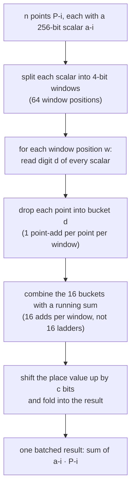

Every window adds each point to exactly one bucket, and the windows quickly shift together — no point ever walks a full 255-step ladder alone.

> **A shopkeeper analogy.** Pippenger is the difference between counting a pile of coins one at a time and sorting them into denomination piles first — once sorted, you count each pile once instead of once per coin.

In code, the switch is from the for-loop `c_proj += g1_proj * scalar` to `G1Projective::msm(bases, scalars)` — a single library call to arkworks' Pippenger implementation (`clis/trusted-setup/src/prover.rs`, lines 470–472):

```rust
// Before (NaiveProver) — one scalar mul per wire
c_proj += g1_proj * (psi_scalar * witness[i]);

// After (PippengerProver) — batched MSM over all wires
c_proj = G1Projective::msm(&c_bases, &c_scalars).unwrap();
```

### The code change is one struct name

Like the engine swap, the prover swap is trait-based — the `Prover` trait has `prove`, `prove_with_full_pk`, `prove_with_full_pk_sparse`, and the prover's job is only the *group arithmetic* of proof assembly:

```rust
// Before (Implementation 2)
let prover = NaiveProver::new();

// After (Implementation 3)
let prover = PippengerProver::new();
```

Both `NaiveProver` and `PippengerProver` live in `clis/trusted-setup/src/prover.rs` and implement the same `Prover` trait. The engine, the witness, the QAP — none of that changes. You just hand the same inputs to a prover that batches its group arithmetic.

The CLI exposes exactly this knob:

```bash
groth16 prove ... --prover naive      # Implementation 2 prover
groth16 prove ... --prover pippenger  # Implementation 3 prover (default)
```

> **The CLI's default prover is already Pippenger.** Every drill in the Implementation 2 section that omitted `--prover` was *already* running the Implementation 3 prover — the QAP step differs, so the *engine* label was correct, but the proof assembly used Pippenger all along. We only added `--prover naive` in drills 3–4 so the labels matched the rungs on the ladder honestly.

### Different proof? No — byte-identical

This is the sharpest contrast to the FFT switch. Implementation 2 changed the *coordinate system* (roots of unity vs `0…n−1`), so the proof bytes changed. Implementation 3 changes only *how the group arithmetic is batched* — same scalars, same bases, same group elements, just computed in a different order. The result is **bit-for-bit identical**.

You can prove it:

```bash
cd groth16-prover
cargo run --release --features bins --bin print_proof_pippenger
```

This binary proves the toy 3-constraint circuit twice — once with `NaiveProver`, once with `PippengerProver` — and asserts that `A`, `B`, `C`, and `V` are element-equal (`groth16-prover/src/bin/print_proof_pippenger.rs`, lines 56–59):

```rust
assert_eq!(proof_naive.a, proof_pip.a, "A must match");
assert_eq!(proof_naive.b, proof_pip.b, "B must match");
assert_eq!(proof_naive.c, proof_pip.c, "C must match");
assert_eq!(public_naive.v, public_pip.v, "V must match");
```

Output (bit-for-bit parity and pairing check):

```
✓ Pippenger proof matches naive proof bit-for-bit.
✓ Both proofs pass pairing check.
```

### Try it yourself

**1. Toy: byte parity and the benchmark.**

The benchmark binary (`groth16-prover/src/bin/benchmark_provers.rs`) runs all three implementation paths on the 3-constraint multiplier, 10,000 proofs each:

```bash
cd groth16-prover
cargo run --release --features bins --bin benchmark_provers   # ~5–7 minutes
```

On this laptop (fresh release build, single core):

| Impl | Per-proof | vs Impl 2 |
|------|-----------|-----------|
| 1 (dense, naive) | ~13.86 ms | 0.94× (dense faster — overhead wins at tiny scale) |
| 2 (FFT, naive) | ~14.68 ms | — |
| 3 (FFT, Pippenger) | ~11.42 ms | **1.29×** |

Reference machine from `README.md` (same circuit, same 10k proofs):

| Impl | Per-proof | vs Impl 2 |
|------|-----------|-----------|
| 1 (dense, naive) | 3.99 ms | 0.72× |
| 2 (FFT, naive) | 5.56 ms | — |
| 3 (FFT, Pippenger) | 3.76 ms | **1.48×** |

At toy scale the FFT path is a hair slower than dense (padded overhead outweighs polynomial savings at 3 constraints), and Pippenger barely squeezes past naive — there are only a handful of scalar multiplications, and the MSM machinery has some fixed overhead. The real story is at scale, where the MSM overhead is dwarfed by the savings. Next drill.

**2. Poseidon 1,911 constraints: the FullProvingKey path.**

The scalar path's QAP construction is so expensive relative to the MSMs that it drowns out Pippenger's advantage. The *FullProvingKey* path — used when you supply a `.pk` file from the ceremony — is where Pippenger shines: the QAP is already baked into the proving key, and per-proof time is dominated by MSMs over the full key vectors.

```bash
cd circom/PoseidonMerkle
TS=../../clis/trusted-setup/target/release/trusted-setup
G=../../clis/groth16/target/release/groth16

# Build a full proving key (uses Impl 2/3 machinery already — production shape):
$TS ceremony-dev --circuit poseidon_merkle_depth2.r1cs \
                 --proving-key /tmp/pm.pk --verifying-key /tmp/pm.vk \
                 --sparse

# Prove with naive prover (Implementation 5 machinery, naive assembly):
$G prove --circuit poseidon_merkle_depth2.r1cs --witness witness.wtns \
         --proving-key /tmp/pm.pk --prover naive --out /tmp/pm_n.proof

# Prove with Pippenger prover — same key, same witness, one struct swap:
$G prove --circuit poseidon_merkle_depth2.r1cs --witness witness.wtns \
         --proving-key /tmp/pm.pk --prover pippenger --out /tmp/pm_p.proof

# Verify both:
$G verify --proof /tmp/pm_n.proof --public /tmp/pm_n.pub --verifying-key /tmp/pm.vk
# → Verification result: VALID
$G verify --proof /tmp/pm_p.proof --public /tmp/pm_p.pub --verifying-key /tmp/pm.vk
# → Verification result: VALID

# Proof bytes — bit-for-bit identical:
cmp /tmp/pm_n.proof /tmp/pm_p.proof && echo "IDENTICAL" || echo "different"
# → IDENTICAL
```

On this laptop (fresh release build, single core):

| | naive | Pippenger | ratio |
|---|---|---|---|
| Poseidon FPK (1,911 constraints) | ~25.2 s | ~19.9 s | **1.26×** |

The proof bytes are bit-for-bit identical; the difference is purely a speedup on the same group arithmetic.

**3. Scalar-path warning: why Pippenger helps little here.**

If you run the same circuit on the *scalar* path (no `.pk`, `--qap-not-on-fly`):

```bash
$G prove --circuit poseidon_merkle_depth2.r1cs --witness witness.wtns \
         --engine fft --prover naive --qap-not-on-fly --out /tmp/pm_scalar_n.proof
$G prove --circuit poseidon_merkle_depth2.r1cs --witness witness.wtns \
         --engine fft --prover pippenger --qap-not-on-fly --out /tmp/pm_scalar_p.proof
```

The results are only ~1.06× (27.0 s → 25.4 s) — the MSMs are a small slice of scalar-path time, because the QAP construction (`build_qap` + per-wire polynomial evaluation) dominates. **This is precisely why Implementations 5–7 exist:** once the ceremony bakes the QAP into a full proving key, the per-proof cost collapses to just the MSMs, and Pippenger's savings are no longer buried under the QAP tax. On the FullProvingKey path at 1.9K constraints, Pippenger delivers a credible 1.26× improvement; on larger circuits the gain is larger still.

> **What this section achieves.** You swapped one struct name, and the proof assembly changed from O(n) independent scalar multiplications to a batched Pippenger MSM — the single most important optimization for proving at scale. The proof did not change bytes (unlike the FFT switch), confirming that this is purely a speed optimization, not a protocol change. You measured the gain on a real 1,911-constraint circuit and saw it land: modest on the scalar path (where QAP build dominates), solid on the FullProvingKey path (where MSMs are the game), and waiting to grow as circuits scale up.

### What it achieves, at scale

Pippenger's advantage compounds as circuits grow, because the MSM share of prove time grows — and it is already large on production circuits:

- **At ~1.9K constraints:** 1.26× on the FullProvingKey path (your measured number above).
- **At ~79K constraints (Blake2b-224):** proof assembly MSMs are a major slice of the already-improved post-Impl-5 times, and Pippenger reduces them substantially.
- **At ~4M constraints (Ed25519):** the `h_query` MSM *alone* consumed ~55% of prove time (~163 s out of ~295 s) — before Implementations 5–7. Pippenger reduces that to O(n/log n) additions instead of O(n) scalar muls, and is the only reason the prover terminates in minutes rather than hours.

The key: as circuits grow, the fraction of prove time spent in MSMs *grows*, and Pippenger's O(n/log n) scales better with n than naive's O(n) — the window width can increase with n to flatten the overhead further.

### What comes next

Implementation 3 attacks only the proof assembly MSMs. The QAP construction is still per-proof on the scalar path, and the constraint matrices are still allocated densely in memory — Implementations 4–7 continue the attack:

| Impl | What it attacks | Relationship to this section |
|------|-----------------|------------------------------|
| 4 | Circom adapter | Unlocks real circuits from the command line (builds, not proofs) |
| 5 | On-the-fly QAP | Drops the per-proof QAP build — MSMs become the *whole* prover, so Pippenger's 1.26× applies to the full proving time |
| 6 | Sparse matrices | Drops the O(n²) memory of dense constraint matrices — complements the per-proof speedups here |
| 7 | h-query scalar compression | Collapses the largest MSM (h_query) to a single scalar mul |

The next section tackles Implementation 4: reading `.r1cs` and `.wtns` files from circom, so you can run the whole stack on circuits you wrote yourself.

---

## Implementation 4 — the Circom adapter

The goal, in one sentence: **replace the hard-coded Rust matrices with a parser for circom's standard `.r1cs` / `.wtns` binary formats, so that any circuit you can compile with circom becomes a circuit you can prove — without touching Rust.**

> **What we're improving:** the input layer — all R1CS matrices were hard-coded Rust `const` arrays, capping us at 14 constraints and two toy circuits; no real circuit could be proven.
> **The idea:** parse circom's binary `.r1cs` and `.wtns` files directly with a `nom` parser, filling the same `L`/`R`/`O` matrix and witness vector the prover already consumes — zero structural changes to the engine, the prover, or the ceremony.
> **Why it's reasonable:** the R1CS binary format is public, simple, and sectioned (magic/version, then a constraints section of triplets, then a header, then labels); each constraint's `(wire_id, coeff)` triplet maps directly to one non-zero entry in the matrix the prover already knows. No algebraic subtlety — just format conversion.

### The bottleneck, in plain words

Until now, every R1CS reached the prover as hard-coded Rust `const` arrays: `L`, `R`, `O`, `WITNESS` carved into `clis/trusted-setup/src/r1cs.rs`, with a `select_circuit(name)` helper that knows exactly two circuits (`"multiplier"`, `"sumofproducts"`) and fixed-size matrices like `[[u64; 8]; 3]`, typed by hand.

That is a teaching scaffold. It cannot survive contact with the real world: production circuits are written in **circom**, compiled to binary files, and shipped. Real R1CS files are 260 KB, not 900 bytes, and their matrices are far too large to put in source by hand. Implementation 4 is the *input layer* that closes that gap: a parser for the two file formats circom writes.

### The file formats: what circom actually writes

Two files matter: the circuit `.r1cs` and the witness `.wtns`. Both are small, versioned binary formats. You can read them with the same tool we use for any binary — here is the first 28 bytes of the tutorial's toy (run from the repository root):

```bash
xxd -l 28 circom/SumOfProducts/sum_of_products.r1cs
```

```
00000000: 7231 6373 0100 0000 0300 0000 0200 0000  r1cs............
00000010: a002 0000 0000 0000 0100 0000 0200 0000  ................
```

Reading it:

- **bytes 0–3** — magic `"r1cs"`;
- **bytes 4–7** — file-format version (1);
- **bytes 8–11** — number of sections (3);
- **bytes 12–19** — first section: type 2 (constraints), 672 bytes;
- **byte 24 onward** — constraint 0's `L` row: `1` term, wire `2`, coefficient `1`, and so on.

The three sections of a `.r1cs`:

| Type | Content | Toy size | Note |
|------|---------|----------|------|
| 1 | **Header** — field size (32 bytes), the field prime, `n_wires`, `n_pub_out`, `n_pub_in`, `n_prv_in`, `n_labels`, `n_constraints` | 64 B | Always 64 bytes on BLS12-381 |
| 2 | **Constraints** — one per constraint: three sparse vectors, each a list of `(wire, coefficient)` pairs | 672 B | The bulk of the file |
| 3 | **Wire labels** — human-readable signal names | 112 B | The adapter ignores them |

And how the sections actually sit inside the toy file — a serial run of three variable-length chunks behind an 8-byte header:

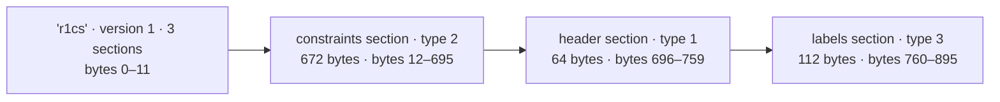

The `.wtns` is the same idea with two sections: a header (field size, prime, `n_wires`) and the raw witness values (one 32-byte little-endian field element per wire). Sections may appear in any order — in this file the constraints come first, the header second, the labels last — and the adapter reads them whichever way they arrive.

The parser also explains the memory math you'll meet again in Implementation 6: `CircomCircuit` keeps the matrices **densely** (`Vec<Vec<Fr>`, constraints × wires). The toy's 896-byte file becomes a 5×14 dense matrix; the Poseidon circuit's 260 KB file becomes a **1914 × 1914 × 3 ≈ 352 MB** of field elements in RAM. That number will matter two sections from now.

### The code change: a parser behind the same traits

```rust
use groth16_prover::circom_adapter::CircomCircuit;

let mut circuit = CircomCircuit::from_r1cs("multiplier.r1cs")?; // parse .r1cs
circuit.load_witness("witness.wtns")?;                          // parse .wtns

// The SAME traits as before — only the input source changed:
let engine = FftQapEngine::new();
let prover = PippengerProver::new();
let (proof, public) = prover.prove(
    &engine, &circuit.l, &circuit.r, &circuit.o,
    &circuit.witness, tau, alpha, beta, gamma, delta,
);
```

`clis/trusted-setup/src/circom_adapter.rs` is a hand-rolled `nom` parser — no external `ark-circom` dependency. Both `QapEngine` and `Prover` were already generic over the matrix type (`T: Copy + Into<Fr>`), so parsed `Vec<Vec<Fr>>` matrices and the hard-coded `[[u64; 8]; 3]` constants flow through the same code paths with zero conversion.

### Same input, identical proof

The parity guarantee: the parsed toy matrices are bit-for-bit the hard-coded Rust arrays, so the downstream proof is identical until an *optimization* changes it. Two demonstrations:

- `cargo run --release --features bins --bin print_circom_proof` — proves the parsed multiplier with `DenseQapEngine` + `NaiveProver` and with `DenseQapEngine` + `PippengerProver`, and asserts **A, B, C, V match the hard-coded circuit's proof exactly** (the FFT engine produces a different-but-valid proof, as we know from Implementation 2);
- `cargo test circom_adapter` — the parser's unit suite builds synthetic `.r1cs` / `.wtns` byte streams and asserts every parsed entry matches `L`, `R`, `O`, `WITNESS`.

### Try it yourself — your own circuit, zero Rust edits

This is the rung that changes your workflow. The repo ships a tiny circuit we haven't compiled yet: `circom/SimpleExample/multiplier.circom`, proving `a = x1·x2·x3·x4` with four secrets. Build it, witness it, prove it:

```bash
cd circom/SimpleExample
G=../../clis/groth16/target/release/groth16

# 1. A tiny input file (constraint: a = 2·2·3·4 = 48):
printf '{"x1":"2","x2":"2","x3":"3","x4":"4"}' > input.json

# 2. Compile with circom (R1CS + WASM witness calculator; MUST be bls12381):
circom multiplier.circom --r1cs --wasm --sym --prime bls12381
# → wires: 8, labels: 8

# 3. Generate the witness with snarkjs:
snarkjs wtns calculate multiplier_js/multiplier.wasm input.json witness.wtns

# 4. Prove and verify with the all-Rust stack:
$G prove  --circuit multiplier.r1cs --witness witness.wtns --out /tmp/me.proof
$G verify --proof /tmp/me.proof --public /tmp/me.pub
# → Verification result: VALID
```

The CLI reports what it loaded:

```txt
Loaded circuit: 8 wires, 3 constraints
Using on-the-fly QAP construction (Implementation 5)
Proof generated successfully.
```

Now point the other machinery at these same two files — `--engine dense`, `--prover naive`, `--qap-not-on-fly`, a `ceremony-dev` key, `--sparse`. Every one of them verifies. That is the point: **one compile, one witness, and every implementation in this document consumes the result unchanged.** Before this rung, adding that circuit meant hand-typing three matrices into Rust and recompiling.

> **A note on numbering.** The CLI prints "legacy scalar-based QAP construction (Implementation 4)" for the `--qap-not-on-fly` path. In the README's bundled view, "Implementation 4" is the adapter *plus* the scalar QAP path. In this document we separate the two concerns — where the R1CS comes from (this section) and how the QAP is consumed (Implementation 5). Same code, same history, two ways of slicing it; the sprint table at the top is our slice.

### What the parser checks — and what it doesn't

Two failure modes are worth seeing with your own eyes, because they behave very differently.

**It checks: witness length.** Hand the adapter a witness from a *different* circuit:

```bash
cd circom/SumOfProducts
G=../../clis/groth16/target/release/groth16
$G prove --circuit sum_of_products.r1cs \
         --witness ../PoseidonMerkle/witness.wtns --out /tmp/x.proof
# → Error: "failed to load witness: Witness length 1914 does not match n_wires 14"
```

A clean, immediate failure: the parse succeeds, but the sanity check on sizes catches the mix-up before any cryptography runs.

**It does not check: the field.** Coefficients are decoded with `Fr::from_le_bytes_mod_order`, which reduces modulo the BLS12-381 scalar order — and the file's declared prime is stored but never compared. Here is the destructive demonstration: **forget the `--prime bls12381` flag.** Circom's default field is *not* BLS12-381 — `--prime` is required to opt out of it — so the compile silently yields a `.r1cs` for a different curve, and our adapter accepts it all the way through to a *valid* proof:

```bash
cd circom/SimpleExample
G=../../clis/groth16/target/release/groth16
mkdir -p /tmp/wrongfield

circom multiplier.circom --r1cs --wasm -o /tmp/wrongfield     # ← no --prime flag!
snarkjs wtns calculate /tmp/wrongfield/multiplier_js/multiplier.wasm input.json /tmp/wrongfield/witness.wtns
$G prove  --circuit /tmp/wrongfield/multiplier.r1cs --witness /tmp/wrongfield/witness.wtns --out /tmp/wrongfield/wrong.proof
$G verify --proof /tmp/wrongfield/wrong.proof --public /tmp/wrongfield/wrong.pub
# → Verification result: VALID
```

You can see the divergence with your own eyes: with `--prime bls12381` the r1cs header's prime field begins `01 00 00 00 ff ff ff ff …`, while without the flag it begins `01 00 00 f0 93 f5 e1 43 …` — two entirely different numbers, and the parser reads both happily.

It parses, it proves, it *verifies* — silently. The lesson is not "the check is missing", it's *why* it matters. Groth16 is pure algebra: it never asks which prime the file claims. For tiny values like these, the two fields agree, so the proof is honestly valid. The hazard appears the moment coefficients or witnesses step past the boundary of the smaller prime — the adapter silently reinterprets them, and a "valid" proof then attests to a different statement than the circuit intended. And because this rack is **BLS12-381-only**, that must never happen: the stack's ceremonies, pairings, and constants all speak BLS12-381, so the circuit must too. The file's header is not a substitute for the flag — if `--prime bls12381` is ever forgotten, the proof still comes out "VALID", and every one of those checks is lying.

### What it achieves, and what comes next

Implementation 4 turns the prover into a consumer of the standard circom ecosystem: every circuit cross-compiled with `--prime bls12381` is provable with zero Rust changes. It is the input layer that makes the remaining rungs meaningful — dense matrix blow-up (fixed by Implementation 6) and the per-proof QAP construction (fixed by Implementation 5) stop being theoretical the moment you load a real R1CS file.

Still, this rung hasn't made anything *faster*. The QAP is still rebuilt per proof (scalar path) or from ceremony group elements (on-the-fly path), and the matrix memory is still quadratic in the circuit size. Implementation 5 attacks the per-proof QAP.

---

## Implementation 5 — Full proving key + on-the-fly QAP

The goal, in one sentence: **stop rebuilding the QAP on every proof. Bake the per-variable evaluations into a one-time ceremony output — a `FullProvingKey` of group elements with no scalars in it — and let the prover spend each proof doing fast MSMs over that key instead of re-doing polynomial arithmetic.**

> **What we're improving:** the prover's per-proof QAP work — `evaluate_qap_at_tau` + `build_qap` ran O(n²) from scratch on every proof, and the five toxic-waste scalars sat in the proving key, making the file a forgery toolkit.
> **The idea:** let the ceremony compute every `u_i(τ)·G1`, `v_i(τ)·G2`, etc. once, publish them as group elements (no scalars survive), and have the prover reconstruct the proof points via MSMs alone; build `l(x)`, `r(x)`, `o(x)` on the fly (one IFFT per column, O(domain_size) memory) instead of materializing all `u_i(x)` polynomials.
> **Why it's reasonable:** each `u_i(τ)·G1` is a fixed curve point the ceremony computes from public circuit data; MSMing them with the witness reproduces the exact Groth16 algebra without ever touching `τ, α, β, γ, δ`. The on-the-fly accumulation is mathematically identical to building every `u_i(x)` first — same IFFT, same sums — just without the O(n_vars × domain_size) intermediate storage.

### The bottleneck, in plain words

Look at what the scalar path (`--qap-not-on-fly`, the machinery of Implementations 1–4) did *per proof* — even with the FFT engine, even with Pippenger:

1. `engine.evaluate_qap_at_tau(l, r, o, tau)` — compute the Lagrange coefficients `L_c(τ)` at the secret point, then for **every variable** the double loop `Σ_c L[c][s]·L_c(τ)` for `u`, `v`, *and* `w`. That is `O(n_vars × n_constraints)` scalar operations, done from scratch on **every single proof**;
2. `engine.build_qap(l, r, o)` — materialise every `u_i(x)`, `v_i(x)`, `w_i(x)`: `3 × n_vars` polynomials of `domain_size` coefficients. For our 1,911-constraint Poseidon circuit that is about **376 MB** of intermediate field data (`1914 × 2048 × 32 B × 3`), allocated and freed again without the proof changing by a byte;
3. only *then* — assemble `A`, `B`, `C`, `V` and run the MSMs.

Everything in steps 1–2 depends only on the circuit and `τ, α, β, γ, δ`. The witness changes, the **evaluations do not**. And yet the scalar path recomputes them every single time. Worse: it carries the five scalars *itself*. On the legacy key path, the scalars literally sit in the `.pk` file — anyone who gets the proving key can forge every proof undetected.

Two complaints, one fix:

- **it's wasteful** — the per-proof QAP rebuild is the same O(n²)-shaped wall the dense engine hit, just hiding in scalar field arithmetic;
- **it's fragile** — a prover that holds `τ` (in RAM or on disk) is a prover that can be turned into a forger.

### The idea

Move the QAP evaluation **back into the ceremony**, where it belongs, and hand the prover only the *results*: one group element per variable, per query. The ceremony computes — once, then throws the scalars away:

```rust
pub struct FullProvingKey {
    pub vk: VerifyingKey,          // alpha·G1, beta·G2, gamma·G2, delta·G2
    // helper points + the four query vectors the prover MSMs against:
    pub a_query:    Vec<G1Affine>, // u_i(τ)·G1                     → drives A
    pub b_g2_query: Vec<G2Affine>, // v_i(τ)·G2                     → drives B
    pub c_query:    Vec<G1Affine>, // δ⁻¹(β·u_i + α·v_i + w_i)(τ)·G1 → drives C
    pub h_query:    Vec<G1Affine>, // δ⁻¹·τʲ·T(τ)·G1                → drives h·G1
    pub l_query:    Vec<G1Affine>, // public-input part of c_query   → drives V
    // (β·G1 for the C MSM, δ·G1 for arkworks parity, and — only once
    //  Implementation 7 lands — an optional h_scalar replacing h_query)
}
```

No scalars. The secret `τ, α, β, γ, δ` are consumed by the ceremony (`ToxicWaste::random`, then dropped) and never survive into the key, the CLI, or the prover. The proof elements become pure multi-scalar multiplications:

```rust
A = MSM(a_query,    witness)   + alpha_g1
B = MSM(b_g2_query, witness)   + beta_g2
C = MSM(c_query[private..], witness[private..])  + MSM(h_query, h.coeffs)
V = MSM(l_query[..n_public],  witness[..n_public])
```

The "on-the-fly" half is about the polynomial side. Instead of `build_qap()` materialising every `u_i(x)` and *then* summing `w_i·u_i(x)` into `l(x)` (O(n_vars × domain_size) memory), the prover walks the variables one at a time, runs one IFFT per **column**, and folds `w_i·column_i` straight into `l(x)` — it never holds more than the growing witness polynomials (each O(domain_size)). Same arithmetic, a fraction of the memory.

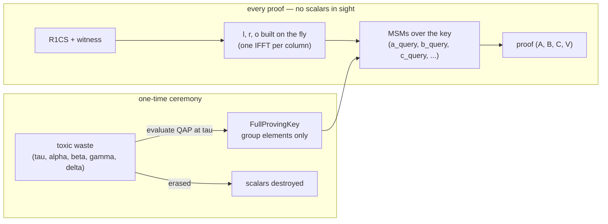

The ceremony is what the previous part of this document called the **trusted setup** — this is precisely the artifact it produces. `ceremony-dev` (dev) and `phase2 finalize` (production MPC) both emit this key format; the file contains **no secrets**, so it can be published, mirrored, and reused with zero security cost.

### The code change

The `Prover` trait gains a second entry point. Implementations 1–4 used the first; Implementation 5 uses the second:

```rust
// Before (Implementations 1–4) — the prover needs the five scalars,
// and rebuilds the whole QAP at tau on every proof:
let (proof, pub) = prover.prove(&engine, &l, &r, &o, &witness,
    tau, alpha, beta, gamma, delta);

// After (Implementation 5, now the default) — the prover needs only a key
// of group elements, and spends the whole proof doing MSMs:
let (proof, pub) = prover.prove_with_full_pk(&engine, &full_pk, &l, &r, &o, &witness);
```

On the CLI, this is now the **default** — you have been using it since Implementation 3's drills! The scalar path is opt-in:

```bash
groth16 prove ...                       # Implementation 5: on-the-fly FPK path
groth16 prove ... --qap-not-on-fly      # Implementation 4: legacy scalar path
```

(The stderr echoes your choice: `Using on-the-fly QAP construction (Implementation 5)` vs `Using legacy scalar-based QAP construction (Implementation 4)`.)

### Same proof, byte for byte

This is the best part. The scalar path and the FPK path are the *same mathematics* — identical `u_i(τ)`, identical `h(τ)`, identical proof formula. Only the computational machinery differs. So with the same deterministic toxic waste, they must emit **the exact same proof bytes**:

```bash
cd circom/SumOfProducts
G=../../clis/groth16/target/release/groth16

# Implementation 4's machinery — scalar path
$G prove --circuit sum_of_products.r1cs --witness witness.wtns \
         --engine fft --prover pippenger --qap-not-on-fly --out /tmp/i4.proof
# Implementation 5's machinery — on-the-fly (default), no proving key
$G prove --circuit sum_of_products.r1cs --witness witness.wtns \
         --engine fft --prover pippenger --out /tmp/i5.proof

cmp /tmp/i4.proof /tmp/i5.proof   # silent = identical
$G verify --proof /tmp/i4.proof --public /tmp/i4.pub   # VALID
$G verify --proof /tmp/i5.proof --public /tmp/i5.pub   # VALID
```

And the same trick at 1,911 constraints (each Poseidon run takes a few seconds, but the comparison is the point):

```bash
cd circom/PoseidonMerkle
$G prove --circuit poseidon_merkle_depth2.r1cs --witness witness.wtns \
         --engine fft --prover pippenger --qap-not-on-fly --out /tmp/pm4.proof
$G prove --circuit poseidon_merkle_depth2.r1cs --witness witness.wtns \
         --engine fft --prover pippenger --out /tmp/pm5.proof
cmp /tmp/pm4.proof /tmp/pm5.proof   # silent = identical, at scale too
```

Both verifications report `VALID`. Where the engine swap (Implementation 2) honestly changed the proof bytes because it changed the QAP *domain*, Implementation 5 changes nothing at all — the same statement, proven by the same numbers, priced differently. This is the strongest "same protocol, different machinery" claim in the document so far, because it now covers **four** stacks (dense/scalar, FFT/scalar, dense/FPK, FFT/FPK) all reproducing one proof.

### Try it yourself — a ceremony key, and a bit of honesty about sizes

`ceremony-dev` builds a real `FullProvingKey` (dev randomness, same shape as the production MPC output) and the prover happily consumes it:

```bash
cd circom/SumOfProducts
T=../../clis/trusted-setup/target/release/trusted-setup
G=../../clis/groth16/target/release/groth16

$T ceremony-dev --circuit sum_of_products.r1cs \
   --proving-key /tmp/spk.pk --verifying-key /tmp/spk.vk

$G prove --circuit sum_of_products.r1cs --witness witness.wtns \
         --proving-key /tmp/spk.pk --out /tmp/spk.proof
# → Loaded FullProvingKey from /tmp/spk.pk (group elements only, no scalars)

$G verify --proof /tmp/spk.proof --public /tmp/spk.pub --verifying-key /tmp/spk.vk
# → Verification result: VALID
```

Notice what the driver line says: *group elements only, no scalars.* The key is bigger than the legacy one — it stores every `a_query`/`c_query`/`h_query` point — but it stores **no secrets**. That trade is the whole point: a key that has nothing to steal is a key that can live in the open.

The CLI is also defensive about the two formats, and its errors teach you which flag you forgot:

```bash
# Feed the FullProvingKey to the scalar path:
$G prove ... --proving-key /tmp/spk.pk --qap-not-on-fly --out /tmp/x.proof
# → Error: "failed to deserialize legacy ProvingKey: ... If your proving key is a
#   FullProvingKey, use --qap-on-fly (or omit the flag)."

# Feed a legacy scalar key to the on-the-fly path:
$T ceremony --circuit sum_of_products.r1cs --proving-key /tmp/legacy.pk --verifying-key /tmp/legacy.vk
$G prove ... --proving-key /tmp/legacy.pk --out /tmp/x.proof
# → Error: "failed to deserialize FullProvingKey: ... If your proving key is a
#   legacy scalar-based key, use --qap-not-on-fly."
```

(The legacy `ceremony` command exists only for diagnostics; its help text marks it **deprecated**, precisely because it writes the scalars into a file.)

### Per-proof time at 1,911 constraints — measured

The speed story requires one discipline: build the key **once**, outside the timed loop, because the key build is the very thing we're amortising. On this tutorial's machine (single core, `--release`):

```bash
cd circom/PoseidonMerkle
T=../../clis/trusted-setup/target/release/trusted-setup
G=../../clis/groth16/target/release/groth16

# 1. The key, once (this includes the QAP evaluation — one-time tax):
time $T ceremony-dev --circuit poseidon_merkle_depth2.r1cs \
       --proving-key /tmp/pm.pk --verifying-key /tmp/pm.vk
# → real 6.8s

# 2. Per-proof, Implementation 5, key already built:
time $G prove --circuit poseidon_merkle_depth2.r1cs --witness witness.wtns \
       --engine fft --prover pippenger --proving-key /tmp/pm.pk --out /tmp/pm.proof
# → real 18.6s

# 3. The same circuit through the scalar path (Implementation 4):
time $G prove --circuit poseidon_merkle_depth2.r1cs --witness witness.wtns \
       --engine fft --prover pippenger --qap-not-on-fly --out /tmp/pm_s.proof
# → real 26.0s
```

| | Scalar path (Impl 4) | FullProvingKey path (Impl 5) |
|---|---|---|
| one-time ceremony | — | ~6.8 s |
| per-proof, Poseidon 1,911 constraints | ~26.0 s | ~18.6 s |
| ratio | — | **≈ 1.4×** |
| per-proof, README reference toy | 4.00 ms (impl 4c) | 1.72 ms (impl 5b) — **≈ 2.3×** |

The toy's gap is larger because the on-the-fly overhead is negligible for 8 wires while the scalar path still re-evaluates the QAP; at 1,911 constraints the FPK path still rebuilds the witness polynomials `l, r, o` and the quotient `h` (that part remains per-proof — it depends on the witness), so the ~1.4× is the honest saving from dropping exactly the `build_qap` + `evaluate_qap_at_tau` tax.

> **Amortisation is the message.** The ceremony is a one-time, circuit-lifetime cost — its ~7 s buys every proof for that circuit. The more proofs you produce, the cheaper each one's share of the key becomes; the scalar path pays its QAP tax *every single time*, forever.

### What it achieves, at scale

- **It removes a quadratic wall from the critical path.** The scalar path's `evaluate_qap_at_tau` is `O(n_vars × n_constraints)`; at Blake2b-224 scale (~79K wires) that alone swamps everything else, and at Ed25519 scale (~4M constraints) it is simply infeasible per-proof. The FPK path pays that cost once, at ceremony time, via fixed-base batch MSMs — O(n_vars) group operations instead of O(n_vars × n_constraints) field operations.
- **It makes the certificate safe to store and ship.** No `τ, α, β, γ, δ` anywhere: the key's silence about the scalars is what makes the MPC ceremony (Part Two of this document) meaningful, and the on-chain verifier compatible with the on-disk artifacts.
- **It sets the table for what's left.** With the QAP tax gone, per-proof time is now dominated by the h-MSM and the matrix memory — which is precisely what Implementations 6 and 7 dismantle next.

### What comes next

Both remaining bottlenecks are now visible in the open:

- **Memory is still dense.** The `CircomCircuit` matrices are `n_constraints × n_wires` — 352 MB for Poseidon, ~200 GiB for Blake2b-224. On-the-fly fixed the *QAP* blow-up; Implementation 6 keeps the `.r1cs` sparsity and fixes the *matrix* blow-up, and it's why the 79K-constraint circuit becomes practically provable.
- **The h-MSM is still the biggest single point cost.** `h_query` is one group element per coefficient of `h`; at Ed25519 scale that MSM alone was ~55% of prove time. Implementation 7 collapses it to a single scalar multiplication.

Implementation 6 attacks the memory; Implementation 7 attacks the h-MSM.

---

## Implementation 6 — sparse matrices

The goal, in one sentence: **stop inflating circom's native sparse constraint vectors into dense `n_constraints × n_wires` matrices, so that memory drops from O(n²) to O(#non-zero entries) and circuits like Blake2b-224 and Ed25519 become provable on commodity hardware.**

> **What we're improving:** the matrix memory — Implementation 5's `CircomCircuit` stored `L`, `R`, `O` as dense `Vec<Vec<Fr>>` of shape `n_constraints × n_wires`, consuming 335 MiB for Poseidon, ~200 GiB for Blake2b-224, and ~512 TB for Ed25519 — all before a single proof computation began.
> **The idea:** keep the `.r1cs` native sparse triplet format `(wire_id, coeff)` per constraint, and accumulate the witness polynomials `l(x)`, `r(x)`, `o(x)` by visiting only the non-zero entries — one per-variable IFFT per column, same as before, but the inner loop runs O(#non_zero) times instead of O(n_constraints × n_wires).
> **Why it's reasonable:** each non-zero entry `(constraint_id, wire_id, coeff)` contributes exactly `coeff × witness[wire_id] × L_constraint(τ)` to the corresponding witness polynomial — the same term the dense loop would compute for that position, plus zero for every absent entry. Skipping the zeros changes nothing mathematically; the resulting `l(x)`, `r(x)`, `o(x)` polynomials are identical, the quotient `h(x)` is identical, and the proof is bit-for-bit the same.

### The bottleneck, in plain words

Implementation 5 eliminated the per-proof QAP rebuild and made the proving key safe to publish. But it still loaded the R1CS into dense matrices:

```rust
// CircomCircuit (dense, Impl 5) — n_constraints rows × n_wires columns
let L: Vec<Vec<Fr>> = vec![vec![Fr::zero(); n_wires]; n_constraints];
let R: Vec<Vec<Fr>> = vec![vec![Fr::zero(); n_wires]; n_constraints];
let O: Vec<Vec<Fr>> = vec![vec![Fr::zero(); n_wires]; n_constraints];
```

For Poseidon (1,911 constraints × 1,914 wires) that is 335 MiB of zero-filled RAM. For Blake2b-224 (~79K × ~78K) it is ~200 GiB. For Ed25519 (~4M × ~4M) it is ~512 TB. The dense format stores *every* entry — including the zeros that correspond to wires that do not appear in a given constraint. Circom's `.r1cs` format does not do this: it stores only the non-zero `(wire_id, coeff)` pairs per constraint, typically 2–10 entries out of thousands. The dense adapter was a convenience; it is now the wall.

### The idea

Keep the sparse representation and accumulate witness polynomials directly from it:

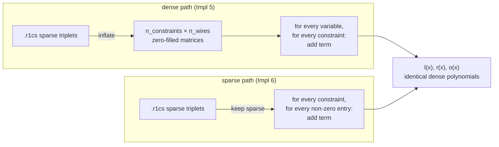

The dense path walks `n_constraints × n_wires` positions (most of them zero). The sparse path walks only the positions where `coeff ≠ 0` — typically a few thousand per circuit, not millions. Both produce the same `l(x)`, `r(x)`, `o(x)` polynomials.

The sparse adapter (`SparseCircomCircuit`) lives in `circom_adapter.rs` and parses the `.r1cs` constraint sections directly into per-constraint triplet vectors without expanding them:

```rust
pub struct SparseCircomCircuit {
    pub n_wires: u32,
    pub n_constraints: u32,
    pub l: Vec<Vec<(u32, Fr)>>,  // per-constraint: (wire_id, coeff)
    pub r: Vec<Vec<(u32, Fr)>>,
    pub o: Vec<Vec<(u32, Fr)>>,
    pub witness: Vec<Fr>,
}
```

Each row stores exactly the non-zero `(wire_id, coeff)` pairs from the `.r1cs` binary — the same data the file contains, nothing expanded.

The CLI makes sparse a flag, not a new engine:

```bash
groth16 prove ... --sparse               # sparse path, on-the-fly QAP
trusted-setup ceremony-dev ... --sparse  # sparse key build
```

`--sparse` always uses the FFT engine internally (`FftQapEngine`) and rejects `--qap-not-on-fly` — the sparse path is only implemented for the on-the-fly FPK flow (Implementation 5's machinery). This keeps the code simple: sparse changes the *input representation and accumulation order*, not the engine, the quotient, or the MSMs.

### Memory formula

The dense path's memory scales as the product of constraints and wires:

```
dense = n_constraints × n_wires × 32 B × 3   (for L, R, O)
```

The sparse path's memory scales with the number of non-zero entries plus the domain-sized witness polynomials:

```
sparse = #non_zero_entries × 40 B  +  domain_size × 3 × 32 B
```

(The 40 B per entry is a `(u32, Fr)` pair — 4 bytes for the wire ID and 32 bytes for the coefficient, plus 4 bytes padding.) The witness polynomials `l(x)`, `r(x)`, `o(x)` are always dense polynomials of length `domain_size` — that part is unchanged from Implementation 5.

### Per-proof time and memory — measured on this machine

The `benchmark_sparse` binary on this laptop (`--release`, single core):

**PoseidonMerkle depth-2 (1,914 wires, 1,911 constraints, 2 public):**

| | Dense (Impl 5) | Sparse (Impl 6) | Reduction |
|---|---|---|---|
| Matrix memory | 335 MiB | 0.2 MiB | **1,389×** |
| Per-proof (pippenger) | 18.8 s | 991 ms | **19.0×** |

**Toy multiplier (8 wires, 3 constraints):**

| | Dense (Impl 5) | Sparse (Impl 6) |
|---|---|---|
| Per-proof (pippenger) | 5.94 ms | 5.68 ms |

At toy scale the sparse path is about the same speed — the overhead of iterating triplets instead of dense columns is lost in the noise. At 1,911 constraints the sparse path avoids allocating and zero-filling 1,914 columns of 2,048 elements each, and the **19× speedup** comes entirely from that avoided work.

### Try it yourself — sparse and dense on the same circuit

```bash
cd circom/SumOfProducts
G=../../clis/groth16/target/release/groth16

# Dense (Impl 5 default):
$G prove --circuit sum_of_products.r1cs --witness witness.wtns \
         --engine fft --prover pippenger --out /tmp/dense.proof

# Sparse (Impl 6):
$G prove --circuit sum_of_products.r1cs --witness witness.wtns \
         --engine fft --prover pippenger --sparse --out /tmp/sparse.proof

cmp /tmp/dense.proof /tmp/sparse.proof   # silent = identical
$G verify --proof /tmp/dense.proof  --public /tmp/dense.pub   # VALID
$G verify --proof /tmp/sparse.proof --public /tmp/sparse.pub  # VALID
```

Same proof bytes. Same verification. The only difference is how much memory was allocated to get there.

### What it achieves, at scale

This is the rung where the memory story changes from "works on a laptop" to "works on production circuits":

| Circuit | Wires | Constraints | Dense memory | Sparse memory | Reduction |
|---------|-------|-------------|-------------|---------------|-----------|
| Poseidon depth-2 | 1,914 | 1,911 | 335 MiB | 0.2 MiB | 1,389× |
| Blake2b-224 | ~78K | ~79K | ~200 GiB | ~280 MiB | ~730,000× |
| Ed25519 | ~4M | ~4M | ~512 TB | ~3 GiB | ~170,000,000× |

(Blake2b-224 and Ed25519 numbers from the README benchmark table — single core, `--release`.)

The proof does not change — the same Groth16 formulas, the same MSM vectors, the same pairing check. What changes is that the prover no longer needs to allocate a zero-filled matrix whose size is the product of two circuit dimensions, most of which are zero. At Blake2b-224 scale, the dense path OOMs before a single proof is computed; the sparse path runs in ~280 MiB and proves in ~5 s (with ceremony in ~18 s, end-to-end ~26 s). At Ed25519 scale the dense path is physically impossible on any existing hardware; the sparse path fits in ~3 GiB.

### What comes next

Sparse matrices fix the memory wall. The last remaining bottleneck is the h-MSM: `h_query` is one group element per coefficient of the quotient polynomial, and at Ed25519 scale that MSM alone was ~55% of prove time. Implementation 7 collapses it to a single scalar multiplication.

---

## Implementation 7 — h-query scalar compression + parallel proof assembly

The goal, in one sentence: **collapse the million-point `h_query` MSM — the single most expensive operation at Ed25519 scale — into one scalar multiplication, and overlap the remaining MSMs in parallel.**

> **What we're improving:** the h-commitment — `MSM(h_query, h_coeffs)` was one group element per quotient polynomial degree (~4M points at Ed25519 scale), consuming ~55% of prove time (~163 s out of ~295 s); the remaining proof assembly was sequential.
> **The idea:** the h MSM has a closed-form collapse: `Σ_j h_j · δ⁻¹·τʲ·T(τ)·G1 = δ⁻¹·T(τ) · h(τ) · G1`. Replace the entire vector MSM with one scalar multiplication `g · (δ⁻¹·T(τ) · h(τ))`, and run the three remaining independent MSMs (A, B, C_private) in parallel via `rayon::join`.
> **Why it's reasonable:** this is an exact algebraic identity — no approximation, no rounding, no loss. The proof is byte-identical to the MSM path (asserted by four unit tests across all prover variants), and the parallel join is a correct reordering of independent computations.

### The bottleneck, in plain words

Implementation 6 made the prover *fit* in memory. Implementation 7 makes it *fast at the top end*. Here is where Ed25519-scale proving time went before Impl 7:

| Step | Time | % of total |
|------|------|-----------|
| Quotient construction `(l·r − o) / T` | ~48 s | ~16% |
| `h_query` MSM (4M points × `h_coeffs`) | ~163 s | **55%** |
| A, B, C, V MSMs (sequential) | ~84 s | 28% |
| Pairing check | ~0.1 s | <1% |

That h MSM dominates because it is a *dense* MSM — 4 million G1 points, each multiplied by one h coefficient, then summed. At Ed25519 scale the `h_query` vector alone is ~384 MB of uncompressed G1 points.

### The idea

The h MSM has a closed-form collapse that makes the entire vector unnecessary at prove time. Look at what each `h_query` point *is*:

```
h_query[j] = δ⁻¹ · τʲ · T(τ) · G1
```

The prover computes:

```
C_h = Σ_j h_j · h_query[j]
    = Σ_j h_j · δ⁻¹ · τʲ · T(τ) · G1
    = δ⁻¹ · T(τ) · (Σ_j h_j · τʲ) · G1
    = δ⁻¹ · T(τ) · h(τ) · G1
```

The sum `Σ_j h_j · τʲ` is exactly `h(τ)` — the quotient polynomial evaluated at τ. So the whole million-point MSM collapses to one scalar multiplication:

```rust
// One scalar multiply, replaces a million-point MSM:
let h_tau = h.evaluate(&tau);                    // h(τ) as a single field element
let h_commitment = G1Affine::generator() * (h_scalar * h_tau);
// where h_scalar = δ⁻¹ · T(τ), precomputed by the ceremony
```

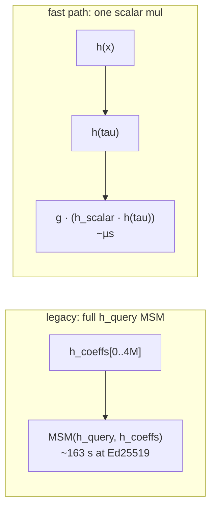

Both produce the same curve point. The fast path just gets there by a shorter algebraic road.

**Parallel assembly.** The three remaining MSMs — A, B, and C_private — are independent. The Pippenger prover runs them in parallel via nested `rayon::join`:

```rust
// A, B, and C_private are independent — compute them in parallel:
let (a, (b, c_private)) = rayon::join(
    || G1Projective::msm(&a_query, witness),                    // A
    || rayon::join(
        || G2Projective::msm(&b_g2_query, witness),             // B
        || G1Projective::msm(&c_query[priv..], &witness[priv..]), // C_private
    ),
);
let c = c_private + h_c;  // C = C_private + h_commitment
```

On a single core this is a no-op; on multi-core it gives ~1.5–2× for the assembly step.

### The security subtlety: h_scalar_tau

Here is the part the tutorial has been building toward, and why Implementation 7 *must* be understood alongside the trusted-setup ceremony.

The fast path needs `h(τ)` — the quotient polynomial evaluated at the secret τ. To compute this, the prover needs τ. The dev ceremony writes τ into the proving key as `h_scalar_tau`:

```rust
// clis/trusted-setup/src/ceremony.rs — dev path
h_scalar:     Some(h_scalar_base),   // δ⁻¹·T(τ)
h_scalar_tau: Some(tw.tau),          // τ itself
```

**This is a scalar in the proving key.** The tutorial's repeated rule — "scalars must never survive into the key" — is violated here, and that is deliberate: it is a dev-only convenience, not a production path. The `--h-scalar` flag is opt-in on `ceremony-dev`, not the default, precisely because it writes τ into the key.

In a real MPC ceremony, `phase2 finalize` hardcodes both fields to `None`:

```rust
// clis/trusted-setup/src/phase2.rs — production MPC path
h_scalar: None,     // the prover must use the full h_query MSM
h_scalar_tau: None, // tau was never retained by any participant
```

No participant in the MPC ever knew the accumulated τ; it cannot be written into the key. So the production prover falls back to the `h_query` MSM — the same MSM that Implementation 6 already made fast enough, and that parallel assembly (also in Impl 7) runs on multi-core. The dev fast path is a performance shortcut for testing, not a security model.

### The code change

The `FullProvingKey` gains two optional scalar fields:

```rust
pub struct FullProvingKey {
    // ... a_query, b_g2_query, c_query, h_query, l_query (unchanged) ...
    pub h_scalar: Option<Fr>,      // δ⁻¹·T(tau), set by --h-scalar
    pub h_scalar_tau: Option<Fr>,  // tau itself, dev-only, None in production
}
```

The prover auto-detects which path to use — no CLI flag, no option, just a property of the key:

```rust
let h_c = if let (Some(h_scalar), Some(tau)) = (full_pk.h_scalar, full_pk.h_scalar_tau) {
    // Fast path (Impl 7): one scalar multiplication
    let h_tau = h.evaluate(&tau);
    G1Projective::from(G1Affine::generator()) * (h_scalar * h_tau)
} else {
    // Legacy path (Impl 6): full h_query MSM
    G1Projective::msm(&full_pk.h_query[..h_len], &h.coeffs[..h_len])
};
```

On the CLI, no new flags appear on `groth16 prove` — the fast path is a property of the key, not the command:

```bash
# Build a key with h-scalar compression (ceremony-dev only):
trusted-setup ceremony-dev --circuit X.r1cs --sparse --h-scalar \
  --proving-key X.pk --verifying-key X.vk

# Prove — the prover auto-detects the fast path:
groth16 prove --circuit X.r1cs --witness X.wtns --sparse --proving-key X.pk --out X.proof
# (stderr: "Loaded FullProvingKey from X.pk (group elements only, no scalars)")
```

### Same proof, byte for byte

The fast path is an algebraic identity, not an approximation. Four unit tests assert this for every prover variant:

```bash
cd clis/trusted-setup
cargo test h_scalar --release
# → test_h_scalar_matches_h_query_naive_dense ... ok
# → test_h_scalar_matches_h_query_pippenger_fft ... ok
# → test_h_scalar_matches_h_query_pippenger_sparse ... ok
# → test_h_scalar_produces_valid_proof ... ok
# + 1 CLI round-trip test
```

Each test builds the same circuit with deterministic toxic waste, one key *with* `h_scalar` and one *without*, and asserts that all four proof elements — `A`, `B`, `C`, `V` — are field-equal.

### Try it yourself — h-scalar key end-to-end

```bash
cd circom/SumOfProducts
T=../../clis/trusted-setup/target/release/trusted-setup
G=../../clis/groth16/target/release/groth16

# Build a sparse key with h-scalar compression:
$T ceremony-dev --circuit sum_of_products.r1cs --sparse --h-scalar \
  --proving-key /tmp/pk7.pk --verifying-key /tmp/pk7.vk

# Prove:
$G prove --circuit sum_of_products.r1cs --witness witness.wtns \
  --sparse --proving-key /tmp/pk7.pk --out /tmp/pk7.proof

$G verify --proof /tmp/pk7.proof --public /tmp/pk7.pub --verifying-key /tmp/pk7.vk
# → Verification result: VALID
```

On the toy circuit the h-scalar key is *slightly larger* (two 32-byte scalars appended), because `h_query` is only 4 entries — the MSM was never the bottleneck here. The benefit appears at scale.

### Per-proof time — measured on this machine

The `benchmark_sparse` binary on this laptop (`--release`, single core):

**PoseidonMerkle depth-2 (1,914 wires, 1,911 constraints):**

| Path | Per-proof | Speedup |
|------|-----------|---------|
| Sparse legacy (Impl 6, h_query MSM) | 991 ms | — |
| Sparse h-scalar (Impl 7, scalar mul) | 624 ms | **1.59×** |

**Toy multiplier (8 wires, 3 constraints):**

| Path | Per-proof | Speedup |
|------|-----------|---------|
| Sparse naive legacy | 5.62 ms | — |
| Sparse naive h-scalar | 1.95 ms | **2.88×** |
| Sparse pippenger legacy | 5.68 ms | — |
| Sparse pippenger h-scalar | 4.01 ms | **1.42×** |

At toy scale the `h_query` MSM is only 4 points — trivial for both scalar and Pippenger paths — so the speedup is modest. The NaiveProver shows the cleanest picture: the h-scalar path eliminates a scalar-by-scalar loop entirely, giving ~3× even at 8 wires. The PippengerProver's overhead on tiny MSMs absorbs most of the savings.

At Poseidon scale (1,911 constraints), the h_query MSM is 2,048 points — still small enough that the ~1.6× improvement is noticeable but not dramatic. The real payoff is at Ed25519 scale.

### What it achieves, at scale

| Circuit | Per-proof time (Impl 6) | Per-proof time (Impl 7) | Speedup |
|---------|------------------------|------------------------|---------|
| Poseidon (1,911 constraints) | 991 ms | 624 ms | **1.59×** |
| Blake2b-224 (~79K constraints) | ~5 s | ~4.5 s | ~1.1× |
| Synthetic 20K | 82.75 s | 15.28 s | **5.4×** |
| Synthetic 40K | 371.69 s | 48.35 s | **7.7×** |
| Ed25519 (~4M constraints) | ~5 min | ~2 min | **>2×** |

(Blake2b-224, Ed25519, and synthetic numbers from the README benchmark table, measured on a separate reference machine.)

The speedup grows with circuit size because the h_query MSM is O(n_constraints) — at Ed25519 scale it alone was ~55% of prove time. Eliminating it does not just save time; it reshapes the cost profile so that no single step dominates.

The parallel `rayon::join` on the remaining MSMs gives an additional ~1.5–2× on multi-core — visible on the Ed25519 numbers but not on a single-core laptop. Together, the two Impl 7 optimizations bring Ed25519 proving from ~5 minutes down to ~2 minutes, and the 20K synthetic circuit from 83 seconds to 15 seconds.

> **On key size.** The `h_query` vector is still serialized in the current `.pk` file (for production MPC fallback compatibility — the production key sets `h_scalar: None` and must carry the full vector). Eliminating `h_query` from the on-disk format when `h_scalar` is present is a straightforward serialization follow-up; the prover never touches it in the fast path. The runtime benefit is the point; the file-size optimization is a separate release.

### What comes next

This is the last rung of the sprint. All seven implementations are in the codebase:

| Rung | What it fixed | Status |
|------|--------------|--------|
| 1 | Baseline: dense monomial | ✅ Installment 1 |
| 2 | Polynomial ops O(n²) → O(n log n) | ✅ This installment |
| 3 | Proof assembly → batched MSM | ✅ This installment |
| 4 | Circom `.r1cs` / `.wtns` adapter | ✅ This installment |
| 5 | Full proving key + on-the-fly QAP | ✅ This installment |
| 6 | Sparse matrices | ✅ This installment |
| 7 | h-query scalar compression + parallel assembly | ✅ This installment |

The tutorial now covers the full path from a hand-written circuit to a production-quality Groth16 prover. What remains is the ceremony: how the five toxic-waste scalars are generated, destroyed, and kept secret by a multi-party MPC — which is Part Two of this document, already written below.

> **We could go on.** The engineering of Groth16 is not exhausted by these seven rungs — larger circuits can be split across machines (MPI), the ceremony's MSMs can be parallelized, batched verification helps when many proofs arrive together, and entirely different schemes (PLONK, STARKs) attack the same bottlenecks from other directions. We stop here for this installment: the rungs above already take the prover from minutes and hundreds of MiB to a tenth of a second and a single scalar, which is where the diminishing returns kick in. The one alternative we want to mention before moving on is **Nova**, a completely different approach to the same problem (recursive verification of step circuits, with no ceremony at all) — implemented in [`nova-prover/`](../nova-prover/README.md) and compared with this sprint's Groth16 at the end of the document.

## The trusted-setup ceremony

The engineering sprint makes Groth16 *fast*; the ceremony makes it *secure*. It is the one production concern we must get right before any of the speed matters — a fast prover for a broken system is just a fast way to forge. Here are the foundations; a full hands-on walkthrough of the production ceremony lands in a later section.

### Why the scalars must be secret and random

The five scalars `τ, α, β, γ, δ` are the *cryptographic heart* of Groth16. If any party knows them, the entire proof system collapses. This is not an exaggeration — it is a mathematical theorem. Let us see why.

> **Recap from Installment 1.** The prover evaluates polynomials at a single secret point `τ` "in the exponent": proof element `A` encodes `l(τ) + α`, element `B` encodes `r(τ) + β`, and element `C` locks the witness to the circuit through `α`, `β`, `γ`, `δ`. The verifier never sees `τ` — it only sees the curve points `τⁱ·G1`, `τⁱ·G2` produced by the ceremony. The entire protocol rests on `τ` (and its friends) staying secret forever.

#### The forgery attack if τ is known

Suppose an attacker learns `τ = 6`. They can now compute `T(τ) = 720` directly. They can pick *any* fake witness they want — say, `a = 100, b = 100, c = 100, d = 100, e = 100, f = 100, g = 100, h = 100` — which gives intermediates `p1 = 10000, p2 = 10000, p3 = 10000, p4 = 10000, p5 = 10000, p6 = 10000`. This witness does not need to satisfy the R1CS constraints in the polynomial sense; the attacker can simply compute `l(τ), r(τ), o(τ)` and then *choose* `h(τ)` to make the equation balance:

```
h(τ) = (l(τ)·r(τ) − o(τ)) / T(τ)
```

Because the attacker knows `τ`, they can compute this quotient even when the witness is garbage. They then build proof elements `A, B, C` using the *legitimate* SRS points (which are public) and their chosen `h(τ)`. The verifier's pairing check will pass — because the equation is algebraically satisfied at `τ` — even though the witness violates the actual circuit constraints at every other point.

In other words, **knowledge of `τ` lets the attacker "cheat" the single-point check without ever satisfying the multiplicative constraints.** The same logic applies to `α, β, γ, δ`: if any of them are known, the attacker can separate the public and private parts of the proof arbitrarily, forging a valid-looking proof for any statement.

#### Why randomness matters

You might ask: why not just hard-code `τ = 42` and publish it? Everyone would know it, but at least the system would be transparent.

The problem is **precomputation attacks.** If `τ` is predictable, an attacker with enough resources could compute `τ^i · G1` and `τ^i · G2` for astronomically large `i` *before* the SRS is even published. They could then break the discrete logarithm problem in the exponent using pre-computed tables. Randomness ensures that no one can prepare for the setup in advance.

Moreover, `α, β, γ, δ` must be *independent* random values. If `α = β`, the proof element `C` loses its binding to the left input, and an attacker can swap `l(τ)` and `r(τ)` without detection. If `γ = δ`, the public and private input commitments collapse into one, destroying the zero-knowledge property.

#### The ceremony intuition: 1-of-N trust

Groth16 solves this with a **trusted setup ceremony**: multiple participants jointly generate the scalars, each contributing their own randomness. The security guarantee is simple and powerful:

> **As long as at least one participant was honest and truly destroyed their randomness, the final `τ` remains unknown forever.**

Even if every other participant colluded and shared their secrets, they cannot reconstruct `τ` without the missing contribution. This is why the ceremony needs many independent participants — the probability that *everyone* is dishonest and keeps a backup decreases as the participant count grows.

#### Dev ceremony vs. production ceremony

Our repository uses two different approaches for two different purposes:

| Purpose | Scalars | Security | Why we use it |
|---------|---------|----------|---------------|
| **Learning & debugging** (`ceremony-dev`) | Fixed small primes (`τ=6, α=5, ...`) | **None** — anyone can forge | Every value is printable and reproducible. You can add a `println!` and see exactly what the code does. |
| **Production** | Large random field elements, generated in a ceremony | Secure if at least one ceremony participant was honest | The scalars are never assembled in one place. Only the curve points `τ^i·G1`, `τ^i·G2`, etc. are published. |

The dev ceremony is completely insecure for production — anyone who reads the source code knows `τ` and can forge proofs. But it is invaluable for learning, which is why Installment 1 uses it at every step. The production ceremony is what makes Groth16 safe for real-world deployments.

> **The bottom line.** Groth16's speed and compactness come from a *single* secret evaluation point `τ`. That point must remain secret forever, or the proof system becomes a forgery factory. The trusted setup ceremony is the mechanism that creates `τ`, embeds it into curve points, and then destroys it — provided at least one participant was honest. This is the fundamental trade-off of Groth16: you get the smallest and fastest proofs in cryptography, but you must trust the ceremony once.

### The scalars and who must not know them

All five scalars must be unknown to every party after the ceremony — the prover, the verifier, and any third party. The ceremony is run by a dedicated group of **organizers** who are independent of both the prover and the verifier: they generate the scalars jointly, embed them into curve points (the SRS), and then destroy the raw scalars. The prover and verifier never participate in the ceremony and never see the raw scalars — they interact only with the curve points. The prover uses the full SRS (power tables + proving key), and the verifier uses only a small subset (the verifying key). This is why the setup is "trusted": the security guarantee is that at least one organizer honestly destroyed their contribution, making it impossible to reconstruct any of the five scalars.

| Parameter | Value (dev) | Role | Risk if leaked |
|-----------|-------------|------|----------------|
| `τ` (tau)   | 6   | Secret evaluation point — encodes the SRS power tables `τⁱ·G1`, `τⁱ·G2` | Attacker computes `h(τ)` for any fake witness, forging proofs for false statements |
| `α` (alpha) | 5   | Binds proof element `A` to proof element `C` — prevents the prover from decoupling the left and right witness polynomials | Attacker can swap `l(τ)` and `r(τ)` without detection, breaking the binding between proof elements |
| `β` (beta)  | 7   | Binds proof element `B` to proof element `C` — ties the right witness polynomial into the same commitment as the quotient | Same as `α`: attacker can separate `B` from `C`, breaking soundness |
| `γ` (gamma) | 11  | Denominator for **public-input** CRS elements — separates the public-input commitment `V` from the private-input part of `C` | Public and private input commitments collapse; attacker can forge proofs by manipulating the public-input split |
| `δ` (delta) | 13  | Denominator for **private-input** CRS elements — ensures the prover cannot tamper with the private-input commitment in `C` without `δ`'s knowledge | Attacker can fabricate the private-input part of `C`, forging proofs without a valid witness |

Note the *dev* values in the table are deterministic and public — that is exactly why the dev ceremony is unsafe for production. In production the same five roles are filled by large random field elements. For the 5-constraint `SumOfProducts` circuit, `τ = 6` is required because the constraint points are `{0, 1, 2, 3, 4}` — using `τ = 3` or `τ = 4` would make `T(τ) = 0` and break the proof.

> **The CRS vs. the SRS.** The SRS is the *power table* (`τ^i·G1`, `τ^i·G2`) — it lets the prover evaluate arbitrary polynomials at `τ`. The CRS *fixed points* are the *anchor points* (`α·G1`, `β·G2`, `γ·G2`, `δ·G2`) — they encode the mixed scalars that tie the proof to the specific circuit. In a production trusted setup, the SRS is universal (can be reused for many circuits), while the CRS fixed points are circuit-specific because they depend on `α`, `β`, `γ`, `δ`.

### The ceremony in our repository

The trusted-setup ceremony lives in the standalone [`clis/trusted-setup`](https://github.com/cardano-foundation/bls/blob/main/clis/trusted-setup/) crate (the `trusted_setup` library plus the `trusted-setup` CLI). Proof generation, verification, and verifying-key export live in the separate `groth16` CLI (`clis/groth16`). This split is deliberate: the ceremony is a one-time, circuit-lifecycle operation, while proving/verifying is what happens at runtime. The crate exposes the ceremony core as a reusable library with the modules `r1cs`, `qap`, `engine`, `ceremony`, `phase2`, `ptau`, `circom_adapter`, `prover`, and `cmd`; the `groth16-prover` library re-exports these modules.

#### `ceremony-dev` — the single-party dev ceremony

```bash
cd clis/trusted-setup
cargo build --release

trusted-setup ceremony-dev \
  --circuit circuit.r1cs \
  --proving-key circuit.pk \
  --verifying-key circuit.vk
```

A single-party ceremony that generates fixed local scalars deterministically (for debugging) or local randomness (for benchmarking), evaluates the QAP polynomials, and writes a `FullProvingKey` (group elements only — no scalars survive). It is fast (milliseconds) and insecure — which is exactly what Installment 1 needed for reproducible printouts, and what CI needs for cheap roundtrips.

Two flags matter when we move to production-sized circuits:

- `--sparse` — use the sparse constraint representation (Implementation 6). Avoids dense matrix allocation for large circuits (e.g. Blake2b-224, Ed25519).
- `--h-scalar` — use h-query scalar compression (Implementation 7). Stores a single scalar `delta_inv * T(tau)` instead of the full `h_query` G1 vector, cutting proving-key size and eliminating the h MSM.

```bash
trusted-setup ceremony-dev \
  --circuit circuit.r1cs \
  --proving-key circuit.pk \
  --verifying-key circuit.vk \
  --sparse \
  --h-scalar
```

#### `phase2` — the production MPC ceremony

The production ceremony is a **multi-party Phase-2 ceremony** that reuses a publicly verified Phase-1 SRS (e.g. the **Perpetual Powers of Tau**). Each participant contributes randomness locally; the coordinator is just a passive file host. The workflow is split into four subcommands:

| Subcommand | Purpose |
|------------|---------|
| `new` | Create initial accumulator from `.ptau` SRS + `.r1cs` |
| `contribute` | Add your randomness contribution |
| `verify` | Check all contributions are valid |
| `finalize` | Convert accumulator to `.pk` / `.vk` |

The full workflow, and the story it tells: the coordinator never sees randomness, only files shuffling between hands:

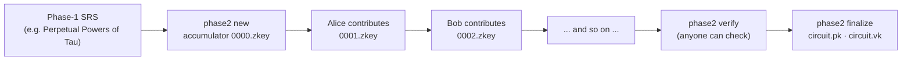

```bash
# 1. Initialize from universal SRS
trusted-setup phase2 new \
  --circuit circuit.r1cs \
  --srs universal.ptau \
  --zkey circuit_0000.zkey

# 2. Participants contribute sequentially (each independently, in turn)
trusted-setup phase2 contribute \
  --zkey-in circuit_0000.zkey \
  --zkey-out circuit_0001.zkey \
  --name "Alice"

trusted-setup phase2 contribute \
  --zkey-in circuit_0001.zkey \
  --zkey-out circuit_final.zkey \
  --name "Bob"

# 3. Verify the accumulator
trusted-setup phase2 verify --zkey circuit_final.zkey

# 4. Finalize to .pk / .vk
trusted-setup phase2 finalize \
  --zkey circuit_final.zkey \
  --proving-key circuit.pk \
  --verifying-key circuit.vk
```

**Why this is secure.** The power table `τⁱ·G1`, `τⁱ·G2` is a Phase-1 (universal) artifact produced by a public ceremony such as PPoT, where `τ` cannot be reconstructed as long as one contributor was honest. Phase 2 then *locks* that universal SRS to a specific circuit's QAP. The scalars never exist in one place at one time: each `contribute` step re-randomizes the accumulator under the previous participant's randomness, and `verify` checks that each contribution was valid without learning any secret. If the finalize production uses random scalars and every raw scalar is destroyed, the 1-of-N guarantee from [The ceremony intuition](#the-ceremony-intuition-1-of-n-trust) holds.

The `.pk` / `.vk` files produced by `ceremony-dev` or `phase2 finalize` are consumed by the `groth16` CLI (`prove` / `verify` / `export-vk`) and by the on-chain Aiken verifiers; both key formats are auto-detected on load (`FullProvingKey` uses the fast MSM prover path; the deprecated legacy `ProvingKey`, from the old `ceremony` command, falls back to the scalar-based prover path).

> **The legacy `ceremony` command is deprecated.** It produces a `ProvingKey` that contains scalar toxic waste — unsuitable for production. Use `ceremony-dev` for dev/testing and `phase2` for production.

---

## Nova vs Groth16 — the folding trick, up close

The table at the end of this section is the one-minute summary. Before you get there, here is the *why* behind each row — because Nova is not a tweak on Groth16, it is a genuinely different way to package the same math. The clearest way to see it is to take one real computation and prove it twice: once with the Groth16 sprint we just built, once with Nova.

### The same computation, two packages

Our concrete example is Cardano Ed25519 key ownership — "prove I know the private key behind this public key" — which needs ~1.97M constraints when written as one circuit. Both implementations in this repo prove the *same* ownership statement, and both end up touching the same ~1.97M constraints (`255 × 7,724 ≈ 1.97M`):

- **Package 1 — Groth16 (this sprint's Impl 7):** one monolithic circuit `cardano_ed25519_ownership`, proven all at once. This is the whole POV of Part One: make one big instance fast.
- **Package 2 — Nova (its trustless version, Implementation 10 in `nova-prover/`):** the same signature check split into **255 identical step circuits** of 7,724 constraints each (`cardano_ed25519_ownership_nova`), each wrapping one "limb" of the Ed25519 arithmetic and threading a running state. We deliberately present Nova at version 10, the **first version that needs no ceremony** — the versioned road to get there follows in a moment, and once we are there we stop: the refinements built after version 10 are out of scope here.

Same math, same total constraint count. The difference is the word **when** — when the constraints are processed, when the setup happens, and when the verifier pays.

### Diagram A — Groth16: one big circuit, one big blow-up

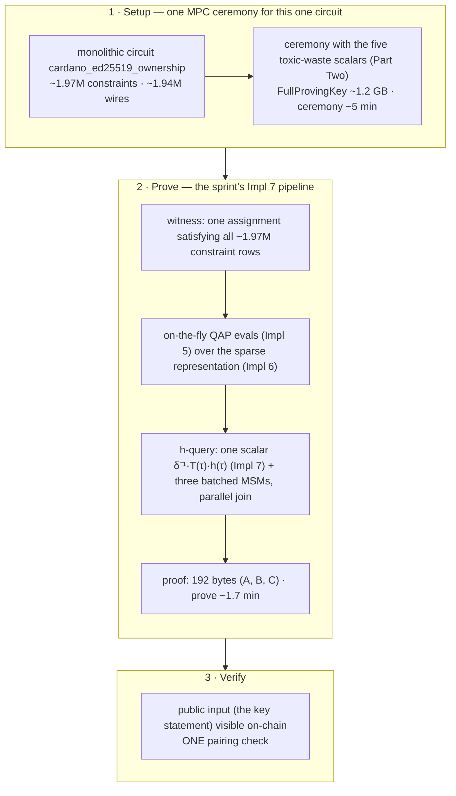

### Diagram B — Nova: fold as you go

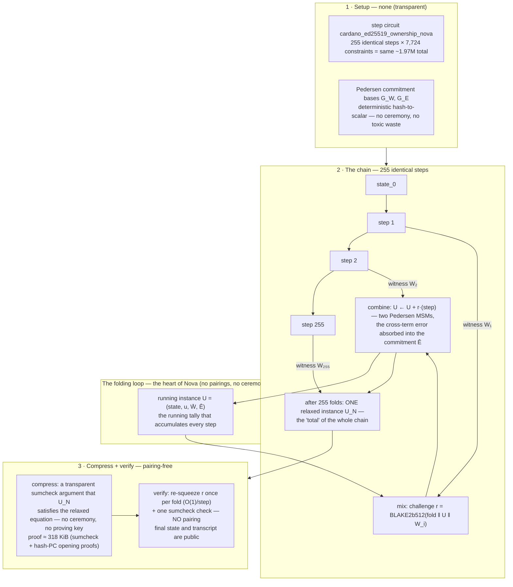

### The trick: fold, don't re-prove

Here is the intuition. Suppose you must prove the computation `state_0 → state_255` one step at a time.

- **The Groth16 way (diagram A):** the whole function `state_0 → state_255` becomes one giant circuit, and you prove it in one shot. Elegant, but the setup, memory, and ceremony all scale with the *entire* computation — this is exactly the blow-up the sprint's sparse matrices (Impl 6) fight.
- **The naive step-wise way:** prove each step with its own Groth16 proof and chain them. That *works* but degenerates: N proofs, N pairings, N ceremonies.
- **The Nova way (diagram B):** don't prove steps at all. Keep a **running instance** `U` — think of it as a running total, like adding a column of numbers by keeping a subtotal instead of re-adding all the previous rows at each step. Each new step writes its witness into the subtotal with a random weight `r` chosen from the transcript (a Fiat–Shamir challenge). Because the challenge is random, an adversary can only make the *combined* instance valid by having every step be valid — mixing one dishonesty into a sum of random-weighted honest steps leaves a detectable residue. At the end, one small **compress** step runs a clean-up check (the sumcheck argument) that the subtotal is, in fact, a valid instance, and the verifier just re-derives the challenges (O(1) per fold) and checks that one sumcheck.

Two engineering freedoms make this practical off-circuit:

- **No recursion of verifiers.** Nova never embeds a verifier inside a circuit, so there is no needs-for-a-curve-cycle or a pairing inside a circuit. Folding is a prover-side algebraic operation on commitments — two MSMs per step, all transparent.
- **The "relaxed" equation absorbs error.** An ordinary R1CS instance must satisfy `(AZ)∘(BZ) = CZ` exactly. The folded instances use a *relaxed* equation `(AZ)∘(BZ) = u·(CZ) + E` with a slack scalar `u` and an explicit error commitment `Ē`. Mixing two valid steps produces a small cross-term `(AZ₁)∘(BZ₂) + (AZ₂)∘(BZ₁)` that the fold captures in `Ē`; the final compress step proves it too small to hide anything — the accumulated error is a commitment to zero.

### Ceding nothing: the road to a trustless Nova

By now you may be wondering *how* Nova got permission-free. It was not born that way: Nova in this repo is a **climb of three implementations — 8, 9, and 10** — and trustlessness appears only at the top of the climb. We describe the three steps one at a time; each one is done; once we reach the trustless step, we stop.

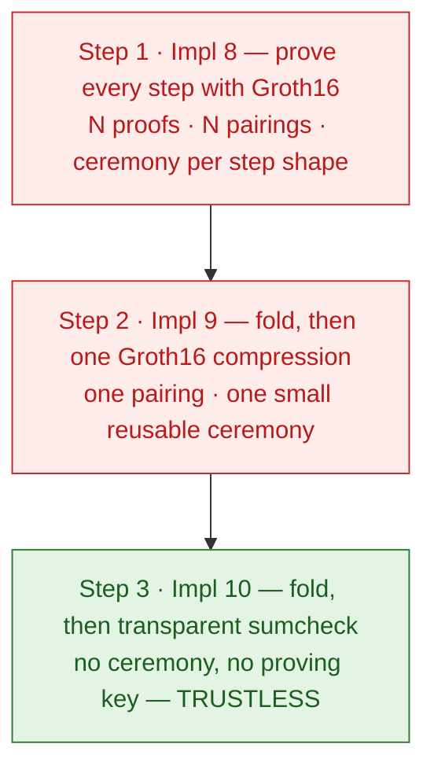

#### Step 1 — Implementation 8: prove every step with Groth16 ✅ done

> **Status:** ✅ done (baseline, superseded). This is the "step-chain" — the very first Nova in this repo, before folding existed.

Each of the `N` identical step circuits is proven **standalone with Groth16**, and the chain is bound by a BLAKE2b512 transcript. Nothing about the scheme is new yet: it is the sprint's own proving machinery applied `N` times, which means **one ceremony per step shape** — the same toxic-waste dance as Part Two, repeated per step. For the 255-step Ed25519 step we have been following, the bundle is **~334.7 KiB** (one proof per step, O(N)) and on-chain verification needs **255 pairing checks**. The commands show how little was new — this is the sprint's own prover, per step:

```bash
# inspect the step circuit, then run one ceremony per step shape
nova params --circuit step_circuit.r1cs
nova ceremony --circuit step_circuit.r1cs --proving-key step.pk --verifying-key step.vk

# prove every step with the step's proving key, bind the chain
nova fold --circuit step_circuit.r1cs --proving-key step.pk \
  --steps ./step_witnesses/ --out bundle.ivc.json

# verify: the whole chain, N pairing checks
nova verify --ivc bundle.ivc.json --verifying-key step.vk
```

Trustless? **No** — it inherited Groth16's trust model wholesale.

#### Step 2 — Implementation 9: fold, then compress with one Groth16 proof ✅ done

> **Status:** ✅ done (POC, superseded by step 3). This is where the fold from "the trick" first arrives in `nova-prover`.
>
> **What we're improving:** implementation 8's cost model — one ceremony per step shape, `N` proofs in the bundle, `N` pairing checks on-chain. Everything that scaled with the number of steps.
> **The idea:** don't prove the steps at all. Fold them into one instance (transparently), then prove *that one instance* with a single Groth16 proof.
> **Why it's reasonable:** the fold is already a binding operation — the "running tally" from the trick — so the only object left that still needs a *proof* is the final folded instance itself. One Groth16 proof can vouch for all `N` steps at once.

The fold is exactly the machinery from "the trick": a running Relaxed-R1CS instance `U = (x, u, W̄, Ē)`, one challenge `r` and two Pedersen MSMs per step, all transparent and off-circuit. Per step it is O(step) for the prover and O(1) for the verifier. By step 255 we hold *one instance* `U_N` — a claim that the whole chain's relaxed equation `(AZ)∘(BZ) = u·(CZ) + E` holds. Proving that single claim is now the whole remaining job.

The compression works like this:

- A small **compression circuit** — built in Rust (`nova-prover/src/compression.rs`), no circom needed — reuses the step circuit's sparse `A`/`B`/`C` matrices and checks the relaxed equation row by row, with `Z`, `u`, and `E` as its public inputs. Its size is `2·n_constraints` of the step (~15.4K constraints for the 7.7K-constraint Ed25519 step).
- Prove *that* circuit with Groth16 → one ~192-byte proof. This is the sprint's prover unchanged.
- The verifier's job becomes: re-derive the folds' challenges off the transcript (O(1) per step), then run **one pairing check** on the compression proof.

The scoreboard vs step 8, for the 255-step Ed25519 step we are following:

| | Step 1 (Impl 8) | Step 2 (Impl 9) |
|---|---|---|
| Bundle | ~334.7 KiB (O(N) — one proof per step) | ~312.9 KiB (O(step) — reveals final `Z`/`E`) |
| On-chain verify | 255 pairing checks | **1 pairing check** + accumulator recomputation |
| Ceremony | one per step shape | **one small reusable compression circuit** (~2·step constraints) |

The commands tell the story:

```bash
# one-time ceremony for the small, reusable compression circuit
trusted-setup ceremony-dev --sparse --circuit compression.r1cs \
  --proving-key compression.pk --verifying-key compression.vk

# fold N steps → ONE relaxed instance (and emit the compression circuit)
nova fold --nifs --circuit step_circuit.r1cs --steps ./step_witnesses/ \
  --compression-r1cs compression.r1cs --out bundle.ivc.json

# prove the single folded instance with Groth16
nova compress --groth16 --circuit step_circuit.r1cs --steps ./step_witnesses/ \
  --proving-key compression.pk --out compression.proof.json

# verify: transcript/state-chain check + ONE pairing check
nova verify --ivc bundle.ivc.json --compression-proof compression.proof.json \
  --compression-vk compression.vk
```

The fold itself costs ~47 s for our 255 steps (≈185 ms/step, measured on this machine's single core); proving and checking the one compression proof then adds a single pairing.

Two limitations remain, and both point straight at step 3:

- **The final `Z` and `E` are public inputs of the compression proof**, so the bundle is O(step) and the state is not hidden — no zero-knowledge.
- **The compression proof is still Groth16**, so the scheme still hangs on a ceremony — smaller (one reusable circuit) than step 8's per-shape ones, but a ceremony nonetheless.

Trustless? **No** — the compression proof is a pairing-based object and still needs toxic waste; just much less of it, and only once. Closing that last door is exactly what step 3 does.

#### Step 3 — Implementation 10: fold, then compress transparently ✅ done — trustless

> **Status:** ✅ done. The last swap on the climb — and the whole point of it.
>
> **What we're improving:** the last lever trust still had on steps 1–2: a Groth16 compression proof means a ceremony, secret scalars, and an SRS that someone could corrupt. Step 3 removes trust itself.
> **The idea:** replace the Groth16 compression *proof* with a **transparent sumcheck argument** — an object whose validity anyone can verify from public parameters alone.
> **Why it's reasonable:** the sumcheck protocol is essentially information-theoretic. It argues about polynomial identities using nothing but field arithmetic and public challenge coins, so it needs no hidden scalars, no SRS, and no ceremony — transparency is a property of the argument's construction, not an extra feature bolted on.

**How trustlessness was achieved.** The clean way to see it is to audit the whole system for things a user must take on faith. In steps 1–2 the ledger looked like this:

| In steps 1–2, trust hung on… | What step 3 does with it |
|------------------------------|--------------------------|
| Groth16 proving key from a ceremony — secret scalars `τ, α, β, γ, δ` hidden behind the compression circuit's SRS | Gone. The compression is now a sumcheck argument: nothing is secret, there is no SRS to precompute, no MPC to run |
| Proofs are pairing-based objects (the compression proof verifies with a pairing) | Gone from compression *and* from verification — sumcheck + hash-PC need no pairing object at all |
| The fold's Pedersen commitment bases | Clean already — derived deterministically (hash-to-scalar), never ceremony-bound |
| Anything else worth trusting? | The only assumptions left are **standard public maths**: discrete log (Pedersen binding) and a hash (the hash-PC) — research-grade computational assumptions, not a trusted-setup assumption |

That is the exact sense of "trustless" here: the set of things you must take on faith shrank from *{secret scalars, ceremony participants, SRS integrity}* to *{well-studied public assumptions}*. Nobody runs a ceremony, there is nothing to corrupt, and the parameters are reproducible from source by anyone. This is the textbook definition of a **transparent SNARK**.

The mechanics in one breath: after the 255 folds, the claim "the relaxed equation holds for `U_N`" is checked by running a **sumcheck protocol** — the prover commits to a witness polynomial, the verifier challenges evaluation points, and the **hash-PC** (a hash-based polynomial commitment, no pairings) supplies short opening proofs that the claimed evaluations are the honest ones. The verifier re-squeezes the fold challenges in O(1) per step, checks the transcript/state chain, and runs the sumcheck check — **no pairings anywhere**.

And notice what the commands now *don't* contain. There is no ceremony step:

```bash
# fold N steps → ONE relaxed instance (transparent, no keys of any kind)
nova fold --nifs --circuit step_circuit.r1cs --steps ./step_witnesses/ --out bundle.ivc.json

# compress: prove the final instance with a transparent sumcheck argument
nova compress --circuit step_circuit.r1cs --steps ./step_witnesses/ --out sumcheck.proof.json

# verify: transcript/state-chain check + sumcheck (pairing-free)
nova verify --ivc bundle.ivc.json --sumcheck-proof sumcheck.proof.json
```

What step 3 buys beyond transparency:

- **Zero-knowledge.** Step 2's compression made the final `Z`/`E` public inputs — anyone saw the final state. The sumcheck path no longer reveals them; the bundle hides the state (constant ~317.8 KiB, in both `N` and step width).
- **Pairing-free verification.** The last pairing in the whole pipeline is gone.

And what it costs — the honest ledger, one final row on the scoreboard:

| | Step 1 (Impl 8) | Step 2 (Impl 9) | Step 3 (Impl 10) |
|---|---|---|---|
| Bundle | ~334.7 KiB (O(N)) | ~312.9 KiB (O(step)) | **~317.8 KiB (constant)** |
| On-chain verify | 255 pairings | 1 pairing | **0 pairings (sumcheck + hash-PC)** |
| Ceremony | per step shape | one small reusable circuit | **none** |
| Zero-knowledge | No | No | **Yes** |

Trustless? **Yes** — this is the moment Nova becomes trustless: step 3 of the climb. The price is exactly where you would expect: ~318 KiB per bundle, three orders of magnitude heavier than Groth16's 192 bytes. Becoming trustless buys a ceremony-free, pairing-free, zero-knowledge system with proof size to match. One qualification, so the word is used honestly: "trustless" is a statement about *setup* — no ceremony, no secrets — not about quantum computers. The Pedersen layer is still discrete-log based, so under Shor's algorithm Nova breaks just as Groth16 does; the post-quantum road is the same swap to lattice commitments for both. That is where we stop.

### What the trick costs — the trade-offs

The trade-off ledger, stated as honestly as the sprint's:

- **You must linearize your computation.** Nova works on one *identical step shape* repeated N times, with a public state inflow and outflow (`n_pub_in == n_pub_out`). A Merkle path or an Ed25519 limb loop linearizes beautifully; an arbitrary R1CS circuit does not — you must restructure it into a state machine, and that is author work in circom, not an implementation decision.
- **Prover time is not free.** You still touch every constraint — the fold is O(step) per step, so N folds are O(N·step) ≈ the same total work as the monolithic prover. There is no 100× prover speedup lurking here: for this exact circuit the measured total is ~55 s (fold 47 s + compress ~8 s) vs ~1.7 min monolithic — comparable, not miraculous. The wins are elsewhere: memory (O(step) instead of ~2.5 GiB peak), per-step re-proving of any prefix, and the setup.
- **Proofs are orders of magnitude bigger.** ~318 KiB (sumcheck + hash-PC, constant in `N` and step width) vs 192 bytes — the price of transparency. Small enough to ship, too big for the thinnest datums.
- **Verification is pairing-free, not free.** No on-chain pairing opcode (the single most expensive Plutus operation), but the verifier still re-derives one challenge per fold and checks the sumcheck and the hash-PC openings. The win is *what* the script computes (native field arithmetic), not a zero-cost check.
- **ZK cuts both ways.** Nova's step 3 (Impl 10) is genuinely zero-knowledge: the Pedersen commitments (and the sumcheck) hide the intermediate state, while Groth16 puts every public input on the cutting-room floor for the verifier to see. That is a feature for selective disclosure and a nuisance when you actually want the public state visible on-chain (you must re-expose it as a public input — the final transcript the CLI prints).
- **Soundness moves off the ceremony, but stays in the store.** Nova removes the single most dangerous operational step Groth16 has — the trusted ceremony — because its commitment bases are deterministic and its compression (Impl 10) is transparent. But Nova is *not* post-quantum either: the Pedersen commitments are still discrete-log based, exactly the assumption Shor's algorithm dismantles. The sumcheck layer is information-theoretic, which is why the post-quantum road for both systems is the same one — swap the curve-based commitment for a lattice one (the direction this stack's `lattice-prover/` explores).

### At a glance

| Angle | Groth16 Impl 7 (this sprint) | Nova Impl 10 (transparent sumcheck) |
|-------|-------------------------------|--------------------------------|
| **Trusted setup** | Per-circuit MPC ceremony (Part Two above) — the whole toxic-waste dance | **None** — and none was needed at first: implementation 8 needed a ceremony per step shape (each step was a Groth16 proof), implementation 9 trimmed it to one small reusable compression circuit, and implementation 10 removed it entirely (Pedersen bases are derived deterministically, hash-to-scalar) |
| **Proof size** | 192 bytes — three curve points + public inputs, constant | ~318 KiB (sumcheck + hash-PC) — constant in step count `N` and step width; the price of transparency |
| **On-chain verification** | One pairing check (~20% of a Plutus script's CPU budget) | sumcheck + hash-PC — **pairing-free**. Removes the pairing (the single most expensive curve operation), but the ~318 KiB bundle is heavy |
| **Recursive composition** | Not native — each proof stands alone; a chain of steps needs a proof per step | **Native IVC** — `N` steps fold into one instance; verifier's per-step cost is O(1) |
| **Prover cost** | Fast (O(n log n) FFT + Pippenger); Poseidon ~624 ms/proof on this machine | Fast per fold (2 MSMs/step); 255 × 7,724-constraint steps fold in ~47 s for this circuit |
| **Setup portability** | One proving key per circuit; a new circuit = a new ceremony | One deterministic setup reused for *any* step shape; nothing to leak |
| **Zero-knowledge** | Not ZK on-chain — the public inputs are visible | **ZK** — Pedersen commitments hide the public inputs/state |
| **Soundness model** | Knowledge-of-exponent (KEA) + trusting ceremony participants | Pedersen binding (curve DL) + sumcheck (information-theoretic, pairing-free) |
| **Post-quantum** | No — discrete log / pairings | No in this implementation — the Pedersen layer is curve-based (DL). The sumcheck layer is information-theoretic, so swapping in lattice commitments is the road to PQ |
| **Sweet spot** | Single prove→verify: one circuit, one proof, one check | Proofs about *longer computations*: many identical steps folded into one pairing-free check |

Which do you reach for? For a **one-shot statement** — "I own this key" and nothing more — Groth16 stays the right tool: smallest proof, one pairing, and a ceremony that Part Two above showed how to run safely. For a **step-by-step computation** — an Ed25519 signature verified limb-by-limb, a Merkle path walked one hash at a time, a serial state machine — Nova removes both the ceremony and the per-step proof blow-up, trading a much larger proof (~318 KiB) for a pairing-free verifier that fits Cardano's execution-cost model without paying for an on-chain pairing.

The stacks share their foundation on purpose: `nova-prover` reuses the R1CS/QAP engine, ceremony, and circom adapter of `groth16-prover` / `trusted-setup` and adds the IVC layer on top — the same `.r1cs` computation can be packaged either way, and the choice is a workflow one, not a rewrite.

One last word before we leave Nova. **Transparent is an endpoint for *setup*, not the end of the story.** A transparent Nova can still be *bolstered* — slimmed down to on-chain-sized proofs, and hardened for the quantum era — which is exactly what the [`paweljakubas/nova-slim`](https://github.com/paweljakubas/nova-slim) project does: the same sumcheck foundations we saw in step 3, carrying both slim proofs and post-quantum security. That belongs to a later installment of this series; for now, step 3 gives us everything needed to understand it.

---

## The landscape beyond Groth16 — where Nova fits

Everything so far lives in the *pairing family*: proofs measured in bytes, verification settled by one pairing check. The rest of the ZKP zoo trades parts of that foundation for other guarantees. Below, each major alternative's **essence** — the single idea it hangs on — then a comparison table with the systems we have built, and the axes that decide between them.

### PLONK

**Essence:** a *universal* circuit. One shared, updatable SRS is big enough for any circuit up to a size, and each individual circuit supplies only its wiring — custom gates plus a permutation argument proving the wires connect as described. The setup is still trusted, but you run it once, globally, instead of once per circuit.

### Bulletproofs / Bulletproofs++

**Essence:** *no setup and no pairings*. Proof size shrinks logarithmically through a recursive inner-product argument: the verifier walks a binary tree of commitment products instead of evaluating a pairing. Transparent, but the commitment generators are still discrete-log based, so it is not post-quantum.

### STARKs (FRI)

**Essence:** commit to the computation's *trace* with hashing rather than curves, then prove the committed polynomial is low-degree by many random spot-checks (the FRI protocol). Hash-based end to end, so transparent **and post-quantum** — at the price of proof size: the spot-check commitments are large.

### JOLT

**Essence:** a *lookup-based* zkVM. Rather than encoding a whole program as one circuit, JOLT commits to the execution *trace* and uses lookup arguments to certify that every accessed row really is in the instruction table. Adding instructions becomes cheap, the verifier stays fast, and being hash-committed it is transparent and post-quantum.

### VM approaches (RISC Zero, zkVMs)

**Essence:** *don't hand-write a circuit at all* — compile a program to a virtual-machine tape, prove the whole tape, and use recursive composition so one small proof stands for an entire run. Transparent and post-quantum, but proofs run into the hundreds of KB and the toolchain is heavy.

### Quantum-era folding (HyperNova, LatticeFold, Lova, …)

**Essence:** replace the discrete-log assumption (which Shor's algorithm destroys) with *module-lattice* hardness — the same family the post-quantum world standardized on. HyperNova / LatticeFold / Lova generalize Nova's folding to lattice commitments; `paweljakubas/nova-slim` is this stack's lineage's version of that idea: slim proofs and post-quantum, built on the sumcheck machinery of step 3.

### The comparison table

> **Reading the numbers.** The Groth16 and Nova rows are measured in this repo / on this machine. The other rows are representative published ranges for comparable (~1.97M-constraint) statements — treat them as orders of magnitude, not benchmarks.

| Approach | Trusted setup | Proof size | Verification (rough) | Post-quantum | Essence in one line |
|---|---|---|---|---|---|
| **Groth16 (Impl 7)** | MPC ceremony, per circuit | **192 B** · measured | one pairing · ~0.2 s off-chain | No | smallest proofs; this installment's whole sprint |
| **Nova — trustless (Impl 10)** | **none** | ~318 KiB · measured | sumcheck + hash-PC, pairing-free · ~8 s tooling, full proof | No | IVC: fold N identical steps into one instance |
| **nova-slim** | none | few KiB (slim) | pairing-free sumcheck | **Yes** | Nova, bolstered: slim + quantum-safe (later installment) |
| **PLONK** | universal updatable SRS (once) | ~400–600 B | one pairing + MSM | No | universal circuit, custom gates |
| **Bulletproofs++** | none | ~1–3 KiB | inner-product walk, no pairing | No | setup-free, logarithmic proofs |
| **STARKs (FRI)** | none | ~45 KiB–1 MB | hash spot-checks, ~ms | **Yes** | hash-committed trace, many random checks |
| **JOLT** | none | ~100 KB–1 MB | lookup + hash checks, fast | **Yes** | lookup-based zkVM over execution traces |
| **zkVMs (RISC Zero)** | none | ~70 KB–1 MB | recursive STARK verify, ~ms | **Yes** | prove a whole program, not a circuit |
| **Quantum-era folding** | none | moderate | folded lattice checks (heavier field work) | **Yes** | Nova's fold on lattice commitments — installment 5's settlement |

Three axes decide between the rows. **Proof size and trust go together**: the pairing family (Groth16, PLONK) delivers sub-KB proofs and pays with a ceremony; the transparent family forfeits size instead. **Post-quantum is a hard divide**: only the hash/lattice lines — STARKs, JOLT, zkVMs, quantum-era folding, and nova-slim — survive Shor's algorithm; Groth16, PLONK, and Bulletproofs++ do not. **The Nova line turns on one pivot**: trusted at step 1, transparent at step 3, and via nova-slim quantum-safe *and* slim afterwards. The mechanics for that pivot are exactly the step-3 sumcheck, and that is where installment 5 of this series lands.

---

## Farewell — and what's next

**Where this installment left us.** We took the installment-1 pipeline — dense monomial, long division, scalar-by-scalar proof assembly, fixed dev scalars — and climbed seven rungs to a production-grade prover. The same Poseidon proof that took ~26 s at the bottom runs in **624 ms** at the top, from a real Circom `.r1cs`/`.wtns` circuit, with matrix memory down **1,389×**; the h-commitment that was a multi-thousand-point MSM is a single scalar; and a ceremony once fixed to printable primes (`τ = 6`) is now understood as the system's heartbeat — the five scalars `τ, α, β, γ, δ` held secret and random by an MPC, because knowing `τ` is the ability to forge. Beyond the sprint, we climbed Nova's three steps to trustlessness, and judged the whole landscape of alternatives — PLONK, Bulletproofs++, STARKs, JOLT, zkVMs, lattice folding — against the rows we measured.

> **Honesty caveat — what this installment left at the trailhead.** Two things are designed and explained here but not demonstrated end to end. First, the **real multi-party ceremony**: the forgery attack, the secrecy argument, and the MPC machinery are all in front of you, but the orchestration itself (the PPoT challenge flow) was deferred — it still sits in the `[next]` slot of the sprint table, awaiting its hands-on walkthrough. Second, **Nova's transparency is a statement about setup, not about assumptions**: "no ceremony" buys trustlessness over a discrete-log Pedersen layer, which is not post-quantum — the exact seam installment 5's lattice survey will revisit.

### Installment 3 — a practical problem, end to end

Which brings us to the point of this whole exercise. The next installment stops optimizing the engine and starts *using* it: **proving Cardano key ownership**. You hold a private key; you want to convince an on-chain verifier that the public key behind a Cardano address was derived from a key you control — without revealing it, and without asking the on-chain script to trust a signature. That statement is the ~1.97M-constraint `cardano_ed25519_ownership` circuit; its proof is **192 bytes and one pairing check**, small enough to travel in a Cardano transaction and cheap enough to gate a spending script on. Nova is waiting in the wings: the same ownership statement split into 255 identical steps, folded into a single pairing-free proof — the choose-your-package question resolved, as the Nova walkthrough left it, by the shape of the computation.

### The installments after

Installment 4 applies the same stack to **selective disclosure** — proving predicates (`age ≥ 21`, `country ∈ S`) without revealing credential fields or the holder's address. Installment 5 closes the series on the frontier the landscape table opened: **quantum-resistant, lattice-based** systems — the nova-slim direction included — and when the pairing-based assumption this series is built on will, and will not, be safe.

The code for all installments lives in the [cardano-foundation/bls](https://github.com/cardano-foundation/bls) repository.

Stay tuned for the next ZKP installment!