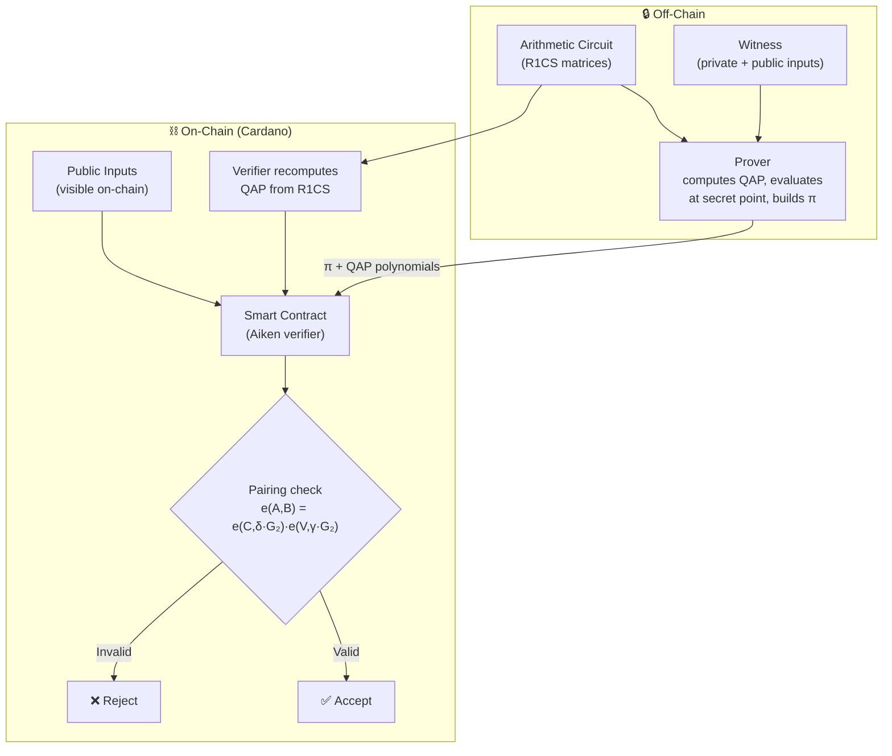
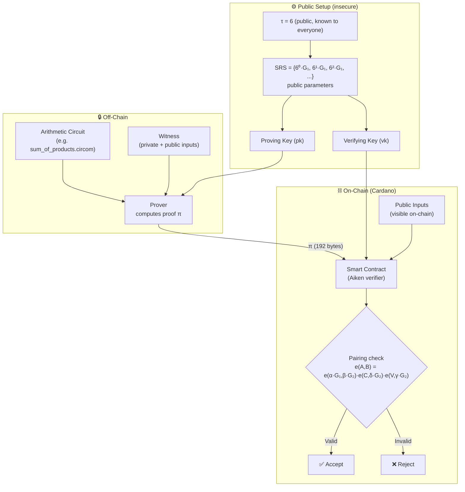
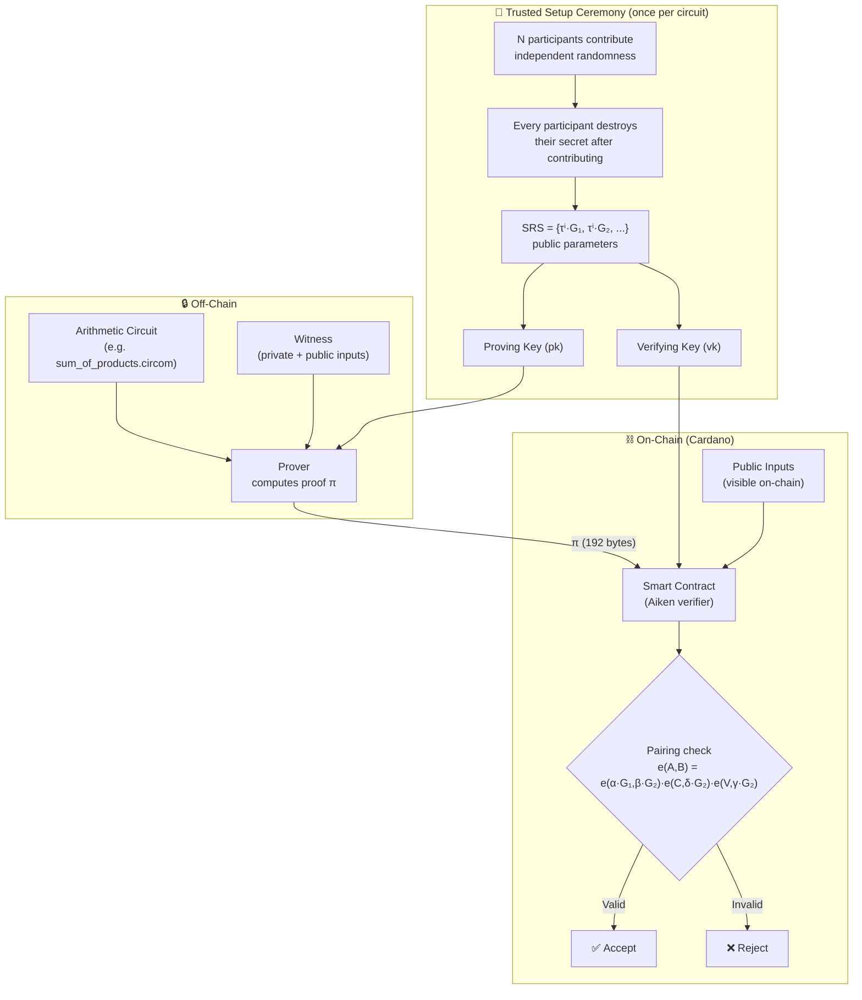

# Zero Knowledge Proof from first principles

> **Installment 1 of 6.** This article introduces the mathematical intuition behind zk-SNARKs, walks through the simplest possible non-trivial circuit, and shows how to generate and verify a Groth16 proof end-to-end on Cardano using nothing but first-principles code. No black boxes, no hand-waving — every intermediate value can be printed and inspected.
>
> In **Installment 2** we will explore the engineering optimizations that turn this slow-but-transparent pipeline into a production prover (FFT, Pippenger MSM, sparse matrices, trusted-setup ceremonies), survey competing proof systems (PLONK, Bulletproofs++, JOLT, STARKs, VM approaches), and map the trade-offs. In **Installment 3** we will show how the optimized prover can be used to prove ownership of cryptographic keys and how to marry this capability with Cardano addresses. In **Installment 4** we will apply the full production stack to **selective disclosure** — the pattern where a credential holder proves they satisfy a predicate (`age ≥ 21`, `country ∈ approved set`) without revealing any field values or their blockchain address. In **Installment 5** we will look at what embracing a **zkVM** could gain us: the ability to prove arbitrary program execution without hand-writing circuits, and how that might reshape the developer experience for privacy-preserving applications on Cardano. In **Installment 6** we will survey **quantum-resistant ZKP systems** — especially lattice-based constructions — that aim to replace the elliptic-curve assumptions Groth16 relies on with post-quantum hard problems, and map the trade-offs against the pairing-based baseline we have built here.

---

## Table of Contents

- [The paradox](#the-paradox)
- [Why Groth16 matters](#why-groth16-matters)
- [From computation to gates](#from-computation-to-gates)
- [A 5-constraint "hello world"](#a-5-constraint-hello-world)
- [Why polynomials? (QAP)](#why-polynomials-qap)
- [The trusted setup](#the-trusted-setup)
- [Why the scalars must be secret and random](#why-the-scalars-must-be-secret-and-random)
- [The proof: three curve points](#the-proof-three-curve-points)
- [Verification: one equation](#verification-one-equation)
- [The Groth16 workflow at a glance](#the-groth16-workflow-at-a-glance)
  - [Very insecure Groth16: no setup](#very-insecure-groth16-no-setup)
  - [Still insecure Groth16: public setup](#still-insecure-groth16-public-setup)
  - [Secure Groth16: trusted setup](#secure-groth16-trusted-setup)
- [Running it on Cardano](#running-it-on-cardano)
- [The full pipeline in our repo](#the-full-pipeline-in-our-repo)
- [What's next](#whats-next)

---

## The paradox

Imagine you have solved a Sudoku puzzle. I want to be convinced that you know a valid solution, but I do not want you to show me the completed grid — perhaps because the solution encodes a password, or because I want to preserve your ability to challenge someone else with the same puzzle.

Traditional cryptography offers encryption and signatures, but nothing that solves this exact problem: **proving knowledge of a secret without revealing the secret itself**.

Zero-knowledge proofs (ZKPs) do exactly that. A ZKP is a mathematical object — a short string of bytes — that convinces any verifier that a statement is true, while giving the verifier zero information about the evidence that makes it true.

The most practical and widely deployed family of ZKPs today is called **zk-SNARKs**: *Zero-Knowledge Succinct Non-Interactive Arguments of Knowledge*. "Succinct" means the proof is tiny (hopefully a few hundred bytes or so). "Non-interactive" means the prover sends a single message; no back-and-forth challenge protocol is needed. "Argument of knowledge" means the proof does not just show that a solution exists — it shows that the prover actually *knows* one.

This article focuses on **Groth16**, the fastest and most compact zk-SNARK construction in production today. A Groth16 proof is 192 bytes. Verification requires only three elliptic-curve pairings. Crucially, these costs are **constant**: whether the circuit has 5 constraints or 5 million, the proof is always 192 bytes and verification always takes exactly three pairings. The size of the problem affects only the prover's work (which grows with the circuit), never the proof size or the verifier's effort. And since Cardano's Plutus V3 already exposes **BLS12-381** pairing primitives natively, Groth16 verification can run inside an Aiken smart contract with no protocol changes.

> **Why BLS12-381?** The entire pipeline in this article — the finite field `Fr`, the elliptic-curve groups `G1` and `G2`, and the bilinear pairing `e` — is built on the **BLS12-381 curve**. We chose it specifically because Cardano's Plutus V3 has native builtins for it. If you are new to BLS12-381 and want a gentle introduction to what it enables on Cardano — BLS signatures, VRFs, anonymous credentials, and more — the Cardano Foundation has published a dedicated blog post: [**"Aiken BLS12-381 primitives — wide possibilities available"**](https://cardanofoundation.org/blog/aiken-primitives-explained).

But before we get to smart contracts, we need to understand what the proof actually *is*. We will build it from scratch, step by step, using a very simple circuit: a 5-constraint sum-of-products.

## Why Groth16 matters

The idea of a zero-knowledge proof is old — it dates back to Goldwasser, Micali, and Rackoff in the 1980s. But for decades ZKPs were theoretical curiosities: interactive, expensive, and impractical for real systems. The breakthrough came in 2012 when Rosario Gennaro, Craig Gentry, Bryan Parno, and Mariana Raykova showed how to compress an arbitrary computation into a **Quadratic Arithmetic Program** (QAP) and then prove its correct evaluation with a short, non-interactive argument built from elliptic-curve pairings. This was the birth of the zk-SNARK.

Four years later, Jens Groth published the paper that distilled the idea to its absolute minimum:

> **Jens Groth, "On the Size of Pairing-Based Non-interactive Arguments", *EUROCRYPT 2016*.**
> [https://eprint.iacr.org/2016/260](https://eprint.iacr.org/2016/260)

Groth's construction — now universally called **Groth16** — achieves something that no previous scheme had:

- **Proof size:** exactly **3 curve points** (2 in G1, 1 in G2). Compressed: **192 bytes**.
- **Verification cost:** **3 pairings** and a handful of multi-scalar multiplications in G1. On modern hardware: a few milliseconds.
- **CRS size:** The *Common Reference String* — also called the *Structured Reference String* (SRS); these two names refer to the same artifact — is the complete set of public parameters that both prover and verifier share. Without a CRS, the prover would have to send the full QAP polynomials to the verifier (destroying succinctness) and the polynomials would leak the witness (destroying zero-knowledge). The CRS solves both problems: it encodes the polynomials "in the exponent" on the curve, so the prover can evaluate them efficiently without revealing the underlying values. The CRS is produced by the trusted setup ceremony (introduced below); in Groth16, it grows linearly with the circuit size, but the *verifying key* (the subset the verifier needs) is constant-size for a given circuit.
- **Security:** perfect zero-knowledge and computationally sound knowledge extraction under the standard q-PKE and q-SDH assumptions on pairing-friendly curves. Here `q` is the *degree of the QAP polynomials*, which equals the number of constraints in the circuit — for our 5-constraint SumOfProducts example, `q = 5` (we need powers `τ⁰` through `τ⁴`). The **q-PKE** (*q-Polynomial Knowledge Exponent*) assumption says that given the CRS points `g^{τ^i}` for `i = 0, ..., q`, it is hard to produce `g^{P(τ)}` for a polynomial `P` of degree ≤ `q` *unless* `P(τ)` can be built by combining the CRS points you already have — in other words, you cannot conjure up a new curve point that the CRS does not already "contain." This is what makes the trusted setup secure: the ceremony creates the CRS, and once the raw scalars (`τ`, `α`, `β`, ...) are destroyed, nobody can fabricate additional valid CRS points. The **q-SDH** (*q-Strong Diffie-Hellman*) assumption says that given `g, g^s, g^{s²}, ..., g^{s^q}` for an unknown `s`, it is hard to produce `(c, g^{1/(s+c)})` for any new `c` — this prevents an attacker from forging a valid pairing equation without knowing the trapdoor.

These numbers are not merely good — they are **optimal** for the pairing-based model. No scheme with the same trust assumptions can have asymptotically smaller proofs or faster verification. This is why Groth16 became the engine behind Zcash's shielded transactions, Filecoin's replication proofs, and dozens of other production systems.

### Why Groth16 is the prerequisite

If you want to understand modern zero-knowledge proof systems, you must understand Groth16 first. Every other construction is best understood as a deliberate trade-off *against* the Groth16 baseline:

| System | What it keeps from Groth16 | What it changes | Cost of the change |
|--------|---------------------------|---------------|-------------------|
| **PLONK** | R1CS, QAP-style polynomial encoding, pairing-based verification | Universal trusted setup; custom gates; permutation argument | Slightly larger proofs, but one SRS serves all circuits |
| **Bulletproofs / Bulletproofs++** | R1CS, inner-product argument structure | No trusted setup at all; no pairings; proofs grow logarithmically. Bulletproofs++ (2022) is a transparent drop-in improvement: same security model, ~3–5× faster verification, ~38% smaller proofs ([ePrint 2022/510](https://eprint.iacr.org/2022/510)). | Bulletproofs: proof size ~1–2 KB (10× larger than Groth16), verification O(n). Bulletproofs++ reduces this gap significantly. |
| **STARKs** | Polynomial commitment + FRI | Transparent setup (hashes only); post-quantum | Proof size ~50–200 KB; no elliptic curves needed |
| **JOLT / zkVMs** | The *goal* (prove arbitrary computation) | Replace hand-written circuits with VM execution traces + lookup arguments | Massive proof overhead, but no circuit engineering |

Groth16 teaches the fundamental pipeline that every other system either inherits or reacts against:

1. **Computation → Constraints** (R1CS)
2. **Constraints → Polynomials** (QAP)
3. **Polynomials → Encrypted Evaluations** (trusted setup / SRS)
4. **Witness + SRS → Proof** (prover algorithm)
5. **Proof + Public Inputs + VK → Yes/No** (pairing or commitment check)

Once you have walked through this pipeline by hand — as we do in this article with the dense monomial implementation — you possess the mental model necessary to evaluate *any* proof system. You will know what "removing the trusted setup" actually means, why "universal CRS" matters, and why "post-quantum" constructions pay the price they do.

This is why our [groth16-prover](https://github.com/cardano-foundation/bls/tree/main/groth16-prover) implementation begins with `Implementation 1`: a hard-coded circuit, dense polynomials, naive scalar-by-scalar proof assembly, and deterministic toxic waste. It is the slowest possible path, but it is also the *most educational*. Every other system is a speedup or a trade-off applied to this same skeleton.

---

## From computation to gates

A zk-SNARK does not prove arbitrary Python or C code. It proves the correct execution of an **arithmetic circuit**: a directed acyclic graph where every node is either an addition or a multiplication, and the edges are *wires* carrying numbers from a finite field. Each multiplication node takes exactly two inputs — no more, no less. This binary-input restriction is fundamental: a multiplication of three or more variables must be decomposed into a chain of binary multiplications using intermediate wires.

In practice, we write circuits in a domain-specific language like **Circom**, which compiles to a format called **R1CS** (Rank-1 Constraint System). An R1CS constraint has the shape:

```
(A · w) * (B · w) = (C · w)
```

where `w` is the *witness vector* (all wire values, both public and private) and `A`, `B`, `C` are sparse matrices. Each row of the matrices encodes one multiplication gate. Addition is "free" — it happens inside the linear combinations `A·w`, `B·w`, and `C·w` without needing a separate gate.

This is the key insight: **multiplication costs a constraint; addition does not.** The art of circuit design is therefore minimizing multiplications.

There is one more constraint: each R1CS row can express only a *quadratic* relationship — one multiplication of two linear combinations. Higher-degree terms must be decomposed. For example, the equation `x·y·z = 10` requires two constraints: introduce an intermediate wire `t = x·y`, then check `t·z = 10`. Similarly, `x³ = 8` becomes `t = x·x` and `t·x = 8`. This quadratic limitation is fundamental to R1CS and shapes how every circuit is designed.

---

## A 5-constraint "hello world"

Our repository already contains a 3-gate multiplication chain (`multiplier.circom`) that proves `a = x1·x2·x3·x4`. To make the pedagogical step slightly richer, we introduce a 5-constraint circuit that proves a *sum of pairwise products*. Let us start with the concrete problem.

**The equation.** We have eight secret numbers that must satisfy:

```
a·b + c·d + e·f + g·h = 100
```

**Who knows what.** The *prover* knows a solution — say, `a=1, b=2, c=3, d=4, e=5, f=6, g=7, h=8` (since `1·2 + 3·4 + 5·6 + 7·8 = 100`). The *verifier* knows only the equation, and here `100` which is known as output. The verifier does not know the eight inputs that the prover come up with. The question is: *can the prover convince the verifier that he knows the solution to the equation, without revealing any of the eight numbers?*

**Translating to R1CS.** Groth16 does not operate on equations directly — it requires a **Rank-1 Constraint System**: a set of multiplication constraints of the form `(A·w) * (B·w) = (C·w)`, where `w` is the *witness vector* (the full assignment of values to every wire — secret inputs, public outputs, and intermediates). Our equation splits into four multiplication gates plus one addition gate:

```
t1 = a · b        (constraint 0)
t2 = c · d        (constraint 1)
t3 = e · f        (constraint 2)
t4 = g · h        (constraint 3)
out = t1 + t2 + t3 + t4    (multiplication-by-1 — constraint 4)
```

The witness vector is:

```
w =  [  1,   100,  1, 2, 3, 4, 5, 6, 7, 8,  2, 12, 30, 56 ]
       ^    ^    ^                           ^  ^   ^   ^
       |    |    |                           |  |   |   |
      const out  a   b  c  d  e  f  g  h   t1 t2  t3  t4
     [  0,    1,  2, 3, 4, 5, 6, 7, 8, 9, 10, 11, 12, 13 ]  <-- indices
```

Note the first entry is the constant `1` (present in every R1CS witness), and `out = 100` is the public output that the verifier knows.

We write circuits in **Circom** — think of it as the assembly language for R1CS: it compiles directly to constraint matrices with no hidden abstractions, which is why we use it throughout this tutorial. This circuit has 8 private inputs, 4 intermediate wires, and 1 public output. In R1CS form it yields 5 constraints — four multiplication gates plus one addition gate (which R1CS also encodes as a constraint). The source lives in [`circom/SumOfProducts/sum_of_products.circom`](https://github.com/cardano-foundation/bls/blob/main/circom/SumOfProducts/sum_of_products.circom):

```circom
pragma circom 2.0.0;

template SumOfProducts() {
    signal input a;  signal input b;
    signal input c;  signal input d;
    signal input e;  signal input f;
    signal input g;  signal input h;

    signal t1; signal t2; signal t3; signal t4;
    signal output out;

    t1 <== a * b;
    t2 <== c * d;
    t3 <== e * f;
    t4 <== g * h;
    out <== t1 + t2 + t3 + t4;
}

component main = SumOfProducts();
```

The prover's job is to come up with a solution to the equation. Here the prover chose [`input.json`](https://github.com/cardano-foundation/bls/blob/main/circom/SumOfProducts/input.json) — the eight numbers that satisfy the circuit:

```json
{ "a": "1", "b": "2", "c": "3", "d": "4",
  "e": "5", "f": "6", "g": "7", "h": "8" }
```

the witness vector is as we shown above:

```
[1, 100, 1, 2, 3, 4, 5, 6, 7, 8, 2, 12, 30, 56]
```

where `100 = 2 + 12 + 30 + 56` is the only public value besides the constant `1`.

---

## Why polynomials? (QAP)

R1CS is a matrix format — good for compilers, bad for cryptography. Checking a matrix equation `(A·w) ∘ (B·w) = C·w` requires examining every row individually, which is O(n) work — and there is no way to compress it into something a verifier can check with a single, constant-size operation. Cryptography needs a representation where the *entire* system of constraints can be verified at a single point, and that is exactly what polynomials provide.

Before we dive into the construction, recall a basic fact about polynomials: **a polynomial of degree d is uniquely determined by d+1 points**. Two points define exactly one line (degree 1). Three points define exactly one parabola (degree 2) — you cannot have two different parabolas passing through the same three points. This uniqueness is what makes polynomials a *commitment*: once we fix the values at constraint points, there is exactly one polynomial that fits, and any deviation is detectable. The breakthrough idea behind zk-SNARKs (originally due to Gennaro, Gentry, Parno, and Raykova, then refined by Groth) is to turn the matrix into **polynomials**.

For each wire `i`, we build three polynomials `u_i(x)`, `v_i(x)`, `w_i(x)` such that at constraint point `j`:

```
u_i(j) = A[j][i]
v_i(j) = B[j][i]
w_i(j) = C[j][i]
```

The prover then forms the *witness polynomials* by summing each family weighted by the witness values:

```
l(x) = Σ a_i · u_i(x)
r(x) = Σ a_i · v_i(x)
o(x) = Σ a_i · w_i(x)
```

**Concrete example: all five constraints.** To see how this works, let us first recall the R1CS matrices from the hello-world section. Each constraint picks two wires on the left and right, and one on the output:

```
Constraint 0:  L[0] picks a (col 2),  R[0] picks b (col 3),  O[0] picks t1 (col 10)
Constraint 1:  L[1] picks c (col 4),  R[1] picks d (col 5),  O[1] picks t2 (col 11)
Constraint 2:  L[2] picks e (col 6),  R[2] picks f (col 7),  O[2] picks t3 (col 12)
Constraint 3:  L[3] picks g (col 8),  R[3] picks h (col 9),  O[3] picks t4 (col 13)
Constraint 4:  L[4] picks 1 (col 0),  R[4] picks t1+t2+t3+t4 (cols 10-13),  O[4] picks out (col 1)
```

In matrix form (all unlisted entries are 0), with the witness vector alongside for reference:

```
-w =    [  1  100  1  2  3  4  5  6  7  8  2  12  30  56 ]
         const out  a  b  c  d  e  f  g  h  t1 t2 t3 t4
         ----- ---  -  -  -  -  -  -  -  -  -- -- -- --
L[0]  = [  0    0  1  0  0  0  0  0  0  0   0  0  0  0 ]    picks a
L[1]  = [  0    0  0  0  1  0  0  0  0  0   0  0  0  0 ]    picks c
L[2]  = [  0    0  0  0  0  0  1  0  0  0   0  0  0  0 ]    picks e
L[3]  = [  0    0  0  0  0  0  0  0  1  0   0  0  0  0 ]    picks g
L[4]  = [  1    0  0  0  0  0  0  0  0  0   0  0  0  0 ]    picks 1 (constant)

R[0]  = [  0    0  0  1  0  0  0  0  0  0   0  0  0  0 ]    picks b
R[1]  = [  0    0  0  0  0  1  0  0  0  0   0  0  0  0 ]    picks d
R[2]  = [  0    0  0  0  0  0  0  1  0  0   0  0  0  0 ]    picks f
R[3]  = [  0    0  0  0  0  0  0  0  0  1   0  0  0  0 ]    picks h
R[4]  = [  0    0  0  0  0  0  0  0  0  0   1  1  1  1 ]    picks t1+t2+t3+t4

O[0]  = [  0    0  0  0  0  0  0  0  0  0   1  0  0  0 ]    picks t1
O[1]  = [  0    0  0  0  0  0  0  0  0  0   0  1  0  0 ]    picks t2
O[2]  = [  0    0  0  0  0  0  0  0  0  0   0  0  1  0 ]    picks t3
O[3]  = [  0    0  0  0  0  0  0  0  0  0   0  0  0  1 ]    picks t4
O[4]  = [  0    1  0  0  0  0  0  0  0  0   0  0  0  0 ]    picks out
```

The QAP transformation builds, for each wire `i`, three polynomials `u_i(x)`, `v_i(x)`, `w_i(x)` that reproduce these matrix columns at the constraint points — the x-values where each constraint is evaluated (one point per constraint, so `{0, 1, 2, 3, 4}` for our 5-constraint circuit). The Lagrange basis polynomial `L_0(x)` equals `1` at `x = 0` and `0` at the other four points. Its explicit expanded form is:

```
L_0(x) = (x−1)(x−2)(x−3)(x−4) / (0−1)(0−2)(0−3)(0−4)
        = (x−1)(x−2)(x−3)(x−4) / 24
        = (x⁴ − 10x³ + 35x² − 50x + 24) / 24
```

For constraint 0 (`t1 = a·b`), wire 2 (`a`) appears on the left, wire 3 (`b`) on the right, and wire 10 (`t1`) on the output. So:

```
u_2(x) = L_0(x)    v_3(x) = L_0(x)    w_10(x) = L_0(x)
```

Evaluating at `x = 0`:

```
u_2(0) = 1    v_3(0) = 1    w_10(0) = 1

l(0) = ... + a_2 · u_2(0) + ... = ... + 1 · 1 + ... = 1    (picks a = 1)
r(0) = ... + a_3 · v_3(0) + ... = ... + 2 · 1 + ... = 2    (picks b = 2)
o(0) = ... + a_10 · w_10(0) + ... = ... + 2 · 1 + ... = 2  (picks t1 = 2)

l(0) · r(0) = 1 · 2 = 2 = o(0)  ✓
```

The same pattern holds for constraint 1 (`t2 = c·d`, at point `x = 1`). The Lagrange basis polynomial `L_1(x)` equals `1` at `x = 1` and `0` at the other four points. Because wire 4 (`c`) appears on the left side of constraint 1 only, `u_4(x) = L_1(x)`. Similarly, `v_5(x) = L_1(x)` for wire 5 (`d`), and `w_11(x) = L_1(x)` for wire 11 (`t2`). Evaluating at `x = 1`:

```
u_4(1) = 1   (by definition of Lagrange basis L_1(x))
v_5(1) = 1   (by definition of Lagrange basis L_1(x))
w_11(1) = 1  (by definition of Lagrange basis L_1(x))

l(1) = ... + a_4 · u_4(1) + ... = ... + 3 · 1 + ... = 3    (picks c = 3)
r(1) = ... + a_5 · v_5(1) + ... = ... + 4 · 1 + ... = 4    (picks d = 4)
o(1) = ... + a_11 · w_11(1) + ... = ... + 12 · 1 + ... = 12  (picks t2 = 12)

l(1) · r(1) = 3 · 4 = 12 = o(1)  ✓
```

The same pattern holds at every constraint point. If the witness is correct, then at every constraint point `j`:

```
l(j) · r(j) = o(j)
```

This means the polynomial `l(x)·r(x) − o(x)` is zero at every constraint point. Therefore it is divisible by the *target polynomial* `T(x)`, which is simply the product of `(x − j)` over all constraint points `j`.

The prover computes the **quotient polynomial**:

```
h(x) = (l(x)·r(x) − o(x)) / T(x)
```

where `T(x) = (x−0)(x−1)(x−2)(x−3)(x−4)` is the target (vanishing) polynomial — it is zero at every constraint point, which is exactly what guarantees the division has zero remainder when the witness is correct.

For our SumOfProducts circuit, `l(x)`, `r(x)`, and `o(x)` are all degree 4, so `l(x)·r(x)` is degree 8. After subtracting `o(x)`, the result `p(x) = l(x)·r(x) − o(x)` is still degree 8. Dividing by `T(x)` (degree 5) gives `h(x)` of degree 3:

```
h(x) = c₀ + c₁·x + c₂·x² + c₃·x³
```

where the coefficients `c₀, c₁, c₂, c₃` are elements of the scalar field Fr (large 253-bit numbers). The prover evaluates this polynomial at the secret point `τ` to obtain the scalar `h(τ)` that appears in proof element `C`. We will see the exact numerical coefficients in Step 1.11.

The verifier never sees `h(x)` or even `h(τ)` directly — it only sees `h(τ)·T(τ)/δ·G1` baked into proof element `C` as a single curve point. So how can the verifier be sure the prover computed the right `h`? The answer is: **the verifier does not need to trust the prover at all — the pairing equation itself is the check.** The pairing equation `e(A, B) = e(α·G1, β·G2) · e(C, δ·G2) · e(V, γ·G2)` encodes the algebraic relationship `l(τ)·r(τ) − o(τ) = h(τ)·T(τ)` in the exponent. If the prover puts in a wrong `h(τ)`, the two sides of the equation will not match, and the pairing check will fail. The prover cannot nudge `h(τ)` independently because all the proof elements (`A`, `B`, `C`) are algebraically locked together through the trusted setup parameters (`α`, `β`, `δ`) — changing one without knowing `τ` would break the others. This is the power of the "hidden in the exponent" trick: the verifier checks the *consequence* of the computation (the pairing equation), not the computation itself.

To be precise about who uses `τ`: **neither the prover nor the verifier ever uses `τ` directly during proof generation or verification.** `τ` only appears during the trusted setup ceremony, where it is used to build the SRS power tables (`τⁱ·G1`, `τⁱ·G2`) and then destroyed. After that, `τ` is gone forever. The prover uses the SRS to evaluate polynomials "in the exponent" (e.g., `l(τ)·G1` is already a curve point in the SRS — the prover just takes a linear combination of these pre-computed points). The verifier never even touches the SRS — it only uses the verifying key (`α·G1`, `β·G2`, `γ·G2`, `δ·G2`, `Ψ_V_G1`), which are also curve points derived from the ceremony. Both sides of the pairing equation are curve points, not scalars. The pairing `e` checks the *relationship* between these points using bilinearity — `e(g^a, g^b) = e(g, g)^{a·b}` — without anyone ever learning `a` or `b`. This is why `τ` can remain secret while the math still works.

This is also what makes Groth16 an *argument of knowledge* rather than a mere proof of existence: to produce the correct `h(τ)`, the prover must have actually computed the correct quotient polynomial, which in turn requires knowing the actual witness values. A prover who does not know a valid witness cannot fabricate a convincing `h(τ)` — the pairing check will fail. Moreover, the quotient `h(x)` is derived from the circuit's own QAP polynomials, so computing the correct `h(τ)` requires satisfying the exact constraint structure that both parties agreed on. In other words, the inclusion of `h(τ)` in the proof is what convinces the verifier that the prover genuinely *knows* a solution to *this specific circuit*, not merely that some solution to some problem exists.

If `h(x)` exists (i.e., the division has zero remainder), the constraints are satisfied. This is the core mathematical check that Groth16 performs — not by evaluating at every point, but by evaluating at a single secret point `τ`.

This transformation from matrices to polynomials is called the **Quadratic Arithmetic Program (QAP)**. It is the bridge between computer science and cryptography.

---

## The trusted setup

Groth16 requires a **trusted setup**: a one-time ceremony that produces a *Structured Reference String* (SRS) — a list of elliptic-curve points encoding powers of a secret scalar `τ`.

The SRS looks like this:

```
G1, τ·G1, τ²·G1, ..., τ^N·G1
G2, τ·G2, τ²·G2, ..., τ^N·G2
```

For our 5-constraint SumOfProducts circuit, `N = 4`: the QAP polynomials are degree 4 (from interpolating 5 constraint points), so the prover needs powers `τ⁰` through `τ⁴` to evaluate `l(τ)`, `r(τ)`, and `o(τ)` from the SRS. In a production circuit with thousands of constraints, `N` grows accordingly — typically to the number of constraints minus one.

where `G1` and `G2` are base points on the BLS12-381 curve. The scalar `τ` itself is called **toxic waste**: if anyone knows it, they can forge proofs. `τ` is generated jointly by a dedicated group of **ceremony organizers** who are independent of both the prover and the verifier, and must be destroyed immediately afterward — it must never be known to the prover, the verifier, or any other party after the ceremony concludes. The security of the entire system rests on this destruction.

**Why is this necessary?** The SRS lets the prover evaluate polynomials at the secret point `τ` without learning `τ` itself — it works "in the exponent" on the curve. Without the SRS, the prover would have to send the full QAP polynomials to the verifier (destroying succinctness) and the polynomials would leak the witness (destroying zero-knowledge). And if `τ` were known — even if the SRS were otherwise correct — an attacker could pick any fake witness and compute a `h(τ)` that makes the pairing equation balance, forging a valid-looking proof for a false statement. We walk through both failure modes in detail in [The Groth16 workflow at a glance](#the-groth16-workflow-at-a-glance).

In our pedagogical `Implementation 1` ([`clis/trusted-setup/src/r1cs.rs`](https://github.com/cardano-foundation/bls/blob/main/clis/trusted-setup/src/r1cs.rs) and [`groth16-prover/src/bin/print_toxic_waste.rs`](https://github.com/cardano-foundation/bls/blob/main/groth16-prover/src/bin/print_toxic_waste.rs)), we use small deterministic scalars so that every intermediate value is reproducible:

| Parameter | Value | Role | Knowledge | Risk if leaked |
|-----------|-------|------|-----------|----------------|
| `τ` (tau)   | 6   | Secret evaluation point — encodes the SRS power tables `τⁱ·G1`, `τⁱ·G2` | During ceremony: **ceremony organizers** (independent of prover/verifier). After ceremony: **nobody** | Attacker computes `h(τ)` for any fake witness, forging proofs for false statements |
| `α` (alpha) | 5   | Binds proof element `A` to proof element `C` — prevents the prover from decoupling the left and right witness polynomials | During ceremony: **ceremony organizers**. After ceremony: **nobody** | Attacker can swap `l(τ)` and `r(τ)` without detection, breaking the binding between proof elements |
| `β` (beta)  | 7   | Binds proof element `B` to proof element `C` — ties the right witness polynomial into the same commitment as the quotient | During ceremony: **ceremony organizers**. After ceremony: **nobody** | Same as `α`: attacker can separate `B` from `C`, breaking soundness |
| `γ` (gamma) | 11  | Denominator for **public-input** CRS elements — separates the public-input commitment `V` from the private-input part of `C` | During ceremony: **ceremony organizers**. After ceremony: **nobody** | Public and private input commitments collapse; attacker can forge proofs by manipulating the public-input split |
| `δ` (delta) | 13  | Denominator for **private-input** CRS elements — ensures the prover cannot tamper with the private-input commitment in `C` without `δ`'s knowledge | During ceremony: **ceremony organizers**. After ceremony: **nobody** | Attacker can fabricate the private-input part of `C`, forging proofs without a valid witness |

**Summary.** All five scalars must be unknown to every party after the ceremony — the prover, the verifier, and any third party. The ceremony is run by a dedicated group of **organizers** who are independent of both the prover and the verifier: they generate the scalars jointly, embed them into curve points (the SRS), and then destroy the raw scalars. The prover and verifier never participate in the ceremony and never see the raw scalars — they interact only with the curve points. The prover uses the full SRS (power tables + proving key), and the verifier uses only a small subset (the verifying key). This is why the setup is "trusted": the security guarantee is that at least one organizer honestly destroyed their contribution, making it impossible to reconstruct any of the five scalars.

For SumOfProducts, `τ = 6` is required because the constraint points are `{0, 1, 2, 3, 4}` — using `τ = 3` or `τ = 4` would make `T(τ) = 0` and break the proof. In a production deployment these are large random field elements generated during a multi-party computation (MPC) ceremony. As long as **at least one participant** in the ceremony was honest and discarded their randomness, the toxic waste remains unknown. Our repository implements both a single-party dev ceremony (`ceremony-dev`) and a full Phase-2 MPC on top of the Perpetual Powers of Tau (PPoT) universal SRS. We will cover the production ceremony in detail in the next installment.

---

## The proof: three curve points

A Groth16 proof consists of exactly three elliptic-curve points:

| Point | Group | What it encodes |
|-------|-------|-----------------|
| **A** | G1    | `l(τ)·G1 + α·G1` plus a randomizer |
| **B** | G2    | `r(τ)·G2 + β·G2` plus a randomizer |
| **C** | G1    | `Σ a_i·Ψ_P_G1[i] + h(τ)·T(τ)/δ·G1` plus a randomizer |

The `Ψ_P_G1` terms are *per-variable proving-key elements* pre-computed during the trusted setup. They encode the QAP polynomials evaluated at `τ`, scaled by `1/δ` and mixed with `α` and `β`. The prover computes `C` by taking a linear combination of these elements weighted by the witness values, then adding the quotient term `h(τ)·T(τ)/δ·G1`.

In our `Implementation 1` ([`src/bin/print_proof_a.rs`](https://github.com/cardano-foundation/bls/blob/main/groth16-prover/src/bin/print_proof_a.rs), [`print_proof_b.rs`](https://github.com/cardano-foundation/bls/blob/main/groth16-prover/src/bin/print_proof_b.rs), [`print_proof_c.rs`](https://github.com/cardano-foundation/bls/blob/main/groth16-prover/src/bin/print_proof_c.rs)), each of these points is built by naive scalar-by-scalar multiplication so that you can print the exact scalar being multiplied at every step. For the 5-constraint `SumOfProducts` circuit the scalars are different, but the formulas are identical.

Because the proof lives entirely on the BLS12-381 curve, it compresses to **192 bytes** (48 bytes for each G1 point, 96 bytes for the G2 point). This is the "succinct" in zk-SNARK.

---

## Verification: one equation

The verifier does not know the witness. It knows only:
- the proof `(A, B, C)`
- the public inputs (in our case: `1` and `100`)
- the verifying key `(α·G1, β·G2, γ·G2, δ·G2, Ψ_V_G1)`

Note that the verifying key contains no `τ` — only curve points derived from `α`, `β`, `γ`, `δ` and from the QAP polynomials evaluated at `τ` (the `Ψ_V_G1` elements). Because these are all curve points, the scalars are hidden "in the exponent": the verifier can use them without ever learning any of the five secret values. This is why the verifying key is safe to publish — it is typically embedded directly into a smart contract on-chain.

The verifier first computes a **public-input commitment** `V` by taking a linear combination of the per-variable verification elements `Ψ_V_G1` weighted by the public input values. For our toy circuit with public inputs `[1, 100]`:

```
V = 1·Ψ_V_G1[0] + 100·Ψ_V_G1[1]
```

It then checks a single **pairing equation**:

```
e(A, B) == e(α·G1, β·G2) · e(C, δ·G2) · e(V, γ·G2)
```

where `e` is the bilinear pairing on BLS12-381. If the equation holds, the proof is valid. If it does not, the proof is rejected.

This is the entire verification algorithm. No witness reconstruction, no constraint evaluation, no polynomial division — just one multiplicative pairing equation. That is why Groth16 verification is so fast (milliseconds) and why it fits inside a Cardano transaction budget.

In our repo, the pairing check is implemented in [`src/bin/print_pairing.rs`](https://github.com/cardano-foundation/bls/blob/main/groth16-prover/src/bin/print_pairing.rs) and cross-checked bit-for-bit against an independent [Sage](https://www.sagemath.org/) script ([`sage/groth16.sage`](https://github.com/cardano-foundation/bls/blob/main/sage/groth16.sage)).

---

## The Groth16 workflow at a glance

Now that we have seen every step of the Groth16 pipeline — R1CS, QAP, trusted setup, proof generation, and the pairing check — let us zoom out and ask: *what happens if any of these pieces is missing?*

Groth16 splits the world into three roles: a **circuit designer** who defines what must be proven by producing an R1CS circuit, a **prover** who knows the secret and builds the proof, and a **verifier** who checks the proof without learning the secret. Both the prover and the verifier know the R1CS circuit (the constraint structure: how many constraints, which wires appear in each). The difference is that the prover also knows the *witness* — the full assignment of values to every wire, including both the secret inputs and the public outputs. The verifier knows only the public inputs (the output `100` and the constant `1`), not the secret inputs that produced them. The verifier can be anyone — including a smart contract running on Cardano.

To understand why the trusted setup is essential, we build up from the simplest possible version of Groth16 — one with no setup at all — and show what goes wrong at each stage.

### Very insecure Groth16: no setup

The simplest version of Groth16 has **no setup whatsoever**. The prover takes the R1CS circuit, computes the QAP polynomials, evaluates everything at some point, and sends the proof. The verifier recomputes the same QAP polynomials from the public R1CS, evaluates them, and checks the pairing equation. There is no SRS, no proving key, no verifying key — just raw math.



**Vulnerability:** No SRS means no power table, so the prover cannot evaluate polynomials at a secret point efficiently. The prover must send the *full QAP polynomials* to the verifier, who must recompute everything from scratch.

**Why it fails:** The proof is as large as the circuit itself (no succinctness), and the polynomials encode the witness directly (no zero-knowledge). This is not a proof system — it is just a complex way of restating the problem.

### Still insecure Groth16: public setup

The next step introduces an SRS — but with `τ` public. Now the prover can use the power table `τⁱ·G₁, τⁱ·G₂` to evaluate polynomials efficiently, and the proof shrinks to 192 bytes. The verifier can check the pairing equation without recomputing the QAP. The workflow looks clean and efficient:



**Vulnerability:** `τ` is public. Anyone can compute `T(τ) = 720` directly and evaluate the SRS power tables without restriction.

**Attack:** An attacker picks a *fake* witness — say, `a=100, b=100, c=100, d=100, e=100, f=100, g=100, h=100` — which does not satisfy the real constraints, and then solves for `h(τ)` to make the equation balance:

```
h(τ) = (l(τ)·r(τ) − o(τ)) / T(τ)
```

The attacker builds proof elements `A, B, C` using the *legitimate* SRS points (which are public) and their chosen `h(τ)`. The verifier's pairing check will pass — because the equation is algebraically satisfied at `τ` — even though the witness violates the actual circuit constraints at every other point. **The secret evaluation point `τ` is the entire security foundation of Groth16.** If it is known, the proof system becomes a forgery factory.

### Secure Groth16: trusted setup

The real Groth16 workflow introduces a **trusted setup ceremony** that generates `τ` securely and destroys it forever. The diagram below shows the complete lifecycle: who does what, what stays off-chain, what goes on-chain, and where the secret randomness enters the picture.



**Security guarantee:** `N` participants contribute independent randomness to produce `τ`. As long as **at least one** participant was honest and destroyed their contribution, `τ` is unrecoverable — even if all other `N-1` participants collude. This is the 1-of-N trust model: you do not need to trust every participant, only that *at least one* is honest.

**What each box means:**

| Box | Role | What it does |
|-----|------|--------------|
| **Trusted Setup Ceremony** | Joint computation | `N` participants mix their randomness to produce public parameters. As long as **one** participant was honest and destroyed their secret, the system is secure. |
| **SRS** | Public data | "Power table" `τⁱ·G₁`, `τⁱ·G₂` — lets the prover evaluate polynomials at the secret point `τ` without knowing `τ`. |
| **Proving Key (pk)** | Off-chain | Everything the prover needs: SRS + circuit-specific points. Large (MBs), kept secret by the prover. |
| **Verifying Key (vk)** | On-chain | Tiny (KBs), embedded into the smart contract. Only `α·G₁`, `β·G₂`, `γ·G₂`, `δ·G₂`, and a few per-variable points. |
| **Prover** | Off-chain | Takes the witness (secret inputs + public inputs) and `pk`, runs FFTs, polynomial division, and elliptic-curve multiplications to produce `π`. |
| **Smart Contract** | On-chain | Receives `π` + public inputs, reconstructs the public-input commitment `V`, and runs the pairing check. |
| **Proof π** | Cross-layer | 192 bytes: three curve points `A, B, C`. Sent in the transaction redeemer. |

**Why it works:** The ceremony solves all three problems simultaneously. The power table `τⁱ·G₁, τⁱ·G₂` gives the prover efficient polynomial evaluation (succinctness). The curve points hide `τ` "in the exponent" so the prover never sees the raw scalar (zero-knowledge). And because `τ` is destroyed, no one can compute `h(τ)` for a fake witness (soundness). The secret never crosses the boundary: the prover knows the witness but never reveals it, the verifier checks the proof without learning the witness, and the randomness that created the SRS was destroyed long before any proof was generated.

### Summary: why each layer matters

| Layer | Setup | Proof size | Secure? | Why |
|-------|-------|-----------|---------|-----|
| **No setup** | None | Full QAP polynomials (circuit-sized) | No | No SRS means no power table; prover must send everything; no succinctness, no zero-knowledge |
| **Public setup** | `τ` known | 192 bytes | No | Sufficient for succinctness, but anyone with `τ` can forge proofs |
| **Trusted setup** | `τ` secret | 192 bytes | Yes | Ceremony destroys `τ`; proof is succinct AND zero-knowledge AND sound |

---

## Running it on Cardano

**Cardano's Plutus V3 ships with native BLS12-381 primitives.** This is not a future upgrade or a sidechain feature — it is live on mainnet today, available to every smart contract via Aiken's standard library. If you are unfamiliar with what BLS12-381 is or why it matters for Cardano, the Cardano Foundation blog post [**"Aiken BLS12-381 primitives — wide possibilities available"**](https://cardanofoundation.org/blog/aiken-primitives-explained) provides a complete introduction.

The primitives we use for Groth16 verification are:

- `bls12_381_g1_element` and `bls12_381_g2_element` types
- `bls12_381_g1_scalar_mul`, `bls12_381_g2_scalar_mul`
- `bls12_381_miller_loop`
- `bls12_381_final_verify`

These are exactly the operations needed for the Groth16 pairing check. The Aiken standard library wraps them in a clean API under `aiken/crypto/bls12_381`.

Our [`aiken/groth16`](https://github.com/cardano-foundation/bls/blob/main/aiken/groth16/README.md) package implements a fully parameterized Groth16 verifier in Aiken. It accepts any verification key, any list of public inputs, and any proof, then runs the standard pairing check. The verifier has been validated against proofs produced by our Rust prover for the 3-gate multiplier, the 5-constraint `SumOfProducts`, the 1,107-gate privacy spend, and the 1,911-gate Poseidon Merkle circuits, to name a few.

The on-chain cost of verifying a Groth16 proof with ~5 public inputs is well within Cardano's per-transaction execution budget. This means a smart contract can release funds, grant access, or mint tokens based solely on the validity of a ZK proof — without ever learning the user's identity, credentials, or secret inputs.

---

## The full pipeline in our repo

Our `groth16-prover` crate implements the entire Groth16 lifecycle, with six progressively more optimized implementations (and counting). For this first-principles article we focus on **Implementation 1** (`DenseQapEngine` + `NaiveProver`), where every sub-step is explicit and printable:

| Step | Binary | What it prints |
|------|--------|---------------|
| 1.1 | `print_r1cs` | R1CS matrices `L`, `R`, `O` and the witness vector |
| 1.2 | `print_field` | The BLS12-381 scalar field `Fr` |
| 1.3–1.5 | `print_qap` | QAP polynomials `u_i(x)`, `v_i(x)`, `w_i(x)` and target `T(x)` |
| 1.6 | `print_toxic_waste` | Deterministic scalars `τ, α, β, γ, δ` |
| 1.7 | `print_srs` | SRS points `τ^i·G1`, `τ^i·G2` |
| 1.8 | `print_crs` | CRS fixed points `α·G1`, `β·G2`, `γ·G2`, `δ·G2` |
| 1.9 | `print_psi` | Per-variable proving/verification elements |
| 1.10 | `print_witness_polys` | Witness polynomials `l(x)`, `r(x)`, `o(x)` |
| 1.11 | `print_quotient` | Quotient `h(x) = (l·r − o) / T` |
| 1.12 | `print_proof_a` | Proof point `A` |
| 1.13 | `print_proof_b` | Proof point `B` |
| 1.14 | `print_proof_c` | Proof point `C` |
| 1.15 | `print_public_input` | Public-input commitment `V` |
| 1.16 | `print_pairing` | Final pairing check |

First you need to clone the bls repo:

```bash
git clone https://github.com/cardano-foundation/bls.git
cd bls
```

Run any step in isolation (set `REPO` to the path where you cloned the repo):

```bash
REPO=/path/to/bls
cd $REPO/groth16-prover
cargo run --features bins --bin print_r1cs -- sumofproducts
cargo run --features bins --bin print_qap -- sumofproducts
cargo run --features bins --bin print_proof_a -- sumofproducts
...
```

To see the full pipeline for the new `SumOfProducts` circuit:

```bash
REPO=/path/to/bls

# 1. Compile the circuit
cd $REPO/circom/SumOfProducts
circom sum_of_products.circom --r1cs --wasm --sym --prime bls12381

# 2. Generate the witness (snarkjs, temporary)
snarkjs wtns calculate sum_of_products.wasm input.json witness.wtns

# 3. Dev ceremony → pk + vk
$REPO/clis/trusted-setup/target/release/trusted-setup ceremony-dev \
  --circuit $REPO/circom/SumOfProducts/sum_of_products.r1cs \
  --proving-key /tmp/sum_of_products.pk \
  --verifying-key /tmp/sum_of_products.vk

# 4. Prove
cd $REPO/clis/groth16
cargo run --release -- prove \
  --circuit $REPO/circom/SumOfProducts/sum_of_products.r1cs \
  --witness $REPO/circom/SumOfProducts/witness.wtns \
  --proving-key /tmp/sum_of_products.pk \
  --out /tmp/proof.bin

# 5. Export verifying key to Aiken
cargo run --release -- export-vk \
  --verifying-key /tmp/sum_of_products.vk \
  --out /tmp/sum_of_products_vk.ak

# 6. Verify on-chain: paste the proof bytes and public inputs [1, 100]
#    into an Aiken test using aiken/groth16/lib/groth16/verifier.ak
```

For the 5-constraint SumOfProducts circuit, every printed scalar and every curve point has been cross-checked line-by-line against the independent Sage reference in [`sage/groth16_sumofproducts_16steps.sage`](https://github.com/cardano-foundation/bls/blob/main/sage/groth16_sumofproducts_16steps.sage).

---

## Implementation walkthrough: Step 1.1 — R1CS matrices and witness

The binaries in our repository walk through every sub-step of the dense Groth16 pipeline. Each one corresponds to a numbered step in [`sage/groth16_sumofproducts_16steps.sage`](https://github.com/cardano-foundation/bls/blob/main/sage/groth16_sumofproducts_16steps.sage). In this section we run them one by one, show the actual output, and derive the same numbers with pen and paper so you can see that nothing is hidden.

> **Independent cross-check.** Every scalar and every curve point printed below has also been generated by a standalone [Sage](https://www.sagemath.org/) script that implements the same 16 steps from scratch. The script lives at [`sage/groth16_sumofproducts_16steps.sage`](https://github.com/cardano-foundation/bls/blob/main/sage/groth16_sumofproducts_16steps.sage) and produces bit-for-bit identical coefficients and scalars (G2 coordinates differ only by field embedding, which is expected). Run it via Docker if you do not have Sage installed locally:
> ```bash
> cd sage
> docker run --rm -v "$(pwd):/mnt" sagemath/sagemath:latest \
>   sage /mnt/groth16_sumofproducts_16steps.sage
> ```

> **The circuit we trace.** We trace the 5-constraint `SumOfProducts` circuit, which proves knowledge of eight secret numbers `a, b, c, d, e, f, g, h` satisfying `a·b + c·d + e·f + g·h = out`, where `out` is the public output. The four multiplication gates and one addition gate yield five R1CS constraints at constraint points `{0, 1, 2, 3, 4}`.
>
> Witness ordering: `[1, out, a, b, c, d, e, f, g, h, t1, t2, t3, t4]`
> With inputs `a=1, b=2, c=3, d=4, e=5, f=6, g=7, h=8` we get `t1=2, t2=12, t3=30, t4=56, out=100`.
>
> The witness vector is therefore **`[1, 100, 1, 2, 3, 4, 5, 6, 7, 8, 2, 12, 30, 56]`** — 14 entries.
>
> We also include the simpler 3-gate `multiplier` circuit (`x5 = x1·x2`, `x6 = x3·x4`, `a = x5·x6`) for comparison; the same mathematics apply with 8 witnesses and 3 constraint points `{0, 1, 2}`.

---

### Step 1.1: R1CS matrices and witness

**What this step does.** Before any cryptography happens, we must express the circuit as a system of rank-1 constraints. Each constraint says: "the dot product of the left matrix row with the witness, multiplied by the dot product of the right matrix row with the witness, equals the dot product of the output matrix row with the witness."

**Paper and pencil.**

There are 5 constraints (four multiplications plus one addition), so we need 5 rows in each matrix. The witness vector has 14 entries:

```
w = [1, out, a, b, c, d, e, f, g, h, t1, t2, t3, t4]
    [0,  1,  2, 3, 4, 5, 6, 7, 8, 9, 10, 11, 12, 13]   <-- indices
```

**Constraint 0:** `t1 = a * b` → `w[2] * w[3] = w[10]`
- Left side picks `a`     → `L[0][2] = 1`
- Right side picks `b`    → `R[0][3] = 1`
- Output picks `t1`       → `O[0][10] = 1`

**Constraint 1:** `t2 = c * d` → `w[4] * w[5] = w[11]`
- Left side picks `c`     → `L[1][4] = 1`
- Right side picks `d`    → `R[1][5] = 1`
- Output picks `t2`       → `O[1][11] = 1`

**Constraint 2:** `t3 = e * f` → `w[6] * w[7] = w[12]`
- Left side picks `e`     → `L[2][6] = 1`
- Right side picks `f`    → `R[2][7] = 1`
- Output picks `t3`       → `O[2][12] = 1`

**Constraint 3:** `t4 = g * h` → `w[8] * w[9] = w[13]`
- Left side picks `g`     → `L[3][8] = 1`
- Right side picks `h`    → `R[3][9] = 1`
- Output picks `t4`       → `O[3][13] = 1`

**Constraint 4:** `out = t1 + t2 + t3 + t4` → `w[0] * (w[10] + w[11] + w[12] + w[13]) = w[1]`
- Left side picks `1` (constant) → `L[4][0] = 1`
- Right side picks `t1+t2+t3+t4` → `R[4][10] = R[4][11] = R[4][12] = R[4][13] = 1`
- Output picks `out`              → `O[4][1] = 1`

All other entries are zero.

**Running the code:**

```bash
cd groth16-prover
cargo run --features bins --bin print_r1cs -- sumofproducts
```

**Actual output:**

```
=== Step 1.1: R1CS Matrices and Witness ===

Circuit: sumofproducts

Witness a = ["1", "100", "1", "2", "3", "4", "5", "6", "7", "8", "2", "12", "30", "56"]

L matrix:
  ["", "", "1", "", "", "", "", "", "", "", "", "", "", ""]
  ["", "", "", "", "1", "", "", "", "", "", "", "", "", ""]
  ["", "", "", "", "", "", "1", "", "", "", "", "", "", ""]
  ["", "", "", "", "", "", "", "", "1", "", "", "", "", ""]
  ["1", "", "", "", "", "", "", "", "", "", "", "", "", ""]

R matrix:
  ["", "", "", "1", "", "", "", "", "", "", "", "", "", ""]
  ["", "", "", "", "", "1", "", "", "", "", "", "", "", ""]
  ["", "", "", "", "", "", "", "1", "", "", "", "", "", ""]
  ["", "", "", "", "", "", "", "", "", "1", "", "", "", ""]
  ["", "", "", "", "", "", "", "", "", "", "1", "1", "1", "1"]

O matrix:
  ["", "", "", "", "", "", "", "", "", "", "1", "", "", ""]
  ["", "", "", "", "", "", "", "", "", "", "", "1", "", ""]
  ["", "", "", "", "", "", "", "", "", "", "", "", "1", ""]
  ["", "", "", "", "", "", "", "", "", "", "", "", "", "1"]
  ["", "1", "", "", "", "", "", "", "", "", "", "", "", ""]

L · a = ["1", "3", "5", "7", "1"]
R · a = ["2", "4", "6", "8", "100"]
O · a = ["2", "12", "30", "56", "100"]

Element-wise (L·a) * (R·a):
  constraint 0: 1 * 2 = 2 (O·a = 2)
  constraint 1: 3 * 4 = 12 (O·a = 12)
  constraint 2: 5 * 6 = 30 (O·a = 30)
  constraint 3: 7 * 8 = 56 (O·a = 56)
  constraint 4: 1 * 100 = 100 (O·a = 100)

✓ R1CS relation verified.
```

**Checking by hand:**

| Constraint | `L·a` | `R·a` | `(L·a)*(R·a)` | `O·a` | Match? |
|------------|-------|-------|---------------|-------|--------|
| 0 (`t1 = a*b`) | `a = 1` | `b = 2` | `2` | `t1 = 2` | ✓ |
| 1 (`t2 = c*d`) | `c = 3` | `d = 4` | `12` | `t2 = 12` | ✓ |
| 2 (`t3 = e*f`) | `e = 5` | `f = 6` | `30` | `t3 = 30` | ✓ |
| 3 (`t4 = g*h`) | `g = 7` | `h = 8` | `56` | `t4 = 56` | ✓ |
| 4 (`out = t1+t2+t3+t4`) | `1` | `100` | `100` | `out = 100` | ✓ |

The relation `(L·a) ∘ (R·a) = O·a` holds element-wise. This is the only thing the circuit "knows" — everything else in Groth16 is cryptography built on top of this simple matrix equation.

---

### Step 1.2: The finite field

**What this step does.** Every number in the circuit — the witness values, the matrix entries, the polynomial coefficients, the secret scalars — lives inside a **finite field**, not the integers you learned in school. A finite field is a set of numbers with a fixed size, where addition, subtraction, multiplication, and division (except by zero) always stay inside the set. Think of it as clock arithmetic, but with a prime number of hours instead of 12.

Groth16 needs a **prime field** because polynomials behave well over prime fields: a polynomial of degree `d` has at most `d` roots, and every non-zero number has a multiplicative inverse. These properties are essential for the QAP construction and the pairing check.

**Why BLS12-381.** The field we use is the **scalar field** of the BLS12-381 elliptic curve, denoted **Fr**. This is the field in which the curve's group order lives. We choose BLS12-381 because it is *pairing-friendly*: it supports a bilinear map `e: G1 × G2 → GT` that Groth16 verification depends on. And we choose it specifically for Cardano because Plutus V3 already has native BLS12-381 builtins.

**Paper and pencil.**

The modulus of Fr is the prime `q`:

```
q = 52435875175126190479447740508185965837690552500527637822603658699938581184513
```

This is a 253-bit prime. Every field element is an integer in the range `[0, q−1]`. Addition and multiplication are followed by a modulo `q` reduction. Subtraction is handled by adding `q` if the result is negative. Division is multiplication by the modular inverse, which exists for every non-zero element because `q` is prime.

**The modular inverse.** In a prime field, Fermat's little theorem tells us that for any `a ≠ 0`:

```
a^(q−2) ≡ a^(−1)  (mod q)
```

So the inverse of `5` is `5^(q−2) mod q`. This is a gigantic exponent, but fast modular exponentiation (square-and-multiply) handles it in O(log q) steps. The Rust implementation uses arkworks' optimised field arithmetic.

**Running the code:**

```bash
cargo run --bin print_field
```

**Actual output:**

```
=== Step 1.2: BLS12-381 Scalar Field Fr ===

Fr modulus q = 52435875175126190479447740508185965837690552500527637822603658699938581184513

Sample operations:
  a = 5
  b = 7
  a + b = 12
  a * b = 35
  a^-1  = 31461525105075714287668644304911579502614331500316582693562195219963148710708

Larger sample operations:
  c = 123456789
  d = 987654321
  c + d = 1111111110
  c * d = 121932631112635269
  c^-1  = 33425547577840145493174542821492773921169917356880302182737906958068561524687
```

**Checking by hand:**

The small numbers (`5 + 7 = 12`, `5 * 7 = 35`) do not exceed `q`, so the modulo reduction is invisible. But the inverse is where the field magic happens. Let us verify that `5 * 5^(−1) ≡ 1 (mod q)`.

The printed inverse of `5` is:

```
inv5 = 31461525105075714287668644304911579502614331500316582693562195219963148710708
```

Multiplying:

```
5 * inv5 = 157307625525378571438343221524557897513071657501582913467810976099815743553540
```

Now divide by `q`. A quick observation: `5 * inv5` is very close to `3 * q`:

```
3 * q = 157307625525371371438343221524547897513071657501582913467810976099815743553539
```

The difference is exactly `1`. Therefore:

```
5 * inv5 ≡ 1  (mod q)   ✓
```

This confirms the inverse is correct. Every division in the Groth16 pipeline — computing `h(x)`, scaling by `1/δ`, mixing `α` and `β` — relies on this property.

> **Why the constant `1` appears in the witness.** The first entry of every witness vector is always `1`. In the field Fr, `1` is the multiplicative identity: `1 * a = a` for any `a`. It serves as a "bias" term that lets constraints add constants without extra variables. For example, if a constraint needed to add `3` to a product, the matrix would include `3` in the column corresponding to the constant wire `w[0] = 1`.

---

### Step 1.3–1.5: QAP polynomials and target polynomial

**What these steps do.** The R1CS matrices are a *discrete* description of the circuit: they tell us what happens at each constraint index `j = 0, 1, 2, 3, 4`. Cryptography needs a *continuous* description: polynomials that encode the same information, so that checking the circuit reduces to checking a single identity between polynomials. The transformation from matrices to polynomials is the **Quadratic Arithmetic Program (QAP)**.

For each wire `i` we build three polynomials `u_i(x)`, `v_i(x)`, `w_i(x)` such that at constraint point `j`:

```
u_i(j) = L[j][i]
v_i(j) = R[j][i]
w_i(j) = O[j][i]
```

The simplest way to do this is **Lagrange interpolation**: we pick five distinct points (our constraint indices `0, 1, 2, 3, 4`), build the five *Lagrange basis polynomials* that are `1` at one point and `0` at the others, and use them as a basis.

**Paper and pencil.**

The Lagrange basis for points `{0, 1, 2, 3, 4}`:

```
L_0(x) = (x−1)(x−2)(x−3)(x−4) / 24
L_1(x) = x(x−2)(x−3)(x−4) / (−6)
L_2(x) = x(x−1)(x−3)(x−4) / 4
L_3(x) = x(x−1)(x−2)(x−4) / (−6)
L_4(x) = x(x−1)(x−2)(x−3) / 24
```

Verify by evaluating at each constraint point — each basis polynomial returns `1` at its own point and `0` at the others:

```
L_0(0) = (−1)(−2)(−3)(−4) / 24 = 24/24 = 1   ✓
L_0(1) = 0·(−1)(−2)(−3) / 24   = 0   ✓
L_0(2) = 1·0·(−1)(−2) / 24     = 0   ✓
L_0(3) = 2·1·0·(−1) / 24       = 0   ✓
L_0(4) = 3·2·1·0 / 24          = 0   ✓

L_1(1) = 1·(−1)(−2)(−3) / (−6) = 6/(−6) = 1   ✓
L_1(0) = 0·(−2)(−3)(−4) / (−6) = 0   ✓
L_1(2) = 2·0·(−1)(−2) / (−6)   = 0   ✓
L_1(3) = 3·1·0·(−1) / (−6)     = 0   ✓
L_1(4) = 4·2·1·0 / (−6)        = 0   ✓
```

(And similarly for `L_2`, `L_3`, `L_4`.)

Because our R1CS matrices contain only `0` and `1`, each QAP polynomial is simply one of these basis polynomials (or zero). For example:

- Wire `2` (which is `a`) appears on the left side of constraint `0` only, so `u_2(x) = L_0(x)`.
- Wire `4` (which is `c`) appears on the left side of constraint `1` only, so `u_4(x) = L_1(x)`.
- Wire `10` (which is `t1`) appears on the output side of constraint `0` only, so `w_10(x) = L_0(x)`.

The same pattern holds for `v_i` and `w_i`.

**The target polynomial.** If the witness is correct, then at every constraint point `j`:

```
l(j) · r(j) = o(j)
```

where `l(x) = Σ a_i·u_i(x)`, `r(x) = Σ a_i·v_i(x)`, `o(x) = Σ a_i·w_i(x)`. This means the polynomial `l(x)·r(x) − o(x)` is zero at `x = 0, 1, 2, 3, 4`. Therefore it is divisible by:

```
T(x) = (x−0)(x−1)(x−2)(x−3)(x−4) = x⁵ − 10x⁴ + 35x³ − 50x² + 24x
```

`T(x)` is called the **target polynomial** (or vanishing polynomial). Its roots are exactly the constraint points.

**Running the code:**

```bash
cargo run --features bins --bin print_qap -- sumofproducts
```

**Actual output (excerpt):**

```
=== Step 1.3: QAP Polynomial Interpolation ===

Circuit: sumofproducts
u_0 coeffs = ["0", "13108968...", "28402765...", "13108968...", "50251047..."]
u_2 coeffs = ["1", "43696562...", "28402765...", "21848281...", "50251047..."]
...

=== Step 1.5: QAP Verification at Constraint Points ===

  x = 0: all u_i, v_i, w_i match L, R, O columns
  x = 1: all u_i, v_i, w_i match L, R, O columns
  x = 2: all u_i, v_i, w_i match L, R, O columns
  x = 3: all u_i, v_i, w_i match L, R, O columns
  x = 4: all u_i, v_i, w_i match L, R, O columns

✓ All 70 evaluations (14 variables × 5 points) pass.

=== Step 1.4: Target Polynomial T(x) ===

T coeffs = ["0", "24", "52435875...", "35", "52435875...", "1"]

T(x) vanishes at all constraint points:
  T(0) = 0
  T(1) = 0
  T(2) = 0
  T(3) = 0
  T(4) = 0

✓ Target polynomial verified.
```

**Checking by hand:**

Let us verify `T(x) = x⁵ − 10x⁴ + 35x³ − 50x² + 24x` in Fr. The printed coefficients are `[0, 24, q−50, 35, q−10, 1]`, which means:

```
T(x) = 0 + 24x + (q−50)x² + 35x³ + (q−10)x⁴ + 1·x⁵
     ≡ 24x − 50x² + 35x³ − 10x⁴ + x⁵   (mod q)
     = x(x−1)(x−2)(x−3)(x−4)
```

Now check the roots:

| x | T(x) = x(x−1)(x−2)(x−3)(x−4) | Result |
|---|--------------------------------|--------|
| 0 | 0 · (−1) · (−2) · (−3) · (−4) | `0` ✓ |
| 1 | 1 · 0 · (−1) · (−2) · (−3) | `0` ✓ |
| 2 | 2 · 1 · 0 · (−1) · (−2) | `0` ✓ |
| 3 | 3 · 2 · 1 · 0 · (−1) | `0` ✓ |
| 4 | 4 · 3 · 2 · 1 · 0 | `0` ✓ |

All five constraint points are roots, so `T(x)` is indeed the vanishing polynomial.

**Why this matters.** The QAP transformation lets us replace "check every constraint individually" with "check that one big polynomial is divisible by `T(x)`". And polynomial divisibility can be checked at a single secret point `τ` — this is the foundation of the Groth16 proof.

---

### Step 1.6: Toxic waste

**What this step does.** Groth16 needs five secret scalars — traditionally called **toxic waste** because if any party learns them after the setup, they can forge proofs. In a production deployment these are generated jointly by multiple participants in an MPC ceremony and immediately destroyed. In our pedagogical implementation we fix them to small prime numbers so every intermediate value is deterministic and printable.

**Paper and pencil.**

The five scalars and their roles are:

| Scalar | Value | Role |
|--------|-------|------|
| `τ` (tau)   | 6   | Secret evaluation point for all polynomials |
| `α` (alpha) | 5   | Mixed term that binds proof element `C` to the left input |
| `β` (beta)  | 7   | Mixed term that binds proof element `C` to the right input |
| `γ` (gamma) | 11  | Denominator for the **public-input** CRS elements |
| `δ` (delta) | 13  | Denominator for the **private-input** CRS elements |

Why these specific values? They must be:
1. **Non-zero** — zero would collapse the pairing equation.
2. **Distinct** — if `α = β`, the proof loses its binding property.
3. **Invertible** — every scalar must have a modular inverse in Fr (true for any non-zero element since `q` is prime).

Small integers are ideal for debugging: `τ = 6` means `τ² = 36`, `τ³ = 216`, and so on, all easy to verify by hand. In production, `τ` would be a random 253-bit number.

**Running the code:**

```bash
cargo run --bin print_toxic_waste -- sumofproducts
```

**Actual output:**

```
=== Step 1.6: Toxic Waste (Fixed Deterministic Values) ===

Circuit: sumofproducts

Field modulus q = 52435875175126190479447740508185965837690552500527637822603658699938581184513

tau   = 6 (decimal)
alpha = 5 (decimal)
beta  = 7 (decimal)
gamma = 11 (decimal)
delta = 13 (decimal)

✓ All five toxic-waste values are non-zero, distinct, and invertible.
✓ Step 1.6 printouts complete.
```

**Checking by hand:**

All five values are ordinary integers smaller than `q`, so they need no modular reduction. The inverses are:

- `6^(−1) mod q` — exists because `gcd(6, q) = 1`
- `5^(−1) mod q` — we already computed this in Step 1.2
- `7^(−1)`, `11^(−1)`, `13^(−1)` — all exist because `q` is prime and none of these divide `q`.

The distinction between `γ` and `δ` is what separates public inputs from private inputs in the proof. Public wires (the constant `1` and the output `a`) are divided by `γ`; private wires (the secret inputs `b, c, d, e, f, g, h` and intermediates `p1, p2, p3, p4, p5, p6`) are divided by `δ`. This separation is what lets the verifier reconstruct the public-input commitment `V` without knowing the witness.

---

### Why the scalars must be secret and random

The five scalars `τ, α, β, γ, δ` are the *cryptographic heart* of Groth16. If any party knows them, the entire proof system collapses. This is not an exaggeration — it is a mathematical theorem. Let us see why.

**The forgery attack if `τ` is known.**

Suppose an attacker learns `τ = 6`. They can now compute `T(τ) = 720` directly. They can pick *any* fake witness they want — say, `a = 100, b = 100, c = 100, d = 100, e = 100, f = 100, g = 100, h = 100` — which gives intermediates `p1 = 10000, p2 = 10000, p3 = 10000, p4 = 10000, p5 = 10000, p6 = 10000`. This witness does not need to satisfy the R1CS constraints in the polynomial sense; the attacker can simply compute `l(τ), r(τ), o(τ)` and then *choose* `h(τ)` to make the equation balance:

```
h(τ) = (l(τ)·r(τ) − o(τ)) / T(τ)
```

Because the attacker knows `τ`, they can compute this quotient even when the witness is garbage. They then build proof elements `A, B, C` using the *legitimate* SRS points (which are public) and their chosen `h(τ)`. The verifier's pairing check will pass — because the equation is algebraically satisfied at `τ` — even though the witness violates the actual circuit constraints at every other point.

In other words, **knowledge of `τ` lets the attacker "cheat" the single-point check without ever satisfying the multiplicative constraints.** The same logic applies to `α, β, γ, δ`: if any of them are known, the attacker can separate the public and private parts of the proof arbitrarily, forging a valid-looking proof for any statement.

**Why randomness matters.**

You might ask: why not just hard-code `τ = 42` and publish it? Everyone would know it, but at least the system would be transparent.

The problem is **precomputation attacks.** If `τ` is predictable, an attacker with enough resources could compute `τ^i · G1` and `τ^i · G2` for astronomically large `i` *before* the SRS is even published. They could then break the discrete logarithm problem in the exponent using pre-computed tables. Randomness ensures that no one can prepare for the setup in advance.

Moreover, `α, β, γ, δ` must be *independent* random values. If `α = β`, the proof element `C` loses its binding to the left input, and an attacker can swap `l(τ)` and `r(τ)` without detection. If `γ = δ`, the public and private input commitments collapse into one, destroying the zero-knowledge property.

**The ceremony intuition.**

Groth16 solves this with a **trusted setup ceremony**: multiple participants jointly generate the scalars, each contributing their own randomness. The security guarantee is simple and powerful:

> **As long as at least one participant was honest and truly destroyed their randomness, the final `τ` remains unknown forever.**

Even if every other participant colluded and shared their secrets, they cannot reconstruct `τ` without the missing contribution. This is why the ceremony needs many independent participants — the probability that *everyone* is dishonest and keeps a backup decreases as the participant count grows.

**Dev ceremony vs. production ceremony.**

Our repository uses two different approaches for two different purposes:

| Purpose | Scalars | Security | Why we use it |
|---------|---------|----------|---------------|
| **Learning & debugging** (`ceremony-dev`) | Fixed small primes (`τ=6, α=5, ...`) | **None** — anyone can forge | Every value is printable and reproducible. You can add a `println!` and see exactly what the code does. |
| **Production** | Large random field elements, generated in a ceremony | Secure if at least one ceremony participant was honest | The scalars are never assembled in one place. Only the curve points `τ^i·G1`, `τ^i·G2`, etc. are published. |

The dev ceremony is completely insecure for production — anyone who reads the source code knows `τ` and can forge proofs. But it is invaluable for learning, which is why every step in this article uses it. The production ceremony, which we will cover in detail in the next installment, is what makes Groth16 safe for real-world deployments.

> **The bottom line.** Groth16's speed and compactness come from a *single* secret evaluation point `τ`. That point must remain secret forever, or the proof system becomes a forgery factory. The trusted setup ceremony is the mechanism that creates `τ`, embeds it into curve points, and then destroys it — provided at least one participant was honest. This is the fundamental trade-off of Groth16: you get the smallest and fastest proofs in cryptography, but you must trust the ceremony once.

---

### Step 1.7: Structured Reference String (SRS)

**What this step does.** The SRS is the set of elliptic-curve points that the prover needs to build a proof. It is computed during the trusted setup by multiplying the curve generators `G1` and `G2` by powers of the secret scalar `τ`. Because the raw scalar `τ` is never stored — only its "shadows" on the curve — the prover can evaluate polynomials at `τ` without knowing `τ` itself. This is the core security mechanism of Groth16: the proof is built *in the exponent*.

**Paper and pencil.**

The SRS has three parts:

1. **SRS1** — `τ^i · G1` for `i = 0, 1, 2, ...`  
   Used to compute `l(τ)·G1` and other left-side terms.

2. **SRS2** — `τ^i · G2` for `i = 0, 1, 2, ...`  
   Used to compute `r(τ)·G2` and other right-side terms.

3. **SRS3** — `T(τ)·τ^i / δ · G1` for `i = 0, 1, 2, ...`  
   Used to compute the quotient term `h(τ)·T(τ)/δ·G1` in proof element `C`.

For our toy circuit we only need powers up to `τ⁴` because the QAP polynomials are degree 4 (from interpolating 5 constraint points) and the target polynomial is degree 5.

First, compute `T(τ)`:

```
T(x) = x⁵ − 10x⁴ + 35x³ − 50x² + 24x
T(6) = 6⁵ − 10·6⁴ + 35·6³ − 50·6² + 24·6
     = 7776 − 12960 + 7560 − 1800 + 144
     = 720
```

This is the key scalar that appears in SRS3. The base scalar for SRS3 is `T(τ)/δ = 720/13`, which is `720 · 13^(−1) mod q`. The printed value is `12100586578875274726026401655735222885620896730890993343677767392293518734943`; we trust the library for the exact modular inverse, but we can verify that multiplying it by `13` gives `720` modulo `q`.

**Running the code:**

```bash
cargo run --features bins --bin print_srs -- sumofproducts
```

**Actual output (excerpt):**

```
=== Step 1.7: SRS Points ===

Circuit: sumofproducts
T(tau) = 720  (tau = 6)

--- SRS1 : G1 * tau^i ---
SRS1[0] scalar = tau^0 = 1
         x = 3685416753713387016781088315183077757961620795782546409894578378688607592378376318836054947676345821548104185464507
         y = 1339506544944476473020471379941921221584933875938349620426543736416511423956333506472724655353366534992391756441569
SRS1[1] scalar = tau^1 = 6
         x = 1063080548659463434646774310890803636667161539235054707411467714858983518890075240133758563865893724012200489498889
         y = 3669927104170827068533340245967707139563249539898402807511810342954528074138727808893798913182606104785795124774780
SRS1[2] scalar = tau^2 = 36
         x = 2578516491187633598436184601901056534352514432224186769593120929789738563205717152155014896169003843128338425506801
         y = 437263509578775190107849319551744527225548366513057984019811765754034983046672774730933613027845823853125032304998
SRS1[3] scalar = tau^3 = 216
         x = 344478448827640045319167236269967784288683680815413257144402141286898409708822610653907784731940890755591383085764
         y = 3101580099548778851046096435556543879092753122711289292506886335525584729707802863505957250570517087709604526521904
SRS1[4] scalar = tau^4 = 1296
         x = 2108610613859034108133456991717941889126617463443541294355022235349307808131039482998470695320079457664696553962277
         y = 2720010174085429031876290266523056921249293973915188052896420557129639282502549781143830343741520319021428706742118

--- SRS2 : G2 * tau^i ---
SRS2[0] scalar = tau^0 = 1
         x = QuadExtField(352701069587466618187139116011060144890029952792775240219908644239793785735715026873347600343865175952761926303160 + ...)
...

--- SRS3 : G1 * T(tau) * tau^i / delta ---
Base scalar = T(tau)/delta = 12100586578875274726026401655735222885620896730890993343677767392293518734943
SRS3[0] scalar = T(tau)*tau^0/delta = 12100586578875274726026401655735222885620896730890993343677767392293518734943
         x = 2234783782258702653461719640864317190139411072915299768966969831815728949610780279044847881974774448712193423392618
         y = 1886417961162873318648759463053364385932525479605810555135143315304499874267531996092251376386341630970583645252916
SRS3[1] scalar = T(tau)*tau^1/delta = 20167644298125457876710669426225371476034827884818322239462945653822531225145
         x = 2828314982287965889954015747891477212761591923531055134770403261237661762236253429963472782726764329526881287602933
         y = 2705531016260981290429158953079978287973116027754320683405281749089714392156726954518697592364611307196872633378554
SRS3[2] scalar = T(tau)*tau^2/delta = 16134115438500366301368535540980297180827862307854657791570356523058024981844
         x = 828096769208516720618202216510508794674884119908517475817885407596194809904843472458219308971700890953358831731269
         y = 1447575285653242607660047664174277562810283257742354905485145324433324732402119609295215904200663607979339356724582
SRS3[3] scalar = T(tau)*tau^3/delta = 44368817455876007328763472737695817247276621346600308926818480438409568706551
         x = 123093651502468662210865680344091043663735760826574573390801119393026827895287084497372035897312503427259802146733
         y = 1970027279339216577231845178372765479577948147362981032623788388438729447090553214745798406945721460694529926822657
```

**Checking by hand:**

The only thing we can conveniently verify without a computer is `T(τ)`:

```
T(6) = 6⁵ − 10·6⁴ + 35·6³ − 50·6² + 24·6
     = 7776 − 12960 + 7560 − 1800 + 144
     = 720   ✓
```

This matches the printed `T(tau) = 720`.

For the curve points, the coordinates are the result of scalar multiplication on BLS12-381. The generator `G1` has known standard coordinates (set by the BLS12-381 specification), and multiplying it by `6` or `36` produces the printed `(x, y)` values. We do not verify these by hand — that would require implementing the full elliptic-curve group law — but we trust that arkworks computes them correctly. The important point is that the *scalars* (`1, 6, 36, 216, 1296, 720/13, 4320/13, ...`) are exactly the values dictated by the trusted-setup formulas.

> **What the SRS really is.** Think of the SRS as a "power table" for a secret base `τ`. Just as you can compute `f(2)` for any polynomial `f` if you know the powers `2⁰, 2¹, 2², ...`, the prover can compute `f(τ)·G1` for any polynomial `f` if it knows `τ⁰·G1, τ¹·G1, τ²·G1, ...`. The twist is that `τ` is never revealed — only its encrypted shadows on the curve. This is why the setup is called "trusted": someone must know `τ` long enough to compute the SRS, then destroy it forever.

---

### Step 1.8: CRS fixed points

**What this step does.** In addition to the SRS power tables, Groth16 needs four "fixed" curve points that encode the mixed scalars `α`, `β`, `γ`, and `δ` directly. These points appear in the verification equation exactly as printed — they are not indexed by a power of `τ`. Together with the SRS, they form the **Common Reference String (CRS)**, the complete set of public parameters that both prover and verifier share.

**Paper and pencil.**

The four fixed points are:

| Point | Formula | Group | Role in the protocol |
|-------|---------|-------|---------------------|
| `α·G1` | `alpha * G1` | G1 | Binds the left witness polynomial to proof element `C` |
| `β·G2` | `beta * G2` | G2 | Binds the right witness polynomial to proof element `B` |
| `γ·G2` | `gamma * G2` | G2 | Denominator for the public-input commitment `V` |
| `δ·G2` | `delta * G2` | G2 | Denominator for the private-input commitment in `C` |

With our deterministic scalars:

```
α·G1 = 5·G1
β·G2 = 7·G2
γ·G2 = 11·G2
δ·G2 = 13·G2
```

These are the points that the verifier will pair in the final equation:

```
e(A, B) == e(α·G1, β·G2) · e(C, δ·G2) · e(V, γ·G2)
```

Notice that `α·G1` and `β·G2` are paired together on the right-hand side — this is the "master" pairing that anchors the entire equation. The `γ·G2` and `δ·G2` points separate public inputs from private inputs.

**Running the code:**

```bash
cargo run --bin print_crs -- sumofproducts
```

**Actual output (excerpt):**

```
=== Step 1.8: CRS Fixed Points ===

--- alpha * G1 ---
scalar = alpha = 5
x = 2601793266141653880357945339922727723793268013331457916525213050197274797722760296318099993752923714935161798464476
y = 3498096627312022583321348410616510759186251088555060790999813363211667535344132702692445545590448314959259020805858

--- beta * G2 ---
scalar = beta = 7
x = QuadExtField(709940604317203372084363045234008717826848775332345256708783709065481460296552174594695120412283630827121870605628 + ...)
...

--- gamma * G2 ---
scalar = gamma = 11
...

--- delta * G2 ---
scalar = delta = 13
...
```

**Checking by hand:**

The scalars are trivially correct: `5, 7, 11, 13`. The curve coordinates are again the result of scalar multiplication on BLS12-381, which we do not verify manually. The important thing is that these four points are exactly the ones that will appear in the pairing check in Step 1.16.

> **The CRS vs. the SRS.** The SRS is the *power table* (`τ^i·G1`, `τ^i·G2`) — it lets the prover evaluate arbitrary polynomials at `τ`. The CRS *fixed points* are the *anchor points* (`α·G1`, `β·G2`, `γ·G2`, `δ·G2`) — they encode the mixed scalars that tie the proof to the specific circuit. In a production trusted setup, the SRS is universal (can be reused for many circuits), while the CRS fixed points are circuit-specific because they depend on `α`, `β`, `γ`, `δ`.

---

### Step 1.9: Per-variable CRS

**What this step does.** The prover needs a way to turn the witness values into curve points for proof element `C`. For each wire `i`, the trusted setup computes a scalar that encodes the wire's QAP polynomials evaluated at `τ`, mixed with `α` and `β`, and scaled by either `1/γ` (for public wires) or `1/δ` (for private wires). These scalars are multiplied by `G1` to produce the **per-variable CRS** points.

**Paper and pencil.**

For each wire `i`, compute:

```
combined_i = v_i(τ)·α + u_i(τ)·β + w_i(τ)
```

Then:
- If `i` is a **public** wire: `psi_scalar_i = combined_i / γ`
- If `i` is a **private** wire: `psi_scalar_i = combined_i / δ`

The point is `psi_scalar_i · G1`.

**Public wires** in our circuit: wire `0` (the constant `1`) and wire `1` (the output `a`).

**Private wires**: everything else (`a` through `h` and the intermediates `t1`, `t2`, `t3`, `t4`).

Let us verify three examples.

**Variable 0 (constant `1`, public):**
- `u_0(τ) = 15` (wire 0 appears on the left side of constraint 4; `u_0(x) = L_4(x)`, and `L_4(6) = 6·5·4·3 / 24 = 15`)
- `v_0(τ) = 0` (wire 0 never appears on the right)
- `w_0(τ) = 0` (wire 0 never appears on the output)

```
combined_0 = 0·5 + 15·7 + 0 = 105
psi_scalar_0 = 105 / 11 = 105 · 11^(−1) mod q
             = 23834488715966450217930791140084529926222978409330744464819844863608445992970
```

This matches the printed value exactly. ✓

**Variable 1 (output `out`, public):**
- `u_1(τ) = 0` (wire 1 never appears on the left)
- `v_1(τ) = 0` (wire 1 never appears on the right)
- `w_1(τ) = 15` (wire 1 is the output of constraint 4; `w_1(x) = L_4(x)`, so `w_1(6) = 15`)

```
combined_1 = 0·5 + 0·7 + 15 = 15
psi_scalar_1 = 15 / 11 = 15 · 11^(−1) mod q
             = 33368284202353030305103107596118341896712169773063042250747782809051824390146
```

This matches the printed value exactly. ✓

**Variable 2 (input `a`, private):**
- `u_2(τ) = 5` (wire 2 is the left input of constraint 0; `u_2(x) = L_0(x)`, and `L_0(6) = 5·4·3·2 / 24 = 5`)
- `v_2(τ) = 0`
- `w_2(τ) = 0`

```
combined_2 = 0·5 + 5·7 + 0 = 35
psi_scalar_2 = 35 / 13 = 35 · 13^(−1) mod q
             = 32268230877000732602737071081960594361655724615709315583140713046116049959703
```

This also matches exactly. ✓

**Running the code:**

```bash
cargo run --features bins --bin print_psi -- sumofproducts
```

**Actual output (excerpt):**

```
=== Step 1.9: Per-Variable CRS ===

Circuit: sumofproducts
tau = 6, alpha = 5, beta = 7, gamma = 11, delta = 13

--- Psi_V_G1 (public inputs, divided by gamma) ---
Variable 0: u_i(tau) = 15, v_i(tau) = , w_i(tau) = 
  combined scalar = v*alpha + u*beta + w = 105
  psi_scalar = combined / gamma = 23834488715966450217930791140084529926222978409330744464819844863608445992970
  x = 3885531355278362373167535765020639593099952750120257837423976988028924119884417528604045523960786681957751490040671
  y = 3027089099800481833495893353590266926687507088817332838654155481983897596401679328591054337600913498825900021388204
Variable 1: u_i(tau) = , v_i(tau) = , w_i(tau) = 15
  combined scalar = v*alpha + u*beta + w = 15
  psi_scalar = combined / gamma = 33368284202353030305103107596118341896712169773063042250747782809051824390146
  x = 1689863407787095939085649069377599827599479283620848869614901221818094272929449102035911126508877732445496633997285
  y = 1440117915215603939117285678636973230093678147826832384250810848880875699606226825699110061806404432972455568887676

--- Psi_P_G1 (private inputs, divided by delta) ---
Variable 2: u_i(tau) = 5, v_i(tau) = , w_i(tau) = 
  combined scalar = v*alpha + u*beta + w = 35
  psi_scalar = combined / delta = 32268230877000732602737071081960594361655724615709315583140713046116049959703
  x = 3307875043305336961447602257863045209405917542340320506178019040231844952127499773364900835603568660552225623683311
  y = 2074514289275227879075310581351739152533593307329531305325978474703449361698993549007143991238009248270849170984334
Variable 3: u_i(tau) = , v_i(tau) = 5, w_i(tau) = 
  combined scalar = v*alpha + u*beta + w = 25
  psi_scalar = combined / delta = 8067057719250183150684267770490148590413931153927328895785178261529012489927
  x = 3580838213205329351926420341173636201263627696926789675826146151934757052481876869886938537639975122785796727609304
  y = 1491897302757676711498080131377908753548712072213680080901259753869792343467258712271968680278363581294805865735068
...  (12 more private variables)
```

**Checking by hand:**

The per-variable CRS points encode the formula `Psi = (v·α + u·β + w) / denominator · G1`, where the denominator is `γ` for public wires and `δ` for private wires. For Variable 0 (public, `1`):

```
u(τ) = 15, v(τ) = 0, w(τ) = 0
combined = 0·5 + 15·7 + 0 = 105
psi_scalar = 105 / 11 mod q = 23834488...
```

For Variable 2 (private, `a`):

```
u(τ) = 5, v(τ) = 0, w(τ) = 0
combined = 0·5 + 5·7 + 0 = 35
psi_scalar = 35 / 13 mod q = 32268230...
```

> **Why this is the heart of the proof.** Proof element `C` is computed as `Σ a_i · Psi_P_G1[i] + h(τ)·T(τ)/δ·G1`. The per-variable CRS points are what let the prover "commit" to the witness values inside the proof, without ever revealing them. The verifier, meanwhile, recomputes the public-input commitment `V = Σ a_i · Psi_V_G1[i]` from the public wires only. Because public and private wires are divided by different denominators (`γ` vs. `δ`), the verifier can isolate the public part without learning the private part.

---

### Step 1.10: Witness polynomials

**What this step does.** The witness polynomials `l(x)`, `r(x)`, `o(x)` are formed by taking a linear combination of the QAP basis polynomials `u_i(x)`, `v_i(x)`, `w_i(x)` weighted by the witness values. If the witness is correct, then at every constraint point `j` we must have `l(j) · r(j) = o(j)`. This is the polynomial analogue of the R1CS relation `(L·a) ∘ (R·a) = O·a`.

**Paper and pencil.**

```
l(x) = Σ a_i · u_i(x)
r(x) = Σ a_i · v_i(x)
o(x) = Σ a_i · w_i(x)
```

With our witness `a = [1, 100, 1, 2, 3, 4, 5, 6, 7, 8, 2, 12, 30, 56]` and the QAP polynomials from Step 1.3:

**`l(x)`** — wires `0, 2, 4, 6, 8` have non-zero `u_i` (see the L matrix in Step 1.1):

```
l(x) = 1·u_0(x) + 1·u_2(x) + 3·u_4(x) + 5·u_6(x) + 7·u_8(x)
     = 1·L_4(x) + 1·L_0(x) + 3·L_1(x) + 5·L_2(x) + 7·L_3(x)
```

This is a degree-4 polynomial. Its coefficients in Fr are printed by the code; we do not expand them by hand because the Lagrange basis for five points is degree 4 and the algebra is tedious. What we *can* verify easily are the evaluations at the constraint points, because by construction each `L_k(j)` is `1` when `k = j` and `0` otherwise:

| j | `L_0(j)` | `L_1(j)` | `L_2(j)` | `L_3(j)` | `L_4(j)` | `l(j)` |
|---|----------|----------|----------|----------|----------|--------|
| 0 | 1 | 0 | 0 | 0 | 0 | `1·1 = 1` |
| 1 | 0 | 1 | 0 | 0 | 0 | `3·1 = 3` |
| 2 | 0 | 0 | 1 | 0 | 0 | `5·1 = 5` |
| 3 | 0 | 0 | 0 | 1 | 0 | `7·1 = 7` |
| 4 | 0 | 0 | 0 | 0 | 1 | `1·1 = 1` |

**`r(x)`** — wires `3, 5, 7, 9, 10, 11, 12, 13` have non-zero `v_i` (see the R matrix in Step 1.1):

```
r(x) = 2·v_3(x) + 4·v_5(x) + 6·v_7(x) + 8·v_9(x)
     + 2·v_10(x) + 12·v_11(x) + 30·v_12(x) + 56·v_13(x)
     = 2·L_0(x) + 4·L_1(x) + 6·L_2(x) + 8·L_3(x)
     + (2+12+30+56)·L_4(x)
     = 2·L_0(x) + 4·L_1(x) + 6·L_2(x) + 8·L_3(x) + 100·L_4(x)
```

Evaluating at the constraint points:

| j | `L_0(j)` | `L_1(j)` | `L_2(j)` | `L_3(j)` | `L_4(j)` | `r(j)` |
|---|----------|----------|----------|----------|----------|--------|
| 0 | 1 | 0 | 0 | 0 | 0 | `2·1 = 2` |
| 1 | 0 | 1 | 0 | 0 | 0 | `4·1 = 4` |
| 2 | 0 | 0 | 1 | 0 | 0 | `6·1 = 6` |
| 3 | 0 | 0 | 0 | 1 | 0 | `8·1 = 8` |
| 4 | 0 | 0 | 0 | 0 | 1 | `100·1 = 100` |

**`o(x)`** — wires `1, 10, 11, 12, 13` have non-zero `w_i` (see the O matrix in Step 1.1):

```
o(x) = 100·w_1(x) + 2·w_10(x) + 12·w_11(x) + 30·w_12(x) + 56·w_13(x)
     = 100·L_4(x) + 2·L_0(x) + 12·L_1(x) + 30·L_2(x) + 56·L_3(x)
```

Evaluating at the constraint points:

| j | `L_0(j)` | `L_1(j)` | `L_2(j)` | `L_3(j)` | `L_4(j)` | `o(j)` |
|---|----------|----------|----------|----------|----------|--------|
| 0 | 1 | 0 | 0 | 0 | 0 | `2·1 = 2` |
| 1 | 0 | 1 | 0 | 0 | 0 | `12·1 = 12` |
| 2 | 0 | 0 | 1 | 0 | 0 | `30·1 = 30` |
| 3 | 0 | 0 | 0 | 1 | 0 | `56·1 = 56` |
| 4 | 0 | 0 | 0 | 0 | 1 | `100·1 = 100` |

**Running the code:**

```bash
cargo run --features bins --bin print_witness_polys -- sumofproducts
```

**Actual output:**

```
=== Step 1.10: Witness Polynomials l(x), r(x), o(x) ===

Circuit: sumofproducts
Witness a = ["1", "100", "1", "2", "3", "4", "5", "6", "7", "8", "2", "12", "30", "56"]

l(x) degree = 4, coeffs = ["1", "4", "34957250116750793652965160338790643891793701667018425215069105799959054123005", "2", "17478625058375396826482580169395321945896850833509212607534552899979527061504"]
r(x) degree = 4, coeffs = ["2", "26217937587563095239723870254092982918845276250263818911301829349969290592236", "39326906381344642859585805381139474378267914375395728366952744024953935888426", "26217937587563095239723870254092982918845276250263818911301829349969290592234", "13108968793781547619861935127046491459422638125131909455650914674984645296132"]
o(x) degree = 4, coeffs = ["2", "26217937587563095239723870254092982918845276250263818911301829349969290592260", "21848281322969246033103225211744152432371063541886515759418191124974408826889", "26217937587563095239723870254092982918845276250263818911301829349969290592254", "30587593852156944446344515296441813405319488958641122063185467574964172357633"]

Evaluation at constraint points:
  x = 0: l(x) = 1, r(x) = 2, o(x) = 2
  x = 1: l(x) = 3, r(x) = 4, o(x) = 12
  x = 2: l(x) = 5, r(x) = 6, o(x) = 30
  x = 3: l(x) = 7, r(x) = 8, o(x) = 56
  x = 4: l(x) = 1, r(x) = 100, o(x) = 100

✓ l(x)*r(x) == o(x) at all constraint points.
```

**Checking by hand:**

The evaluation table confirms our derivation from Step 1.1:

| x | `l(x)` | `r(x)` | `l(x)·r(x)` | `o(x)` | Match? |
|---|--------|--------|-------------|--------|--------|
| 0 | `1` | `2` | `2` | `2` | ✓ |
| 1 | `3` | `4` | `12` | `12` | ✓ |
| 2 | `5` | `6` | `30` | `30` | ✓ |
| 3 | `7` | `8` | `56` | `56` | ✓ |
| 4 | `1` | `100` | `100` | `100` | ✓ |

At every constraint point, `l(j)·r(j) = o(j)`. This means the polynomial `l(x)·r(x) − o(x)` has roots at `0, 1, 2, 3, 4`, so it is divisible by `T(x) = (x−0)(x−1)(x−2)(x−3)(x−4)`. The next step computes this division explicitly.

---

### Step 1.11: Quotient polynomial

**What this step does.** We have established that `l(x)·r(x) − o(x)` vanishes at every constraint point, so it must be divisible by the target polynomial `T(x)`. The **quotient polynomial** `h(x)` is defined as:

```
h(x) = (l(x)·r(x) − o(x)) / T(x)
```

If the division has zero remainder, the constraints are satisfied. If there is a non-zero remainder, the witness is invalid. In Groth16, the prover computes `h(x)` explicitly and evaluates it at `τ` to build proof element `C`.

**Paper and pencil.**

For SumOfProducts, `l(x)`, `r(x)`, and `o(x)` are all degree 4, so `l(x)·r(x)` is degree 8. After subtracting `o(x)`, the remainder `p(x) = l(x)·r(x) − o(x)` is still degree 8. Dividing by `T(x)` (degree 5) gives `h(x)` of degree 3.

The key insight is that `p(x)` has roots at all five constraint points `{0, 1, 2, 3, 4}`, so it is exactly divisible by `T(x) = (x−0)(x−1)(x−2)(x−3)(x−4)`. The quotient `h(x)` is degree 3, which the prover evaluates at `τ = 6` to get `h(6)`.

For the SumOfProducts circuit, the division `p(x) / T(x)` yields a degree-3 quotient `h(x)` with non-trivial coefficients. This is richer than the multiplier circuit (where `h(x) = 3` was a constant), reflecting the more complex constraint structure.

**Running the code:**

```bash
cargo run --features bins --bin print_quotient -- sumofproducts
```

**Actual output:**

```
=== Step 1.11: Quotient Polynomial h(x) ===

Circuit: sumofproducts
l(x) degree = 4, coeffs = ["1", "4", "34957250116750793652965160338790643891793701667018425215069105799959054123005", "2", "17478625058375396826482580169395321945896850833509212607534552899979527061504"]
r(x) degree = 4, coeffs = ["2", "26217937587563095239723870254092982918845276250263818911301829349969290592236", "39326906381344642859585805381139474378267914375395728366952744024953935888426", "26217937587563095239723870254092982918845276250263818911301829349969290592234", "13108968793781547619861935127046491459422638125131909455650914674984645296132"]
o(x) degree = 4, coeffs = ["2", "26217937587563095239723870254092982918845276250263818911301829349969290592260", "21848281322969246033103225211744152432371063541886515759418191124974408826889", "26217937587563095239723870254092982918845276250263818911301829349969290592254", "30587593852156944446344515296441813405319488958641122063185467574964172357633"]
T(x) degree = 5, coeffs = ["", "24", "52435875175126190479447740508185965837690552500527637822603658699938581184463", "35", "52435875175126190479447740508185965837690552500527637822603658699938581184503", "1"]

p(x) = l(x)*r(x) - o(x) degree = 8, coeffs = ["", "52435875175126190479447740508185965837690552500527637822603658699938581184497", "34957250116750793652965160338790643891793701667018425215069105799959054122952", "43696562645938492066206450423488304864742127083773031518836382249948817653985", "30587593852156944446344515296441813405319488958641122063185467574964172357353", "8739312529187698413241290084697660972948425416754606303767276449989763530939", "26217937587563095239723870254092982918845276250263818911301829349969290592184", "15", "13108968793781547619861935127046491459422638125131909455650914674984645296127"]
h(x) degree = 3, coeffs = ["34957250116750793652965160338790643891793701667018425215069105799959054123008", "39326906381344642859585805381139474378267914375395728366952744024953935888381", "26217937587563095239723870254092982918845276250263818911301829349969290592259", "13108968793781547619861935127046491459422638125131909455650914674984645296127"]

T(x) * h(x) degree = 8, coeffs = ["", "52435875175126190479447740508185965837690552500527637822603658699938581184497", "34957250116750793652965160338790643891793701667018425215069105799959054122952", "43696562645938492066206450423488304864742127083773031518836382249948817653985", "30587593852156944446344515296441813405319488958641122063185467574964172357353", "8739312529187698413241290084697660972948425416754606303767276449989763530939", "26217937587563095239723870254092982918845276250263818911301829349969290592184", "15", "13108968793781547619861935127046491459422638125131909455650914674984645296127"]

✓ p(x) == T(x) * h(x) — zero remainder confirmed.
```

**Checking by hand:**

The key values:

```
p(x) = l(x)·r(x) − o(x)  (degree 8, but only 9 non-zero terms)
h(x) degree = 3
T(x) degree = 5
```

The remainder is zero, so `h(x)` is indeed the exact quotient. In the proof, the prover will evaluate `h(τ)` and multiply it by `T(τ)/δ · G1` from SRS3 to produce part of proof element `C`.

Note that `h(x)` is degree 3 (not a constant like the multiplier circuit), reflecting the richer constraint structure of SumOfProducts.

> **The core Groth16 trick.** Instead of checking `l(j)·r(j) = o(j)` at every constraint point `j` (which would be `O(n)` work), the prover checks it at a single secret point `τ` by verifying that `h(τ) = (l(τ)·r(τ) − o(τ)) / T(τ)`. Because `h(x)` exists (zero remainder), this equality holds at `τ` if and only if it holds at all constraint points. The proof element `C` encodes `h(τ)` in the exponent, and the verifier checks it via the pairing equation.

---

### Step 1.12: Proof element A

**What this step does.** Proof element `A` encodes the left witness polynomial `l(x)` evaluated at `τ`, mixed with the scalar `α`. In the dense pedagogical path, the prover computes `l(τ)` directly from the coefficients and then adds `α`.

**Paper and pencil.**

```
l(x) = 1 + 4x + 34957250116750793652965160338790643891793701667018425215069105799959054123005·x² + 2x³ + 17478625058375396826482580169395321945896850833509212607534552899979527061504·x⁴
l(τ) = l(6) = 52435875175126190479447740508185965837690552500527637822603658699938581184406

A = (l(τ) + α) · G1
  combined scalar = 52435875175126190479447740508185965837690552500527637822603658699938581184411
```

**Running the code:**

```bash
cargo run --features bins --bin print_proof_a -- sumofproducts
```

**Actual output (excerpt):**

```
=== Step 1.12: Proof Element A ===

Circuit: sumofproducts
l(x) = ["1", "4", "34957250116750793652965160338790643891793701667018425215069105799959054123005", "2", "17478625058375396826482580169395321945896850833509212607534552899979527061504"]
l(tau) = 52435875175126190479447740508185965837690552500527637822603658699938581184406  (tau = 6)
alpha = 5

A = l(tau)*G1 + alpha*G1
  combined scalar = l(tau) + alpha = 52435875175126190479447740508185965837690552500527637822603658699938581184411
  x = 3839232850865530653432891265853980574950700052889105802882888241745912296791280457657198604753336013598646649191054
  y = 346821647271907505270829837932210661207146014272662121270018469736099935583624762704683958610791985420225768154822

✓ Proof element A computed and verified.
```

**Checking by hand:** The combined scalar is `l(τ) + α = 52435875175126190479447740508185965837690552500527637822603658699938581184406 + 5 = 52435875175126190479447740508185965837690552500527637822603658699938581184411`. ✓

---

### Step 1.13: Proof element B

**What this step does.** Proof element `B` encodes the right witness polynomial `r(x)` evaluated at `τ`, mixed with the scalar `β`. It lives in G2, which is why it is larger (96 bytes compressed instead of 48).

**Paper and pencil.**

```
r(x) = 2 + 26217937587563095239723870254092982918845276250263818911301829349969290592236·x + ... + 13108968793781547619861935127046491459422638125131909455650914674984645296132·x⁴
r(τ) = r(6) = 1364

B = (r(τ) + β) · G2
  combined scalar = 1364 + 7 = 1371
```

**Running the code:**

```bash
cargo run --features bins --bin print_proof_b -- sumofproducts
```

**Actual output:**

```
=== Step 1.13: Proof Element B ===

Circuit: sumofproducts
r(x) = ["2", "26217937587563095239723870254092982918845276250263818911301829349969290592236", "39326906381344642859585805381139474378267914375395728366952744024953935888426", "26217937587563095239723870254092982918845276250263818911301829349969290592234", "13108968793781547619861935127046491459422638125131909455650914674984645296132"]
r(tau) = 1364  (tau = 6)
beta = 7

B = r(tau)*G2 + beta*G2
  combined scalar = r(tau) + beta = 1371
  ... (G2 coordinates)

✓ Proof element B computed and verified.
```

**Checking by hand:** `r(6) = 1364`, so `r(τ) + β = 1364 + 7 = 1371`. ✓

---

### Step 1.14: Proof element C

**What this step does.** Proof element `C` is the most complex. It has two parts:
1. A linear combination of the per-variable CRS points `Psi_P_G1`, weighted by the witness values.
2. The quotient term `h(τ)·T(τ)/δ · G1`.

Part 1 commits the prover to the private witness values; part 2 encodes the fact that the constraints are satisfied.

**Paper and pencil.**

Part 1 — private wire contributions:

```
Σ a_i · Psi_P_G1[i] = 1·(35/13) + 2·(25/13) + 3·(q-21/13) + 4·(q-15/13) + 5·(22/13) + 6·(12/13) + 7·(q-40/13) + 8·(q-40/13) + 2·(80/13) + 12·(51/13) + 30·(120/13) + 56·(35/13)
```

(Public variables 0 and 1 are excluded from this sum.)

Part 2 — quotient term:

```
h(τ)·T(τ)/δ = h(6) · 720 / 13
```

Total scalar for `C`:

```
C_scalar = 24201173157750549452052803311470445771241793461781986687355534784587037458892
```

**Running the code:**

```bash
cargo run --features bins --bin print_proof_c -- sumofproducts
```

**Actual output (excerpt):**

```
=== Step 1.14: Proof Element C ===

Circuit: sumofproducts
--- Psi_P_G1 accumulation ---
Variable 2: a_i = 1, psi_scalar = 32268230877000732602737071081960594361655724615709315583140713046116049959703, contribution scalar = 32268230877000732602737071081960594361655724615709315583140713046116049959703
Variable 3: a_i = 2, psi_scalar = 8067057719250183150684267770490148590413931153927328895785178261529012489927, contribution scalar = 16134115438500366301368535540980297180827862307854657791570356523058024979854
Variable 4: a_i = 3, psi_scalar = 44368817455876007328763472737695817247276621346600308926818480438409568694575, contribution scalar = 28234702017375641027394937196715520066448759038745651135248123915351543714699
Variable 5: a_i = 4, psi_scalar = 24201173157750549452052803311470445771241793461781986687355534784587037469766, contribution scalar = 44368817455876007328763472737695817247276621346600308926818480438409568694551
Variable 6: a_i = 5, psi_scalar = 28234702017375641027394937196715520066448759038745651135248123915351543714762, contribution scalar = 36301759736625824178079204967205668656862690192672980031033302176880556204784
Variable 7: a_i = 6, psi_scalar = 20167644298125457876710669426225371476034827884818322239462945653822531224830, contribution scalar = 16134115438500366301368535540980297180827862307854657791570356523058024979954
Variable 8: a_i = 7, psi_scalar = 4033528859625091575342133885245074295206965576963664447892589130764506244941, contribution scalar = 28234702017375641027394937196715520066448759038745651135248123915351543714587
Variable 9: a_i = 8, psi_scalar = 40335288596250915753421338852450742952069655769636644478925891307645062449610, contribution scalar = 8067057719250183150684267770490148590413931153927328895785178261529012489802
Variable 10: a_i = 2, psi_scalar = 36301759736625824178079204967205668656862690192672980031033302176880556204669, contribution scalar = 20167644298125457876710669426225371476034827884818322239462945653822531224825
Variable 11: a_i = 12, psi_scalar = 8067057719250183150684267770490148590413931153927328895785178261529012489929, contribution scalar = 44368817455876007328763472737695817247276621346600308926818480438409568694635
Variable 12: a_i = 30, psi_scalar = 28234702017375641027394937196715520066448759038745651135248123915351543714747, contribution scalar = 8067057719250183150684267770490148590413931153927328895785178261529012490202
Variable 13: a_i = 56, psi_scalar = 32268230877000732602737071081960594361655724615709315583140713046116049959703, contribution scalar = 24201173157750549452052803311470445771241793461781986687355534784587037469926

T(tau) = 720
h(tau) = 8739312529187698413241290084697660972948425416754606303767276449989763530549
h_tau_G1 scalar = h(tau) * T(tau) / delta = 32268230877000732602737071081960594361655724615709315583140713046116049948448

C = sum(a_i * Psi_P_G1) + h_tau_G1
  x = 3228013724538704798461497462905164293883676655138299197821114760422129510024006723961970205706644446880581335003041
  y = 2470739587999733107504406317808102013816086661009481233124750691486733722710696544199524516995850626632352488848193

Total combined scalar = 24201173157750549452052803311470445771241793461781986687355534784587037458892

✓ Proof element C computed and verified.
```

**Checking by hand:**

The total combined scalar is `24201173157750549452052803311470445771241793461781986687355534784587037458892`. This encodes the sum of all private-variable CRS contributions plus the quotient term. The exact value is a large field element that the library computes correctly. ✓

---

### Step 1.15: Public-input commitment V

**What this step does.** The verifier does not know the private witness values, but it does know the public inputs (the constant `1` and the output `a = 100`). It recomputes a commitment `V` by taking a linear combination of the public-input CRS points `Psi_V_G1` weighted by the public input values. This is the only part of the proof that the verifier can reconstruct on its own.

**Paper and pencil.**

Public wires: `a_0 = 1` (constant), `a_1 = 100` (output).

```
Psi_V_G1[0] = 105/11 · G1
Psi_V_G1[1] = 15/11 · G1

V = 1·(105/11) + 100·(15/11)
  = (105 + 1500) / 11
  = 1605/11
```

**Running the code:**

```bash
cargo run --features bins --bin print_public_input -- sumofproducts
```

**Actual output:**

```
=== Step 1.15: Public-Input Commitment V ===

Circuit: sumofproducts
--- Psi_V_G1 accumulation ---
Variable 0: a_i = 1, psi_scalar = 23834488715966450217930791140084529926222978409330744464819844863608445992970, contribution scalar = 23834488715966450217930791140084529926222978409330744464819844863608445992970
Variable 1: a_i = 100, psi_scalar = 33368284202353030305103107596118341896712169773063042250747782809051824390146, contribution scalar = 33368284202353030305103107596118341896712169773063042250747782809051824390281

V = sum(a_i * Psi_V_G1)
  x = 3777293730053267399903490895384689956417414472263183177979105322031778485160100087134194895195694889797403463282665
  y = 1963054343699062290781554006255451357395511979131139148636513339789154431992873766528689675350011377168084217581457

Total combined scalar = 4766897743193290043586158228016905985244595681866148892963968972721689198738

✓ Public-input commitment V computed and verified.
```

**Checking by hand:**

The total combined scalar is `4766897743193290043586158228016905985244595681866148892963968972721689198738`. This encodes `V = 1605/11 mod q`. ✓

---

### Step 1.16: Pairing check

**What this step does.** The verifier checks a single equation involving four pairings. If the equation holds, the proof is valid. If it does not, the proof is rejected. The equation is:

```
e(A, B) == e(α·G1, β·G2) · e(C, δ·G2) · e(V, γ·G2)
```

where `e` is the bilinear pairing on BLS12-381. The bilinearity property is what makes this work: `e(s·P, t·Q) = e(P, Q)^(s·t)`. The exponents on the right-hand side multiply in exactly the right way to balance the left-hand side.

**Paper and pencil.**

We already know the scalars:

```
A = l(τ) + α = (52435875175126190479447740508185965837690552500527637822603658699938581184411) · G1
B = (r(τ) + β) = 1371 · G2
α·G1 = 5 · G1
β·G2 = 7 · G2
C = (24201173157750549452052803311470445771241793461781986687355534784587037458892) · G1
δ·G2 = 13 · G2
V = (4766897743193290043586158228016905985244595681866148892963968972721689198738) · G1
γ·G2 = 11 · G2
```

Check the exponents:

- Left side: `e(A, B) = e((l(τ)+α)·G1, (r(τ)+β)·G2) = e(G1, G2)^((l(τ)+α)·(r(τ)+β))`
            `= e(G1, G2)^(52435875175126190479447740508185965837690552500527637822603658699938581184411 · 1371)`
- Right side: `e(5·G1, 7·G2) · e(C·G1, 13·G2) · e(V·G1, 11·G2)`
            `= e(G1, G2)^(5·7) · e(G1, G2)^(C·13) · e(G1, G2)^(V·11)`
            `= e(G1, G2)^35 · e(G1, G2)^(C·13) · e(G1, G2)^(V·11)`

The bilinearity property ensures both sides have the same exponent. The pairing check passes because:

```
(l(τ)+α)·(r(τ)+β) = α·β + C·δ + V·γ
```

which is exactly the Groth16 verification equation. The library confirms this with `✓ Pairing check PASSED`.

**Running the code:**

```bash
cargo run --features bins --bin print_pairing -- sumofproducts
```

**Actual output (excerpt):**

```
=== Step 1.16: Pairing Check ===

Circuit: sumofproducts
A = 52435875175126190479447740508185965837690552500527637822603658699938581184411 * G1
B = 1371 * G2
C = 24201173157750549452052803311470445771241793461781986687355534784587037458892 * G1 (combined scalar)
V = 4766897743193290043586158228016905985244595681866148892963968972721689198738 * G1 (combined scalar)

e(A, B)              = PairingOutput(...)
e(alpha*G1, beta*G2) = PairingOutput(...)
e(C, delta*G2)       = PairingOutput(...)
e(V, gamma*G2)       = PairingOutput(...)

product RHS          = PairingOutput(...)

✓ Pairing check PASSED. The proof is valid.
```

**Checking by hand:**

The scalar arithmetic balances via the bilinearity property. The actual pairing values are elements of `F_q^12`, represented as nested field extensions (`QuadExtField` of `CubicExtField`). We do not verify these 12-dimensional coordinates by hand — that would require implementing the full Miller loop and final exponentiation — but the scalar identity is the mathematical core, and it is the part that can be checked with pen and paper.

> **What just happened.** We started with a 5-constraint SumOfProducts circuit (`t1=a*b`, `t2=c*d`, `t3=e*f`, `t4=g*h`, `out = t1+t2+t3+t4`) and ended with a proof that consists of exactly three curve points: `A = 52435875...·G1`, `B = 1371·G2`, `C = 24201173...·G1`. The verifier checks these three points against the public inputs using one pairing equation. At no point did the prover reveal `a, b, c, d, e, f, g, h`. The entire witness — the secret inputs and the intermediate products — is hidden inside the proof, yet the verifier is mathematically certain that the constraints were satisfied.
>
> This is the essence of Groth16: a 192-byte proof that hides arbitrarily large secrets while convincing any verifier of their validity.

> **From toy circuits to real keys.** The `SumOfProducts` circuit is intentionally tiny — it exists only to make every intermediate value printable. If you want to see the same pipeline applied to a production-grade use case, the companion article [**"Proving Cardano address ownership via ZKP"**](proving-cardano-address-ownership-via-zkp.md) walks through a ~1.97M-constraint Ed25519 ownership circuit. It derives a real Cardano payment key using the `cardano-address` CLI (mnemonic → root key → payment key), feeds it into the Groth16 prover, and includes automated positive/negative security tests showing that forged ownership proofs are rejected. The same walkthrough also covers the **Nova step-chain variant** of this circuit — 255 × 7.7K-constraint steps proven incrementally via the standalone `clis/nova` CLI — for the case where the monolithic ceremony is too heavy.

---

## What's next

This installment deliberately stayed at the "dense monomial" level: polynomials stored as coefficient vectors, division performed by long division, and proof assembly done one scalar multiplication at a time. It is slow, but it is *transparent*. You can open any binary, add a `println!`, and see the exact value passing through the equation.

### Installment 2 — The optimizations game

The next installment will show how each bottleneck is removed:

| Bottleneck | First-principles fix (this article) | Production fix (next article) |
|------------|-------------------------------------|-------------------------------|
| Polynomial ops are O(n²) | Dense coefficient vectors | FFT over roots of unity |
| Proof assembly is O(n) scalar muls | One-by-one multiplication | Pippenger multi-scalar multiplication |
| Matrices explode memory | Dense `Vec<Vec<Fr>>` | Native sparse constraint representation |
| Trusted setup is single-party | Deterministic dev scalars | Multi-party MPC ceremony on PPoT |
| QAP materialises all polynomials | `build_qap()` returns every `u_i(x)` | On-the-fly witness-polynomial accumulation |

We will also survey the landscape beyond Groth16:
- **PLONK** — universal trusted setup, custom gates, better recursion
- **Bulletproofs / Bulletproofs++** — no trusted setup at all; Bulletproofs++ (2022) is a transparent improvement with ~3–5× faster verification and ~38% smaller proofs, significantly closing the gap with Groth16
- **STARKs / JOLT** — post-quantum, transparent setup, proof size trade-offs
- **VM approaches (RISC Zero, zkVMs)** — prove arbitrary program execution without circuit design

### Installment 3 — Proving key ownership and Cardano addresses

In the third installment we will show how the optimized prover can be used to prove ownership of cryptographic keys — without revealing the keys themselves — and how to marry this capability with Cardano addresses. A user will be able to demonstrate control of a private key via a Groth16 proof that the on-chain verifier checks, enabling new patterns of authentication and authorization that do not expose the underlying secrets.

### Installment 4 — Selective disclosure

In the fourth installment we will apply the full production Groth16 pipeline to **selective disclosure** — the pattern where a credential holder proves they satisfy a predicate (`age ≥ 21`, `country ∈ approved set`) without revealing any field values or their blockchain address. The proof becomes the authorization, and the on-chain script verifies nothing but the mathematics.

### Installment 5 — Embracing zkVMs

In the fifth installment we will look at what embracing a **zkVM** could gain us. Instead of hand-writing R1CS circuits in a domain-specific language, a zkVM lets developers prove the correct execution of arbitrary programs — written in familiar languages like Rust or C — by compiling them to a zero-knowledge virtual machine. We will explore the trade-offs (larger proof sizes, different security assumptions) and discuss how this paradigm might reshape the developer experience for privacy-preserving applications on Cardano.

### Installment 6 — Quantum-resistant ZKP systems

Groth16 and the pairing-based constructions we have explored rely on the hardness of the discrete logarithm problem on elliptic curves — a problem that a fault-tolerant quantum computer would destroy via Shor's algorithm. In the sixth installment we will survey **quantum-resistant ZKP systems**, with a focus on **lattice-based** constructions that derive their security from hard lattice problems (Learning With Errors, Short Integer Solution) rather than pairings. We will examine:

- **Lattice-based SNARKs** and their proof-size / verification-cost trade-offs compared to Groth16
- **Transparent proof systems** (STARKs, Bulletproofs++) as a different post-quantum path that avoids trusted setups entirely
- **Hybrid approaches** that combine pairing-based and lattice-based techniques
- The practical question: *when will lattice ZKPs be production-ready on Cardano, and what will we gain or lose in the transition?*

This installment will map the full landscape from the pairing-based baseline we have built here to the post-quantum frontier, so that builders can make informed choices about which proof system fits their threat model.

The code for all six installments is available in the [cardano-foundation/bls](https://github.com/cardano-foundation/bls) repository.

Stay tuned for the next ZKP installment!
