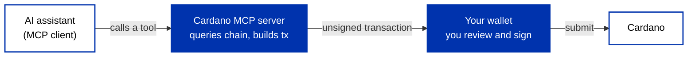

There are three ways AI meets Cardano, and you have already seen two. An assistant can help you [write Cardano code](/docs/developers/curriculum/start-building/ai-assisted-development), and an [autonomous agent](/docs/developers/curriculum/dapps/ai-agents/overview) can hold its own wallet and act on-chain without a human. This page is the third: a general assistant like Claude that reads *your* Cardano state and drafts transactions *you* approve and sign. The bridge that makes this work is **MCP**.

## What MCP is

The **[Model Context Protocol (MCP)](https://modelcontextprotocol.io)** is an open standard for connecting AI assistants to external systems. It was introduced by Anthropic and is now stewarded by the Linux Foundation's Agentic AI Foundation, so it is not tied to a single vendor. An **MCP server** advertises a set of **tools**, callable functions with typed inputs, that any MCP-compatible client (Claude Desktop, an IDE assistant, your own app) can invoke on your behalf.

MCP is complementary to the [agent skills](/docs/developers/curriculum/start-building/ai-assisted-development) covered earlier: a skill is a folder of instructions that shapes *how* the model works, while an MCP server gives it *tools it can call*. You often use both, skills for knowledge, MCP for actions.

## What a Cardano MCP server exposes

A Cardano MCP server turns chain and wallet access into tools the assistant can call. In practice they fall into two groups:

- **Read tools**: query the UTXOs and balance at an address, resolve an ADA Handle to its address, check staking and rewards, look up a transaction. These let the assistant answer questions about your on-chain state in plain language.
- **Write tools**: assemble a transaction from a request ("send 10 ADA to this handle," "delegate to this pool") and submit it once it is signed.

## Your wallet stays the signing authority

The important property is that the assistant **proposes**, and you **sign**. A well-designed Cardano MCP server builds an *unsigned* transaction and hands it to your wallet to review and approve, using the same [CIP-30](/docs/developers/curriculum/dapps/connect-a-wallet#what-cip-30-gives-you) build-then-sign boundary you already use in a dApp. Your signing keys never reach the model or the server.

Treat any server that holds spending keys it can move without your approval as a custodial service, and weigh it accordingly. For read-only servers the risk is smaller, but the same rule applies: an assistant should never be able to move funds you did not authorize.

## Find an implementation

The Cardano MCP ecosystem is early and moving quickly, with wallets and protocols shipping their own servers. Rather than pin a list here, browse the current options, and check each one's license, source, and exactly which tools it exposes, in [Builder Tools](/tools).

## Next steps

- [Connect a wallet](/docs/developers/curriculum/dapps/connect-a-wallet): the CIP-30 signing boundary an MCP server relies on
- [Set up your AI assistant](/docs/developers/curriculum/start-building/ai-assisted-development): give your coding assistant current Cardano context
- [AI agents on Cardano](/docs/developers/curriculum/dapps/ai-agents/overview): autonomous agents that hold their own wallet
