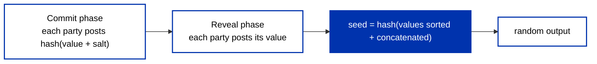

Raffles, lotteries, games, and reward draws all need a random number, but there is no `random()` a Cardano validator can call. A [validator sees only the transaction and its context](/docs/developers/curriculum/smart-contracts/overview#smart-contracts-are-validators-not-actors), never the block it lands in, a clock, or a source of entropy. That is a direct consequence of [determinism](/docs/developers/curriculum/smart-contracts/overview#deterministic-validation): every node has to reach the same verdict, so nothing unpredictable is allowed inside validation.

So randomness on Cardano is not something you read, it is something you **construct and make verifiable**. This page covers the patterns that actually work, and is honest about what each one protects against. There is no native, trustless, high-quality randomness primitive today, so the right choice depends on your trust model and how adversarial your setting is.

## What good randomness has to be

Before picking a pattern, know the bar. A random value used to move money has to be:

- **Unpredictable before it is fixed.** No participant, and no one watching, can know the outcome while they can still act on it.
- **Verifiable after.** Anyone can recompute the value from public data and confirm it was not fabricated.
- **Grind-resistant.** Nobody who can influence the inputs (a transaction builder, a block producer, the last person to act) can retry or withhold to nudge the result their way.
- **High-entropy enough.** A handful of guessable bits is not a seed.

No single Cardano mechanism gives you all four for free. The patterns below trade among them.

## Commit-reveal

Commit-reveal is the one pattern a validator can enforce end to end, because everything it needs is in the transaction. It runs in two phases:

Each participant first commits a hash of a secret value (plus a salt), so the value is locked in but hidden. Once everyone has committed, they reveal, and the validator checks each revealed value against its commitment and combines them into one seed. Combine by sorting and hashing the revealed values, not by XOR: a naive XOR lets a participant who commits after seeing others' commitments cancel out the result.

The weakness is the **last revealer**. Whoever reveals last has already seen every other value, so they can compute the outcome and, if they dislike it, simply not reveal. A group of colluding participants controls one bit of the result per member they are willing to sacrifice. Mitigate it, don't ignore it:

- **Slashable deposits.** Each participant locks a deposit that is forfeited if they fail to reveal by the deadline, so withholding costs more than the draw is worth.
- **Reveal deadlines.** Use the transaction [validity interval](/docs/developers/curriculum/fundamentals/core-concepts/transactions#validity-intervals-and-time) to bound the reveal window and let the protocol resolve (or refund) if someone drops out.

Even then, a determined last revealer can grief the round (force a restart) if not the outcome. Commit-reveal is strongest with a fixed, accountable set of participants who each contribute entropy.

## Randomness from a block's VRF (via an oracle)

Every Cardano block already carries a [verifiable random value](/docs/developers/curriculum/fundamentals/cryptographic-primitives#what-are-verifiable-random-functions-vrfs): the VRF output the winning stake pool produced to claim its slot in [Ouroboros leader election](/docs/developers/curriculum/fundamentals/consensus-and-ouroboros). It is public, and anyone can verify it against the pool's key once the block exists. That looks like a ready-made randomness beacon, with one catch that shapes everything: **a validator cannot see it.** The block header, the slot leader, and the VRF output are not in the script context, so the value has to be brought on-chain by an [oracle](/docs/developers/curriculum/dapps/oracles/overview), using the same reference-input and signed-value machinery as a price feed.

The trick that makes it unpredictable is timing: pick the VRF of a block that does not exist yet when a user commits, for example the block *after* the commit transaction. At commit time the value is unknown, and afterward anyone can recompute it from public data. Useful, but be blunt about the trust involved:

- **You trust the oracle unless the contract re-verifies.** Publishing the VRF value on-chain is not the same as proving it. If the contract only checks the publisher's signature, a faulty or dishonest operator can post whatever value it likes. The result is *verifiable off-chain* (a consumer can recompute it), not *enforced on-chain*. This is the same integrity-versus-liveness distinction the [oracles page](/docs/developers/curriculum/dapps/oracles/overview#who-publishes-and-what-that-guarantees) draws for price feeds.
- **Block producers can grind it.** The pool that wins the target slot computes its own VRF value before it publishes the block, so it can choose to withhold the block and try again. Block randomness is grindable today; hardening it is a protocol-level concern (the [grinding defense](/docs/developers/curriculum/fundamentals/consensus-and-ouroboros#common-attacks-and-defenses) in Ouroboros, with further work proposed in CIP-0161). If a draw's beneficiary could collude with a block producer, this matters.
- **Extraction can bias the result.** Mapping a VRF output to your range carelessly (say, keeping only decimal digits of its string form) skews the distribution. Reduce modulo your range from the full output, and mind modulo bias.

Oracle-published VRF is a good fit for public, auditable draws where the priority is that outsiders can check the result, and a poor fit where a well-resourced insider could collude with a block producer.

## On-chain entropy to be wary of

Some values sitting in the ledger look random and are not safe to treat as such:

- **Block or transaction hashes and validity-range timestamps.** These are chosen or influenced by whoever builds the transaction or produces the block, so they are grindable. Treating a timestamp as randomness is a known footgun, see [time handling](/docs/developers/curriculum/smart-contracts/advanced/security/vulnerabilities/time-handling).
- **The treasury amount.** Plutus V3 (Conway) can expose the current treasury balance to a validator, but only when the transaction chooses to include that optional field, and only as the current value with no built-in delta. It changes each epoch, yet the change is mostly predictable, only the low digits are hard to guess. It updates once every ~5 days and is public for the whole epoch, so it is low-entropy and already known to anyone acting late in the epoch. At best a weak supplementary seed, never a standalone source.

## Choosing an approach

| Your situation | Reasonable approach |
|---|---|
| A fixed, accountable set of participants who each contribute | Commit-reveal with slashable deposits and a reveal deadline |
| A public draw where auditability matters more than stopping a determined insider | Oracle-published block VRF, contract-verified where you can |
| You only need a weak, non-adversarial nudge | On-chain entropy, with eyes open about its limits |
| High value, open participation, and a strong adversary | No fully trustless native primitive exists; combine commit-reveal with deposits or a verifiable oracle, and design explicitly against grinding and withholding |

The honest bottom line: match the pattern to your threat model, and state the trust assumption out loud. If your "random" draw quietly depends on an operator being honest or a block producer not colluding, your users deserve to know that is the assumption.

## Key takeaways

- **Validators cannot generate randomness.** Determinism forbids it, so verifiable randomness is constructed, not read.
- **Commit-reveal is the only fully on-chain-enforceable pattern**, and its Achilles heel is the last revealer; deposits and deadlines are not optional.
- **Block VRF is verifiable but not visible to a validator**, so it arrives through an oracle you must either trust or re-verify, and it is grindable by block producers.
- **No native primitive is unpredictable, verifiable, grind-resistant, and high-entropy all at once.** Choose against your adversary, not against the happy path.

## Next steps

- [Oracles on Cardano](/docs/developers/curriculum/dapps/oracles/overview): the publication and trust machinery an oracle-delivered random value rides on
- [Verifiable Random Functions](/docs/developers/curriculum/fundamentals/cryptographic-primitives#what-are-verifiable-random-functions-vrfs): what a VRF is and why its output is verifiable
- [Time handling](/docs/developers/curriculum/smart-contracts/advanced/security/vulnerabilities/time-handling): why a timestamp is not a source of randomness
