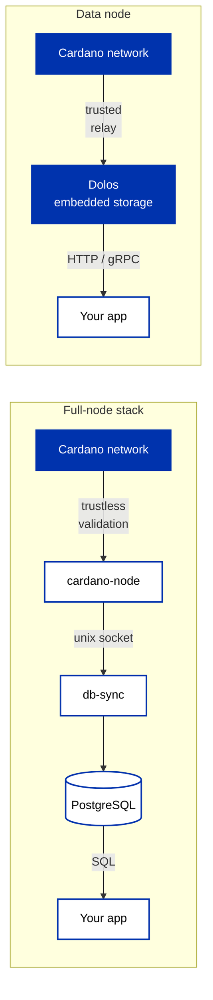

import Tabs from '@theme/Tabs';
import TabItem from '@theme/TabItem';

[Dolos](https://docs.txpipe.io/dolos) is a **data node**: a single lightweight process (written in Rust) that syncs the ledger directly from Cardano relays and serves it to your application over several APIs. It replaces the node + indexer + API stack for one specific job, serving chain data to apps, and deliberately does nothing else: it cannot produce blocks, so stake pool operators still run [cardano-node](/docs/operators/).

:::note
For hosted alternatives, see [Blockfrost](/docs/developers/curriculum/production/api-providers/blockfrost) and [Koios](/docs/developers/curriculum/production/api-providers/koios). For the full self-hosted stack (your own node with an indexer and query layer), see [Ogmios](/docs/developers/curriculum/production/api-providers/ogmios) and [production infrastructure](/docs/developers/curriculum/production/infrastructure).
:::

## One process instead of a stack

The classic self-hosted read stack runs three components and stores the ledger twice (once in the node, once in the database). A data node collapses that into one process with embedded storage:



The single process keeps the resource bill low: a few GB of RAM and one copy of the ledger on disk cover both syncing and serving. Scaling out is plain web scaling, run more Dolos replicas and load-balance HTTP across them.

The ledger data model is rich across every era, from Byron to Conway: not just UTXOs, blocks, and transactions, but pools, accounts, rewards, delegation, governance, assets, and scripts/datums.

## The APIs

Dolos exposes each API on its own port, enabled selectively in `dolos.toml`:

| API | Protocol | What it serves |
| --- | --- | --- |
| **Mini-Blockfrost** | REST | A [subset of the Blockfrost API](https://docs.txpipe.io/dolos/apis/minibf), so Blockfrost SDKs and providers work against it |
| **Mini-Kupo** | REST | Kupo-style lightweight UTXO indexer queries |
| **UTxO RPC** | gRPC | High-performance structured chain access |
| **Ouroboros node-to-client** | Local socket | The node's native protocol, for tools that expect a node socket (e.g. cardano-cli) |

The most useful one for app developers is **Mini-Blockfrost**: your existing SDK already speaks it.

## Quickstart: a local Blockfrost-compatible API

Install Dolos and sync it against your network first, the [TxPipe quickstart](https://docs.txpipe.io/dolos) covers installation and initial configuration.

### 1. Enable Mini-Blockfrost

Add a `serve.minibf` block to your `dolos.toml`, then start Dolos:

```toml
[serve.minibf]
listen_address = "[::]:3000"
permissive_cors = true
```

Port 3000 now serves Blockfrost-shaped responses from your local copy of the ledger.

### 2. Query it

Any HTTP client works, no API key required:

```sh
curl -s localhost:3000/blocks/latest | jq
```

```json
{
  "time": 1777659382,
  "height": 13363229,
  "hash": "152da6e42cfa3b0aee0478bcfffe255d9e370df20482bcd4def9dc5bd673e9d9",
  "slot": 186093091,
  "epoch": 628,
  "tx_count": 1,
  "fees": "330473"
}
```

### 3. Point your SDK at it

Every major transaction builder has a Blockfrost provider; point its base URL at your Dolos instance instead of the hosted service (make sure the SDK's network matches the network your Dolos is syncing):

<Tabs groupId="sdk">
<TabItem value="evolution" label="Evolution" default>

```typescript
import { preprod, Client } from "@evolution-sdk/evolution"

const client = Client.make(preprod)
  .withBlockfrost({
    baseUrl: "http://localhost:3000",
    projectId: "dolos"   // Mini-Blockfrost doesn't check the key; any value works
  })
  .withSeed({ mnemonic: process.env.WALLET_MNEMONIC!, accountIndex: 0 })
```

</TabItem>
<TabItem value="mesh" label="Mesh">

```typescript
import { BlockfrostProvider, MeshTxBuilder } from "@meshsdk/core";

const provider = new BlockfrostProvider("http://localhost:3000");

const txBuilder = new MeshTxBuilder({
  fetcher: provider,
  submitter: provider,
});
```

</TabItem>
</Tabs>

From here, everything you built against a hosted provider in [Start Building](/docs/developers/curriculum/start-building/your-first-transaction) runs unchanged against your own infrastructure.

## Storage modes

Not every workload needs the full chain, so Dolos lets you store only what you need:

- **Ledger-only**: just the current state, minimal disk. Enough for building and submitting transactions.
- **Sliding window**: recent history with configurable retention. For apps that look back a bounded distance.
- **Full archive**: everything, always. For explorers and historical queries.

## Trade-offs

- **Trust**: Dolos syncs from relay nodes you configure and trusts them, rather than participating in trustless consensus validation the way a full cardano-node does. Choose upstream relays you trust; run your own node when you can't afford to trust anyone.
- **API coverage**: Mini-Blockfrost implements a subset of the hosted Blockfrost API, aimed at typical wallet and dApp use cases. Check the [endpoint list](https://docs.txpipe.io/dolos/apis/minibf) before swapping it in.
- **Not a block producer**: it serves data only. Stake pool operation is [cardano-node territory](/docs/operators/).

## Next steps

- [Dolos documentation](https://docs.txpipe.io/dolos): installation, configuration, and API references
- [Production infrastructure](/docs/developers/curriculum/production/infrastructure): where a data node fits in the wider stack
- [Going to production](/docs/developers/curriculum/production/going-to-production): the pre-mainnet checklist
