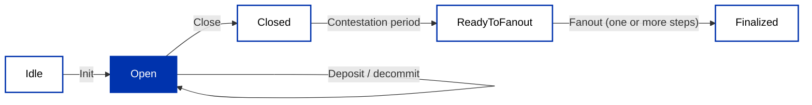

import Tabs from '@theme/Tabs';
import TabItem from '@theme/TabItem';

Hydra is a Layer 2 scaling solution for Cardano that enables near-instant, low-cost transactions between participants. It operates as a **state channel**: a temporary off-chain ledger where a known set of parties transact as fast as their network connection allows while keeping the security guarantees of the Cardano main chain (Layer 1).

Inside a Hydra Head, transactions use the same format as Cardano Layer 1. **Fees are configurable down to zero**, confirmation is instant (limited only by network latency between participants), and all parties must agree on every state transition.

If you have put a Redis cache in front of a Postgres database, the model is familiar: Layer 1 is the durable source of record, and the Head is the fast, temporary layer shared by a known set of participants. Depositing funds loads state into that fast layer, the participants transact there with no per-operation cost, and fanout flushes the agreed final state back to Layer 1, with the contestation period acting as a grace window to catch a disagreement before it finalizes. The trade-off is the same as a cache cluster: you pay a Layer 1 cost to open and close the Head, but everything inside is fast and free.

## The security model

A Head runs on **unanimous consensus**. Every confirmed Layer 2 transaction produces a new **snapshot** of the Head's state, and a snapshot only counts once every participant has signed it. That is a much stronger requirement than the majority or two-thirds thresholds of Layer 1 consensus protocols, and it buys a correspondingly strong guarantee: your funds cannot move without your signature, and the [Hydra Head paper](https://eprint.iacr.org/2020/299.pdf) proves the protocol secure as long as even one participant is honest.

The price of unanimity is **liveness**: the Head only makes progress while all participants are online and cooperating. If someone disappears or refuses to sign, the Head stalls, and the remedy is Layer 1. Anyone can **close** the Head with the latest signed snapshot; a **contestation period** follows (configurable, 12 hours by default) during which any participant can contest with a newer snapshot, each contest extending the deadline. When it expires, the final state fans out to Layer 1. So the worst case in an uncooperative Head is not lost funds, it is waiting out the contestation window to get them back on Layer 1.

Two key pairs per participant make this work: **Cardano keys** sign the Layer 1 boundary transactions (open, deposit, close, fanout), and separate **Hydra keys** sign snapshots inside the Head.

## How a Hydra Head works

A Hydra Head is a state channel with a defined lifecycle:

1. **Initialize**: a participant posts an init transaction on Layer 1, and the Head opens directly, empty if you like.
2. **Deposit and decommit**: funds move *into* the running Head through Layer 1 deposit transactions, and back *out* through decommits, at any time while it stays open. A deposit that is not picked up by the Head is recoverable, so funds cannot strand between layers.
3. **Transact**: process transactions instantly off-chain, each confirmed one becoming a snapshot signed by all parties.
4. **Close**: any participant submits the latest snapshot to Layer 1, starting the contestation period.
5. **Fanout**: after contestation passes, distribute funds on Layer 1 according to the final state; large UTXO sets fan out in multiple steps.



Because funds flow in and out of a running Head, there is no reason to treat Heads as short-lived: a Head can stay open indefinitely, and in practice you close one only when the group is done or a breaking node upgrade requires it.

:::info What changed in Hydra 2.0
Earlier versions had a commit phase: after init, the Head waited in an "initializing" state until every participant had committed funds, and only then opened. Hydra 2.0 (2026) removed that phase, an initialized Head opens immediately, and deposits became the only way funds enter. You will still meet the older flow in existing tutorials and SDKs, including the walkthrough below. Fanout in steps arrived in Hydra 2.2, removing the earlier limit on how many UTXOs a Head could hold at close.
:::

## When to use Hydra

Hydra is ideal for:

- **High-frequency transactions**: gaming, micropayments, real-time applications.
- **Cost-sensitive applications**: batch many transactions off-chain; only pay L1 fees to open and close.
- **Private transactions**: keep details off-chain until settlement.
- **Interactive multi-party protocols**: rapid state updates among a known group.

It is not a fit for open, anonymous, low-frequency interactions: a Head is among a **fixed, known set of participants**, and every participant must sign every snapshot. Membership is static, whoever should be in the Head must be decided before it opens.

## Choose a topology

Who runs the hydra-nodes is a design decision, and it determines the trust model:

- **Direct**: the transacting parties run their own nodes and hold both key pairs themselves. This gives the full protocol guarantees with no intermediaries, and fits small known groups doing heavy flows between themselves: settlement between trading desks, recurring business-to-business payments, machine-to-machine and [AI agent payments](/docs/developers/curriculum/dapps/ai-agents/masumi).
- **Delegated**: a set of operators runs the nodes, and users interact with the Head through the application. The useful design insight: most applications already have points of trust, a prediction market has resolvers who settle outcomes, an exchange has an operator matching orders. If the parties you already trust are the ones running the Head, the Head adds speed and zero fees without adding any *new* trust, and one honest operator still keeps the whole set in check.
- **Managed**: a service provisions and operates Head infrastructure for you, so you integrate an API instead of running nodes, with users keeping their own keys.

One honest note on privacy: what happens inside a Head stays off-chain, only the final state settles to Layer 1, and that is genuinely useful when a month of business flows should not be public. But it is operational privacy, not cryptographic privacy, in a delegated setup the operators see everything, and any participant can publish Head data. When auditability is the requirement rather than privacy, that is a feature: operators can publish snapshots deliberately, or auditors can simply be given a seat in the Head.

## Beyond one head

One Head does not have to carry everything. Heads are cheap to run in parallel, so applications shard load across many of them, and total throughput grows with the number of Heads rather than being capped by one.

Heads can also interoperate: a participant who sits in two Heads can move funds between them with hash time-locked contracts, without either Head closing, the same pattern payment channel networks use for multi-hop payments. A public walkthrough lives at [eutxo-l2-interop](https://github.com/cardano-scaling/eutxo-l2-interop).

## Hydra in production

The pattern at scale, from deployments you can inspect:

- **Glacier Drop**: the largest Hydra deployment to date, [Midnight's token claims](https://midnight.network/blog/hydra-heads-overview) for roughly 34 million eligible addresses were validated inside Hydra Heads run by independent operators, with only consolidated outcomes settling to Layer 1.
- **[Hydra Doom](https://github.com/cardano-scaling/hydra-doom)**: 1993's Doom with every game frame as a Head transaction; the December 2024 tournament peaked around a million transactions per second in aggregate across many parallel Heads.
- **[DeltaDeFi](https://www.deltadefi.io/)**: a spot exchange executing orders inside a Head for exchange-grade speed, with self-custodial settlement on Layer 1.
- **[Masumi](/docs/developers/curriculum/dapps/ai-agents/masumi)**: agent-to-agent payments over Hydra, AI agents transacting at machine frequency for fractions of a cent.
- **[Intersect voting](https://hydra-voting.intersectmbo.org)**: DRep polling on a Hydra-based voting system, a reminder that Heads also fit information processing, not just value transfer.

## End-to-end flow with MeshJS

The off-chain flow uses `@meshsdk/hydra`. The condensed happy path is below; for setting up the hydra-node pair it talks to, see the [Hydra documentation](https://hydra.family/head-protocol/docs/getting-started).

:::info Version note
This walkthrough follows the commit-phase flow of hydra-node 1.x. On Hydra 2.x the Head opens directly after `init()` and funds enter through deposits; the Mesh APIs are largely the same, but the head-status events differ.
:::

### Prerequisites

- A synced `cardano-node` with `cardano-cli` (preprod), and the `hydra-node` binary ([install](https://hydra.family/head-protocol/docs/getting-started/installation)).
- Test ADA per participant ([faucet](/docs/developers/curriculum/start-building/networks-and-test-ada#get-test-ada)), for L1 node fees and funds to commit.
- Each participant generates **Cardano keys** (L1 identity/fees) and **Hydra keys** (snapshot signing), then starts a `hydra-node` peered with the others. Inside the Head, protocol parameters set all fee fields to zero.

### Connect, initialize, commit

<Tabs groupId="sdk">
<TabItem value="mesh" label="Mesh" default>

```ts
import { HydraProvider, HydraInstance } from "@meshsdk/hydra";
import { BlockfrostProvider } from "@meshsdk/core";

const blockfrost = new BlockfrostProvider("YOUR_BLOCKFROST_KEY");
const hydraProvider = new HydraProvider({ httpUrl: "http://localhost:4001" });
const instance = new HydraInstance({ provider: hydraProvider, fetcher: blockfrost, submitter: blockfrost });

await hydraProvider.connect();
await hydraProvider.init();   // any participant opens the Head -> "HeadIsInitializing"

// during Initializing, each participant commits a UTxO (or commitEmpty())
const commitTx = await instance.commitFunds(utxo.input.txHash, utxo.input.outputIndex);
const signedCommit = await wallet.signTx(commitTx, true, false); // partial sign
await wallet.submitTx(signedCommit);                              // -> "HeadIsOpen" once all commit
```

</TabItem>
</Tabs>

### Transact on Layer 2

Once the Head is open, build with `MeshTxBuilder` using `isHydra: true` and the Head's (zero-fee) protocol parameters. `submitTx` goes to the Head, not Layer 1:

<Tabs groupId="sdk">
<TabItem value="mesh" label="Mesh" default>

```ts
import { MeshTxBuilder } from "@meshsdk/core";

const pp = await hydraProvider.fetchProtocolParameters();
const l2Utxos = await hydraProvider.fetchAddressUTxOs(aliceAddress);

const txBuilder = new MeshTxBuilder({ fetcher: hydraProvider, submitter: hydraProvider, isHydra: true, params: pp });
const unsignedTx = await txBuilder
  .txOut(bobAddress, [{ unit: "lovelace", quantity: "5000000" }])
  .changeAddress(aliceAddress)
  .selectUtxosFrom(l2Utxos)
  .setNetwork("preprod")
  .complete();

const signedTx = await wallet.signTx(unsignedTx, false);
await hydraProvider.submitTx(signedTx);   // instant, zero-fee; emits "TxValid" / "SnapshotConfirmed"
```

</TabItem>
</Tabs>

Submit as many transactions as you need; each confirmed one updates the shared state via a new signed snapshot.

### Close and fanout

<Tabs groupId="sdk">
<TabItem value="mesh" label="Mesh" default>

```ts
await hydraProvider.close();   // posts the latest snapshot to L1, starts the contestation period
// on "ReadyToFanout":
await hydraProvider.fanout();  // distributes final balances back to L1 -> "HeadIsFinalized"
```

</TabItem>
</Tabs>

`close()` posts the final state on-chain and opens a contestation window (any participant can dispute with a newer snapshot). After it passes, `fanout()` returns funds to their Layer 1 addresses.

## Next steps

- [Going to production](/docs/developers/curriculum/production/going-to-production): reliability and security before mainnet
- [Hydra protocol docs](https://hydra.family/head-protocol/) and [MeshJS Hydra](https://meshjs.dev/hydra): the full protocol and SDK reference
