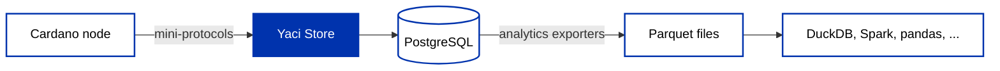

The [infrastructure page](/docs/developers/curriculum/production/infrastructure) maps the indexer landscape: db-sync gives you the full chain in PostgreSQL, Kupo tracks UTXOs matching patterns, Oura streams events. This page goes deeper on two needs those tools don't quite cover:

- **Custom indexing**: your application needs one specific slice of the chain, say every transaction carrying a given metadata label, in a database you control, without indexing everything else.
- **Analytics**: you want to ask questions over the chain's *full history* (fee trends, staking economics, governance participation) without keeping a node, an indexer, and a large database running just to run some queries.

[Yaci Store](https://github.com/bloxbean/yaci-store) addresses both. It is an open-source (MIT) modular indexer in Java from the BloxBean project, developed with engineering support from the Cardano Foundation and used in production by [cardano-rosetta-java](https://github.com/cardano-foundation/cardano-rosetta-java) and CF Ledger Sync, among others.

:::info The Yaci family
Three related projects share the name: [yaci](https://github.com/bloxbean/yaci) is the underlying Java implementation of the [Ouroboros mini-protocols](https://ouroboros-network.cardano.intersectmbo.org/pdfs/network-spec/network-spec.pdf); **Yaci Store** is the indexer built on it, covered here; [Yaci DevKit](https://devkit.yaci.xyz/introduction) is the local devnet tool that bundles a Store instance, covered in [development networks](/docs/developers/curriculum/production/development-networks).
:::

## A modular indexer

Most indexers make the sizing decision for you: db-sync stores everything, Kupo stores only UTXOs. Yaci Store is assembled from **stores** you enable per use case: blocks, transactions, UTXOs, metadata, assets, scripts, staking, and governance each ship as separate modules, plus aggregation modules that derive account balances, rewards, and ledger state independently, without a db-sync instance behind them.

It syncs directly from any Cardano node over the node-to-node protocol, so it can follow a remote relay without you operating a node, writes to PostgreSQL, MySQL, or H2, and exposes **Blockfrost-compatible REST APIs** out of the box, meaning SDKs that speak Blockfrost can point at your own index unchanged (the same property [Yaci DevKit](/docs/developers/curriculum/production/development-networks) exploits locally).

## Index exactly what you need: plugins

A common question, almost verbatim from builders: *"I want to index all transactions with metadata containing a given label, cheaply and reliably, and sort the results into buckets."* Doing this with a full indexer means storing the whole chain to use a sliver of it. Doing it with a provider means polling and being bound by their API shapes and rate limits.

Yaci Store's **plugin system** solves it with filter-before-persist: small scripts in **MVEL, JavaScript, or Python** hook into the indexing pipeline and decide what gets stored, transform it, or trigger side effects, with no Java code and no fork of the indexer. The official tutorial [Tracking UTXOs for a specific address](https://store.yaci.xyz/docs/v2/tutorials/tracking-address-utxos) walks the pattern end to end for addresses; the same approach filters metadata by label.

It is already used exactly this way in production: the [IntersectMBO administration-data indexer](https://github.com/IntersectMBO/administration-data/tree/main/indexer) is a Yaci Store deployment whose MVEL filter keeps only transactions carrying metadata label `1694` (treasury administration data), a few lines of configuration standing in for a bespoke indexer.

If you don't want to run anything, the hosted alternative remains: Blockfrost serves [transactions by metadata label](/docs/developers/curriculum/start-building/transaction-building#transaction-metadata) over REST. The plugin route earns its keep when you need your own database, your own filtering logic, or independence from a third party.

## Analytics without running infrastructure

Answering *historical* questions has traditionally required the full stack: node + indexer + database, days of sync, and a server bill that outlives the question. Yaci Store's **Analytics Store** module (in the 3.0.0-beta releases) changes the economics: it continuously exports every table to **[Parquet](https://parquet.apache.org/) files**, the columnar format the wider data industry standardizes on. Once the files exist, the infrastructure has done its job; the dataset is a folder you can copy, share, archive, and query on a laptop.



The module ships **47 exporters**, one per table: 31 tables that flow continuously (transactions, UTXOs, blocks, address activity) are partitioned by day (`date=2026-06-01/`), and 16 tables tied to Cardano's ~5-day epochs (stake snapshots, rewards, the ada pots) are partitioned by epoch (`epoch=450/`), so query engines skip straight to the slices they need.

Two properties matter for research and reporting:

- **Finalized data only.** Exports deliberately lag the chain tip (two days by default, `yaci.store.analytics.finalization-lag-days`), so the files never change retroactively; a rollback can't rewrite your dataset. Two people querying the same files get the same answers.
- **Open format, no lock-in.** By default the export runs in [DuckLake](https://ducklake.select/) mode, a catalog layer adding ACID transactions and named tables (`analytics.block`); set `yaci.store.analytics.storage.type=parquet` for plain partitioned files. Either way the output is standard Parquet that DuckDB, Spark, Polars, pandas, ClickHouse, Athena, and BigQuery all read natively.

### Enabling the export

The Analytics Store is a Spring profile on a running Yaci Store; add `ledger-state` if you want rewards and stake snapshots in the export:

```bash
# Docker: set in the environment
SPRING_PROFILES_ACTIVE=ledger-state,analytics

# Zip distribution: pass to the start script
./bin/start.sh ledger-state,analytics
```

Files land in `./data/analytics` by default (`yaci.store.analytics.export-path`), and on mainnet the export starts automatically once the initial sync reaches the tip.

### Querying with DuckDB

[DuckDB](https://duckdb.org/) is the natural first tool: a free analytics engine that runs in-process on your machine and reads Parquet directly. Transaction statistics per epoch, over the full exported history:

```sql
SELECT epoch,
       COUNT(*) AS tx_count,
       SUM(fee) AS total_fees,
       AVG(fee) AS avg_fee
FROM read_parquet('data/analytics/main/transaction/**/*.parquet',
                  hive_partitioning = true)
GROUP BY epoch
ORDER BY epoch;
```

(`main` in the path is the source schema name; adjust to your export location.) Because partition-aware queries read only the files they need, questions like this return in seconds even against full-history exports.

### Custom exporters

The built-in exporters mirror tables one-to-one, but real questions often span tables. Custom exporters are defined **entirely in YAML**: you provide the SQL (joins included), a name, and a partition strategy, and the module produces a fresh Parquet dataset on the same schedule. A dataset joining transactions with their metadata:

```yaml
yaci:
  store:
    analytics:
      custom-exporters:
        - name: tx_with_metadata
          partition-strategy: DAILY
          query: >-
            SELECT t.tx_hash, t.block, t.slot,
                   to_timestamp(t.block_time) AS block_time,
                   t.fee, m.label, m.body
            FROM {source}.transaction t
            JOIN {source}.transaction_metadata m
              ON t.tx_hash = m.tx_hash
            WHERE t.slot >= {start_slot} AND t.slot < {end_slot}
```

The `{source}`, `{start_slot}`, `{end_slot}`, and `{epoch}` placeholders are filled in per partition. Enable with the `custom-exporters` profile alongside `analytics`. See the [Analytics Store docs](https://store.yaci.xyz/docs/v2/analytics/overview) for the full configuration surface.

:::info Beta, and you produce the files yourself
The Analytics Store ships in the 3.0.0-beta line (the stable line is 2.0.x), and there is no public dataset mirror yet, so today you run Yaci Store once to produce the export. The output is the stable part: standard Parquet files that remain useful regardless of what produced them.
:::

## Choosing your approach

For serving an application's live queries, a [provider](/docs/developers/curriculum/production/api-providers/overview) or the [infrastructure stack](/docs/developers/curriculum/production/infrastructure) remains the reference path; db-sync is still the answer when you need the entire chain in SQL continuously. Reach for Yaci Store when you want an index shaped like your application (modular stores, plugin filters, Blockfrost-compatible API against your own database), and for the Analytics Store when the goal is a portable, reproducible dataset for analysis rather than a running service.
