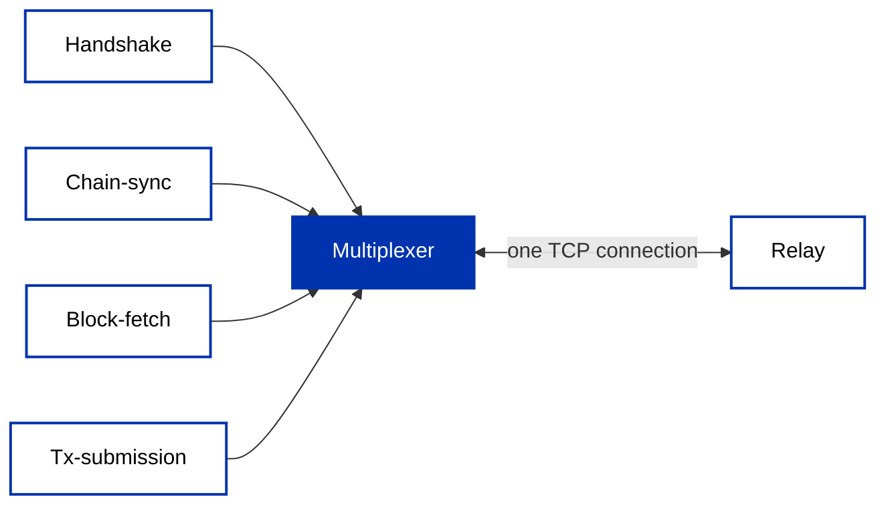

Most applications reach Cardano through an abstraction: a [managed API](/docs/developers/curriculum/production/api-providers/overview), an [indexer](/docs/developers/curriculum/production/infrastructure#chain-indexers), a bridge like [Ogmios](/docs/developers/curriculum/production/api-providers/ogmios), or a [node of your own](/docs/developers/curriculum/production/run-your-own-node) queried over its socket. All of them bottom out in the same place: the **Ouroboros network protocol**, the wire format Cardano nodes use to talk to each other.

A relay does not speak REST. It speaks a set of typed **mini-protocols** multiplexed over a single TCP connection. Nothing about that layer is reserved for nodes: any client that implements the protocol can dial a public relay and take part. This page explains that layer, then demonstrates it by fetching a block straight off a mainnet relay in about twenty lines of Rust, with no node, no indexer, and no API key involved.

You will rarely build on this layer directly, but understanding it demystifies everything above it: what a provider actually abstracts, what an indexer actually consumes, and why every tool in the stack keeps talking about chain-sync and rollbacks.

## Two interfaces to a node

A Cardano node exposes two distinct interfaces, built from the same protocol machinery but designed for different trust settings:

- **Node-to-client (N2C)** runs over a local Unix socket, the `CARDANO_NODE_SOCKET_PATH` you set when [querying your own node](/docs/developers/curriculum/production/development-networks). It is a trusted interface for local processes: `cardano-cli` uses it, and Ogmios translates it into WebSocket JSON. Beyond following the chain and submitting transactions, it can query live ledger state (UTXOs, protocol parameters), which is why it stays local: those queries are not designed to be served to strangers.
- **Node-to-node (N2N)** runs over TCP between peers that do not trust each other. It is how relays exchange blocks and transactions across the open internet, and it is deliberately narrow: sync headers, fetch blocks, diffuse transactions. This is the interface the rest of this page uses.

The distinction explains a pattern you have already met in this module: "run your own node" tooling always talks about a local socket (N2C), while the network itself, and anything that taps it directly, speaks N2N.

## Mini-protocols over one connection

Each interface is a bundle of **mini-protocols**: small, typed state machines, each doing one job. The node-to-node bundle:

- **Handshake** negotiates the protocol version and the [network magic](/docs/developers/curriculum/start-building/networks-and-test-ada), the identifier proving both sides are on the same chain, before anything else happens.
- **Chain-sync** streams block headers as the chain grows, including *rollback* instructions when the peer switches to a better fork. This is the protocol every indexer is built on.
- **Block-fetch** downloads block bodies for the headers you decide you want.
- **Tx-submission** diffuses transactions toward block producers.
- **Keep-alive** and **peer-sharing** maintain the connection and support peer discovery.

All of them share one TCP connection through a **multiplexer**: every message segment carries an 8-byte header, a timestamp, a 16-bit protocol identifier (one bit of which marks the direction of the conversation), and the payload length, so the demultiplexer on the other side can hand each segment to the right mini-protocol.



The full state machines and wire encodings are specified in the [Ouroboros network specification](https://ouroboros-network.cardano.intersectmbo.org/pdfs/network-spec/network-spec.pdf); [`ouroboros-network`](https://github.com/IntersectMBO/ouroboros-network) is the reference implementation inside `cardano-node`.

## Addressing a block: chain points

Mini-protocols refer to positions on the chain with a **point**: a `(slot, header hash)` pair. The slot says *when*, the hash says exactly *which* block, since a slot alone could refer to a block that was rolled back. A special `Origin` point means the very start of the chain.

Points are the shared handle across the whole bundle: chain-sync finds where your view and the peer's chain *intersect* by exchanging points, rollbacks are announced as "go back to this point", and block-fetch requests bodies by point. Every explorer already shows you both halves; any block page gives you a slot and a block hash, which is the header hash.

## Fetch a block from mainnet, no node required

[Pallas](https://github.com/txpipe/pallas) is a Rust library by TxPipe that re-implements this stack natively: "Rust-native building blocks for the Cardano blockchain ecosystem", including the multiplexer and every mini-protocol above. One dependency gets you on the wire (plus [Tokio](https://tokio.rs) for the async runtime):

```bash
cargo add pallas tokio --features tokio/full
```

The whole program is one connect, one point, one fetch, mirroring the [`block-download` example](https://github.com/txpipe/pallas/tree/main/examples/block-download) in the Pallas repository:

```rust
use pallas::network::{
    facades::PeerClient,
    miniprotocols::{Point, MAINNET_MAGIC},
};

#[tokio::main]
async fn main() {
    // TCP dial + handshake: version negotiation carrying the network magic
    let mut peer = PeerClient::connect(
        "backbone.mainnet.cardanofoundation.org:3001",
        MAINNET_MAGIC,
    )
    .await
    .unwrap();

    // a real mainnet block: (slot, header hash), as shown by any explorer
    let point = Point::Specific(
        191447882,
        hex::decode("d557600b99c14678e58ad7da7152fd2dbf188f290d4cef296ab6df774d2e0f3d")
            .unwrap(),
    );

    // drive the block-fetch mini-protocol, get the raw block back
    let block = peer.blockfetch().fetch_single(point).await.unwrap();

    println!("downloaded block of {} bytes", block.len());
    println!("{}", hex::encode(&block));
}
```

`connect` dials the address, performs the handshake, and starts the multiplexer; `backbone.mainnet.cardanofoundation.org` is one of the public bootstrap relays run by the founding entities (any synced relay that accepts your connection works). `fetch_single` runs the block-fetch state machine end to end and returns the block exactly as the peer has it on disk: raw bytes, no translation. The same `Point` type is what you would hand to chain-sync to start following the chain from that position; the [`n2n-miniprotocols` example](https://github.com/txpipe/pallas/tree/main/examples/n2n-miniprotocols) shows that flow.

## From bytes to data

What comes back is [CBOR](/docs/developers/curriculum/fundamentals/core-concepts/transactions#serialization-cbor), the same binary format transactions are serialized in; a block is CBOR all the way down. Since the encoding differs by era, Pallas provides a multi-era wrapper that detects the era and decodes into typed structs, as in its [`block-decode` example](https://github.com/txpipe/pallas/tree/main/examples/block-decode):

```rust
use pallas::ledger::traverse::MultiEraBlock;

let block = MultiEraBlock::decode(&cbor).expect("invalid cbor");
println!("slot {} hash {}", block.slot(), block.hash());
println!("{} transactions", block.txs().len());
```

From here you can walk transactions, outputs, datums, and native assets across any era with one API. If you ever need to inspect the raw bytes themselves, the [CBOR debugging guide](/docs/developers/curriculum/smart-contracts/advanced/debug-cbor) covers the tooling.

## Where this sits in your stack

Everything in the [production infrastructure stack](/docs/developers/curriculum/production/infrastructure) is built on these two interfaces. Ogmios bridges the node-to-client protocols of a local node into WebSocket JSON. Indexers and pipelines like Oura and Dolos speak node-to-node to follow the chain, and Dolos then serves node-to-client APIs to your app. Managed providers run all of that for you behind REST. The protocol itself has implementations beyond the Haskell reference: [Pallas](https://github.com/txpipe/pallas) in Rust (the foundation of Dolos, Oura, and the Amaru node project) and [gOuroboros](https://github.com/blinklabs-io/gouroboros) in Go (the foundation of the Dingo node), both listed in [Builder Tools](/tools/?tags=rust).

Reach for this layer when you are building the tools other developers use: a custom indexer or event pipeline, chain monitoring that must not depend on third parties, or lightweight tooling that needs one thing from the chain without running a node. For a typical application backend, a [provider](/docs/developers/curriculum/production/api-providers/overview) or [your own node](/docs/developers/curriculum/production/run-your-own-node) remains the right entry point; now you know exactly what they are abstracting.
