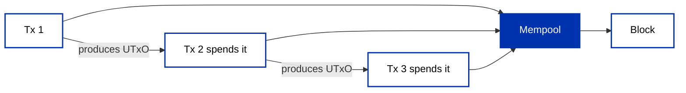

The normal build loop is **build, sign, submit, wait for confirmation**, then build the next one. That wait, ten to thirty seconds per step, is the bottleneck for anything that sends many dependent transactions. **Transaction chaining** removes it: you build and submit a transaction that spends an output of an earlier transaction that has not been confirmed yet.

The [SDK how-to](/docs/developers/curriculum/start-building/transaction-building#chaining-transactions) shows the code in Evolution, Mesh, and cardano-cli. This page is the concept underneath it: why an unconfirmed output is safe to spend, what chaining buys you, and where it sits among Cardano's scaling options in the [scaling overview](/docs/developers/curriculum/production/overview).

## Why the next transaction's inputs already exist

A transaction's id is the hash of its **body**, the inputs, outputs, and everything else you sign over, not of the signatures that get added afterward. So the id is fixed the moment the transaction is built, before it is signed or submitted. Every output it will create is therefore addressable in advance as `txid#index`, along with its exact value and datum.

This is a direct consequence of [deterministic validation](/docs/developers/curriculum/smart-contracts/overview#deterministic-validation). A transaction that validates locally produces exactly the outputs you built, or it does not apply at all, with nothing in between. You know the result before submission, so you can build on it before submission.

An account-based chain can queue dependent transactions too, ordered by nonce, but each one references a mutable account whose balance and state are only resolved when it is included in a block. On [eUTXO](/docs/developers/curriculum/fundamentals/core-concepts/eutxo#why-is-deterministic-validation-such-a-big-deal) the next transaction references a concrete, immutable output that is fully determined at build time. That is the whole trick: build transaction 1, read the id it will have, and build transaction 2 spending transaction 1's outputs, all before transaction 1 reaches a block.

## The mempool accepts the chain

When you submit a transaction, the node validates it against the current ledger state **plus the transactions already waiting in its mempool**. So a transaction whose input is an output of another transaction still in the mempool is valid: the node sees the producing transaction ahead of it and applies them in order. You can submit the whole chain back to back without waiting for a single confirmation, each transaction layering onto the state the previous ones established.

Once a transaction is accepted into the mempool it is [guaranteed to be included](/docs/developers/curriculum/fundamentals/core-concepts/transactions#the-transaction-lifecycle) until its validity interval passes, so the links you have already placed are firm. The chain as a whole, though, is only as durable as its first link.

:::warning Submit in order
A chained transaction is only valid once its predecessor is in the mempool or a block. If it arrives first, the node sees inputs that do not exist yet and rejects it. Submit sequentially, and never hand a not-yet-submitted output to a provider query: your provider only knows about outputs that are already on-chain.
:::

## What chaining unlocks

**Throughput without the wait.** Sending N dependent transactions the naive way costs N confirmation waits. Chained, they are built and submitted in one pass and settle together. This is what makes high-volume flows practical: large [airdrops](/docs/developers/curriculum/start-building/transaction-building#batching-and-airdrops), minting many tokens in sequence, or any multi-step interaction where each step consumes the output of the last.

**A decentralized way to order contended state.** [eUTXO concurrency](/docs/developers/curriculum/dapps/defi#the-eutxo-design-challenge) means a shared UTxO, a liquidity pool or a registry, can be spent only once per block, so many parties competing for it need their turns ordered. The common answer is off-chain [order batching](/docs/developers/curriculum/dapps/defi#order-batching), where an operator collects intents and settles them, at the cost of latency and of trusting that operator to include and sequence fairly. Chaining offers another shape: each interaction builds directly on the previous one's unconfirmed output, so the order is fixed by the on-chain input dependencies rather than chosen by an off-chain operator. The two compose, a protocol can use chaining to keep its own batching pipeline moving without waiting on confirmations.

## The trade-offs

Chaining trades away the wait, not the work. The costs are real and worth designing around:

- **The chain is only as strong as its first link.** If an early transaction is dropped, evicted, or its input is spent by someone else, every transaction downstream of it fails, because the outputs they depend on never come to exist.
- **Every transaction pays its own fee.** Chaining removes the waiting, not the per-transaction [minimum fee](/docs/developers/curriculum/fundamentals/core-concepts/fees#the-fee-formula). A chain of N transactions is N fees.
- **You track the unconfirmed UTxOs yourself.** Thread each transaction's outputs into the next build in your own code; the SDKs that automate this are covered in the [how-to](/docs/developers/curriculum/start-building/transaction-building#chaining-transactions).
- **The mempool is not permanent.** Transactions past their [validity interval](/docs/developers/curriculum/fundamentals/core-concepts/transactions#validity-intervals-and-time) are dropped, and a change of chain tip revalidates the mempool, so a long chain that lingers can be invalidated partway. Keep chains bounded and submit promptly.
- **Script transactions each need collateral.** Every script-bearing transaction in the chain sets aside its own [collateral](/docs/developers/curriculum/smart-contracts/lock-and-spend#collateral); determinism lets you confirm locally that it will not be taken.
- **Shared reference inputs must stay put.** If transactions in the chain read a [reference input or reference script](/docs/developers/curriculum/fundamentals/core-concepts/transactions#reference-inputs-and-reference-scripts), that UTxO has to stay unspent for the life of the chain; anything that spends it breaks the dependents relying on it.

## Building a chain

The code lives with the other build-side how-tos. [Chaining transactions](/docs/developers/curriculum/start-building/transaction-building#chaining-transactions) shows it three ways: Evolution tracks the produced outputs for you, Mesh has you thread them in by hand, and at the lowest level `cardano-cli transaction txid` computes a transaction's id from its body so you can reference `txid#index` in the next one before anything is submitted. When a long chain has to carry a large, verifiable piece of state, a registry or set updated at every step, an on-chain [Merkle Patricia Forestry](/docs/developers/curriculum/smart-contracts/advanced/optimization#use-merkle-patricia-forestry-for-larger-registries) keeps the whole structure behind a single root hash.

## Where chaining fits

Chaining is one of several ways Cardano scales, and each solves a different problem:

- **Versus off-chain batching.** Both raise throughput against contended state. Batching aggregates many intents into one transaction through an operator; chaining keeps each interaction as its own transaction, ordered by on-chain input dependencies, and can also be used to scale a batching pipeline itself.
- **Versus [Hydra](/docs/developers/curriculum/production/hydra) (Layer 2).** Hydra moves transactions off the main chain entirely, among a fixed, known set of participants, for near-instant and near-free throughput. Chaining stays on Layer 1 and is open to anyone: it removes the confirmation wait, but every transaction is still a real Layer 1 transaction with a Layer 1 fee.
- **Versus input endorsers.** Higher base-layer throughput is also coming at the protocol level through Leios and its input endorsers, still in research and not yet live. See the [Ouroboros roadmap](/docs/developers/curriculum/fundamentals/consensus-and-ouroboros).

Reach for chaining when you have many dependent transactions to submit from one place and do not want a confirmation wait between each, or when you want interactions with a contended UTxO ordered by their on-chain dependencies rather than by an off-chain operator.

## Next steps

- [Chaining transactions](/docs/developers/curriculum/start-building/transaction-building#chaining-transactions): the SDK code, in Evolution, Mesh, and cardano-cli
- [Scaling & production](/docs/developers/curriculum/production/overview): how chaining sits alongside batching, sharding, and Hydra
- [DeFi on Cardano](/docs/developers/curriculum/dapps/defi#the-eutxo-design-challenge): the concurrency problem chaining helps with
