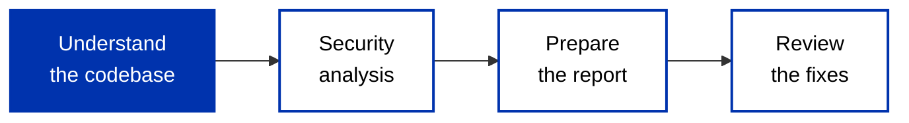

Testing and property-based checks find the bugs you thought of; an audit is where people whose job is to break contracts look for the ones you didn't. On Cardano the stakes are high in a specific way: a deployed validator usually cannot be changed. The security model resembles hardware more than software, once a faulty component ships, recalling it can be very difficult or impossible. For any contract holding meaningful value, a professional audit is standard practice before mainnet.

This page covers what an audit involves and, more usefully, how to prepare so it finds as much as possible in the time you pay for.

## What an audit checks

A vulnerable validator can lead to money being stolen from the protocol or its users, protocol-only tokens being leaked, funds becoming permanently locked, or the protocol being stalled by a denial-of-service under the UTxO model. An audit exists to catch those outcomes before they happen: auditors confirm the contract behaves as intended, is resistant to malicious exploitation, and protects user funds. Because Cardano contracts often coordinate several UTxOs and scripts in one transaction, much of the work is reasoning about subtle interactions between components, exactly where the [vulnerabilities in this catalog](/docs/developers/curriculum/smart-contracts/advanced/security/vulnerabilities/overview) tend to hide.

## How to prepare

The single biggest lever you control is how ready the codebase is when the auditors arrive. Time they spend reconstructing what the protocol is supposed to do is time not spent finding bugs. Provide:

- **A specification of intended behavior, independent of the code.** State the use cases, the assumptions and invariants, and the expected interactions between contracts. Without a spec that is separate from the implementation, auditors cannot tell intentional behavior from a bug, they only see what the code does, not what it should do.
- **A runnable test suite** covering the core on-chain logic with unit tests, realistic transaction flows with property-based or scenario tests, and edge cases (minimum-ADA boundaries, unexpected datum values). Auditors verify behavior by writing and modifying tests, so a suite they can run and extend lets them explore quickly.
- **A reproducible build.** Simple, documented steps to compile and deploy, so an auditor can make a small change to the on-chain code and run a test against it. This matters most when investigating a complex vulnerability.

The length of the first phase is roughly inversely proportional to the quality of this material. Shortening it is in your interest: every hour saved there is an hour available for deeper analysis.

## The process

An audit usually runs in four phases.

1. **Understand the codebase.** Auditors study the documentation and the code until they know how the protocol is intended to work and how it works under the hood, and confirm the test suite runs. This is where good preparation pays off.
2. **Security analysis.** They first check whether the common vulnerability classes apply to this code, writing tests to confirm each finding (a vulnerability is considered confirmed once a test demonstrates it), then move to protocol-design issues, the mathematical assumptions behind incentives and fees, and the parameters used to instantiate the contracts on-chain. Confirmed issues are communicated as they are found, though it is sometimes better to hold a fix until the whole picture is clear, since vulnerabilities can combine and a complete view often leads to a simpler, more efficient fix.
3. **Prepare the report.** Findings are compiled into a report: a summary of each issue with suggested fixes, plus context, disclaimers, and a description of each issue type. By this point most issues have already been raised informally with the team.
4. **Review the fixes.** After the team addresses the issues, the auditors verify each fix is the suggested one or equally effective and introduces no new problems, and record the outcome of every issue. Only then is the report final and ready to share publicly.

## Certification standards

Cardano has a community standard for how audits are conducted and certified: **[CIP-52 (Cardano Audit Best Practice Guidelines)](https://cips.cardano.org/cip/CIP-52)**. It defines three assurance levels a project can target:

- **Level 1**: automated tooling and static analysis.
- **Level 2**: a manual audit by an independent team.
- **Level 3**: formal verification of critical properties (see [Formal verification](/docs/developers/curriculum/smart-contracts/advanced/security/formal-verification)).

There is no mandatory audit registry on Cardano; certification runs through the auditors and certification services themselves. [CIP-96](https://github.com/cardano-foundation/CIPs/pull/499) proposes an on-chain standard for publishing certification metadata (audit reports, test results, formal proofs), but it remains a draft rather than an adopted mechanism.
