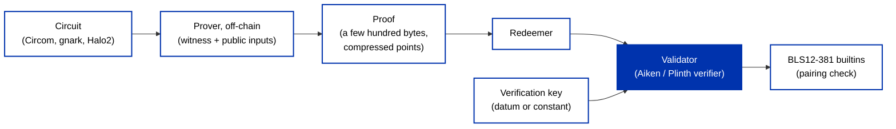

## Introduction

A zero-knowledge proof lets one party convince another that a statement is true without revealing why it is true. On a public ledger that unlocks two things at once: **privacy**, prove you are eligible, solvent, or authorized without exposing the underlying data, and **succinctness**, verify one short proof on-chain instead of re-running an expensive computation, which is the foundation most zk-rollup scaling designs build on.

You already know the primitive this improves on. A hash lock ([pre-image resistance](/docs/developers/curriculum/fundamentals/cryptographic-primitives#what-is-a-cryptographic-hash-function)) also proves you know a secret, but revealing the pre-image burns it: once it is on-chain, anyone can copy it. A zero-knowledge proof makes the same claim, "I know a value that hashes to this", without ever publishing the value, so the secret survives being used.

A proof system gives you three guarantees: **completeness** (an honest prover with a valid secret can always convince the verifier), **soundness** (a prover without a valid secret cannot, except with negligible probability), and **zero-knowledge** (the verifier learns nothing beyond the fact that the statement is true).

## What a proof actually claims

Most proof systems used on Cardano are **zk-SNARKs**: succinct non-interactive arguments of knowledge. The statement you want to prove is encoded as an **arithmetic circuit**, a set of equations over a finite field. The prover holds a private **witness** (the secret), the circuit takes some **public inputs** (values both sides can see), and the proof asserts: *I know a witness that satisfies this circuit for these public inputs.*

The important consequence: **the proof only proves what the circuit constrains**. A circuit that checks `a * b * c == n` proves you know three factors of `n`, not three *prime* factors; if primality matters, the circuit must enforce it. When you design or audit a ZK application, read the circuit, not the marketing: every property the application claims must appear as a constraint.

## How proofs fit the eUTxO model

Proving and verifying have wildly asymmetric costs, and that asymmetry maps cleanly onto Cardano's architecture. Generating a proof is heavy, seconds to minutes of computation, and happens **off-chain**, in a browser or on a backend. Verifying is cheap and deterministic, so it can happen **on-chain**, inside a validator, within one script execution:

The recurring on-chain shape, whichever toolchain you use:

- The **verification key** (a handful of curve points that commit to the circuit) lives in a datum, often on a reference input, or is compiled into the validator.
- The **proof** travels in the [redeemer](/docs/developers/curriculum/smart-contracts/datum-redeemer-context) of the spending transaction.
- The **public inputs** come from the datum, the redeemer, or the transaction context.
- The validator decompresses the points, runs the proof system's pairing equation with the BLS12-381 builtins, and approves or rejects the spend.

Because Plutus evaluation is deterministic, verification cost is known before the transaction is submitted; a proof that verifies locally will verify on-chain.

## The primitives: what shipped when

On-chain verification is built on two protocol upgrades:

- **Chang (September 2024, Plutus V3)** shipped [CIP-0381](https://cips.cardano.org/cip/CIP-0381): 17 builtins for the pairing-friendly **BLS12-381** curve, group operations (`bls12_381_G1_add`, `bls12_381_G1_scalarMul`, and their G2 counterparts), the pairing (`bls12_381_millerLoop`, `bls12_381_mulMlResult`, `bls12_381_finalVerify`), plus compression, hashing-to-group, and equality. They are backed by the independently audited `blst` library, so the *primitives* are production-grade even where the verifiers built on them are not. This made pairing-based SNARK verification possible on Cardano.
- **van Rossem (June 2026, protocol version 11)** made it cheaper: [CIP-0133](https://cips.cardano.org/cip/CIP-0133) added multi-scalar multiplication builtins (`bls12_381_G1_multiScalarMul`, `bls12_381_G2_multiScalarMul`), the operation that dominates PLONK and Halo2 verification, and [CIP-0109](https://cips.cardano.org/cip/CIP-0109) added `expModInteger` for modular field arithmetic.

Two practical constraints follow from the builtin design:

- **Points cross the boundary compressed.** Curve points can only be stored in datums and redeemers in compressed form, 48 bytes for G1, 96 bytes for G2, so every pipeline includes a compression step off-chain and `uncompress` calls in the validator.
- **Verification is affordable but not free.** A Groth16 verification costs roughly a quarter of one script's CPU budget; a full PLONK verification has been measured around a third. It fits comfortably in a transaction, but budget for it in validator design.

## Proof systems in use on Cardano

| Proof system | Proof size | Setup | How it reaches Cardano |
|---|---|---|---|
| **Groth16** | Smallest (~200 bytes: two G1 points and one G2 point) | Trusted setup **per circuit** | Circuits in Circom or gnark; Groth16 verifiers in Aiken |
| **PLONK** | ~0.5 KB | **Universal** trusted setup, reusable across circuits | Circom circuits via a snarkjs adaptation; verifiers in Plutus and Aiken |
| **Halo2 (KZG)** | Circuit-dependent | Universal setup | Verifier code generated from a Rust circuit into Plinth or Aiken |
| **Sigma protocols** (e.g. Schnorr) | A few group elements | **None** | Implemented directly on the BLS12-381 builtins |

Two contrasts worth internalizing. Groth16 gives the smallest proofs and cheapest verification but requires a new trusted setup for every circuit; PLONK and Halo2 pay slightly more per proof for a setup you do once. And not everything needs a circuit: a **sigma protocol** proves knowledge of a discrete logarithm ("I know the secret behind this public point") with no circuit, no ceremony, and a much simpler verifier, if that is all your application needs, it is the lighter tool. Halo2 is also the proof system used by [Midnight](https://midnight.network/), which is why generated Halo2 verifiers matter for bridging proofs from it into Cardano validators.

## The pipeline in practice

Three circuit frontends are in active use, all converging on the on-chain shape above:

- **Circom + snarkjs**: write the circuit in Circom and compile with `--prime bls12381` (the default field targets a different curve); a [snarkjs adaptation for Cardano](https://github.com/perturbing/snarkjs-cardano) runs the setup and generates proofs that Plutus verifiers accept, in Node or in the browser.
- **gnark (Go)**: the [gnark-cardano toolkit](https://github.com/logical-mechanism/Peace-Protocol/tree/dev/public/gnark-cardano) wraps the gnark prover in an end-to-end pipeline: it runs the setup, generates the proof, converts everything to Cardano datum format, and generates Aiken tests for your circuit against a generic Groth16 verifier. It also ships a `proof.pattern` mini-language for describing circuits declaratively, and commands for running a multi-party setup ceremony.
- **Halo2 (Rust)**: the [Halo2 Plutus verifier generator](https://github.com/input-output-hk/plutus-halo2-verifier-gen) extracts the verification logic from a Rust Halo2 circuit and emits a ready-made verifier in Plinth or Aiken.

### What to watch for

- **Trusted setup is a real ceremony.** Groth16 and PLONK setups produce toxic waste: whoever holds the setup randomness can forge proofs. Multi-party ceremonies fix this, the result is secure if *any one* participant was honest, and phase 1 ("powers of tau") is circuit-independent and reusable, while Groth16's phase 2 must be redone per circuit. A single-party setup on your laptop is fine for a demo and disqualifying for production.
- **Use circuit-friendly hashes, on the right curve.** SHA-256 or Blake2b inside a circuit costs tens of thousands of constraints; **Poseidon** and **MiMC** are hashes designed for circuits. One sharp edge: standard Poseidon parameters are generated for other curves, if you hash over BLS12-381 in-circuit, generate matching parameters, or the hash your circuit computes will never equal the one your off-chain code computed.
- **A proof on-chain is public.** Anyone can read a valid proof out of a redeemer and replay it. Bind every proof to its context by putting a challenge nonce, the spending transaction, or a session key into the public inputs, so a copied proof is useless anywhere else.
- **Whoever runs the prover sees the witness.** Browser proving works today (proving keys run to hundreds of megabytes and proofs take tens of seconds, both cacheable), and it keeps the secret on the user's device. If you outsource proving to a server, the user has server-side secrecy, not zero-knowledge privacy, name that trust assumption if you make it.

## Verifiers and toolkits

Everything below is open source and none of it is audited; treat these as research-grade building blocks.

- [gnark-cardano](https://github.com/logical-mechanism/Peace-Protocol/tree/dev/public/gnark-cardano): the gnark-to-Aiken Groth16 pipeline described above, the most automated path from circuit to tested validator today.
- [Halo2 Plutus verifier generator](https://github.com/input-output-hk/plutus-halo2-verifier-gen): generates Halo2/KZG verifiers in Plinth or Aiken; includes an aggregate multisignature (ATMS) example. Explicitly a research proof of concept.
- [snarkjs-cardano](https://github.com/perturbing/snarkjs-cardano): the snarkjs toolchain (Groth16, PLONK) adapted to BLS12-381 output for Plutus verifiers.
- [plutus-plonk-example](https://github.com/perturbing/plutus-plonk-example): an end-to-end PLONK verifier in Plutus with published cost benchmarks.
- [ak-381](https://github.com/Modulo-P/ak-381): a community Groth16 verifier library for Aiken with Circom/snarkjs conversion scripts; several of the applications below build on it. Early-stage: point compression handling is still listed as future work, and the repository currently ships no license.
- [Aiken ZKP library](https://github.com/adaocommunity/zk): a community effort collecting Groth16, PLONK, and Bulletproofs verifiers in Aiken; under development.

## What people have built

Working applications, all explicitly experimental, that show the range of what the primitives support:

- **[Sudoku bounty](https://github.com/perturbing/sudoku-bounty)** (mainnet): bounties locked at a script address that only someone who *proves they solved the puzzle* can claim, without revealing the solution. The browser generates a PLONK proof from a ~36,000-constraint Circom circuit; the Aiken validator verifies it as the spending condition. The purest demonstration that a proof can *be* the redeemer logic, and that publishing the answer is no longer the price of claiming you know it.
- **[zkLogin](https://github.com/eryxcoop/zklogin-aiken)** (preprod): authenticate with an existing OpenID account such as Google and control funds without a seed phrase. The circuit verifies the provider's RSA-signed token and binds it to an ephemeral session key; the validator checks the proof once, then the session key signs transactions, and a user salt keeps the web identity unlinkable to the address. An unaudited proof of concept, proving currently runs on a backend. See [wallet authentication](/docs/developers/curriculum/dapps/wallet-authentication#zero-knowledge-login) for the dApp-side context.
- **[Seedelf](https://github.com/logical-mechanism/Seedelf-Wallet)** (stealth wallet): hides who is paying whom by re-randomizing address material, and authorizes spending with a Schnorr sigma protocol verified on-chain, no circuits, no trusted setup. Its README candidly documents known attacks on its privacy; read it as an honest research wallet.
- **[PEACE protocol / Veiled](https://github.com/logical-mechanism/Peace-Protocol)** (preprod): a marketplace for encrypted data where a Groth16 proof shows the seller derived the re-encryption key *correctly*, so decryption rights transfer trustlessly. Notable as a proof of correct *computation* rather than mere knowledge, and as the project the gnark-cardano toolkit was extracted from.
- **[Janus Wallet](https://github.com/leobel/janus-wallet)** (preview): a smart-contract wallet where spending authority is knowledge of a password, proved with Groth16 against an on-chain challenge nonce that prevents replay, an end-to-end reference tying together most of the patterns on this page.

## Where to go deeper

- **[ZK from zero on Cardano](https://github.com/elRaulito/ZK-from-zero-on-Cardano)**: an open-source ebook that builds from first principles to a complete password-locked UTxO with a Groth16 verifier in Aiken, the most complete written walkthrough of the Circom-to-Aiken pipeline. Chapters are still being added.
- **[Unlocking zero-knowledge proofs for Cardano](https://iohk.io/en/blog/posts/2025/08/26/unlocking-zero-knowledge-proofs-for-cardano-the-halo2-plutus-verifier/)**: the IOG post introducing the Halo2 verifier generator.
- The CIPs behind it all: [CIP-0381](https://cips.cardano.org/cip/CIP-0381) (pairing builtins), [CIP-0133](https://cips.cardano.org/cip/CIP-0133) (multi-scalar multiplication), [CIP-0109](https://cips.cardano.org/cip/CIP-0109) (modular exponentiation).
- For applications that want privacy as the default rather than a feature, [Midnight](https://midnight.network/) is a Cardano partner chain built around zero-knowledge, and its Halo2 proofs can be verified inside Cardano validators via the generator above.

:::info Research-grade, and moving fast
The cryptographic primitives are in place and hardened, the CIP-0381 builtins sit on an audited library, and van Rossem made verification markedly cheaper. The verifiers and toolchains built on top are another matter: none are audited, several are explicit proofs of concept, and APIs are churning. Build and experiment, on testnets first, and read every circuit you depend on.
:::
