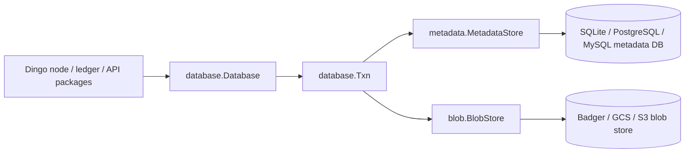
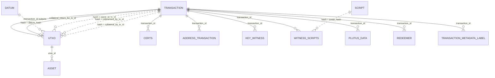
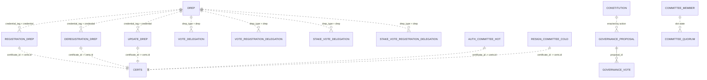
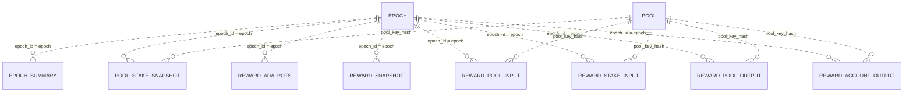
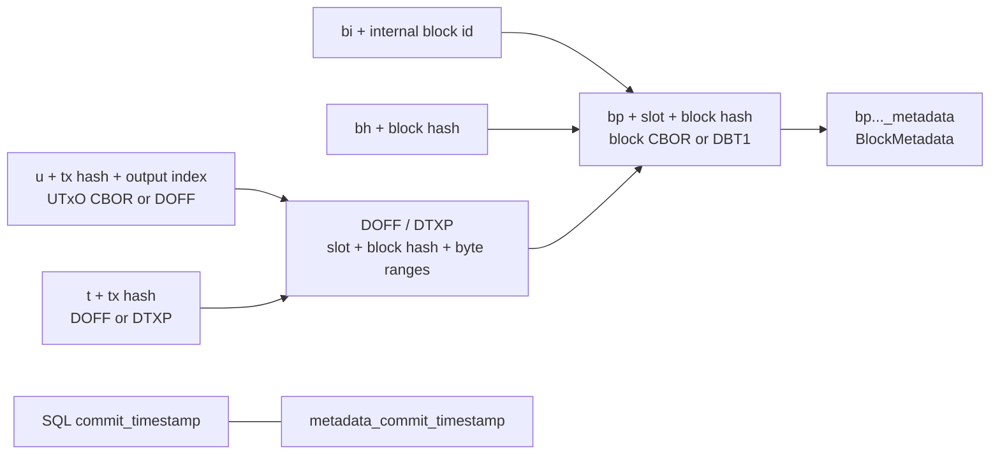

# Dingo Database

## Storage provider ownership

Blob and metadata stores are constructed by the application plugin host and
injected with `database.New(config, database.Stores{Blob: ..., Metadata: ...})`.
The database drains only database-owned workers; the host closes providers
after ledger/database shutdown. Selection and config live under
`plugins.storage`. Schemas, relationships, blob keys, CBOR offsets, transaction
behavior, and persisted formats are unchanged. Library callers of Mithril
`Sync` or `NeedsSync` may leave `SyncConfig.StoragePlugins` unset to select the
local `badger` blob and `sqlite` metadata providers.

Standalone command/bootstrap composition owns these stores through
`internal/plugins.DatabaseRuntime`. `OpenDatabase` returns either a live
runtime with a nil error or a nil runtime with an error, so conventional error
handling cannot leak provider resources. A live runtime may report a
recoverable commit-timestamp mismatch through `RecoveryError()`; callers that
perform repair or forward import can inspect it before continuing and must
still close the runtime.

`databasePath` (including its `CARDANO_DATABASE_PATH` environment binding and
the `--data-dir` flag) is the shared data-directory shortcut for both local
storage providers. `plugins.storage.blob.config.dataDir` and
`plugins.storage.metadata.config.dataDir` may override the paths independently;
when either is unset, that provider inherits `databasePath`.

Dingo stores chain state in two sibling stores:

- The metadata store is a relational SQL database managed by the metadata
  plugins in `database/plugin/metadata/`. SQLite is the default backend and is
  always built. The `dingo_extra_plugins` tag adds operational PostgreSQL and
  MySQL providers using the same shared store, direct drivers, v1alpha1 schema,
  and dialect-specific migration locks. All providers retain
  `poolMaxOpenConns`, `poolMaxIdleConns`, and `poolConnMaxLifetime`.
- The blob store is a key/value object store managed by the blob plugins in `database/plugin/blob/`. The always-built plugin is `badger`; `gcs` and `s3` are optional and are built only with the `dingo_extra_plugins` build tag.

The PostgreSQL metadata provider defaults `sslMode` to `require`, so new
connections negotiate TLS unless an operator explicitly selects another mode
(for example, `disable` for a loopback-only database). This is an intentional
security-sensitive default change for existing deployments that omit
`sslMode`; remote PostgreSQL deployments must support TLS before upgrading.

The providers open their direct database/sql drivers and return the shared
`database/plugin/metadata/sqlstore.Store`. Schema ownership is explicit:
versioned DDL lives under `database/plugin/metadata/sqlstore/migrations`,
fixed-shape queries and generated sqlc output are internal to `sqlstore`, and
models in
`database/models` are domain transfer types only; they do not define SQL
columns, relationships, indexes, or migrations. There is no ORM,
`AutoMigrate`, or provider-specific business-query implementation.

The initial database schema release is `v1alpha1`, stored as integer version 1
for migration ordering. A fresh database creates it from embedded DDL. Existing
unversioned metadata databases are intentionally rejected: the database/sql
cutover is a clean break, so users must remove the data directory (metadata and
blob stores) and resync from genesis. This keeps startup deterministic and avoids carrying a large,
fragile compatibility layer for obsolete schemas. Reference inputs are stored
in the v1alpha1 `utxo_reference_input` association table so multiple
transactions can reference one output; the legacy single-column marker is not
used by the new store. `v1alpha1` also creates the `node_settings_gate` table
described below: the schema is unreleased, so a new table belongs in the
initial version rather than in a version of its own.

The v1alpha1 schema also includes
`idx_pool_opcert_sequence_pool_sequence` (see `pool_opcert_sequence` below).
It is created as part of the initial schema on fresh databases.

Migration `v2` (`leios-key-registration`, integer version 2) is the first
real post-release migration: it additively (`ALTER TABLE ... ADD COLUMN`)
adds `leios_key_public` and `leios_key_possession_proof` to `pool` and
`pool_registration` (see the Pools section below). Only a SQLite
`expand.sql` is checked in; the shared migration registry translates it to
PostgreSQL/MySQL DDL the same way it does for `v1alpha1`.

Migration `v3` (`token-registry-metadata`, integer version 3) creates the
`token_registry_entry` table and its unique `subject` index for the CIP-26
off-chain token registry sync (see the Off-chain Metadata Cache section
below). Like `v2` it ships only a SQLite `expand.sql`. `subject` is a `TEXT`
column, which MySQL cannot index without a prefix length; the registry's
translation derives that `(255)` prefix from the `CREATE TABLE` carried in the
same migration, so the table definition and its index have to stay together in
`v3`.

The upgrade runner owns a `schema_migrations` row per contiguous integer version with
`version`, stable `name`, SHA-256 `checksum`, `phase`, opaque `cursor`, `dirty`,
Unix-millisecond `started_at`/`updated_at`, and nullable `completed_at`.
Phases are `expand`, `backfill`, `contract`, and `complete`. The runner marks a
phase dirty before work, executes idempotent DDL, commits each data batch and
cursor checkpoint in the same transaction, and only marks a version complete
after contract/index DDL succeeds. Completed checksum drift, registry gaps,
unknown phases, inconsistent completion state, and a database newer than the
binary are hard startup errors. File-backed SQLite uses a cross-process lock
file and in-memory SQLite uses a process lock. Store readiness remains false
until the locked, offline run succeeds. PostgreSQL/MySQL advisory locks are
connection-owned for the complete migration run. Bulk-load session settings are held on a dedicated
connection for the duration of a bulk window and restored before that
connection returns to the pool; SQLite maintenance receives the provider stop
context so shutdown deadlines can cancel a running vacuum.

The Go model `models.Block` has `TableName() == "block"`, but it is not migrated into the metadata database. Blocks are stored in the blob store. SQL rows refer to blocks with `slot`, `block_hash`, and other hash columns. `Block.Decode` is Leios-aware for Conway-tagged blocks (`ledger.BlockTypeConway`): it calls `DecodeConwayBlock` (`database/models/leios_block.go`), which tries gouroboros' strict Conway decoder first and only falls back to reconstructing a Leios-extended block when strict decode fails. This is detection-based, so the Musashi prototype's Conway-tagged blocks (block type 7 carrying a 12-field Leios-extended header body) decode from stored CBOR while real Conway networks (mainnet/preprod/preview) are unaffected. The reconstruct preserves the original wire bytes, so `Block.Cbor()` returns the verbatim block and any `DOFF` byte offsets recorded against the stored block CBOR stay valid.

## API Surface

Use the Go APIs when code runs inside Dingo:

- `database.Database` in `database/database.go` owns both stores and exposes `Blob()`, `Metadata()`, `Transaction()`, `BlobTxn()`, `MetadataTxn()`, `StorageMode()`, and `Close()`.
- `database.Txn` in `database/txn.go` coordinates sibling metadata/blob transactions. Write commits update commit timestamps in both stores, commit the blob transaction first, then commit metadata.
- `metadata.MetadataStore` in `database/plugin/metadata/store.go` is the
  compatibility composition of the SQL-facing capabilities. New components
  should accept the narrowest one they use rather than the composition.
  Cross-cutting: `LifecycleStore` (close), `SettingsStore` (singleton
  database/node settings and gates), `TxnStore` (creates the
  `database/types.Txn` read and write handles), and `SlotRangeStore` (the
  small aggregate surface used by API adapters). Storage domains:
  - `UtxoStore` — the UTxO set, its spent-output history, and the address,
    credential, and asset lookups over it.
  - `TransactionStore` — chain transactions, their metadata, and the address
    and metadata-label indexes derived from them. Not `TxnStore`.
  - `CertificateStore` — the `certs` table and its per-type detail tables,
    MIR certificates, genesis delegations, and the per-credential
    certificate-history readers.
  - `EpochStore` — the `epoch` table.
  - `GovernanceStore` — governance proposals and votes, the constitutional
    committee and its quorum, DReps including voting power and activity, the
    constitution, and the rollback deletes for those tables.
  - `StakeSnapshotStore` — epoch-boundary pool stake snapshots, the epoch
    summaries computed from them, and historical per-boundary stake.

  Accounts, pools, rewards and live stake, protocol parameters, block nonces,
  datums and scripts, assets, treasury/reserves and donations, Midnight
  indexer state, sync state, and backfill checkpoints remain composed while
  their SQL ports are completed.
- `blob.BlobStore` in `database/plugin/blob/store.go` is the blob-facing interface. It provides raw `Get`/`Set`/`Delete`/iteration plus block, UTxO, transaction, signed-URL, tombstone, and commit-timestamp methods.
- `types.Txn`, `types.BlobIterator`, `types.BlockMetadata`, and blob key helpers live in `database/types/`.

Direct SQL users should treat this document as a map of the metadata store. The blob store remains the source of block CBOR, UTxO CBOR, and transaction CBOR/offset bytes.

### Testing storage plugins

`internal/test/storagetest` is a shared conformance suite that every blob and
metadata plugin runs against, so `badger`/`aws`/`gcs` (blob) and
`sqlite`/`mysql`/`postgres` (metadata) are all checked against the same
`BlobStore`/`MetadataStore` contract instead of each plugin inventing its own
CRUD test shape -- including a large-payload round-trip, an operation-timeout
bound, one empty-state read through each extracted domain interface's
narrowed handle plus a constitution round trip through `GovernanceStore`, and
(as standalone per-plugin tests) unreachable-endpoint, bad-credential, and
Stop/Close resource-cleanup checks.
`internal/integration/storage_migration_test.go` separately covers migrating
a dataset from one plugin to another. See
[`internal/test/storagetest/README.md`](internal/test/storagetest/README.md)
and "Conformance tests" in `database/plugin/PLUGIN_DEVELOPMENT.md` for how to
wire a new plugin's conformance test and which environment variables each
cloud/database backend needs. Cloud- and database-backed plugins skip their
credential-requiring tests cleanly (never fail `go test ./...`) when
unconfigured; note that no GCS emulator exists in this repository (unlike
S3's MinIO in CI), so the `gcs` plugin's conformance, migration, and
resource-cleanup coverage only run manually against a real bucket, never in
CI.

## Database Lifecycle (Snapshot, Restore, Truncate)

`database/lifecycle/` (package `lifecycle`) implements point-in-time database snapshots, restore from a snapshot, and truncation to an earlier chain point, shared by the offline `dingo database` CLI commands and, for truncate, the live ledger rollback path. It is a pure library over `*database.Database` — no CLI, config, or node-composition knowledge — with node-facing orchestration in `internal/dblifecycle` (`Service` for the CLI, `Manager` for automatic epoch-boundary snapshots).

**Backup-capable plugin interfaces.** Two new optional interfaces, checked via type assertion the same way `plugin.LoggerSetter` is (`database/plugin/log.go`):

- `blob.Backuper` / `blob.Restorer` (`database/plugin/blob/backup.go`): stream-based (`io.Writer`/`io.Reader`), implemented by the badger plugin (`database/plugin/blob/badger/backup.go`) as a thin wrapper over Badger's native `DB.Backup`/`DB.Load`. Badger's backup is MVCC-consistent as of whenever it runs and does not itself block concurrent readers or writers. Some malformed/corrupted backup streams make Badger's `Load` return a clean error, but others make it panic outright (e.g. a corrupted length header producing a negative/oversized slice length); `BlobStoreBadger.Restore` recovers any such panic and returns it as a normal error instead, so a corrupted or adversarial backup stream can never crash the calling process. Before handing the stream to `Load`, `Restore` also makes a cheap, allocation-bounded pass over the same length-prefixed record framing (`validateLoadRecordSizes`, spooling a non-seekable reader to a temp file first so both passes can read from the start) and rejects any declared record length over `maxLoadRecordSize` (512MiB) with a normal error — `Load`'s own length prefix is an unvalidated raw `uint64` it trusts unconditionally before allocating a buffer of that size, and an allocation large enough to fail can produce a fatal, unrecoverable runtime OOM that no `recover()` can catch, unlike the panic case above. Badger's own docs require `Load` to be the only thing operating on the store — no concurrent reads, writes, or GC — so `restoreBlobStore` (`database/lifecycle/restore.go`) resolves the blob plugin with `blob.ProviderDependencies.RunMode` set to `"load"`; the badger provider (`database/plugin/blob/badger/provider.go`) already reads that same `RunMode` value (also used for the offline `load` CLI command) to skip starting its periodic background value-log GC ticker (`RunValueLogGC`, every 5 minutes when enabled), so a long-running `Restore` can never have that ticker fire concurrently with `Load`.

  `s3`/`gcs` (`database/plugin/blob/aws/backup.go`, `database/plugin/blob/gcs/backup.go`, both behind `dingo_extra_plugins`) implement the same interface with a generic key-iteration dump instead: neither backend has a point-in-time snapshot primitive the way Badger's `Backup`/`Load` does. Both are thin wrappers around one shared implementation, `database/plugin/blob/internal/blobbackup` — the two plugins are otherwise near-identical siblings (see their `database.go` files), so this is one framing/consistency/batching implementation instead of two copies that could silently drift apart on a format or version change; each plugin's `Backup`/`Restore` method just calls `blobbackup.Backup`/`blobbackup.Restore` with its own `maxBlobReadBytes` bound and an error-message prefix ("s3 backup"/"gcs backup" etc). `blobbackup.Backup` opens a read-only transaction, walks every key with the store's own forward `NewIterator` (empty prefix), and writes each key/value as a `[4-byte key length][key][8-byte value length][value]` record behind a small magic/version header — a package-private framing, unrelated to Badger's. The last thing `Backup` writes, once the walk is confirmed complete, is a terminator: `terminatorMarker` (an out-of-band declared key length no real record could ever have), followed by a 12-byte footer (an 8-byte record count and a 4-byte CRC32 checksum, both computed over every record actually written). Without any terminator at all, a backup file truncated exactly at a record boundary reads back identically to a complete one (`io.ReadFull` reports a clean `io.EOF` either way), so `Restore` would have no way to tell "every key was captured" from "the stream stopped early but happened to stop cleanly" — a silent partial restore that looks successful. The marker's 4 bytes alone aren't sufficient proof of that, though: `0xFFFFFFFF` ("all bits set") is a realistic corruption pattern for some storage/flash failure modes, not just an arbitrary value, so a truncated or corrupted stream that happens to place those exact bytes at a key-length read position would otherwise be silently accepted as complete — the same bug, just moved. `blobbackup.ReadRecord` therefore returns a typed `*blobbackup.ErrTerminator` (wrapping `io.EOF`, so `errors.Is(_, io.EOF)` still recognizes it) carrying the footer's declared count/checksum, and `Restore` uses `errors.As` to compare them against a running count/checksum it accumulates over every record it actually read (via the same `WriteRecord` framing, fed into a `crc32.NewIEEE()` hasher) — only a match is accepted as a genuine end; any mismatch is reported as a corrupted-or-truncated stream. A real end-of-file before ever reaching a terminator at all is a separate, simpler "missing terminator" error, deliberately not wrapping the underlying `io.EOF` so `errors.Is(_, io.EOF)` can't mistake it for a clean end either. `blobbackup.Restore` requires an empty store (one iterator check via `blobbackup.IsEmpty`, mirroring `isEmptyBadgerStore` — `IsEmpty` checks the iterator's error both before and after `Rewind`, since a transient listing failure on the very first page reports identically to "no keys" otherwise) and replays records in batches (1000 records or 32MiB, whichever comes first) each in its own write transaction, rather than one transaction for the whole stream: both cloud plugins' write transactions buffer every staged change in memory until `Commit`, so an unbounded single transaction would hold an entire large store's contents in memory before issuing its first PUT. `blobbackup.WriteRecord` bounds both key and value length against the same limits `blobbackup.ReadRecord` enforces on the way back in (`MaxKeyLen`, the caller's own `maxBlobReadBytes`), so an oversized value fails loudly at `Backup` time instead of producing a file that is silently guaranteed to fail every future `Restore`. A batch that fails partway through `Restore` can leave earlier, already-committed batches in the store — both plugins' transactions apply and durably commit each batch independently, so a later batch's failure cannot retroactively undo one that already succeeded — and a failed `Restore` must not be retried against the same store; `IsEmpty`'s precondition check will (correctly) refuse it as no longer empty, so the caller needs a fresh store to try again. `Restore` tracks how many batches it has already committed and, once that count is nonzero, appends an explicit warning to every subsequent error it returns (`partialDataWarning`) — an operator reading a failed restore's error text doesn't have to already know this internal batching detail to realize the store holds partial data and must be discarded, not retried. That counter alone isn't sufficient, though: a cloud store's transaction `Commit` can report failure while having already durably written some of that same batch's keys, if its own internal compensating undo also failed (`types.ErrPartialCommit`, from `s3Txn.Commit`/`gcsTxn.Commit`) — `partialDataWarning` also checks for that sentinel directly, so a first-ever batch's commit failing this way still warns correctly even though the batch counter never got to increment. `Restore` also verifies there is nothing after a validated terminator — one extra byte read must return `io.EOF` — so a second backup stream concatenated after the first (or trailing garbage) is rejected as a malformed backup instead of silently restoring only the first one; a non-`io.EOF` failure on that same read (context cancellation, a real I/O error) is reported as itself, not misreported as trailing data. `Backup`'s per-key loop also rechecks `ctx.Err()` before each `ValueCopy`/iterator advance — the iterator itself manages its own internal call context rather than accepting the caller's, so an in-flight network call can't be preempted mid-call, but this bounds how long a cancellation takes to actually stop the walk to at most one more per-key operation instead of running to completion regardless of `ctx`. Because there is no snapshot primitive, `lifecycle.Snapshot`'s existing `PauseCommitsContext` window (below) covers the whole key-iteration walk for these two plugins, not just a brief pause — for a very large S3/GCS-backed store this means new writes are blocked for as long as the full bucket walk takes, an inherent tradeoff of this backend family, not a defect.

- `metadata.Backuper` / `metadata.Restorer` (`database/plugin/metadata/backup.go`): path-based (`BackupTo(ctx, dstPath)` / `RestoreFrom(ctx, srcPath)`), implemented by the sqlite plugin (`database/plugin/metadata/sqlite/backup.go`) via the SQL `VACUUM INTO` statement (a brief read lock under WAL) for backup, and a plain file copy for restore. SQLite stages the completed vacuum in a private directory and publishes it with a same-filesystem hard link, so a destination created concurrently after the initial existence check is never replaced (`sqlstore.PublishBackupFile`, shared with the postgres/mysql implementations below). `PublishBackupFile` also fsyncs the staged file itself before linking it into place, not just the destination directory afterward — `VACUUM INTO` fsyncs its own output as part of closing the file, but `pg_dump`/`mysqldump` do not, so relying on each write callback to handle that itself would have left a durable directory entry pointing at a file whose contents were never actually flushed to disk for those two backends. Once `os.Link` has published `dstPath`, every remaining step (the directory syncs, removing the staging directory) is only making that publish more durable, not deciding whether it happened — so a failure in any of them still durably leaves `dstPath` behind while reporting the whole call as failed. `PublishBackupFile` best-effort removes it in that case (guarded by `os.SameFile` against ever deleting something a concurrent creator populated at the same path instead, then syncing `dstDir` again afterward so that removal is itself durable, not just the earlier publish), so a retry isn't permanently blocked by the "destination already exists" check the next call makes, forcing an operator to notice and delete it by hand. This guard is itself not atomic — `os.SameFile` and `os.Remove` are two separate syscalls with no portable equivalent of "delete this path only if it's still this inode" — so it remains a best-effort check backed by the documented invariant that nothing else writes `dstPath` directly under this package's own contract, not a hard guarantee; closing that window for real would need locking infrastructure this code doesn't have. The verification `lstat` right after `os.Link` (`lstatFile`, a package-level var so a test can inject its failure deterministically) is itself treated as a publish failure if it errors, not merely consulted to decide whether cleanup should run — otherwise `dstPath` disappearing (or becoming unreadable) in the instant after a successful `Link` could let this function reach its happy path and return `nil` with no durable backup file actually in place. That failure path still attempts the same cleanup every other late failure does, just registered before it returns rather than after: with no `publishedInfo` to compare against (the lstat that would have produced it is what failed), it falls back to comparing `dstPath` against the still-staged file's identity instead, since `stagedPath` is only removed by the (separately registered, earlier, so later-running) staging-directory cleanup. Path-based rather than stream-based because `VACUUM INTO` is itself path-oriented; a cloud snapshot destination would be layered on as an upload/download step around the local path, not a plugin-interface change. `RestoreFrom` must run before the store has ever been started, or after `Close()` — but `plugin.Resolve` always constructs and starts a provider together, with no construct-only step. `database/lifecycle`'s `restoreMetadataStore`/`restoreBlobStore` (`database/lifecycle/restore.go`) resolve the manifest-recorded provider against a `*plugin.Host` supplied as an explicit parameter to `Restore`/`RestoreValidated` — this package never constructs or registers into a plugin host itself; composition code (`node.go`, `cmd/dingo`, `internal/dblifecycle`, `bark`) builds a fresh, single-use one (typically via `internal/plugins.NewHost`) just for the call and stops it once done, the same way `internal/plugins.OpenDatabase` already builds its own scratch host for a temporary open elsewhere. Provider `dataDir` overrides must be absent, nil, or an empty string; non-string values are rejected rather than relying on provider decoding to coerce them and bypass the staging directory. `restoreMetadataStore` resolves the metadata provider on the injected host just long enough to construct it, calls `Reset` on it if the provider implements `metadata.Resettable` (see below), immediately `StopCapability`s it, then resets `targetDataDir` back to empty before calling `RestoreFrom` — undoing whatever the brief resolve-and-start wrote, so the actual restore lands on what is, from `RestoreFrom`'s perspective, a never-started store.

- `metadata.Resettable` (`database/plugin/metadata/backup.go`): an optional `Reset(ctx) error` a metadata provider implements when a directory wipe alone can't undo `restoreMetadataStore`'s brief resolve-and-start. For sqlite (the only file-based metadata provider; badger is a blob backend), deleting `targetDataDir` is the whole story — that directory is the entirety of what the brief start touched. For postgres/mysql, that brief start instead ran real migrations against the actual configured remote database (found via a live end-to-end restore attempt against a real Postgres server, which failed because the migrated-but-otherwise-empty database no longer looked "empty" to `RestoreFrom`'s own precondition check) — a directory wipe does nothing to a remote server. Both providers' `Reset` (`resetDatabase` in each package's `backup.go`) drops every table it can see through the same query `databaseIsEmpty` already uses to define "empty" — all tables in all non-system schemas for postgres (CASCADE handles FK ordering), all tables in the configured database for mysql (with `FOREIGN_KEY_CHECKS` disabled for the same reason, on a single dedicated `*sql.Conn` pinned for the whole operation since that setting is session-scoped and `*sql.DB` is a pool that could otherwise run the drops on a different, still-FK-enforcing connection) — deliberately not dropping schemas/databases themselves, since an operator's search_path/database naming is left untouched. Both the emptiness check and the reset restrict to `table_type = 'BASE TABLE'`, since neither can be told to clear a view (postgres rejects `DROP TABLE` on one outright; MySQL just emits a note and silently leaves it in place) — without that restriction a view sitting alongside dingo's own tables would either abort the reset or make an otherwise-empty database wrongly report "not empty" with no way to fix it. Before dropping anything, `resetDatabase` also calls `refuseIfTargetHasData`, which checks every table besides the migrations bookkeeping table (`schema_migrations`) for an actual row and refuses with a clear error if any has one: dingo's own migrations never insert into a domain table, so a database `restoreMetadataStore`'s brief resolve-and-start just finished migrating has zero rows in everything else, and a nonzero count anywhere means this target isn't that — most plausibly a live node's own database, reused or pointed at by a misconfigured DSN, whose real accumulated data `Reset`'s unconditional `DROP TABLE` would otherwise destroy with no way back. For postgres specifically, that exemption is scoped to `(schema, name)`, not name alone: `resetDatabase` scans every non-system schema, and `migrations/runner.go`'s own `hasUserTables` query creates `schema_migrations` in `current_schema()` (typically `public`, but operator-configurable) — a same-named table an operator's own tooling created in some other schema is not dingo's bookkeeping table, and a name-only exemption would let a populated one of those slip past the check and then get dropped anyway. Postgres's `resetDatabase` also calls `refuseIfDependentViewsExist` before dropping anything: `DROP TABLE ... CASCADE` (used for FK-safe ordering among the tables being dropped) cascades to any *view* that depends on one of those tables too, not just other tables — confirmed live against a real Postgres server ("NOTICE: drop cascades to view") — which would otherwise silently destroy an operator-owned view the moment it depends on one of dingo's tables, exactly the collateral damage `table_type = 'BASE TABLE'` filtering elsewhere in this file exists to prevent. There is no way to recreate such a view correctly after the fact either, since `RestoreFrom` (which runs after `Reset`, not before) is what recreates the tables the view would depend on — so `resetDatabase` fails loudly instead, querying `pg_depend`/`pg_rewrite`/`pg_class` directly (`relkind IN ('v', 'm')`) rather than `information_schema.view_table_usage`: confirmed live, that SQL-standard information_schema view only ever covers plain views and returns zero rows for a *materialized* view's dependency, even though `DROP TABLE ... CASCADE` cascades to a dependent materialized view exactly the same way. `Reset` must run before `StopCapability`, not after: it needs the still-open connection pool, which `StopCapability` closes.

  Before calling `Reset` at all, `restoreMetadataStore` also confirms both the metadata and blob backup files the restore intends to load actually exist — not just the metadata one, since `restoreBlobStore` opens the blob backup later, after `Reset` has already run, and a missing blob backup would otherwise still leave a live remote metadata target reset with no way back even though the overall restore is guaranteed to fail moments later. Existence only, deliberately not also requiring a regular file: `TestRestoreInterruptedByProcessKillLeavesTargetUntouched` (`database/lifecycle/restore_interrupt_test.go`) legitimately replaces the metadata backup with a FIFO for a real-SIGKILL synchronization point, and `os.Stat` never blocks on one anyway (unlike `os.Open`), so this check doesn't interfere with that regardless — an earlier version of this check also required `info.Mode().IsRegular()`, which broke exactly that test by rejecting the FIFO before `RestoreFrom` ever got to open it. Existence alone doesn't catch a corrupt or truncated backup, though, and `RestoreFrom`'s own parsing would only discover that after `Reset` has already destroyed the target's real tables — so where a provider can check its own backup's structural integrity cheaply without touching any database, `restoreMetadataStore` also calls it first via the optional `metadata.BackupValidator` interface (`ValidateBackup(ctx, srcPath) error`, wired through `sqlstore.Config.ValidateBackup` the same way `Reset` is). Postgres's `validatePostgresBackup` runs `pg_restore --list` against the archive — confirmed live to fail cleanly on both a truncated archive and a missing file, without ever connecting to a database — a real, cheap structural check since pg_dump's custom format has a parseable table of contents. MySQL's `validateMySQLBackup` is deliberately weaker: mysqldump's plain-SQL output has no equivalent tool that validates structure without executing it, so this only confirms the file opens and is non-empty. The blob backup gets a shallower check still, directly in `database/lifecycle/restore.go`'s `validateBlobBackupHeader`: it can only verify the 5-byte magic+version header (duplicating `blobbackup.Magic`/`blobbackup.Version` locally, since `database/lifecycle` cannot import `database/plugin/blob/internal/blobbackup` across its `internal` boundary), not the full per-record framing or terminator checksum `blobbackup.Restore` itself verifies, and only applies when the manifest recorded a blobbackup-format plugin (`s3`/`gcs`, not badger's own native format).

  `Reset` destroys a live client/server target's real tables directly with no staging copy or rollback — unlike the file-based path, which only ever mutates a disposable staging directory. Wired through `sqlstore.Config.Reset` (mirroring `BackupTo`/`RestoreFrom`); every backend built on the shared `sqlstore.Store` (sqlite included) therefore satisfies the `Resettable` interface, but sqlite leaves `Config.Reset` unset, so its `Store.Reset` is a documented no-op rather than evidence it needs more than a directory wipe. `Store.Reset` holds the same `startMu` mutex `Start`/`CloseContext` already use, so a concurrent close can't pull the connection pool out from under an in-progress reset.

  `postgres`/`mysql` (`database/plugin/metadata/postgres/backup.go`, `database/plugin/metadata/mysql/backup.go`, both behind `dingo_extra_plugins`) shell out to each backend's native dump tool — `pg_dump --format=custom`/`pg_restore` for postgres, `mysqldump`/`mysql` for mysql — since neither has a `VACUUM INTO` equivalent. Connection credentials are passed via environment (`PGPASSWORD`/`MYSQL_PWD`), never as a subprocess argument, so they never appear in `ps`/`/proc/*/cmdline` output. `mysqldump` also runs with `--single-transaction`, giving it one consistent InnoDB snapshot for the whole dump without blocking concurrent writers — without it, a node actively writing metadata during the dump could leave a backup mixing rows from different points in time. Both backends refuse to restore into a target that already has tables (`information_schema.tables` is non-empty) — there is no fresh, never-created data directory to enforce this the way badger/sqlite's file-based contracts do, so it's checked explicitly instead of silently merging into a populated schema/database. `BackupTo` for both is published through the same `sqlstore.PublishBackupFile` helper sqlite uses.

  Postgres connection parameters are derived from the configured DSN with `pgconn.ParseConfig` (accepts either URI or keyword=value style); any DSN query parameter that isn't one of the handful of real libpq connection keywords (e.g. an operator-set `timezone`, or the `options=-c...` fragment `dialect_integration_test.go`'s search-path-isolated tests rely on) is folded into `PGOPTIONS` instead of forwarded as a raw `PG<NAME>` variable, since real `pg_dump`/`pg_restore` (linked against actual libpq, unlike pgx's own lenient Go DSN parser) reject an unrecognized top-level connection keyword outright — each folded value is backslash-escaped (`escapePGOption`) so an embedded space or backslash survives the server's own whitespace-splitting parse of that startup parameter instead of being read as a token separator or a broken escape sequence. `PGSSLMODE` is recovered from `pgconn.Config`'s already-resolved `*tls.Config` (`postgresSSLMode`) by inspecting the specific field combination each mode leaves behind — `ServerName` set only for `verify-full`, a custom `VerifyPeerCertificate` only for `verify-ca`, neither for a bare `require` — rather than collapsing every non-nil `TLSConfig` to `require`, which would silently downgrade an operator's `verify-ca`/`verify-full` configuration to "encrypted but unverified." A custom root CA or client certificate configured for `verify-ca`/`verify-full` can't be forwarded, though: `pgconn` parses `sslrootcert`/`sslcert`/`sslkey` into in-memory certificate material and discards the original file paths, and `pg_dump`/`pg_restore` need real files — rather than silently falling back to weaker verification in that case, `connEnv` fails loudly instead (this also means a legitimate `sslrootcert=system` configuration is rejected too, since a system-trust pool and a custom-file pool are indistinguishable once resolved — an accepted false-positive in favor of never misclassifying a custom CA as safe to skip).

  MySQL connection parameters come from `mysqldriver.ParseDSN`. The DSN's `tls` setting is mapped to CLI flags (`mysqlSSLArgs`) for the client tools actually shipped in the Docker image — Debian's `default-mysql-client`, confirmed live to be MariaDB's client (`mariadb-client`), not real MySQL: MariaDB's `mysql`/`mysqldump` reject MySQL 5.7+'s `--ssl-mode` flag outright ("unknown variable"), so this speaks MariaDB's older `--ssl`/`--skip-ssl`/`--ssl-verify-server-cert` flags instead. That older flag set can only express whether TLS is attempted and whether the server certificate is verified, not a hard "TLS required, unverified" mode, so `skip-verify` and `preferred` necessarily collapse to the same `--ssl` — an accepted fidelity gap forced by the shipped client. `true` (verify CA and hostname, the driver's strictest mode) still maps to its own distinct `--ssl --ssl-verify-server-cert`, since silently weakening that specific case would be a real regression from what the app's own connection pool requires. A custom registered TLS config name (`mysql.RegisterTLSConfig`, referencing an arbitrary `*tls.Config` the driver resolves internally) can't be mapped to fixed flags at all and is rejected rather than guessed.

A plugin that implements neither interface simply cannot be snapshotted/restored — `lifecycle.Snapshot`/`Restore` return a clear error (e.g. `blob plugin "s3" does not support snapshotting`) rather than silently no-op'ing, and the failure happens before any file is written, since both interfaces are type-asserted up front.

Each backup call is independently consistent, but `lifecycle.Snapshot` runs the two concurrently (in separate goroutines, joined via a `sync.WaitGroup`), not sequentially — neither Badger's `Backup` nor SQLite's `VACUUM INTO` exposes a way to separate "capture a consistent point" from "stream/copy it", so the full duration of whichever call runs longer must still be covered by the same pause, bounded by the slower of the two rather than their sum. Without that pause, a commit landing during either call's own window would write its commit timestamp to one store's backup and not the other's, and the restored copy fails `Database.checkCommitTimestamp`'s cross-store validation on open. `database.Database.PauseCommitsContext` closes that window (its non-cancellable sibling `PauseCommits` is what pre-dates `Snapshot` accepting a `ctx`; `Snapshot` itself calls the cancellable variant, so a caller can give up on a snapshot stuck waiting behind a long-running write transaction): every read-write `Txn` that opens a metadata write transaction holds the shared (`RLock`) side of the barrier from construction through `Commit`/`Rollback`/`Release`, and `lifecycle.Snapshot` takes the exclusive side around both concurrent backup calls together, so no such transaction — committed or still open — can straddle them. The barrier is held from construction, not just around `Commit`, because the metadata plugin's write connection pool is sized to exactly one connection: an already-opened-but-uncommitted transaction holds that connection regardless of whether `Commit` has been called, and if the barrier only guarded `Commit`, `PauseCommitsContext` could acquire its lock while such a transaction sat open — deadlocking `Snapshot`'s metadata backup (`VACUUM INTO`, which needs that same connection) against a writer that can now never reach `Commit`'s release. A blob-only `Txn` (`NewBlobOnlyTxn`) deliberately does *not* participate in the barrier: unlike SQLite, Badger natively supports concurrent read-write transactions, so a blob-only `Txn` never holds the single metadata connection the barrier protects, and its commit never writes the commit timestamp this barrier keeps consistent (only a paired blob+metadata `Txn.Commit` does). Several callers (`deleteUtxoBlobs`, `deleteTxBlobs`) open batched blob-only `Txn`s while an outer read-write `Txn` from the same call is already open on the same goroutine — if blob-only `Txn`s took the barrier too, that nested acquire could deadlock against a concurrent `PauseCommitsContext` caller, since the barrier's write side isn't reentrant. This pauses new read-write transactions only — not reads, and not a quiesce (nothing is torn down or disconnected) — so a snapshot against a live, actively-syncing node stays safe.

**Snapshot directory layout**, written by `lifecycle.Snapshot`:

```
<snapshot-dir>/
  manifest.json      # lifecycle.Manifest — see below
  blob.bak            # badger Backup() stream
  metadata.sqlite      # sqlite VACUUM INTO output
  .cloud-mirrored      # present only once MirrorToCloud's upload succeeds — see below
```

`Snapshot` creates `<snapshot-dir>` itself via a plain, non-recursive `os.Mkdir` (parents created separately via `os.MkdirAll`), not `os.MkdirAll` on the leaf directory — `MkdirAll` doesn't error when the directory already exists, so it can't tell "I just created this" apart from "another concurrent `Snapshot` call to the same path already exists," and a failure-cleanup path that then `os.RemoveAll`s the directory on any later error would delete the other, still-in-flight (or already-succeeded) call's backup files. Only the call whose `Mkdir` actually wins may safely remove the directory on failure; a losing call gets `fs.ErrExist` immediately and never touches the directory at all.

`.cloud-mirrored` (`lifecycle.CloudMirrorMarkerPath`/`lifecycle.IsCloudMirrored`, written/checked by `lifecycle.MirrorToCloud`) exists only when a cloud destination is configured *and* the upload to it has actually succeeded — its content is the destination URI, for operator debugging, not machine-read. Its presence is what lets a caller distinguish "this snapshot is fully mirrored to the cloud" from "the local copy exists but the cloud upload never completed" — both leave every other file above in place identically, so directory existence alone can't tell the two apart. `lifecycle.IsCloudMirroredTo(dir, cloudDest)` additionally checks the marker's recorded URI against `cloudDest`, so a marker left over from a since-reconfigured `SnapshotCloudDestination` isn't mistaken for already-mirrored-to-the-current-destination. `internal/dblifecycle.Manager` retries just the cloud upload (via `MirrorToCloud` directly, not a full re-`Snapshot`) for any local snapshot directory `IsCloudMirroredTo` says isn't mirrored to the current destination — both for the specific epoch a redelivered transition event names, and via `Manager.retryUnmirroredSnapshots`, which scans all of `SnapshotDir` for stranded local-only snapshots from `Start` (on restart) and at the top of every subsequent epoch transition (so advancing past a failed epoch, not just redelivering its event, also heals it) — see ARCHITECTURE.md's "Automatic Snapshot Cloud-Mirror Idempotency".

**Manifest** (`lifecycle.Manifest`, `database/lifecycle/manifest.go`): JSON, not CBOR, since it is operator/tooling-facing metadata rather than chain data. Records `StorageMode`/`Network`/`BlobPlugin`/`MetadataPlugin` (restore refuses a plugin mismatch), `CommitTimestamp`, `TipSlot`/`TipHash`/`TipBlockNumber`, `DingoVersion`, byte sizes, an optional `Name`/`Description` label, `Gates` (a `nodesettings.Values` snapshot of the source database's persisted node settings gates — `network_magic`, `start_era`, genesis hashes, ledger-semantics gates, etc. — read via `GetNodeSettingsGates` at backup time; `gates,omitempty` in JSON; adding it did not bump `FormatVersion`, but it is not actually backward compatible the way that omission implies: `checksum()` covers the whole struct, so a build that predates `Gates` ignores the unknown `gates` key on unmarshal and then recomputes the checksum without a field it never saw, rejecting an otherwise-valid manifest as `ErrManifestCorrupted` — acceptable only because this manifest format is unreleased, so no such build is deployed anywhere to hit it), and a `Checksum` (SHA-256 over the manifest's own JSON with `Checksum` blanked, catching a corrupted or hand-edited file — not a security mechanism). `WriteManifest`/`ReadManifest` handle checksum computation/validation and reject a manifest whose `FormatVersion` is newer than the running build understands (`WriteManifest` takes its `Manifest` by value and computes the checksum/format version onto that local copy before writing, so `Snapshot`/`SnapshotToCloud` re-read the manifest they just wrote via `ReadManifest` rather than returning their own pre-write copy, which would otherwise have an empty `Checksum` and stale `FormatVersion` — nothing reads those fields off the immediate in-memory return value today, since every real caller re-reads from disk/cloud, but the returned `Manifest` is now accurate regardless). A checksum failure returns `lifecycle.ErrManifestCorrupted` specifically (wrapped, so `errors.Is` sees through `ReadManifest`'s path-prefixed error) — distinct from a manifest simply not existing — so a caller like bark's `resolveSnapshotSource` can report a snapshot that's present but corrupted as such (`CodeDataLoss`) instead of collapsing it into `CodeNotFound`; `DeleteSnapshot` checks the local snapshot directory's existence directly (`os.Stat`), not via a readable manifest, so a corrupted local snapshot can still be cleaned up. `Manifest.CheckCompatibility(blobPlugin, metadataPlugin, storageMode, network, gates)` bundles `CheckPluginMatch` with a `StorageMode`/`Network` comparison and `CheckGateMatch(configured nodesettings.Values)`, for a caller that must refuse an incompatible target *before* touching it — `internal/dblifecycle.Service.Restore` (the offline path) checks it against the target's actual configured plugins/network/storage mode/gates via `lifecycle.RestoreValidated`'s `validate` callback, run immediately after the manifest is resolved and before `targetDataDir` is touched in any way; this is also what lets a cloud snapshot's manifest be checked without downloading it twice — one cloud download serves both the compatibility check and the restore itself, unlike calling `PeekManifest` and then `Restore` as two separate calls would. `CheckGateMatch` runs `nodesettings.Evaluate` against `m.Gates` (as persisted) and `configured` (as explicit), so it rejects a mismatch by the same per-class policy `evaluateAndPersistGates` enforces at startup rather than by raw equality — a `LatchBool` gate the manifest recorded `off` restores cleanly onto a target configured `on` (the same one-way upgrade a live resume permits), while the reverse direction, or a `Frozen`/`FrozenFillOnce` disagreement, still fails. It compares only gates present in both `m.Gates` and `configured`, so a gate either side cannot supply (an older snapshot missing a newer gate, or a caller with no cardano config loaded to supply the genesis hashes) is not an error; it never compares `blob_store_id` (the restored blob store is always the snapshot's, so its identity legitimately differs from the target's) and excludes `metadata_plugin`/`blob_plugin` since `CheckPluginMatch` already reports those — all three are filtered out of `configured` before `Evaluate` ever sees them. `internal/dblifecycle.Service`'s `intendedGateValues` builds the configured side from `internal/config.Config` — covering `network_magic`, `start_era`, and the ledger-semantics gates, but not the genesis hashes, which only a running node's parsed cardano config can supply. `PeekManifest` (resolve and read a snapshot's manifest, local or cloud, without restoring anything) is the standalone equivalent for a caller that only wants the manifest, not a restore — for a cloud `snapshotDir`, it fetches just the one `manifest.json` object via `CloudManifestFetcher` when the destination type supports it (S3/GCS both do), rather than downloading the full snapshot just to read its manifest; it falls back to a full download only for a destination type that doesn't implement `CloudManifestFetcher`. The live path (`(n *Node).Restore`) already had the equivalent compatibility check via `validateRestoredAgainstNodeConfig`, since it opens the staged restore with the node's own real `database.Config` and lets `database.New`'s own `CheckNodeSettings` catch a mismatch. Without `CheckCompatibility`, the offline path's own `validateRestoredDatabase` only opens the restored copy using the *manifest's own* recorded plugins — a self-consistency check, not a check against what the caller actually intends to run it with. `Name`/`Description` are empty for a snapshot `Snapshot` produced directly (it has no such parameters); `LabelSnapshot(dir, name, description)` sets them after the fact and rewrites the manifest — bark's `CreateSnapshot` RPC is the current caller, since its request carries a human-readable name/description that `Snapshot` itself has nowhere to put.

**Snapshot catalog** (`lifecycle.ListSnapshots`, `database/lifecycle/catalog.go`): scans a base directory's immediate subdirectories for a valid `manifest.json`, returning one `SnapshotEntry{ID, Manifest}` per readable snapshot (directory name as ID), newest first. There is no separate catalog store — a directory with a valid manifest *is* a catalog entry — so this also picks up automatic epoch-boundary snapshots for free when scanning `databaseLifecycle.snapshotDir`, since both manual and automatic snapshots live under the same directory. A subdirectory that exists but lacks a valid manifest (still being written, or failed partway through) is silently skipped rather than erroring.

`lifecycle.Restore` restores both stores into a target data directory (which must not already exist, or must be empty), then opens the result with `database.New` so its own startup consistency checks (`CheckNodeSettings`, `checkCommitTimestamp`) validate the restore for free, and additionally compares the restored tip against the manifest's recorded tip before returning success.

**Cloud snapshot destinations.** `lifecycle.SnapshotToCloud` wraps `lifecycle.Snapshot` unchanged, then — if a destination URI is configured — additionally uploads the snapshot directory's files to object storage under `<cloudDest>/<snapshotID>` (`snapshotID` = the local snapshot directory's base name), mirroring the local `SnapshotDir/<snapshotID>` layout; the local copy is always kept, so cloud is a mirror, not a replacement (a failed upload still returns an error, since the operator asked for both copies). Nesting under the snapshot's own ID — rather than uploading flat directly under `cloudDest` — is what lets more than one snapshot exist at the same configured cloud destination at once: a flat upload would silently overwrite every previous snapshot's objects with the newest one's. `database/lifecycle/destination.go` defines the `CloudDestination` interface (`UploadDir`/`DownloadDir`, both non-recursive over a snapshot directory's flat file list), an optional `SnapshotLister` interface for cataloging what's already stored at a destination, and `DestinationRegistry`, an instance-owned registry of scheme -> factory (`s3`, `gcs`) — every function that resolves a cloud destination (`SnapshotToCloud`, `MirrorToCloud`, `Restore`, `RestoreValidated`, `PeekManifest`, `ListCloudSnapshots`, `FetchCloudManifest`, `DeleteCloudSnapshot`) takes a `*DestinationRegistry` explicitly (a nil registry behaves as an empty one) rather than resolving against a process-global registry, so this package never itself imports a cloud SDK and never depends on which schemes some other part of the binary happened to link in. Implementations live in build-tag-gated files, mirroring `database/plugin`'s existing optional-plugin convention, each exposing a `RegisterS3`/`RegisterGCS(*DestinationRegistry)` function instead of registering itself via `init()`:

- `destination_s3.go` (`dingo_extra_plugins`) — scheme `s3://bucket/prefix`, using `s3.NewFromConfig` + `manager.Uploader`/`manager.Downloader` for streaming transfer, and `ListObjectsV2`'s delimiter-based listing (`CommonPrefixes`) for `SnapshotLister`. Auth is entirely the AWS SDK default credential chain (`config.LoadDefaultConfig`) — no explicit access-key/secret config, matching `database/plugin/blob/aws`'s convention. An `AWS_ENDPOINT` env var (checked directly, since it isn't a standard AWS SDK variable `LoadDefaultConfig` would pick up on its own) redirects to a self-hosted S3-compatible store — typically MinIO — via `BaseEndpoint` + `UsePathStyle`, mirroring `database/plugin/blob/aws`'s `WithEndpoint` option; without this, a `snapshotCloudDestination` pointed at anything other than genuine AWS S3 would silently try to authenticate against real AWS regardless of intent.
- `destination_gcs.go` (`dingo_extra_plugins`) — scheme `gcs://bucket/prefix` (matching `database/plugin/blob/gcs`'s own dataDir scheme, not `gs://`, for consistency), using GCS's own `Query.Delimiter`-based listing (`ObjectAttrs.Prefix` entries) for `SnapshotLister`. Auth is Application Default Credentials via `storage.NewGRPCClient`, matching `database/plugin/blob/gcs`'s convention — no explicit service-account config.

`RegisterBuiltinDestinations(*DestinationRegistry)` registers every scheme compiled into this build (both under `dingo_extra_plugins`, none otherwise — a `!dingo_extra_plugins`-tagged file provides a no-op version so callers don't need their own build tag) — composition code (`node.go`'s `New`, and `cmd/dingo/database.go`'s CLI commands) calls `NewDestinationRegistry` followed by `RegisterBuiltinDestinations` once at startup and threads the resulting registry down through `internal/dblifecycle.Manager`/`Service`, `bark.BarkConfig.DestinationRegistry`, and `dingo.Node`'s own `destinationRegistry` field — nothing in this call chain re-resolves schemes against a package-level registry.

Configuration validation is build-aware: a non-empty `databaseLifecycle.snapshotCloudDestination` must be a well-formed `s3://` or `gcs://` URI, and those schemes are accepted only in a binary built with `dingo_extra_plugins`. A typoed or unavailable scheme therefore fails startup rather than waiting until an epoch-boundary upload to surface as a logged background error.

**Interrupted truncate marker.** Before `lifecycle.Truncate` begins its batched blob deletion, it records `database_lifecycle_truncate_pending` in `sync_state`, including the target ID/slot/hash, original blob-tip ID/slot/hash, Mithril floor, and a checksum covering the complete marker. The checksum prevents a damaged deletion bound from being resumed; the original blob tip cannot simply be required to remain present because an interrupted attempt may already have deleted it, and it may legitimately be ahead of the applied metadata tip. Recovery therefore accepts a current blob tip below the recorded tip as partial delete progress, requires an equal tip to match the recorded slot/hash, and fails closed if the current blob tip is newer than the authenticated upper bound. Tip identity is read directly from the highest `bi` index entry rather than by resolving its referenced block object: an irreversible cloud delete can fail after removing the block object but before removing that index, and the remaining authenticated index must be allowed to drive idempotent cleanup on retry. This prevents a stale-but-valid marker from deleting only its old blob range while metadata truncation removes state through a subsequently advanced tip. The marker remains durable if cancellation or a storage error lands after one or more blob batches commit, making the intermediate state detectable rather than leaving metadata silently referencing already-deleted block blobs. A subsequent truncate validates the marker, resumes the recorded operation (missing blobs are idempotently skipped), performs metadata truncation, and clears the marker in the same metadata transaction. Normal node startup refuses to serve while this marker exists and directs the operator to rerun truncate; the offline lifecycle service can open the database and complete that recovery.

The truncate deletion range ends at the newest block in the indexed blob chain, not at the metadata ledger tip. During live synchronization, BlockFetch can have persisted a speculative blob tail that the ledger has not applied yet. If the requested target equals the metadata tip, that tail must still be deleted; treating the operation as a no-op would leave non-contiguous block indexes visible after the live node rebuild and prevent ChainSync from making forward progress.

`lifecycle.Restore` accepts either a local directory or a cloud destination URI for `snapshotDir` — a cloud URI is downloaded into a temporary local directory first (`downloadCloudSnapshot`), then Restore proceeds exactly as it would for a local path. Restoring from the cloud requires the full per-snapshot URI (`<cloudDest>/<snapshotID>`, the same one `SnapshotToCloud` uploaded to), not the bare base destination, which is a catalog of potentially many snapshots. This is also how a snapshot captured on one node can be restored onto another, since the two never need to share a filesystem.

`cloud_destination_credentials_test.go` (`dingo_extra_plugins`) exercises both real implementations end to end — upload, list, fetch-manifest, download+restore, delete — against a real bucket, skipping outright when no credentials are configured (`DINGO_TEST_S3_BUCKET`/`DINGO_TEST_GCS_BUCKET`, the same convention `internal/integration/cloud_test.go` already uses for the blob-store plugins); CI's MinIO service exercises the S3 half for real via `AWS_ENDPOINT`. Before this, only the generic orchestration logic (`SnapshotToCloud`/`ListCloudSnapshots`/etc.) had test coverage, against a fake `CloudDestination` — the real S3/GCS client code itself had none.

`lifecycle.ListCloudSnapshots(ctx, cloudDest)` lists every snapshot stored at a base cloud destination: it parses `cloudDest` into a `CloudDestination` and, if that implementation satisfies `SnapshotLister`, calls it — each S3/GCS implementation enumerates the sub-paths one level under the configured prefix (its own delimiter-based listing) and fetches just each one's `manifest.json` (via the new `ParseManifest([]byte)`, factored out of `ReadManifest` so a manifest fetched as in-memory bytes validates the same way one read from a local file does), never downloading the full blob/metadata backups just to build a catalog. `ok=false` (not an error) means cloud listing isn't available — an empty `cloudDest`, or a destination type that doesn't implement `SnapshotLister` — so callers can degrade to local-only rather than failing.

Two further optional `CloudDestination` capabilities, meaningful on a destination parsed from a *specific snapshot's own* URI (`JoinCloudURI(base, snapshotID)`), not a base destination: `CloudManifestFetcher.FetchManifest(ctx)` fetches just that one snapshot's manifest (used to cheaply check "does this snapshot exist here" without a full `DownloadDir`), and `CloudDeleter.Delete(ctx)` removes everything at that location (both refuse outright on an empty prefix, to avoid a misuse that would otherwise list/delete an entire bucket). `lifecycle.FetchCloudManifest`/`lifecycle.DeleteCloudSnapshot` are the corresponding package-level helpers, each with an `ok bool` return distinguishing "destination type doesn't support this" from a real failure. When `ok=true`, a non-nil `err` from `FetchCloudManifest` means an actual fetch was attempted: `errors.Is(err, lifecycle.ErrCloudSnapshotNotFound)` distinguishes a confirmed-absent manifest (both S3's `NoSuchKey`/`NotFound` and GCS's `storage.ErrObjectNotExist` are wrapped in this sentinel by their respective `FetchManifest` implementations) from a real communication failure (auth, network, timeout) that happens to occur while checking — bark's `cloudSnapshotExists` uses exactly this distinction so a snapshot whose cloud probe merely *failed* is reported as `CodeUnavailable`, not folded into the same `CodeNotFound` a genuinely-absent snapshot gets (which would otherwise be indistinguishable from real data loss to an operator). Together these are what let bark's `Restore`/`VerifySnapshot`/`DeleteSnapshot` handlers act on a snapshot whose local copy is gone (deleted, or never synced to this node) but whose cloud mirror still exists — see `ARCHITECTURE.md`'s Bark section.

**Truncate.** `database.TruncateAfterSlot` (`database/truncate.go`) is the shared metadata+blob-referenced-UTxO/tx sweep — deleting certificates, account/pool/DRep state, protocol parameters, governance, epochs, reward state, block nonces, network state, and UTxOs/transactions added after a slot, restoring UTxOs spent after that slot — factored out of `ledger.LedgerState.rollback` so both the bounded, security-parameter-respecting live rollback path and `lifecycle.Truncate`'s unbounded disaster-recovery path share one implementation. `RestorePoolStateAtSlot` runs *before* `DeleteCertificatesAfterSlot` in this sweep, not after: it detects which pools need their denormalized `pledge`/`cost`/`margin`/VRF/reward-account fields reverted by querying `PoolRegistration` rows with `added_slot > slot` — the very rows `DeleteCertificatesAfterSlot` removes, so restoring first (while those rows still exist) is what lets it find the surviving prior registration to revert to, rather than silently leaving every re-registered pool's discarded values in place. `database.MithrilTrustBoundarySlot` reads the persisted Mithril trust-boundary sync-state key so an offline truncate can enforce the same floor the live ledger does, without needing a running `*LedgerState`; it treats a failed read the same as "no boundary recorded" (returns 0, logging the failure), which is the right fail-open behavior for its other caller (a consumed-UTxO recovery heuristic) but wrong for a safety check — `MithrilTrustBoundarySlotStrict` is the fail-closed variant `lifecycle.Truncate` actually uses for its boundary check, propagating a read error instead of silently treating it as "no boundary" and letting an unverifiable truncate through.

`lifecycle.Truncate` additionally removes blob-store blocks above the target via `lifecycle.DeleteBlocksAfter`, which batches deletes across many blob transactions (`DefaultBlockDeleteBatchSize`, 10,000 blocks per transaction) rather than the one-transaction-per-block pattern `Chain.Rollback`/`ChainManager.removeBlockByIndex` use — adequate for a normal bounded rollback, too slow for a truncate spanning a large fraction of the chain. Iterator errors are checked both before and after each batch walk so an S3/GCS listing failure cannot be mistaken for a genuinely empty range and followed by metadata truncation. Failed-batch counts follow backend transaction semantics: Badger rolls the batch back and reports only earlier committed batches, while the GCS/S3 transaction handles implement `types.IrreversibleTxn`, making already-issued object deletions explicit and countable even when the batch later fails. Target resolution (`lifecycle.ResolveTargetByHash`/`ResolveTargetBySlot`/`ResolveTargetByNumber`) accepts a block hash, a slot (resolved to the highest existing block at or before it, since most slots have no block of their own), or a block number (binary-searched over the blob store's internal block ID space, since block number/height is not itself an indexed blob key). That ID space is not guaranteed contiguous: a chain bootstrapped or drain-imported from a Mithril snapshot can leave gaps of never-imported IDs, so `ResolveTargetBySlot`/`ResolveTargetByNumber`'s binary search probes via `database.BlockAtOrAfterIndex` (seeks forward to the next actually-indexed block on a gap) rather than `BlockByIndex` (fails outright on any missing ID) — the same recovery `chain.go`'s forward iterator already uses for the same kind of gap. `ResolveTargetBySlot`/`ResolveTargetByNumber` are structurally guaranteed to return a block on the current genesis-to-tip lineage, since they binary-search that same ID space; `ResolveTargetByHash` resolves purely through the hash index and has no such guarantee. `Truncate` itself cross-checks this regardless of which resolver was used — reading `target.ID`'s block back via `BlockByIndex` and requiring both its slot and hash match `target.Slot`/`target.Hash` — because `DeleteBlocksAfter` deletes blob-store blocks by ID range while `TruncateAfterSlot` deletes metadata using `target.Slot` directly as the cutoff (not `target.ID`), and the two only describe the same rollback when `target`'s ID, slot, and hash all genuinely match the same block on the current chain; checking hash alone would still let a target with a valid ID/hash pair but a forged or otherwise-wrong slot cut blob and metadata history at two different points. A mismatch on either field fails closed (`ErrTruncateNotStarted`) before any deletion, rather than letting blob and metadata history diverge. Unlike `Chain.Rollback`, truncate does not reject a target beyond the configured security parameter: that guard protects *automatic* rollback during normal sync, while an operator explicitly invoking truncate (the CIP-0135 disaster-recovery case — a network partition longer than Ouroboros Praos's rollback limit) is the informed-consent replacement for it. `lifecycle.Truncate` returns the number of blocks `DeleteBlocksAfter` actually reports having deleted, not `tipBlock.ID - target.ID`: with a sparse ID space, that difference is only an upper bound on how many blocks exist in the range, not a count of how many actually do. This is what surfaces as `blocks_removed` in the `dingo database truncate` CLI output and bark's `GetTruncateStatus` RPC.

**Automatic snapshots and the CLI.** `internal/dblifecycle.Manager` subscribes to `event.EpochTransitionEventType` on the EventBus — the same async, decoupled pattern `ledger/snapshot.Manager` uses for stake/reward snapshots, not the synchronous in-transaction hook, since a multi-gigabyte backup must never run inside the ledger's write transaction — and captures a snapshot into a deterministically named `epoch-<N>` directory when `databaseLifecycle.snapshotEnabled` is set, gated by `snapshotEveryNEpochs` and pruned to `snapshotRetention`; if `databaseLifecycle.snapshotCloudDestination` is also set, every automatic snapshot is additionally mirrored to that destination via `lifecycle.SnapshotToCloud` (see "Cloud snapshot destinations" above). The deterministic naming makes a redelivered epoch-transition event (e.g. after a restart) a harmless no-op: `Snapshot` already refuses to overwrite an existing directory. `internal/dblifecycle.Service` is the single entry point both the `dingo database snapshot|restore|truncate` CLI commands (`cmd/dingo/database.go`) and bark's `DatabaseService` handler (`bark/database.go`) call. By default it opens its own `*database.Database` against the configured data directory the same way `load`/`mithril` do (offline mode — must not run against a data directory a `dingo serve` process currently has open); `Service.SetLiveNode` optionally binds it to an already-running `*dingo.Node` instead, so Snapshot/Restore/Truncate all operate on that node's live storage in-process rather than requiring a stopped node (Restore/Truncate quiesce and rebuild it; Snapshot reads it directly, never quiescing). `node.go`'s `Run()` does exactly this when bark is enabled with a snapshot directory configured. See `ARCHITECTURE.md`'s "Database Lifecycle" and "Bark" sections for how the live path and the gRPC surface work.

## Store Topology



## SQL Conventions

- Table and column names are the snake_case names declared by versioned SQL DDL.
- Byte columns store raw bytes, not hex strings. In Postgres use `encode(col, 'hex')` and `decode($1, 'hex')`. In MySQL use `HEX(col)` and `UNHEX(?)`.
- `types.Uint64` values such as `amount`, `reward`, `pledge`, `cost`, treasury/reserves, and stake totals are persisted as unsigned decimal values through the Go SQL driver. Use numeric casts if your SQL client reports them as text in a specific backend.
- Quote the `transaction` table in SQL examples because it is a keyword-adjacent identifier: `"transaction"` in Postgres, `` `transaction` `` in MySQL.
- `id` is the normal auto-increment primary key. Tables with ledger identifiers also have unique indexes such as `hash`, `(credential_tag, staking_key)`, `(tx_id, output_idx)`, or `(epoch, snapshot_type, pool_key_hash)`.
- Relationships declared by the versioned schema are enforced as SQLite
  foreign keys; startup enables `foreign_keys(1)`. Hash-based joins and
  polymorphic relationships remain logical joins rather than explicit foreign
  keys. Certificate rows have two logical pointers: each specialized
  certificate table has `certificate_id -> certs.id`, and
  `certs.certificate_id` is the polymorphic back-pointer to that specialized
  row chosen by `certs.cert_type`.
- Live UTxOs have `utxo.deleted_slot = 0`. Governance/committee/constitution soft deletes use nullable `deleted_slot`; `NULL` means active.
- Certificate history ordering must use `added_slot DESC`, the producing transaction's `block_index DESC`, and `cert_index DESC`. `cert_index` resets per transaction.
- Storage mode is persisted in `node_settings_gate` (the `storage_mode` gate; `node_settings.storage_mode` is a read-only compatibility fallback, see below). `core` mode stores consensus and ledger state. `api` mode additionally populates address, witness, datum, redeemer, script, metadata-label indexes, and the best-effort `offchain_metadata` and `token_registry_entry` caches. API-only tables are still migrated in `core` mode but may be empty.

In core mode, consumed UTxO rows are hard-deleted only by the background
ledger cleanup after they are outside the current era's stability window.
That cleanup is deferred while the local tip is materially behind a known
upstream tip and is single-flight across its timer and epoch-boundary
triggers. The deferral needs a known upstream tip: a node with no connected
peer has no catch-up distance to measure, so cleanup falls back to running
off the local tip alone rather than deferring for as long as the node stays
peerless. Each eligible run deletes at most one bounded batch, so the
potentially large `utxo`/stake-reference scan cannot hold SQLite's single
write connection indefinitely; later timer or epoch-boundary runs reclaim the
remaining rows once the node is near the upstream tip.
API mode retains spent UTxO metadata for historical transaction queries.

## ER Diagrams

### Transactions and UTxO



### Certificates, Accounts, and Pools

```mermaid
erDiagram
    REGISTRATION ||..|| CERTS : "certificate_id -> certs.id"
    DEREGISTRATION ||..|| CERTS : "certificate_id -> certs.id"
    STAKE_REGISTRATION ||..|| CERTS : "certificate_id -> certs.id"
    STAKE_DEREGISTRATION ||..|| CERTS : "certificate_id -> certs.id"
    STAKE_DELEGATION ||..|| CERTS : "certificate_id -> certs.id"
    STAKE_REGISTRATION_DELEGATION ||..|| CERTS : "certificate_id -> certs.id"
    STAKE_VOTE_DELEGATION ||..|| CERTS : "certificate_id -> certs.id"
    STAKE_VOTE_REGISTRATION_DELEGATION ||..|| CERTS : "certificate_id -> certs.id"
    VOTE_DELEGATION ||..|| CERTS : "certificate_id -> certs.id"
    VOTE_REGISTRATION_DELEGATION ||..|| CERTS : "certificate_id -> certs.id"
    MOVE_INSTANTANEOUS_REWARDS ||..|| CERTS : "certificate_id -> certs.id"
    GENESIS_DELEGATION ||..|| CERTS : "certificate_id -> certs.id"
    POOL_REGISTRATION ||..|| CERTS : "certificate_id -> certs.id"
    POOL_RETIREMENT ||..|| CERTS : "certificate_id -> certs.id"

    ACCOUNT ||..o{ REGISTRATION : "credential_tag + staking_key"
    ACCOUNT ||..o{ DEREGISTRATION : "credential_tag + staking_key"
    ACCOUNT ||..o{ STAKE_REGISTRATION : "credential_tag + staking_key"
    ACCOUNT ||..o{ STAKE_DEREGISTRATION : "credential_tag + staking_key"
    ACCOUNT ||..o{ STAKE_DELEGATION : "credential_tag + staking_key"
    ACCOUNT ||..o{ STAKE_REGISTRATION_DELEGATION : "credential_tag + staking_key"
    ACCOUNT ||..o{ STAKE_VOTE_DELEGATION : "credential_tag + staking_key"
    ACCOUNT ||..o{ STAKE_VOTE_REGISTRATION_DELEGATION : "credential_tag + staking_key"
    ACCOUNT ||..o{ VOTE_DELEGATION : "credential_tag + staking_key"
    ACCOUNT ||..o{ VOTE_REGISTRATION_DELEGATION : "credential_tag + staking_key"
    ACCOUNT ||..o{ ACCOUNT_REWARD_DELTA : "credential_tag + staking_key"
    POOL ||--o{ POOL_REGISTRATION : "pool_id"
    POOL ||--o{ POOL_RETIREMENT : "pool_id"
    POOL_REGISTRATION ||--o{ POOL_REGISTRATION_OWNER : "pool_registration_id"
    POOL_REGISTRATION ||--o{ POOL_REGISTRATION_RELAY : "pool_registration_id"
    MOVE_INSTANTANEOUS_REWARDS ||--o{ MOVE_INSTANTANEOUS_REWARDS_REWARD : "mir_id"
    POOL ||..o{ POOL_OPCERT_SEQUENCE : "pool_key_hash"
    POOL ||..o{ STAKE_DELEGATION : "pool_key_hash"
    POOL ||..o{ STAKE_REGISTRATION_DELEGATION : "pool_key_hash"
    POOL ||..o{ STAKE_VOTE_DELEGATION : "pool_key_hash"
    POOL ||..o{ STAKE_VOTE_REGISTRATION_DELEGATION : "pool_key_hash"
```



### Governance, DReps, and Committee



### Epochs, Snapshots, and Rewards



## Metadata Table Reference

### Operational and Chain State

| Table | Columns | Keys / indexes | Relationships and notes |
|---|---|---|---|
| `commit_timestamp` | `id`, `timestamp` | PK `id`; singleton row `id = 1` | Mirrored with the blob-store `metadata_commit_timestamp` key to detect partial commits. |
| `node_settings` | `id`, `storage_mode`, `network` | PK `id`; singleton row `id = 1` | Read-only compatibility fallback for the `storage_mode` and `network` gates, superseded by `node_settings_gate` below. Its row is physically immutable after creation: `InsertNodeSettings` is `ON CONFLICT (id) DO NOTHING` on sqlite/postgres and a no-op `ON DUPLICATE KEY UPDATE` on mysql, and the only `UPDATE node_settings` statement in the store, `BackfillNodeSettingsNetwork`, sets `network` alone (once, while it is still empty) and never touches `storage_mode`. Because of that immutability it cannot be authoritative for either gate; `persistedGateValues` reads it first and lets `node_settings_gate` override it, so a database created before that table existed still validates correctly. The narrow exception is the `network` fill-once: `writeGateValues` still mirrors it here too, keyed on whatever `storage_mode` is physically in the row, so `GetNodeSettings()` stays accurate for callers that read this table directly. |
| `node_settings_gate` | `name`, `value`, `recorded_epoch`, `recorded_slot` | PK `name` | Authoritative store for every gate registered in `database/nodesettings.Gates()`, including `storage_mode` and `network` as well as network_magic, start_era, feature latches, genesis hashes, taints, and plugin selection. `value` is the gate's encoded string (plain value, `LatchOff`/`LatchOn`/`LatchOn:<carried>`, an enum member, or, for `start_era` specifically, the canonical sentinel `nodesettings.NoStartEra` recording "no start era" as a confirmed value rather than an absent row — needed because that gate's `FrozenFillOnce` class otherwise treats an empty configured value as unknown, which would leave the ordinary no-override case unpersisted and let a later `--start-era` change through as a first-ever fill instead of being rejected). `recorded_epoch`/`recorded_slot` are stamped from the write that produced the current value and are zero when the write happens before the first block. Read via `SettingsStore.GetNodeSettingsGates`, which returns a `nodesettings.Values` map, and written one row per gate via `SettingsStore.SetNodeSettingsGates`, an upsert that overwrites the prior value, epoch, and slot for that name. Enforcement of frozen/latched/tainted transitions is `database/nodesettings.Evaluate`, not this table. Two callers merge this table with the legacy `node_settings` row into one value set (`persistedGateValues`) before evaluating: `Database.CheckNodeSettings`, called from `database.New` for the gates a bare open can supply, and `Database.EnforceNodeSettings` (`database/enforce_node_settings.go`), called once from node startup for the genesis-hash and ledger-semantics gates that require the fully-parsed node configuration (see ARCHITECTURE.md's "Node Settings Gate Enforcement"). A database that predates this table simply has no rows here yet, and every gate is skipped rather than compared until it is. `evaluateAndPersistGates` writes a gate's *first-ever* value (one absent from both this table and the legacy row) via `SettingsStore.InsertNodeSettingsGateIfAbsent` rather than the plain upsert, and only falls back to `writeGateValues`'s unconditional upsert for a value already known to exist: two openers can otherwise both see no rows here and both write their own first value, and an unconditional upsert would let whichever commits last silently overwrite the other with no record a collision happened. `InsertNodeSettingsGateIfAbsent` is `INSERT ... ON CONFLICT (name) DO NOTHING` on sqlite/postgres and `INSERT IGNORE` (not `ON DUPLICATE KEY UPDATE`, whose `RowsAffected` is ambiguous under `CLIENT_FOUND_ROWS` — see `SetNodeSettings`'s row above) on mysql, and reports whether its own call is what created the row; a caller that loses re-reads what is now actually persisted and evaluates against that instead of assuming its own write landed. This is reachable in practice only when the metadata plugin is shared across processes by design (postgres, mysql, both `dingo_extra_plugins`-gated): sqlite is opened per-process, and the default blob plugin's exclusive process lock already rules out two full opens of the same database at once regardless of metadata plugin. |
| `tip` | `id`, `hash`, `slot`, `block_number` | PK `id` | Current metadata tip. Block CBOR is in the blob store, not SQL. |
| `epoch` | `id`, `epoch_id`, `start_slot`, `era_id`, `slot_length`, `length_in_slots`, `nonce`, `evolving_nonce`, `candidate_nonce`, `last_epoch_block_nonce` | PK `id`; unique `epoch_id` | Epoch nonce and era boundary state. `last_epoch_block_nonce` is the Praos lab carried at the boundary: the previous epoch's last block `PrevHash`, or the previously carried lab when that epoch had no blocks. Join snapshots and rewards with `epoch.epoch_id = ... .epoch`. |
| `block_nonce` | `id`, `hash`, `slot`, `nonce`, `is_checkpoint` | PK `id`; unique `(hash, slot)`; index `slot` | Per-block nonce history (cumulative evolving nonce through each block) used by Praos nonce computation. New Mithril imports retain the ledger cursor at the stable imported anchor, so ordinary replay creates subsequent nonce rows. For databases produced by older releases, `healMithrilGapBlockNonces` can reconstruct missing gap-block rows at startup (see below). |
| `network_state` | `id`, `treasury`, `reserves`, `slot` | PK `id`; unique `slot` | Treasury/reserves at a slot. Genesis sync writes the slot-0 baseline with treasury `0` and reserves equal to `maxLovelaceSupply` minus the combined Byron and Shelley genesis UTxO values. Startup also adds that baseline to an older matching-genesis database when this table is empty. It does not rewrite a non-empty pot history; operators of a pre-feature from-genesis database that already contains later `network_state` rows must resync to reconstruct the correct history. Mithril import instead writes the certified `NewEpochState.AccountState` treasury/reserves at the imported tip. |
| `network_donation` | `id`, `slot`, `epoch`, `amount` | PK `id`; unique `slot`; index `epoch` | Per-block Conway treasury donation, tagged with its epoch. `amount` is a plain integer column (not `types.Uint64`) so `SUM` aggregates directly across backends. All donation sources applied under the same block slot, including Leios endorser-block effects recorded under a ranking block, are accumulated before this per-slot row is written. Donations accumulate during an epoch and are moved into `network_state.treasury` at the next epoch boundary; rows are kept (not deleted on apply) so a rollback drops them by slot and re-application re-derives the same total. |
| `pparams` | `id`, `cbor`, `added_slot`, `epoch`, `era_id` | PK `id`; index `added_slot` | CBOR protocol parameters. Query by `epoch <= ?` and matching `era_id`. |
| `pparam_update` | `id`, `genesis_hash`, `cbor`, `added_slot`, `epoch` | PK `id`; index `added_slot` | Proposed protocol-parameter updates. `epoch` is the SUBMISSION epoch carried by the on-chain `[proposed_updates, epoch]` structure (gouroboros `Update.Epoch`), stored verbatim at ingest. Per the Shelley update system a proposal submitted in epoch `e` is enacted as epoch `e+1`'s parameters at the `e -> e+1` boundary; enactment (`ComputeAndApplyPParamUpdates`) therefore filters by submission epoch `e` while writing the resulting `pparams` row for the enactment epoch `e+1`. |
| `sync_state` | `sync_key`, `value` | PK `sync_key` | Key/value state for sync/load work. `sync_status` (`in_progress`/`backfill`/cleared; unknown non-empty values are treated as incomplete) is ephemeral and cleared on completion. Mithril stores `mithril_ledger_slot` plus `mithril_ledger_hash` as the trusted replay/intersect boundary point. For new imports this is the selected ledger-state point at or below the certificate-backed ImmutableDB tip; the metadata `tip` remains at the same point so later raw blocks undergo ordinary ledger replay. Ancillary-only volatile state is never recorded as trusted. `mithril_immutable_max` persists the highest immutable file number a Mithril sync imported (written *after* the completion clear, since clearing wipes all `sync_state`) so a later `dingo mithril sync` catch-up can skip already-present immutable archives when the marker exists. `mithril_catchup_active` is ephemeral (set when a catch-up import starts mutating, wiped on completion): it routes an interrupted catch-up back through catch-up semantics (reconcile) on the next run, which a markerless catch-up otherwise leaves no trace of. `deferred_header_validation:<slot>:<hash>` is written when blockfetch defers stateful header checks to ledger apply; the value is `true` and the row is deleted after the strict apply-time check passes. `delegator_inactivity_activated` guards the CIP-0163 one-time activation stamp (`ledger.LedgerState.activateDelegatorInactivityIfNeeded`): its value is the activation epoch `A` (the entered epoch, stored as a decimal string), and any non-empty value means activation has run, so later rollovers skip it even after a restart. It is durable but not permanent: a chain rollback to before epoch `A` clears it (`recomputeAccountExpirationsAfterRollback` calls `DeleteSyncState` alongside `ResetAccountExpirationActivation`), so a subsequent re-sync re-runs activation. The stored epoch is read back (`ledger.LedgerState.delegatorInactivityActivationEpoch`) as the activation floor the rollback recompute clamps expirations up to, since the activation stamp writes `A + DelegatorInactivity` without leaving a witness. |
| `backfill_checkpoint` | `id`, `phase`, `last_slot`, `total_slots`, `started_at`, `updated_at`, `completed` | PK `id`; unique `phase` | Durable application-level backfill progress keyed by `phase`; `metadata` tracks API-mode historical metadata backfill. Schema/data upgrade checkpoints belong to `schema_migrations` instead. |
| `import_checkpoint` | `id`, `import_key`, `phase` | PK `id`; unique `import_key` | Mithril snapshot import resume state. `import_key` is usually `{digest}:{slot}`. Catch-up imports leave `import_key` empty to force a full pass. |

**`dbinfo` sidecar** (`database/dbinfo`, not a SQL table): a small JSON file, `dingo.dbinfo`, written directly in the data directory alongside the metadata and blob stores rather than inside either of them. Its entire content is `{"formatVersion":1,"metadataPlugin":"..."}` — no credentials, DSN, or hostname, since a data directory may be backed up or inspected without any expectation that this file holds anything sensitive. `node_settings_gate`'s own `metadata_plugin` gate remains authoritative for which plugin produced a database; this sidecar exists only so `internal/settingsresolve.Apply` can identify the right plugin to open *before* it has opened anything — resolving a metadata provider runs its own migrations as a side effect of merely starting it, so opening the wrong one first would silently create a fresh, empty database beside the real one instead of ever reaching the gate table that would have caught the mismatch. `dbinfo.Read` returns a zero `Info` and a nil error when the file is absent (advisory: a database predating this file must still open) and errors on an unrecognised `FormatVersion`; `dbinfo.Write` uses a temp-file-then-rename plus `internal/fsyncdir.Sync`, the same durability pattern `database/lifecycle/manifest.go`'s `WriteManifest` uses for `manifest.json`, and rejects an empty `dataDir` up front rather than letting `os.CreateTemp` silently fall back to the system temp directory while `Path("")` resolves to the bare relative name `dingo.dbinfo`. `Read` returns `dbinfo.ErrIncompleteSidecar` (wrapped with the path), not a zero `Info` and nil error, when `FormatVersion` is recognised but `MetadataPlugin` is missing, JSON `null`, or empty — that distinction matters because a zero `Info`/nil error is exactly what a simply-absent sidecar returns too, and `internal/settingsresolve.checkMetadataPluginSidecar` treats absence as "nothing to check, proceed": before this, an incomplete sidecar (interrupted `Write`, hand edit) was indistinguishable from no sidecar at all, so a bare `dingo` run against a directory whose sidecar never got its plugin name written would fall through, resolve the configured plugin, and run its migrations — creating a fresh, empty database beside the real one. `checkMetadataPluginSidecar` now checks `errors.Is` against `ErrIncompleteSidecar` specifically and fails startup on it, while every other `Read` error (a permission error, or an unrecognised newer `FormatVersion`, a deliberate forward-compatibility choice) keeps the original warn-and-proceed behavior. `database/commit_timestamp.go`'s `writeDBInfoSidecar` writes the sidecar under two guards: never with an empty plugin name (the partial `Config`s `mithril/sync.go` and `database/lifecycle/restore.go` reopen with omit `MetadataPlugin` entirely, and writing an empty name would poison every later, complete start's pre-open check) and never overwriting a sidecar that already exists (a present sidecar naming a different plugin means the pre-open check either already failed or was never reached on that path, and silently overwriting it would erase that signal). `evaluateAndPersistGates` (the shared body behind `CheckNodeSettings`/`EnforceNodeSettings`) calls it on *every* open, not only one that writes a gate: it runs from `writeGateValues` when there are gates to write, and directly, on the early return, when there are none — a steady-state start on an otherwise up-to-date database has nothing to write to `node_settings_gate` but must still get the sidecar back if an operator deleted it, or the pre-open check stays silently disabled for every start after the one that lost the file. A write failure is logged at warn and does not fail the database open for an already-established database (`node_settings_gate`'s own `metadata_plugin` gate is already the real enforcement for it by then, so this file is purely a convenience there) — except for the single write `writeGateValues` makes for a brand-new database (`legacy == nil`, its own "am I new" signal, read right before this call): that database has no `metadata_plugin` gate row yet for `settingsresolve` to compare against until this same call creates it, so this sidecar is the only thing that will catch a mistyped provider on the very next start, and losing it here fails the open instead of warning and continuing.

The sidecar failure policy is keyed by the persisted `metadata_plugin` gate,
not by whether the legacy `node_settings` row exists: startup establishes the
sidecar before writing that gate, and fails closed while the gate is absent.
Once the gate is present, sidecar repair is best effort because the gate itself
provides the in-database enforcement.

Mithril v2 catch-up reconcile: when `dingo mithril sync` advances an existing
core database to a newer v2 artifact, the new ledger-state snapshot is the
complete ledger state at its tip, so any live row absent from it is marked
inactive rather than deleted — live UTxOs get a `deleted_slot` tombstone,
`account` and `drep` rows go `active = false`, and a `pool_retirement` row is
added for retired pools. This uses the `metadata.MetadataStore` methods
`GetActiveAccountCredentials`, `DeactivateAccounts`, `DeactivateDreps`, and
`RetirePools` plus the existing
`IterateLiveUtxos` / `MarkUtxosDeletedAtSlot`. Live-state rows are never deleted.

`database.Config` carries the gate values a bare database open can supply,
independently of any parsed cardano config: `NetworkMagic`, `StartEra`,
`BlobPlugin`, and `MetadataPlugin`, alongside the pre-existing `StorageMode`
and `Network`. `Database.phase1GateValues` (`database/commit_timestamp.go`)
maps these onto the matching gate names; genesis hashes and the ledger
feature-latch gates are not among them and are supplied later, once a node
has parsed its cardano config. `NetworkMagic`, `BlobPlugin`, and
`MetadataPlugin` are included only when non-zero/non-empty, so a caller that
does not know one of them (a tool path that never resolves plugin
selections, for instance) is skipped for that gate rather than compared
against a wrong default. `StorageMode` and `Network` are always included, since
their `LatchEnum`/`FrozenFillOnce` gates already treat their own zero value
as "not known on this path" rather than a real configuration. `start_era` is
included only when it can be established: an explicit `StartEra`, or the
`nodesettings.NoStartEra` sentinel when `MetadataPlugin` is set, which is the
signal that this caller resolved a full configuration and can vouch that "no
start era" is the real setting rather than a field it never populated. The
partial callers (`mithril/sync.go`, `database/lifecycle/restore.go`) supply
neither, so they leave the key absent and the gate is skipped rather than
compared -- the same treatment `NetworkMagic` and the plugin gates get.

`blob_store_id` (`Frozen`) is the one `phase1GateValues` gate with no
`database.Config` field: `Database.blobStoreID` (`database/blob_store_id.go`)
reads it from the blob store's own reserved key
(`nodesettings/storeid`, see below), minting and persisting a `uuid.NewString()`
value there the first time a given blob store is opened, so a metadata store
later paired with a *different* blob store it was never initialised with --
a swapped bucket, a restored-to-the-wrong-place backup, an empty replacement
-- fails `CheckNodeSettings` with a named mismatch instead of surfacing as
missing-block errors once the two stores' contents disagree. Minting requires
a write, so the same "unknown, not wrong" rule applies as for the
`database.Config`-derived gates: `blobStoreID` returning any error (a
read-only store, one whose write path is otherwise unavailable) skips the
gate for that open rather than failing it, since `mithril/sync.go:1200` and
`database/lifecycle/restore.go:609`'s partial-`Config` opens must keep working
regardless of whether the blob store they were handed can accept this write
right now. `blobStoreID` calls the blob store's `Sync` after committing the
mint, before returning the id to be latched into `node_settings_gate`: Badger
is opened with `SyncWrites=false` (see `database/plugin/blob/badger`'s
`Sync` doc comment), so without this the mint's commit only guaranteed
survival across a process crash, not an unclean host shutdown, the same
durability gap `Txn.Commit`'s combined blob-then-metadata barrier closes
elsewhere in this package. Losing the unsynced key after `node_settings_gate`
has already latched it is permanent -- the next open mints a new id, which
can never match the `Frozen` gate again -- so `Sync` failing is itself
treated as `blobStoreID` failing, and skips the gate for that open rather
than reporting an id that was never confirmed durable.

`node_settings_gate` is authoritative for every gate, including
`storage_mode` and `network`: `Database.persistedGateValues` loads the
legacy `node_settings` row first and copies `node_settings_gate` on top of
it (order is load-bearing -- see that function's doc comment), and
`Database.writeGateValues` writes every gate in a given write set to
`node_settings_gate` unconditionally. `node_settings`'s own row is
immutable after its first insert (`InsertNodeSettings` is `ON CONFLICT DO
NOTHING`, and the store's only other query touching that table only ever
fills an empty `network` column once), so `writeGateValues` only
opportunistically mirrors into it -- to keep older tooling that reads
`node_settings` directly seeing a sensible value -- and never relies on
that mirror for enforcement correctness. `Database.CheckNodeSettings`
reads every gate back after writing it and fails loudly if any of them
did not persist, rather than trusting the store call silently.

No `bool`-derived gate lives in `phase1GateValues` at all, and
`database.Config` correspondingly has no field for one: a `bool` has no
"unknown" state distinct from its zero value, so a caller that never sets
the underlying setting cannot express "I don't know" the way an empty
string or a zero magic can. `mithril/sync.go:1200` and
`database/lifecycle/restore.go:609` both reopen an existing database with
only `DataDir`/`Logger`/`StorageMode`/`Network` set, so any bool-driven gate
would compute its zero value on those two paths and could collide with a
database that legitimately has the setting on. This ruled out
`history_expiry_active` (`LatchBool`) and both validation taints
(`historical_validation_relaxed`/`strict_utxo_validation_relaxed`, `Taint`)
from `database.Config`/`phase1GateValues`; all three are Task 7's
responsibility instead, wired in `EnforceNodeSettings` once full node config
is always available. `Config.StrictUtxoValidation` is unrelated to any
gate; it only controls `ensureTransactionConsumedUtxos`'s
post-Mithril-boundary strictness (see below).

### Transactions, UTxO, and API Indexes

| Table | Columns | Keys / indexes | Relationships and notes |
|---|---|---|---|
| `transaction` | `id`, `hash`, `block_hash`, `slot`, `block_index`, `type`, `fee`, `collateral_fee`, `ttl`, `valid`, `metadata` | PK `id`; unique `hash`; indexes `block_hash`, `slot` | One row per transaction. `block_hash` and `slot` point to the blob block. `fee` is the declared body fee; `collateral_fee` is the collateral consumed into the fee pot by a phase-2-invalid transaction (collateral inputs minus collateral return) and zero for valid transactions. The epoch fee pot sums `fee` for valid rows plus `collateral_fee` for invalid rows. `metadata` is populated only in API mode. |
| `utxo` | `id`, `transaction_id`, `collateral_return_for_tx_id`, `tx_id`, `output_idx`, `payment_key`, `credential_tag`, `staking_key`, `datum_hash`, `spent_at_tx_id`, `referenced_by_tx_id`, `collateral_by_tx_id`, `added_slot`, `deleted_slot`, `amount`, `payment_script` | PK `id`; unique `(tx_id, output_idx)`; unique `collateral_return_for_tx_id`; indexes `transaction_id`, `payment_key`, `staking_key`, spend/reference/collateral tx hashes, and `added_slot`; composites `idx_utxo_deleted_staking_amount` (`deleted_slot`, `credential_tag`, `staking_key`, `amount`), `idx_utxo_staking_deleted_amount` (`credential_tag`, `staking_key`, `deleted_slot`, `amount`), and `idx_utxo_deleted_payment_script` (`deleted_slot`, `payment_script`, `amount`) | Produced outputs use `transaction_id -> transaction.id`. Collateral returns use `collateral_return_for_tx_id -> transaction.id`. Inputs/reference/collateral joins are logical: `spent_at_tx_id`, `referenced_by_tx_id`, and `collateral_by_tx_id` store transaction hashes. `credential_tag`: 0 key hash, 1 script hash for stake-bearing outputs. The `(credential_tag, staking_key, deleted_slot, amount)` composite backs stake-credential live UTxO sums such as DRep voting-power tallying. `payment_script` is a bool set at index time from the output address type (true when the payment credential is a script hash); the `(deleted_slot, payment_script, amount)` composite backs the network script-locked supply sum (blockfrost `/network` `supply.locked`). It is derived only at write time, so a database synced before this column existed reports script-locked supply only for UTxOs created after the upgrade until it is rebuilt from chain data. |
| `asset` | `id`, `utxo_id`, `policy_id`, `name`, `name_hex`, `fingerprint`, `amount` | PK `id`; unique `(name, policy_id, utxo_id)`; named index `idx_asset_policy_id` on `policy_id`; indexes `name_hex`, `fingerprint`, `amount` | Multi-asset quantities attached to `utxo.id`. The unique key backs ledger-state import `ON CONFLICT`; the policy-id query index can be deferred during bulk load. Use `utxo.deleted_slot = 0` for live balances. |
| `asset_mint_burn` | `id`, `tx_hash`, `policy_id`, `name`, `fingerprint`, `slot`, `quantity`, `tx_index` | PK `id`; unique `(tx_hash, policy_id, name)` (`idx_asset_mint_burn_unique`); composite `(policy_id, name, slot)` (`idx_asset_mint_burn_lookup`); indexes `fingerprint`, `slot` | API-mode-only mint/burn history: one row per `(transaction, asset)` for every tx that mints or burns the asset. Populated from `tx.AssetMint()` during indexing; `quantity` is a signed decimal string (negative for burns). Unlike `asset` (live holdings), this preserves full history so Blockfrost `/assets/{asset}` can derive `initial_mint_tx_hash` (earliest event by `(slot, tx_index, id)`) and `mint_or_burn_count` (row count). The unique key makes re-applying a transaction after a rollback idempotent. Rows with `slot > rollback_slot` are deleted alongside `transaction` on rollback. |
| `address_transaction` | `id`, `payment_key`, `credential_tag`, `staking_key`, `transaction_id`, `slot`, `tx_index` | PK `id`; indexes `payment_key`, `transaction_id`, `slot`; composite `(credential_tag, staking_key, slot, tx_index, payment_key)` | API-mode address-to-transaction index. Join to `transaction.id`. `credential_tag`: 0 key hash, 1 script hash for stake-bearing addresses. The composite index supports credential-scoped pagination and its leading columns cover simple credential lookups. |
| `transaction_metadata_label` | `id`, `transaction_id`, `label`, `slot`, `cbor_value`, `json_value` | PK `id`; unique `(transaction_id, label)`; indexes `label`, `slot` | API-mode per-label metadata index. Join to `transaction.id`. |
| `key_witness` | `id`, `transaction_id`, `type`, `vkey`, `signature`, `public_key`, `chain_code`, `attributes` | PK `id`; indexes `transaction_id`, `type` | API-mode vkey/bootstrap witnesses. Join to `transaction.id`. |
| `witness_scripts` | `id`, `transaction_id`, `script_hash`, `type` | PK `id`; indexes `transaction_id`, `script_hash`, `type` | API-mode witness-script references. Join `script_hash = script.hash`. |
| `script` | `id`, `hash`, `content`, `created_slot`, `type` | PK `id`; unique/index `hash`; index `type` | API-mode de-duplicated script content by hash. |
| `plutus_data` | `id`, `transaction_id`, `data` | PK `id`; index `transaction_id` | API-mode Plutus data from witness sets. Join to `transaction.id`. |
| `redeemer` | `id`, `transaction_id`, `tag`, `index`, `data`, `ex_units_memory`, `ex_units_cpu` | PK `id`; indexes `transaction_id`, `tag`, `index` | API-mode redeemers. Join to `transaction.id`. |
| `datum` | `id`, `hash`, `raw_datum`, `added_slot` | PK `id`; unique/index `hash`; index `added_slot` | API-mode datum hash index. UTxOs can reference it with `utxo.datum_hash = datum.hash`. |
| `certs` | `id`, `transaction_id`, `cert_index`, `cert_type`, `certificate_id`, `slot`, `block_hash` | PK `id`; unique `(transaction_id, cert_index)`; indexes `transaction_id`, `certificate_id`, `cert_type`, `slot`, `block_hash` | Unified certificate index. `certificate_id` points to one specialized certificate table according to `cert_type`; this is logical, not DB-enforced. |

Deferred-index bulk mode is shared by SQLite, PostgreSQL, and MySQL. InnoDB
requires indexes supporting foreign-key child columns and rejects their removal,
so the MySQL dialect keeps those specific indexes resident while dropping and
rebuilding the rest of the deferred manifest. The durable `sync_state` marker
still covers the complete cycle and is cleared only after all rebuildable
indexes are present.

### Midnight Indexer

| Table | Columns | Keys / indexes | Relationships and notes |
|---|---|---|---|
| `midnight_asset_creates` | `id`, `address`, `quantity`, `tx_hash`, `output_index`, `block_number`, `block_hash`, `tx_index`, `block_timestamp_ms` | PK `id`; composite index `(block_number, tx_index)`; **unique** composite index `(tx_hash, output_index)` (`idx_midnight_asset_creates_utxo_lookup`) | cNIGHT UTxO creations. The unique index enforces one create row per UTxO and makes `Create*` idempotent (ON CONFLICT DO NOTHING) for safe backfill replay. |
| `midnight_asset_spends` | `id`, `address`, `quantity`, `spending_tx_hash`, `utxo_tx_hash`, `utxo_index`, `block_number`, `block_hash`, `tx_index`, `block_timestamp_ms` | PK `id`; composite index `(block_number, tx_index)`; **unique** composite index `(utxo_tx_hash, utxo_index)` (`idx_midnight_asset_spends_utxo_ref`) | cNIGHT UTxO spends. The unique index enforces one spend row per UTxO and enables idempotent replays. Accelerates the `NOT EXISTS` subquery in `FindUnspentMidnightAssetCreates`. |
| `midnight_registrations` | `id`, `full_datum`, `tx_hash`, `output_index`, `block_number`, `block_hash`, `tx_index`, `block_timestamp_ms` | PK `id`; composite index `(block_number, tx_index)`; **unique** composite index `(tx_hash, output_index)` (`idx_midnight_registrations_utxo_lookup`) | Mapping validator registration events. The unique index enables idempotent replays and accelerates `FindUnspentMidnightRegistrations`. |
| `midnight_deregistrations` | `id`, `full_datum`, `tx_hash`, `utxo_tx_hash`, `utxo_index`, `block_number`, `block_hash`, `tx_index`, `block_timestamp_ms` | PK `id`; composite index `(block_number, tx_index)`; **unique** composite index `(utxo_tx_hash, utxo_index)` (`idx_midnight_deregistrations_utxo_ref`) | Mapping validator deregistration events. The unique index enables idempotent replays and accelerates `FindUnspentMidnightRegistrations`. |
| `midnight_governance_datums` | `id`, `datum_type`, `tx_hash`, `output_index`, `datum`, `block_number` | PK `id`; composite index `(datum_type, block_number DESC)`; **unique** composite index `(datum_type, tx_hash, output_index)` (`idx_midnight_governance_datums_output`) | Latest Technical Committee and Council datum snapshots. `datum_type` values are `technical_committee` and `council`; use the composite index for latest-at-or-before queries. The unique output key keeps restart/backfill replay idempotent while preserving distinct governance outputs as separate history rows. |
| `midnight_ariadne_params` | `id`, `epoch`, `datum` | PK `id`; unique `epoch` | Ariadne parameters per epoch when changed. |
| `midnight_ariadne_rollbacks` | `id`, `block_number`, `epoch`, `previous_exists`, `previous_datum` | PK `id`; unique `(block_number, epoch)` | Durable rollback journal for Ariadne upserts. Before changing an epoch row, the indexer records the previous row (or absence) so an undo after restart can restore/delete the row. |
| `midnight_epoch_candidates` | `id`, `epoch`, `block_number`, `candidates_cbor` | PK `id`; unique `epoch`; index `block_number` | Candidate snapshots captured at epoch boundaries. `block_number` records the block application that wrote the snapshot, so rollback deletes only snapshots created by the rolled-back block. `candidates_cbor` records only `(tx_hash, output_index, datum)` membership per candidate — see `midnight_committee_candidate_registrations` for per-candidate provenance. |
| `midnight_committee_candidate_registrations` | `id`, `tx_hash`, `output_index`, `block_number`, `slot_number`, `tx_index`, `tx_inputs_cbor` | PK `id`; **unique** composite index `(tx_hash, output_index)` (`idx_midnight_committee_candidate_reg_utxo`); index `block_number` | Durable provenance for a committee-candidate UTxO, written once when it's first observed as a transaction output. `tx_inputs_cbor` is the creating transaction's inputs, CBOR-encoded as a list of `(tx_hash, index)` pairs. Exists because the in-memory candidate set is rebuilt on restart from the generic UTXO index (`GetMidnightCandidates`), which carries only `tx_hash`/`output_index`/`datum` — this table is the only durable source for `tx_inputs`/`slot_number`/`tx_index`/`block_number`, which `MidnightState.GetEpochCandidates` joins in by `tx_hash`. |

#### Midnight MetadataStore API

`metadata.MetadataStore` exposes the following methods for the midnight_* tables:

| Method | Description |
|---|---|
| `CreateMidnightAssetCreate(txn, *MidnightAssetCreate)` | Insert a cNIGHT UTxO creation row. Idempotent: silently ignores conflicts on `(tx_hash, output_index)`. |
| `CreateMidnightAssetSpend(txn, *MidnightAssetSpend)` | Insert a cNIGHT UTxO spend row. Idempotent: silently ignores conflicts on `(utxo_tx_hash, utxo_index)`. |
| `CreateMidnightRegistration(txn, *MidnightRegistration)` | Insert a mapping-validator registration row. Idempotent: silently ignores conflicts on `(tx_hash, output_index)`. |
| `CreateMidnightDeregistration(txn, *MidnightDeregistration)` | Insert a mapping-validator deregistration row. Idempotent: silently ignores conflicts on `(utxo_tx_hash, utxo_index)`. |
| `FindUnspentMidnightAssetCreates()` | Returns `midnight_asset_creates` rows with no matching `midnight_asset_spends` row (`NOT EXISTS` on `(utxo_tx_hash, utxo_index)`). Used on indexer startup to restore the in-memory cNIGHT UTxO set. Accelerated by `idx_midnight_asset_creates_utxo_lookup` and `idx_midnight_asset_spends_utxo_ref`. |
| `FindUnspentMidnightRegistrations()` | Returns `midnight_registrations` rows with no matching `midnight_deregistrations` row. Used on startup to restore the in-memory registration UTxO set. Accelerated by `idx_midnight_registrations_utxo_lookup` and `idx_midnight_deregistrations_utxo_ref`. |
| `DeleteMidnightAssetCreatesByBlock(txn, blockNumber)` | Deletes and returns all `midnight_asset_creates` rows for the given block. Used during chain rollback; caller removes the returned UTxOs from the in-memory set. |
| `DeleteMidnightAssetSpendsByBlock(txn, blockNumber)` | Deletes and returns all `midnight_asset_spends` rows for the given block. Used during chain rollback; caller restores the returned UTxOs to the in-memory set. |
| `DeleteMidnightRegistrationsByBlock(txn, blockNumber)` | Deletes and returns all `midnight_registrations` rows for the given block. Used during chain rollback. |
| `DeleteMidnightDeregistrationsByBlock(txn, blockNumber)` | Deletes and returns all `midnight_deregistrations` rows for the given block. Used during chain rollback; caller restores the returned reg UTxOs to the in-memory set. |
| `FindMidnightAssetCreatesFrom(startBlock, startTxIndex, limit, txn)` | Returns `midnight_asset_creates` rows with `(block_number, tx_index) > (startBlock, startTxIndex)`, ordered `block_number ASC, tx_index ASC`, capped at `limit` (`limit <= 0` means no SQL LIMIT). May return more than `limit` rows: `(block_number, tx_index)` is not a unique key (one tx can write several rows to the same table), so a page that would otherwise end mid-key is extended, via `pagination.ExtendPageToFullTxGroup`, to include the rest of that key's rows — keeping the cursor gap-free instead of silently dropping the remainder on the next call. Backs the MidnightState `GetAssetCreates` RPC. |
| `FindMidnightAssetSpendsFrom(startBlock, startTxIndex, limit, txn)` | Same cursor semantics as `FindMidnightAssetCreatesFrom`, over `midnight_asset_spends`. Backs `GetAssetSpends`. |
| `FindMidnightRegistrationsFrom(startBlock, startTxIndex, limit, txn)` | Same cursor semantics as `FindMidnightAssetCreatesFrom`, over `midnight_registrations`. Backs `GetRegistrations`. |
| `FindMidnightDeregistrationsFrom(startBlock, startTxIndex, limit, txn)` | Same cursor semantics as `FindMidnightAssetCreatesFrom`, over `midnight_deregistrations`. Backs `GetDeregistrations`. |
| `InsertMidnightGovernanceDatum(txn, *MidnightGovernanceDatum)` | Insert a governance datum row. Idempotent: silently ignores replay conflicts on `(datum_type, tx_hash, output_index)`; latest is found via `ORDER BY block_number DESC`. |
| `DeleteMidnightGovernanceDatumsByBlock(txn, blockNumber)` | Deletes governance datum rows written by a rolled-back block. |
| `GetLatestMidnightGovernanceDatum(datumType, blockNumber, txn)` | Returns the newest datum of `datumType` at or before `blockNumber`, or nil when none exist. |
| `GetLatestMidnightAriadneParams(txn)` | Returns the most recently stored Ariadne parameters row (ordered by `epoch DESC`), or nil. |
| `GetMidnightAriadneParamsByEpoch(epoch, txn)` | Returns the Ariadne params row for one epoch, or nil when none exists. Used to journal rollback state before an upsert. |
| `GetMidnightAriadneParamsAtOrBeforeEpoch(epoch, txn)` | Returns the newest Ariadne params row at or before `epoch` (`ORDER BY epoch DESC`), or nil when none exist. Backs `MidnightState.GetAriadneParameters`. |
| `UpsertMidnightAriadneParams(txn, *MidnightAriadneParams)` | Insert or update the Ariadne params row for the given epoch. |
| `DeleteMidnightAriadneParamsByEpoch(txn, epoch)` | Deletes the Ariadne params row for one epoch. Used when rolling back a block that created the row. |
| `CreateMidnightAriadneRollback(txn, *MidnightAriadneRollback)` | Insert an Ariadne rollback journal row, ignoring duplicate `(block_number, epoch)` rows for idempotent replay. |
| `FindMidnightAriadneRollbacksByBlock(txn, blockNumber)` | Returns Ariadne rollback journal rows for a rolled-back block. |
| `DeleteMidnightAriadneRollbacksByBlock(txn, blockNumber)` | Deletes Ariadne rollback journal rows after a successful rollback. |
| `DeleteMidnightAriadneRollbacksBeforeBlock(txn, blockNumber)` | Prunes Ariadne rollback journal rows older than the rollback window. |
| `UpsertMidnightEpochCandidates(txn, *MidnightEpochCandidates)` | Insert or replace the committee-candidate snapshot for the given epoch, including the block number that created it. |
| `DeleteMidnightEpochCandidatesByBlock(txn, blockNumber)` | Deletes candidate snapshots created while applying `blockNumber`. Used during candidate rollback so persisted snapshots cannot retain stale candidate sets. |
| `GetMidnightEpochCandidatesByEpoch(epoch, txn)` | Returns the candidate snapshot row for one epoch, or nil when none exists. Backs `MidnightState.GetEpochCandidates`; `CandidatesCbor` is decoded via `midnight/indexer.DecodeEpochCandidatesCbor`. |
| `InsertMidnightCommitteeCandidateRegistration(txn, *MidnightCommitteeCandidateRegistration)` | Insert a candidate UTxO provenance row. Idempotent: silently ignores conflicts on `(tx_hash, output_index)`. `TxInputsCbor` is encoded via `midnight/indexer.EncodeCandidateInputsCbor`. |
| `DeleteMidnightCommitteeCandidateRegistrationsByBlock(txn, blockNumber)` | Deletes candidate registration rows written while applying `blockNumber`. Used during candidate rollback. |
| `GetMidnightCommitteeCandidateRegistrationsByTxHashes(txHashes, txn)` | Returns every registration row whose `tx_hash` is in `txHashes` (single `IN` query). Backs `MidnightState.GetEpochCandidates`'s join from decoded snapshot entries to their `tx_inputs`/`slot_number`/`tx_index`/`block_number`; `TxInputsCbor` is decoded via `midnight/indexer.DecodeCandidateInputsCbor`. |

Governance datum reads filter by `datum_type` and
`block_number <= requested_block`, then order by `block_number DESC, id DESC`.
The `id` tie-break preserves insertion order when multiple matching outputs
occur in one block. Ariadne rows are written only when the datum differs from
the latest stored value; a later change in the same epoch replaces that
epoch's row. Candidate snapshots encode entries ordered by transaction hash
and output index so identical sets produce identical CBOR.
On startup, committee-candidate restoration reads live `utxo` rows and joins
`utxo.datum_hash` to `datum.raw_datum`; it does not require block CBOR blobs
to still be available. This restoration path rebuilds only the in-memory
`(tx_hash, output_index) -> datum` membership set used to write the next
epoch snapshot — it does not touch `midnight_committee_candidate_registrations`,
which is written once per candidate UTxO at creation time and never needs
rebuilding. `MidnightState.GetEpochCandidates` treats a missing registration
row for a decoded snapshot entry as a legitimate (if unexpected) partial
result: it returns that candidate's `full_datum`/`utxo_tx_hash`/`utxo_index`
with `block_number`/`slot_number`/`tx_index`/`tx_inputs` left at their zero
values, rather than failing the whole response.

The MidnightState `GetUtxoEvents` RPC has no dedicated store method: the
`midnight/server` handler calls the four `Find*From` methods above with the
same cursor window, then merge-sorts the results in Go by
`(block_number, tx_index, kind_order)` (create=0, spend=1, registration=2,
deregistration=3), applies `end_block_hash` truncation and the `tx_capacity`
limit, and returns the last emitted row's position as `next_position`.
Fetching each table's own top-`tx_capacity` rows is sufficient for a correct
merge, since a row beyond that position in its own table cannot be among the
global top `tx_capacity` results. Truncating to `tx_capacity` extends forward
while the next item shares the cutoff's `(block_number, tx_index)` key, for
the same reason the per-table `Find*From` methods extend a page: a single tx
can write rows of more than one kind (e.g. a create and a registration), and
cutting between them would silently drop the remainder. `end_block_hash` is
resolved to a block number via the handler's configured block-hash resolver
(`node.go` wires `database.BlockByHash`), not by scanning the fetched event
rows, so the boundary is honored even when the target block carries no
Midnight events of its own. Both `utxo_capacity` and `tx_capacity` default to
a bounded page size when omitted (proto3 zero value) and are clamped to a
maximum, rather than being forwarded to the store as an unbounded scan.

**Write-side atomicity.** All of one block's `midnight_*` writes — every
`Create*`/`InsertMidnightGovernanceDatum`/`UpsertMidnightAriadneParams`/
`UpsertMidnightEpochCandidates` call `processBlock` makes while scanning that
block's transactions — share a single write transaction
(`Metadata.Transaction()`), committed once at the end of `processBlock` and
rolled back on any error. `(block_number, tx_index)` is not a unique key: one
transaction can write more than one row to the same table (for example
several cNIGHT outputs created in one tx, or a create and a registration in
the same tx). Without this, a live indexer using independent autocommit
writes could let a paginated reader observe one row for a key, advance its
`start_block`/`start_tx_index` cursor past it, and then permanently miss a
sibling row for that same key committed moments later — the per-table page
and merge extensions described above only close pagination-boundary gaps
*within* an already-fully-committed key, not gaps against a write still in
flight.

**Read-side consistency.** `GetUtxoEvents` opens one
`Metadata.ReadTransaction()` and passes it to all four `Find*From` calls, so
they observe a single consistent point in time instead of four independent
reads that could each land on a different side of a live block commit (which
would otherwise let the merged `next_position` cursor skip rows in whichever
table hadn't yet reflected that commit at the time of its read).
`ReadTransaction()` uses SQLite's WAL-mode snapshot semantics and
PostgreSQL/MySQL repeatable-read read-only transactions.

### Stake Accounts and Certificate Tables

| Table | Columns | Keys / indexes | Relationships and notes |
|---|---|---|---|
| `account` | `id`, `staking_key`, `credential_tag`, `pool`, `drep`, `added_slot`, `created_slot`, `certificate_id`, `reward`, `drep_type`, `active`, `expiration_epoch` | PK `id`; unique (`credential_tag`, `staking_key`); indexes pool/DRep/active lookup combinations, including leftmost `active` coverage for reconcile scans; index on `expiration_epoch` | Current stake account state. `credential_tag`: 0 key hash, 1 script hash. Historical changes are in certificate-specific tables. `drep_type`: 0 key hash, 1 script hash, 2 AlwaysAbstain, 3 AlwaysNoConfidence. `created_slot` is the immutable slot the row was first created (0 for Shelley-genesis delegated accounts); unlike `added_slot`, later registration and delegation changes do not bump it. New rows resolve the `AccountCreatedSlotUnset` sentinel when saved, including phantom rows created by deregistration certificates. `RestoreAccountStateAtSlot` deletes an account row only when `created_slot` is strictly greater than the rollback slot, so nothing on the surviving chain created it. An account whose `created_slot` is at or before the rollback slot but which has no registration certificate at or before that slot is kept: that is the normal state for every reward account imported by a Mithril bootstrap, because `ImportAccount` writes the live account row and (unlike `ImportPool`, which synthesizes a `pool_registration`) creates no certificate history, so the real registration predates the snapshot and is absent from this database. Deleting such a row would discard live stake, reward balance, and DRep delegation that no replayed block restores, and would orphan its `account_reward_delta` rows. Because no certificate evidence survives to rebuild them from, the retained row keeps its existing `pool`/`drep` values (which may still reflect a rolled-away certificate until a replayed block overwrites them) and only has `added_slot` clamped to the rollback slot. Older certificate-created rows (`certificate_id != 0`) are backfilled once from the earliest registration certificate in bounded keyset pages; genesis rows remain at 0 even if later registration history exists. `GetAccountsActiveAtSlot` combines registration/deregistration certificate order with this immutable creation slot so pre-Babbage reward filtering can reconstruct whether each requested credential was active immediately before the RUPD cutoff. `expiration_epoch` (default 0, version-1 schema column mirroring `drep.expiry_epoch`) is the CIP-0163 reward-account inactivity expiry: 0 means unset/active; otherwise the account is treated as expired once the current epoch strictly exceeds it (`ledger.accountExpiredAtEpoch`). Mithril bootstrap does not import this column (it is absent from the cardano-ledger snapshot and cannot be reconstructed after import), so a node with the CIP-0163 gate enabled refuses Mithril bootstrap and must sync from genesis (see ARCHITECTURE.md). `MetadataStore.RenewAccountExpirations(refs, expirationEpoch, txn)` sets it for a batch of stake credentials with set-based `UPDATE`s — one statement per chunk of credentials over an OR-chain of `(credential_tag, staking_key)` equality predicates, using the same portable OR-predicate pattern as `MarkUtxosDeletedAtSlot`, rather than one `UPDATE` per credential — so a large rollback recompute does not hold the ledger write transaction open across thousands of single-row round-trips; refs with no matching account row are silently ignored (an account must already be registered to have an expiration). The ledger calls this write primitive during block application through the CIP-0163 renewal hook (`ledger.LedgerState.renewWitnessedAccountExpirations`, invoked from `LedgerDelta.applyWithDonationRecording` — the shared body of `apply` and `applyWithoutRecordingDonations` — after the block's account writes and in the same transaction): when the delegator-inactivity gate is on, every reward-account credential witnessed by a block's phase-2-valid transactions (reward withdrawals plus stake/vote registration, deregistration, and delegation certificates) has its `expiration_epoch` set to `currentEpoch + DelegatorInactivity`; with the gate off the hook computes and writes nothing. `MetadataStore.StampAllActiveAccountExpirations(expirationEpoch, txn)` is the one-time CIP-0163 activation counterpart: it records the exact active credential set in `account_inactivity_activation`, then gives every active account the same full window from the activation epoch, overwriting any shorter expiration set by a pre-activation witness, and returns the row count. `ledger.LedgerState.activateDelegatorInactivityIfNeeded` (`ledger/account_expiry_activate.go`) calls it exactly once before inactivity-gated governance and snapshot calculations, guarded by the `delegator_inactivity_activated` `sync_state` marker (see the `sync_state` row above). On a chain rollback the ledger recomputes `expiration_epoch` for the affected reward accounts, because it is an epoch value the slot-oriented account restore (`RestoreAccountStateAtSlot`) cannot derive: `MetadataStore.AccountsWitnessedAfterSlot(slot, txn)` returns the distinct credentials with a stake-witnessing certificate or a reward withdrawal from `account_withdrawal_witness` (including zero-amount withdrawals) or legacy `account_reward_delta` withdrawal rows at `added_slot > slot` — the rolled-away witnesses, collected before the rollback deletes those rows — and `MetadataStore.AccountLastWitnessSlots(refs, maxSlot, txn)` returns, per credential, the greatest witnessing `added_slot <= maxSlot` across that same CIP-0163 witness set (the ten stake-witnessing certificate tables plus both withdrawal histories), keyed by `StakeCredentialRef.MapKey()` and absent when there is no surviving witness. `ledger.LedgerState.recomputeAccountExpirationsAfterRollback` (`ledger/account_expiry_rollback.go`, invoked from the rollback transaction in `ledger/state.go` after `RestoreAccountStateAtSlot`) stamps each affected credential's `expiration_epoch` to the surviving witness slot's epoch + `DelegatorInactivity`, or resets it to 0 when no surviving witness remains. It also honors the one-time activation floor: when activation ran at or before the rollback point (the `delegator_inactivity_activated` marker epoch `A` is `<= SlotToEpoch(rollbackSlot)`), exactly the credentials recorded in `account_inactivity_activation` are clamped up to at least `A + DelegatorInactivity`, because the activation stamp left no witness for a witness-only recompute to recover. This explicit membership avoids flooring account rows that existed but were deregistered at activation. When rollback crosses before `A`, `ResetAccountExpirationActivation` clears expiration for that exact membership, returns those credentials, and deletes the membership rows; the ledger unions the returned credentials into the affected set so a pre-activation witness expiration overwritten by activation is reconstructed rather than lost. With the gate off it does nothing. The stake-aggregation chokepoint enforces the gate for consensus: `GetStakeByPoolsAtSlot`, `GetPoolOwnerStakeAtSlot`, and `GetRewardStakeInputsForPools` all accept `slot`, `expiryEpoch`, and `inactivityPeriod` arguments (`expiryEpoch == 0` = gate off, byte-identical to pre-CIP). With the gate on they reconstruct each credential's expiration at `slot` from witness history (not the mutable live column) and exclude credentials expired before `expiryEpoch` from leader-election mark stake, the per-pool reward basis, and SPO vote power. `GetRewardStakeInputsForPools` sources the gated per-pool reward basis from the same historical `active_delegator_stake` CTE as `GetStakeByPoolsAtSlot`, so the reward-basis inputs agree with the leader-election pool totals by construction; only its gate-off path still reads the live reward aggregate. See `GetStakeByPoolsAtSlot` below. `GetDRepVotingPower`, `GetDRepVotingPowerBatch`, and `GetDRepVotingPowerByType` accept the identical `expiryEpoch` gate for the separate DRep governance voting-power denominator, applied at the epoch-boundary tally by `ledger/governance.LoadDRepVotingState`; see `GetDRepVotingPower` below. None of the witness sources this reconstruction reads — the ten `accountWitnessTables` certificate tables, `account_reward_delta`, `account_withdrawal_witness` — is ever pruned by age, storage mode, or any configurable retention (issue #2920): the only deletes are the rollback/lifecycle-truncate `added_slot > slot` statements (`DeleteCertificatesAfterSlot` and the equivalent deletes in `database/plugin/metadata/sqlstore/account.go`), keyed on a consensus-derived target slot rather than wall-clock time or per-node config, so a row that is retained is retained identically across any nodes that rolled back or truncated to the same point. That is a guarantee about rows already written, not about whether a row is written at all: `account_withdrawal_witness` inserts are separately elided whenever `DelegatorInactivityEnabled` is off (issue #2919), which is the same network-wide setting the gate itself already requires to match, so it does not introduce new divergence; see ARCHITECTURE.md's CIP-0163 section for the full argument. |
| `account_inactivity_activation` | `credential_tag`, `staking_key` | composite PK (`credential_tag`, `staking_key`); index `staking_key` | Exact active-account membership captured by the one-time CIP-0163 activation stamp. Historical expiry reconstruction and rollback use this table instead of inferring membership from account creation time, because an account row may exist while deregistered. The rows are deleted together with the activation marker when rollback crosses before activation. |
| `account_reward_delta` | `id`, `staking_key`, `credential_tag`, `tx_hash`, `amount`, `previous_reward`, `added_slot`, `withdrawal` | PK `id`; indexes `(credential_tag, staking_key)`, `tx_hash`, `added_slot`, `withdrawal`; unique `(withdrawal, tx_hash, credential_tag, staking_key, added_slot)` | Rollback-aware reward-account change journal. `tx_hash` is non-null; credit writers use an empty blob only when no event discriminator exists. Credit rows add `amount`; withdrawal rows clear `account.reward`, store `previous_reward`, and use `tx_hash` plus the full stake credential identity as their slot-independent logical replay key. The physical unique key also includes `added_slot` so distinct per-epoch credits remain separate while same-boundary credit re-ingest is idempotent. Governance proposal credits store a 32-byte proposal-event discriminator derived from proposal `tx_hash` plus `action_index`, not the raw proposal transaction hash alone. Logical join to `account.(credential_tag, staking_key)`. This join is not enforced, so `DeleteAccountRewardsAfterSlot` treats a row whose account is missing as a no-op rather than an error: the balance it journals lives on the account row, so with that row gone there is nothing to credit back. It logs a warning, drops the stale journal row, and refreshes the credential's `reward_live_stake` aggregate. Failing instead would abort the whole rollback, and because startup reconciliation rolls the ledger back to the chain tip through this path, a database holding even one such orphan could never finish booting. |
| `account_withdrawal_witness` | `id`, `staking_key`, `credential_tag`, `tx_hash`, `added_slot` | PK `id`; indexes `added_slot` and (`staking_key`, `credential_tag`, `added_slot`); unique (`tx_hash`, `credential_tag`, `staking_key`) | Rollback-aware CIP-0163 history for every valid withdrawal-map entry, including zero-amount withdrawals that create no reward delta. Rollback witness queries read this table (and legacy withdrawal delta rows), and rollback deletes rows after its target slot. The insert is elided entirely when the delegator-inactivity gate is off (`MetadataStore.SetTransaction`/`SetTransactionBatched`'s `skipWithdrawalWitness` argument, set from `BatchedTxIngestOpts.SkipWithdrawalWitnessWrite` as `!LedgerStateConfig.DelegatorInactivityEnabled` on the live-apply path): the table is only ever read by the gate's rollback/renewal queries below, so a gate-off node — the default — does the insert's write and index-maintenance work for nothing (issue #2919). `internal/node.Backfill`'s batched historical-replay path derives the same flag from its own `delegatorInactivityEnabled` field, and neither caller relies on its zero-value default: `mithril/sync.go` hardcodes it false (the gate can never be on for a Mithril bootstrap, see `errMithrilInactivityIncompatible` in ARCHITECTURE.md), while `cmd/dingo/serve.go`'s `resumeBackfill` passes the real `DelegatorInactivityEnabled` config value, which can genuinely be true there since it resumes any pending API-mode backfill checkpoint, not only a Mithril-originated one, and does not itself check the gate. |
| `registration` | `id`, `staking_key`, `credential_tag`, `certificate_id`, `added_slot`, `deposit_amount` | PK `id`; indexes `(credential_tag, staking_key)`, `certificate_id`, `added_slot` | Conway-era stake registration certificate. Join `certificate_id -> certs.id`. |
| `deregistration` | `id`, `staking_key`, `credential_tag`, `certificate_id`, `added_slot`, `amount` | PK `id`; indexes `(credential_tag, staking_key)`, `certificate_id`, `added_slot` | Conway-era stake deregistration certificate. |
| `stake_registration` | `id`, `staking_key`, `credential_tag`, `certificate_id`, `added_slot`, `deposit_amount` | PK `id`; indexes `(credential_tag, staking_key)`, `certificate_id`, `added_slot` | Shelley-era stake registration certificate. |
| `stake_deregistration` | `id`, `staking_key`, `credential_tag`, `certificate_id`, `added_slot` | PK `id`; indexes `(credential_tag, staking_key)`, `certificate_id`, `added_slot` | Shelley-era stake deregistration certificate. |
| `stake_delegation` | `id`, `staking_key`, `credential_tag`, `pool_key_hash`, `certificate_id`, `added_slot` | PK `id`; indexes `(credential_tag, staking_key)`, `pool_key_hash`, `certificate_id`, `added_slot` | Stake delegation to pool. Logical joins to `account.(credential_tag, staking_key)` and `pool.pool_key_hash`. |
| `stake_registration_delegation` | `id`, `staking_key`, `credential_tag`, `pool_key_hash`, `certificate_id`, `added_slot`, `deposit_amount` | PK `id`; indexes `(credential_tag, staking_key)`, `pool_key_hash`, `certificate_id`, `added_slot` | Combined registration and pool delegation. |
| `stake_vote_delegation` | `id`, `staking_key`, `credential_tag`, `pool_key_hash`, `drep`, `drep_type`, `certificate_id`, `added_slot` | PK `id`; indexes `(credential_tag, staking_key)`, `pool_key_hash`, `drep`, `certificate_id`, `added_slot` | Combined pool and DRep delegation. |
| `stake_vote_registration_delegation` | `id`, `staking_key`, `credential_tag`, `pool_key_hash`, `drep`, `drep_type`, `certificate_id`, `added_slot`, `deposit_amount` | PK `id`; indexes `(credential_tag, staking_key)`, `pool_key_hash`, `drep`, `certificate_id`, `added_slot` | Combined registration, pool delegation, and DRep delegation. |
| `vote_delegation` | `id`, `staking_key`, `credential_tag`, `drep`, `drep_type`, `certificate_id`, `added_slot` | PK `id`; indexes `(credential_tag, staking_key)`, `drep`, `certificate_id`, `added_slot` | DRep-only vote delegation. |
| `vote_registration_delegation` | `id`, `staking_key`, `credential_tag`, `drep`, `drep_type`, `certificate_id`, `added_slot`, `deposit_amount` | PK `id`; indexes `(credential_tag, staking_key)`, `drep`, `certificate_id`, `added_slot` | Combined registration and DRep delegation. |
| `genesis_delegation` | `id`, `genesis_hash`, `genesis_delegate_hash`, `vrf_key_hash`, `added_slot`, `block_index`, `cert_index`, `certificate_id` | PK `id`; lookup index `(genesis_hash, added_slot, block_index, cert_index)`; index `genesis_delegate_hash`; unique index `certificate_id` | Shelley genesis-key delegation certificates. Header validation resolves the latest row with `added_slot < block_slot`, ordered by slot/block/certificate position, and falls back to Shelley genesis only when no on-chain update exists. |

| `move_instantaneous_rewards` | `id`, `pot`, `certificate_id`, `added_slot`, `other_pot` | PK `id`; indexes `pot`, `certificate_id`, `added_slot` | MIR certificate header. `pot`: 0 = Reserves, 1 = Treasury. `other_pot` is non-zero for pot-to-pot transfer certs (no child rows); zero for credential distribution certs (child rows in `move_instantaneous_rewards_reward`). Applied at each epoch boundary by the Shelley INSTANT rule. |
| `move_instantaneous_rewards_reward` | `id`, `mir_id`, `credential`, `credential_tag`, `amount` | PK `id`; index `mir_id`; composite index `(credential_tag, credential)` | MIR reward rows. Join `mir_id -> move_instantaneous_rewards.id`. `credential_tag` distinguishes key (0) vs script (1) stake credentials sharing a hash; `GetAccountSumsByCredential` filters on `(credential_tag, credential)` to attribute reserves/treasury totals to an account. |

### Pools

| Table | Columns | Keys / indexes | Relationships and notes |
|---|---|---|---|
| `pool` | `id`, `pool_key_hash`, `vrf_key_hash`, `reward_account`, `reward_account_credential_tag`, `latest_op_cert_sequence`, `pledge`, `cost`, `margin`, `leios_key_public`, `leios_key_possession_proof` | PK `id`; unique `pool_key_hash` | Current pool state. Historical registrations and retirements are separate rows. `reward_account_credential_tag`: 0 key hash, 1 script hash for the pool reward account. `leios_key_public` (96-byte BLS12-381 G2 public key) and `leios_key_possession_proof` (48-byte G1 signature) are the pool's registered Dijkstra/Leios voting key from an on-chain `leios_key` pool-cert field (migration `v2`, added for issue #3148); both are NULL only when the pool has no `leios_key`. Storage here never checks the proof -- a key with an invalid proof is still written as-is, so a value here means "seen on-chain," not "trusted." `ledger.LedgerView.GetLeiosKeys` reads these columns back out for a caller-supplied pool key hash set (in practice, the pools an epoch's stake distribution named) and likewise returns them unverified; this is a current-pool-params lookup, not frozen to that epoch's snapshot, the same simplification already made for VRF key hash in `PoolDistr2` (`poolVrfKeyHashes`). The actual proof-of-possession check happens one layer up, in `ledger/leios`'s `resolveOnChainKeys` (`VerifyLeiosKeyProofOfPossession`), which is allowed to depend on `ledger/leios`'s BLS primitives while this package is not (`internal/architecture/import_boundary_test.go` forbids `database` importing `ledger`). |
| `pool_registration` | `id`, `pool_id`, `pool_key_hash`, `vrf_key_hash`, `reward_account`, `reward_account_credential_tag`, `pledge`, `cost`, `margin`, `metadata_url`, `metadata_hash`, `certificate_id`, `added_slot`, `deposit_amount`, `leios_key_public`, `leios_key_possession_proof` | PK `id`; unique `(pool_id, added_slot)`; indexes `pool_key_hash`, `certificate_id` | Pool registration certificate. Join `pool_id -> pool.id` and `certificate_id -> certs.id`. `reward_account_credential_tag`: 0 key hash, 1 script hash. `leios_key_public`/`leios_key_possession_proof` mirror `pool`'s columns of the same name for this specific registration (see above). Genesis staking replay reuses the existing slot-0 row and replaces its owner/relay children from the immutable genesis configuration, making startup repair a partially-written genesis registration instead of inserting children against a missing parent. This behavior is covered by the SQLite metadata contract suite. |
| `pool_registration_owner` | `id`, `pool_registration_id`, `pool_id`, `key_hash` | PK `id`; indexes `pool_registration_id`, `pool_id` | Owners for a pool registration. Join `pool_registration_id -> pool_registration.id`; `pool_id -> pool.id`. |
| `pool_registration_relay` | `id`, `pool_registration_id`, `pool_id`, `ipv4`, `ipv6`, `hostname`, `port` | PK `id`; indexes `pool_registration_id`, `pool_id` | Relay addresses for a pool registration. |
| `pool_retirement` | `id`, `pool_id`, `pool_key_hash`, `certificate_id`, `epoch`, `added_slot` | PK `id`; indexes `pool_id`, `pool_key_hash`, `certificate_id`, `added_slot` | Pool retirement certificate. Synthetic retirements written by a Mithril v2 catch-up (reconcile) or by the initial Mithril bootstrap import have `certificate_id = 0` and no `certs` row (`epoch`/`added_slot` are the catch-up or snapshot point); joins on `certificate_id` must be LEFT JOINs to keep them visible, and active-pool queries rank them ahead of certificate-backed rows at the same slot. The bootstrap case covers a pool that appears in the imported active pool distribution (`pool_stake_snapshot` `"actv"`) but is absent from the certified live pool params: it retired at the snapshot's epoch boundary yet still leads the current epoch's already-fixed schedule, so the import synthesizes a `pool`/`pool_registration` pair carrying only its pool key hash and pool-distr `vrf_key_hash` (pledge/cost/margin/reward-account left zero) plus this retirement tombstone. That keeps the producer resolvable via `GetPool(includeInactive=true)` for the header VRF-key binding check while the tombstone excludes it from active-pool, stake, and reward paths, matching how a genesis-synced node retains a retired pool. |
| `pool_opcert_sequence` | `id`, `pool_key_hash`, `slot`, `sequence` | PK `id`; unique `(pool_key_hash, slot)`; index `slot`; index `(pool_key_hash, sequence)` | Observed operational certificate sequence by slot. Read before write inside the block-apply transaction to enforce inbound opcert counter monotonicity; per-slot rows let rollback drop entries past the rollback slot and recompute `pool.latest_op_cert_sequence`. Reward calculation can read the ordered raw issuer rows for an ended epoch and exclude TPraos overlay slots before deriving pool performance. `LatestPoolOpCertSequences` reduces the whole table to one highest `sequence` per `pool_key_hash` (`GROUP BY pool_key_hash`) for the `GetChainDepState` query; because the table is keyed by issuer rather than joined to `pool`, that set includes cold keys whose pool has left the active set, which is what the chain still enforces against. That aggregate has no slot bound available to narrow it — the table takes a row per block minted, is pruned only by rollback, and holds nothing above the tip — so `(pool_key_hash, sequence)` exists to serve it from an index alone: SQLite and PostgreSQL fold it without reading a table row, and MySQL can skip through the index a pool at a time. It is declared by migration `v1alpha1`. The cost is one further index maintained per minted block. |

### DReps, Governance, and Committee

| Table | Columns | Keys / indexes | Relationships and notes |
|---|---|---|---|
| `drep` | `id`, `credential_tag`, `credential`, `anchor_url`, `anchor_hash`, `added_slot`, `last_activity_epoch`, `expiry_epoch`, `active` | PK `id`; unique `(credential_tag, credential)`; indexes `added_slot`, `last_activity_epoch`, `expiry_epoch`, `active` | Current DRep state. `credential_tag`: 0 key-hash, 1 script-hash. The composite unique key distinguishes same-hash key and script DReps. The `active` index supports reconcile scans for live DReps. A DRep vote, registration, or update certificate sets `last_activity_epoch` to the containing epoch and `expiry_epoch` to that epoch plus the active Conway/Dijkstra `dRepInactivityPeriod`; certificate persistence and the activity refresh commit atomically. |
| `registration_drep` | `id`, `credential_tag`, `drep_credential`, `anchor_url`, `anchor_hash`, `certificate_id`, `added_slot`, `deposit_amount` | PK `id`; unique `(credential_tag, drep_credential, added_slot)`; index `certificate_id` | DRep registration certificate. `credential_tag` mirrors `drep.credential_tag` for the registered DRep. |
| `deregistration_drep` | `id`, `credential_tag`, `drep_credential`, `certificate_id`, `added_slot`, `deposit_amount` | PK `id`; indexes `(credential_tag, drep_credential)`, `certificate_id`, `added_slot` | DRep deregistration certificate. |
| `update_drep` | `id`, `credential_tag`, `credential`, `anchor_url`, `anchor_hash`, `certificate_id`, `added_slot` | PK `id`; indexes `(credential_tag, credential)`, `certificate_id`, `added_slot` | DRep update certificate. |
| `governance_proposal` | `id`, `tx_hash`, `action_index`, `action_type`, `proposed_epoch`, `expires_epoch`, `parent_tx_hash`, `parent_action_idx`, `enacted_epoch`, `enacted_slot`, `ratified_epoch`, `ratified_slot`, `policy_hash`, `anchor_url`, `anchor_hash`, `deposit`, `return_address`, `gov_action_cbor`, `expired_epoch`, `expired_slot`, `added_slot`, `deleted_slot` | PK `id`; unique `(tx_hash, action_index)`; composite `(parent_tx_hash, parent_action_idx)` (`idx_gov_proposal_parent`); indexes action type, epochs, lifecycle slots, `added_slot`, `deleted_slot` | Governance action lifecycle. Votes join by `governance_vote.proposal_id`. `gov_action_cbor` stores the era-specific GovAction CBOR used for enactment; replay may rewrite ratified parameter-change actions at an era boundary, such as Conway to Dijkstra, so old databases should be rebuilt from chain data when this encoding changes. Same-boundary epoch replay reads proposals whose `enacted_epoch/enacted_slot` or `expired_epoch/expired_slot` already match the boundary to restore treasury/reward side effects after stake reward pot reset. |
| `governance_vote` | `id`, `proposal_id`, `voter_type`, `voter_credential_tag`, `voter_credential`, `vote`, `anchor_url`, `anchor_hash`, `added_slot`, `vote_updated_slot`, `deleted_slot` | PK `id`; unique `(proposal_id, voter_type, voter_credential_tag, voter_credential)`; indexes proposal/voter/lifecycle slots | Vote on a governance proposal. `voter_type`: 0 committee, 1 DRep, 2 SPO. `voter_credential_tag`: 0 key hash, 1 script hash for committee/DRep voters; 0 for SPO key hashes. `vote`: 0 No, 1 Yes, 2 Abstain. |
| `constitution` | `id`, `anchor_url`, `anchor_hash`, `policy_hash`, `added_slot`, `deleted_slot` | PK `id`; unique `added_slot`; index `deleted_slot` | Current or historical constitution references. |
| `committee_member` | `id`, `cold_cred_hash`, `expires_epoch`, `added_slot`, `deleted_slot` | PK `id`; unique `cold_cred_hash`; indexes `added_slot`, `deleted_slot` | Snapshot-imported committee state. |
| `committee_quorum` | `id`, `quorum`, `added_slot` | PK `id`; unique `added_slot` | Enacted committee quorum threshold. `quorum` is stored through `types.Rat`. |
| `auth_committee_hot` | `id`, `cold_credential`, `host_credential`, `certificate_id`, `added_slot` | PK `id`; indexes `cold_credential`, `host_credential`, `certificate_id`, `added_slot` | Committee hot-key authorization certificate. The SQL column is `host_credential` for backward compatibility. |
| `resign_committee_cold` | `id`, `cold_credential`, `anchor_url`, `anchor_hash`, `certificate_id`, `added_slot` | PK `id`; indexes `cold_credential`, `certificate_id`, `added_slot` | Committee cold-key resignation certificate. |

### Off-chain Metadata Cache

| Table | Columns | Keys / indexes | Relationships and notes |
|---|---|---|---|
| `offchain_metadata` | `id`, `source_type`, `url`, `hash`, `status`, `content_type`, `content`, `body_hash`, `last_error`, `last_http_status`, `fetch_attempts`, `fetched_at`, `next_fetch_after`, `created_at`, `updated_at` | PK `id`; unique `(source_type, url, hash)`; index `(status, next_fetch_after)` | Best-effort cache for documents referenced by pool metadata URLs and governance anchors. `url` keeps the original on-chain pointer, including HTTP(S) and `ipfs://` URLs; IPFS content is fetched through a gateway. `hash` is the on-chain Blake2b-256 hash. `body_hash` is the Blake2b-256 of the fetched bytes. Only rows with `status = 'fetched'` have hash-verified, schema-valid `content`; failed rows keep retry state and diagnostics. `content_type` is normalized to `application/json`, `application/ld+json`, or `text/plain`; any other response media type is stored as `application/octet-stream` (the header is not covered by the on-chain hash). |
| `token_registry_entry` | `id`, `subject`, `name`, `ticker`, `description`, `url`, `logo`, `decimals`, `created_at`, `updated_at` | PK `id`; unique `subject`; index `updated_at` | Best-effort cache of the CIP-26 off-chain token registry, populated only in `api` storage mode with `tokenRegistry.enabled`. `subject` is the lower-case hex policy ID followed by the hex-encoded asset name, matching how registry mappings are keyed; the API builds the same string from on-chain bytes to look a row up. Backs the `metadata` field of `GET /assets/{asset}`, which is distinct from `onchain_metadata` (CIP-25/CIP-68 mint metadata read from the chain). Every property column is overwritten on each sync, so a property the upstream registry drops stops being served. `logo` is NULL unless `tokenRegistry.storeLogos` is set: base64 logos are roughly 90% of registry bytes. `decimals` is NULL when the registry declares none — 0 is a meaningful declared value and is stored as 0. `updated_at` doubles as the snapshot reconciliation stamp: it holds the timestamp of the last snapshot that carried the subject, not the last time its properties changed, and the index on it serves the post-snapshot prune. The stamp is truncated to a whole second so it round-trips identically through MySQL's fractionless `datetime`; an unrounded stamp would be stored rounded and the prune would then delete the snapshot that had just written it. Never consulted by consensus or ledger validation. |

`source_type` values are `pool`, `drep`, `drep_registration`, `drep_update`, `gov_proposal`, `gov_vote`, `constitution`, and `committee_resign`. `status` values are `pending`, `fetched`, and `failed`.

`token_registry_entry` is reached through three `MetadataStore` methods.
`UpsertTokenRegistryEntries` writes a batch, stamping every row with the
timestamp of the snapshot being applied; it is the only writer, called by
`internal/offchainmetadata.TokenRegistrySync`.
`PruneTokenRegistryEntriesBefore` then deletes rows older than that stamp,
which is how a subject the upstream registry has dropped stops being served —
an upsert-only sync could never retire one. It runs only after a snapshot has
applied in full, since pruning against a partial snapshot would delete live
subjects the failed run never reached. `GetTokenRegistryEntry` looks a subject
up for the API and returns `nil` for an unknown subject rather than an error,
so the endpoint serves a null `metadata` field. Subjects are lower-cased on
both write and read, so a registry that publishes an upper-case subject still
matches a lookup built from on-chain bytes.

The API-mode off-chain metadata fetcher discovers pointers from `pool_registration.metadata_url`, DRep anchor rows, governance proposal/vote anchors, constitutions, and committee resignations. The cache is not consensus state: rollbacks may leave old cache rows behind, and APIs should join/cache-hit by the current on-chain `(source_type, url, hash)` pointer.

`source_type = 'pool'` rows carry stake-pool-specific content rules that no other source type has: the fetcher caps the read at 512 bytes (independent of the generic `maxBytes` configuration) and, once the hash matches, validates the body against the Cardano stake-pool metadata schema (`internal/offchainmetadata.ValidatePoolMetadata`: required `name` <=50 characters, `description` <=255 characters, `ticker` 3-5 characters, `homepage`). A hash-valid pool document that is oversized or fails schema validation is persisted with `status = 'failed'` rather than `'fetched'`, with `last_error` prefixed `response body exceeds` or `metadata decode error` respectively, so `content` never holds oversized or schema-invalid pool documents. Rows fetched before this validation existed and left as `status = 'fetched'` are not retroactively rewritten in place; `api/blockfrost.NodeAdapter.PoolMetadata` re-validates `content` for `source_type = 'pool'` fetched rows on read as a defensive fallback so already-cached invalid documents stop being served as valid, but does not mutate the row.

`metadata.MetadataStore` off-chain fetch methods accept a `context.Context`.
`GetOffchainMetadataFetchBatch` claims due rows before returning them by moving
`next_fetch_after` forward for a short lease, so concurrent fetchers do not
process the same pointer unless the claim expires before a result is recorded.

### Stake Snapshots and Rewards

| Table | Columns | Keys / indexes | Relationships and notes |
|---|---|---|---|
| `pool_stake_snapshot` | `id`, `epoch`, `snapshot_type`, `pool_key_hash`, `total_stake`, `stake_denominator`, `delegator_count`, `captured_slot`, `calculation_version`, `reward_account_auto_vote`, `reward_account_auto_vote_resolved` | PK `id`; unique `(epoch, snapshot_type, pool_key_hash)` | Per-pool stake snapshots. Authoritative `"mark"` rows aggregate the transactionally maintained `reward_live_stake` rows at the exact rollover SNAP point; a late fallback whose tip has passed `captured_slot` uses historical delegation, UTxO liveness, and reward deltas instead. `calculation_version` identifies the stake-accounting algorithm for Mark/Set/Go rows; zero denotes pre-provenance data. Mithril-imported `"actv"` rows store `NewEpochState.pool-distr` stake fractions as `total_stake / stake_denominator` for the imported epoch. Mark snapshot refreshes atomically replace all rows for the same `(epoch, snapshot_type)` before inserting the freshly captured set, so disappeared pools cannot remain in the snapshot. `GetPoolStakeSnapshotsForPools` reads a named subset for one `(epoch, snapshot_type)` via `pool_key_hash IN (...)` on the unique key, chunked over the dialect's parameter limit (999 on SQLite, 65535 on PostgreSQL/MySQL) so a long filter costs a bounded number of statements rather than one per pool; the callers are the pool filters of the node-to-client `GetPoolDistr2` query and of UTxO RPC `v1beta QueryService.ReadState`, both of which reach it through `ledger.LedgerState.PoolStakeDistribution`. A named pool with no row is absent from the result rather than returned at zero stake. Logical joins to `epoch.epoch_id` and `pool.pool_key_hash`. |
| `epoch_summary` | `id`, `epoch`, `total_active_stake`, `total_pool_count`, `total_delegators`, `epoch_nonce`, `boundary_slot`, `snapshot_ready` | PK `id`; unique `epoch` | Aggregate epoch snapshot state, written by the same transaction that captures the Mark snapshot. Retained for the life of the database (see the retention note below), so it is the durable record of every epoch boundary the node captured and a missing row means the boundary was never captured. Re-crossing a boundary after a rollback upserts the row, replacing the stake/pool/delegator totals, nonce, and boundary slot; `snapshot_ready` is sticky (`snapshot_ready OR excluded.snapshot_ready`) so a later partial write cannot clear it. `GetTotalActiveStake` reads `total_active_stake` from here for `"mark"` queries whenever `snapshot_ready` is set, which keeps historical epoch totals answerable after the per-pool rows are pruned. |
| `reward_live_stake` | `id`, `credential_tag`, `staking_key`, `pool_key_hash`, `utxo_stake`, `reward_stake`, `total_stake`, `registered`, `pool_delegation_slot`, `pool_delegation_block_index`, `pool_delegation_cert_index`, `updated_slot`, `calculation_version` | PK `id`; unique `(credential_tag, staking_key)`; index `(pool_key_hash, credential_tag, staking_key)` | Live per-stake-credential aggregate maintained transactionally with UTxO, account, delegation, and reward-balance writes. `calculation_version` is set on every rebuild and incremental update. Authoritative epoch-boundary capture reads all registered, delegated rows through `GetLiveStakeInputsForPools`: zero-stake rows contribute to Mark delegator counts, while positive rows also become `reward_stake_input`. The pool/credential index supports this ordered boundary scan without retaining the legacy index on `total_stake`. Startup compares calculation version, keys, values, registration, and delegation state with canonical metadata and rebuilds on any mismatch. The `(credential_tag, staking_key)` uniqueness protects the invariant that each stake credential contributes to exactly one reward aggregate and pool input. |
| `reward_ada_pots` | `id`, `epoch`, `treasury`, `reserves`, `fees`, `rewards`, `captured_slot` | PK `id`; unique `epoch`; index `captured_slot` | Reward ADA pots captured at an epoch boundary. Reward application reads the row for its pots epoch and skips the epoch when it is absent. Retained for the life of the database (see the retention note below). |
| `reward_snapshot` | `id`, `epoch`, `snapshot_type`, `total_active_stake`, `total_pool_count`, `total_delegators`, `captured_slot`, `boundary_slot`, `epoch_nonce`, `protocol_version`, `authoritative`, `calculation_version` | PK `id`; unique `(epoch, snapshot_type)`; indexes `captured_slot`, `boundary_slot` | Reward snapshot metadata recorded by the epoch rotation path. `authoritative` is `true` for a snapshot captured inside the ledger epoch-rollover write transaction at the SNAP point (`CaptureEpochBoundarySnapshot`) and `false` for the event-driven fallback (`captureMarkSnapshot`). `calculation_version` ties authoritative Mark metadata to the stake algorithm that produced its pool rows. The fallback claims the `(epoch, mark)` row atomically and skips when an authoritative row already exists, so it cannot overwrite the authoritative capture. Retained for the life of the database. Guard claim/release require the same non-nil metadata transaction. |
| `reward_pool_input` | `id`, `epoch`, `pool_key_hash`, `reward_account`, `reward_account_credential_tag`, `pledge`, `delegated_stake`, `owner_stake`, `cost`, `margin`, `delegator_count`, `blocks_produced`, `total_blocks_in_epoch`, `captured_slot`, `boundary_slot` | PK `id`; unique `(epoch, pool_key_hash)`; indexes `captured_slot`, `boundary_slot` | Per-pool metadata captured by epoch rotation. Stake totals are aggregated from the captured `reward_stake_input` credentials, independently of leader-election Mark totals; pool parameters are selected as effective during the ended epoch. Owner stake counts captured key credentials named by the effective pool registration. Block counts are stored on the row at capture time. Pools with missing or invalid registration data are excluded from reward inputs without changing `pool_stake_snapshot` or `epoch_summary`. Retained for the life of the database (see the retention note below), so it is the durable per-pool reward basis for any closed epoch. Logical join to `pool.pool_key_hash`. |
| `reward_stake_input` | `id`, `epoch`, `pool_key_hash`, `credential_tag`, `staking_key`, `stake`, `owner`, `registered`, `captured_slot`, `boundary_slot` | PK `id`; unique `(epoch, pool_key_hash, credential_tag, staking_key)`; indexes `captured_slot`, `boundary_slot` | Per-credential positive stake frozen by either authoritative or fallback reward snapshot capture. Authoritative capture copies from `reward_live_stake` for both gate states, applying the live account-expiration filter inside the exact SNAP-point transaction. A fallback that runs after the transaction tip has passed the snapshot slot reconstructs historical stake as needed. Check the matching `reward_snapshot.authoritative` value to distinguish the source snapshot. `owner` records whether the effective pool registration names the key credential as an owner. Capture defensively deduplicates by `(credential_tag, staking_key)` before deriving `reward_pool_input.delegated_stake` and `delegator_count`, so a corrupted credential cannot contribute to multiple pools and the persisted pool totals remain equal to the sum of their stake-input rows. |
| `reward_pool_output` | `id`, `epoch`, `pool_key_hash`, `apparent_performance`, `optimal_reward`, `total_reward`, `leader_reward`, `member_reward_total`, `owner_stake`, `undistributed`, `unspendable`, `captured_slot`, `boundary_slot` | PK `id`; unique `(epoch, pool_key_hash)`; indexes `captured_slot`, `boundary_slot` | Persisted per-pool reward-calculation results. Replacing a provisional reward snapshot invalidates rows for the same epoch. Retained for the life of the database (see the retention note below), so it is the durable per-pool reward result for any closed epoch. |
| `reward_account_output` | `id`, `epoch`, `credential_tag`, `staking_key`, `pool_key_hash`, `reward_type`, `amount`, `spendable`, `guarded`, `captured_slot`, `boundary_slot` | PK `id`; unique `(epoch, credential_tag, staking_key, pool_key_hash, reward_type)`; credential indexes `(credential_tag, staking_key, spendable, epoch, pool_key_hash, reward_type)` and `(credential_tag, staking_key, spendable, guarded, epoch, pool_key_hash, reward_type)`; indexes `captured_slot`, `boundary_slot` | Persisted per-account reward-calculation results, invalidated together with pool outputs when snapshot inputs are replaced. `spendable = false` records deregistration; `guarded = true` records a CIP-0163 expiry guard. Credential reward-history reads require `spendable = true AND guarded = false`, and the guarded-aware index keeps that lookup bounded. |

#### Snapshot and Reward-State Retention

Every epoch transition runs `cleanupOldSnapshots`, which prunes to the four
epochs the Shelley rotation and delayed reward model need: current, current-1,
current-2 for Go, and current-3 so reward calculation can be replayed after a
rollback across the boundary where those rewards were applied. Retention is not
configurable, and it only ever deletes rows below that window.

Pruned at `epoch < current-3`:

| Table | Scales with | Pruned by |
|---|---|---|
| `pool_stake_snapshot` | pools per epoch | `DeletePoolStakeSnapshotsBeforeEpoch` |
| `reward_stake_input` | delegators per epoch | `DeleteRewardStateBeforeEpoch` |
| `reward_account_output` | delegators per epoch | `DeleteRewardStateBeforeEpoch` |

Retained for the life of the database: `epoch`, `epoch_summary`,
`reward_ada_pots`, `reward_snapshot`, `reward_pool_input`, and
`reward_pool_output`. The first four are one row per epoch and the last two are
roughly one row per pool per epoch, so full history is on the order of a few
hundred thousand rows on a test network and a few million on mainnet. Only the
two per-credential tables scale with delegator count — about 5k rows per epoch on
preview and 1.3M on mainnet — which is why they alone stay windowed. No
before-epoch delete method exists for any retained table on
`metadata.MetadataStore`.

Together the retained tables are the full per-epoch reward record a historical
closed-epoch comparison needs: the pots the epoch was paid from, both sets of
aggregates (leader-election totals in `epoch_summary` and reward-basis totals in
`reward_snapshot`, which differ because the reward basis is derived from
`reward_live_stake` and excludes pools with degraded registration data), each
pool's inputs (delegated and owner stake, pledge, cost, margin, reward account,
block counts), and each pool's results (apparent performance, optimal and total
reward, leader reward, member reward total). What is not answerable outside the
window is anything per-delegator: which credentials backed a pool's stake, and
what each account was paid.

Retaining a `reward_snapshot` whose `reward_stake_input` rows have been pruned
cannot produce a wrong reward calculation. `applyStakeRewards` detects the
combination — a snapshot claiming delegators over an empty credential set — logs
it and skips the epoch, the same outcome as an epoch with no pots row; without
that check `validateRewardCalculatorInputs` would fail with a stake-total
mismatch and take the whole epoch rollover down with it. The precompute-reuse
path reaches the same validation and treats the failure as "no usable
precompute", so it recalculates and then hits the same skip. Reaching either
needs a rewind across more than the retained epochs, far beyond `k`.

Rollback is separate from retention and unaffected by it. Retention only ever
deletes rows below the window, so it never competes with a rewind. Rollback
deletes rolled-back reward state through `DeleteRewardStateAfterSlot`; it leaves
`pool_stake_snapshot` and `epoch_summary` rows for rewound boundaries in place,
because Cardano epoch numbering is derived from the slot and the boundary is
therefore re-crossed on the selected chain, where `SavePoolStakeSnapshots`
replaces that epoch's rows and `SaveEpochSummary` upserts the summary.
`DeleteEpochSummariesAfterEpoch` and `DeletePoolStakeSnapshotsAfterEpoch` exist
on `metadata.MetadataStore` for that case but currently have no callers.

## Blob Store Reference

All blob plugins expose the same logical keys. Badger stores these binary keys directly. GCS and S3 hex-encode the logical key bytes into object names; S3 may prepend the configured object prefix.

### Cross-Store Durability Contract

The metadata tip and the block bytes it references live in two independently
durable stores, so their commit order and their *durability* order both matter.
`database.Txn.Commit` commits the blob transaction first, then calls
`BlobStore.Sync`, then commits the metadata transaction. Only transactions that
span both stores pay the sync; blob-only bulk paths (for example
`chain.addRawBlocks`, which batches 50 blocks per blob transaction) sync at their
own barriers, and `Sync` is a store-wide flush, so the next combined commit also
makes those earlier batches durable.

The ordering exists because the two stores fail asymmetrically. SQLite runs
`journal_mode=WAL` with `synchronous=NORMAL` (WAL is set once at open by
`ensureWALJournalMode` rather than as a per-connection `_pragma`: SQLite takes
the rollback-to-WAL transition's exclusive lock without consulting the busy
handler, so running it on every connection makes a concurrent open fail
outright with `SQLITE_BUSY` instead of waiting, and journal mode is persistent
in the database header so once is enough; `busy_timeout` leads the remaining
pragma list, because the driver applies `_pragma` directives in DSN order and
anything ahead of it would run with no busy handler installed), so committed metadata reaches disk
at WAL checkpoints (every 1000 pages by default). Badger is opened with its
default `SyncWrites=false` and a 128MiB memtable, so committed blob writes can
sit unflushed far longer — at chain tip dingo writes only a few MiB of blocks per
hour, so the memtable may not rotate for hours. Without the sync barrier an
unclean host shutdown leaves a durable metadata tip pointing at blocks the blob
store discarded, which is the inverse of the invariant the rest of the system is
built on: startup reconciliation can trim a blob store that is *ahead* of the
metadata tip (`cleanupOrphanedBlobs`) but cannot rebuild blocks missing *beneath*
it, so it rolls the ledger back to the blob tip instead. That rollback can be
arbitrarily deep and, on a Mithril-bootstrapped node, can reach the
`mithril_ledger_slot` trust boundary, past which no rollback is possible at all.

A failed `Sync` is reported as `PartialCommitError`, because at that point the
blob transaction is committed and carries the new commit timestamp while metadata
does not — the same inconsistency a failed metadata commit leaves, and the same
recovery (trim the blob store back to the metadata tip) applies.

Plugins whose writes are already durable on commit implement `Sync` as a no-op:
an S3 object is durable once `PutObject` is acknowledged, and a GCS object once
its writer closes successfully.

GCS and S3 blob transactions stage object mutations in memory until `Commit`;
`Rollback` discards all staged writes and deletes with no bucket I/O, so these
transactions are reversible and report `RollbackIsNoop() == false` — they
reported true when `Set`/`Delete` wrote through immediately. Callers must not
infer "the bucket was mutated" from a failed transaction; only a commit that
wraps `types.ErrPartialCommit` left it partially applied. Staged changes are visible to
reads within the same transaction: `Get` and every typed getter (`GetBlock`,
`GetUtxo`, `GetTx`) resolve through the staging map first, so a read-after-write
matches badger instead of returning pre-transaction state, and a staged delete
reads as `ErrBlobKeyNotFound`. `GetBlockURL` is the exception — a signed URL
names a bucket object, so a block staged but not yet committed is reported as
not found rather than signed into a URL that would 404. Cloud iterators enumerate
bucket keys and skip keys the transaction has staged for deletion; keys staged
for writing are not listed until commit. Enumeration is not a point-in-time
snapshot in either direction: forward iterators page the listing lazily, so a
later page reflects the bucket when that page is fetched, while reverse iterators
spool their key records up front and so do reflect iterator-creation time. Item
values still resolve through the transaction, so a value read after the listing
observes staged changes regardless of when the key was enumerated.

A staged zero-length write is a value, not a deletion: `Set` with an empty slice
reads back as an empty blob inside the transaction. This matters most for a key
that already exists in the bucket: staging it to an empty value must not make an
iterator's staged-delete filtering mistake it for a deletion and skip it, the way
collapsing "staged empty value" and "staged delete" onto the same nil-value
sentinel would. It does not override the "not listed until commit" rule above for
a key with no committed existence at all — enumerating a brand-new key the bucket
does not have yet would require the iterator to merge the transaction's staged
writes into the bucket listing, which it does not do.

Commit applies changes in a stable key order. Before applying anything it builds
a compensation log recording each key's prior state, probing existence with
`HeadObject`/`Attrs` and downloading a prior value only for the keys the commit
overwrites or deletes. Retained prior values are streamed straight to a temporary
file, and streamed back out of it when compensation restores them, so neither
capturing nor restoring a prior value holds an object payload in memory. That
streaming path deliberately bypasses the 256 MiB read cap — the cap bounds memory
for ordinary reads, and applying it to compensation would make an object larger
than the cap impossible to overwrite or delete inside a transaction. Spool disk
use is therefore bounded by the total size of the objects a single commit
replaces. If a cloud
operation fails partway, the already-applied changes are reversed on a fresh
context (reusing the commit context would make every restore fail instantly when
the commit failed because that context expired). Every entry is attempted even
after an individual failure. When compensation itself fails the bucket is left
partially applied and `Commit` returns an error wrapping
`types.ErrPartialCommit`, so callers do not treat it as a clean abort.

Cloud object reads are capped at 256 MiB. Existence checks use object metadata
rather than a bounded read, and commit compensation streams prior values to disk
uncapped, so an oversized blob can be both staged for deletion and committed —
only reading its value back through `Get` hits the cap.
Forward cloud iterators page keys directly; reverse iterators spool only their
key records to a temporary file so bucket size does not determine iterator heap
usage.

S3 has two prefix input forms with deliberately different compatibility contracts. `New` normalizes a non-empty prefix parsed from `s3://<bucket>/<prefix>` to end in `/`, so `s3://bucket/foo` produces object names such as `foo/<hex-key>`. `WithPrefix`, used by the `plugins.storage` config `prefix` field, preserves the configured value verbatim: `foo` produces `foo<hex-key>`, while `foo/` produces `foo/<hex-key>`. An empty prefix in either form adds nothing. Keeping the option form literal preserves the object-key layout of existing deployments.



| Logical key | Value | Used by |
|---|---|---|
| `bp` + big-endian slot `uint64` + block hash bytes | Raw block CBOR, or expired-history marker `DBT1` | `BlobStore.SetBlock`, `GetBlock`, `TombstoneBlock`, block iterators |
| `bp..._metadata` | `types.BlockMetadata`: `id`, `type`, `height`, `prev_hash` encoded as CBOR; Badger can use compact `DBM1` binary metadata | `GetBlock` and archive-proxy/history-expiry paths |
| `bi` + big-endian internal block ID `uint64` | The corresponding `bp...` block key | Block iteration and block-by-index lookup |
| `bh` + block hash bytes | The corresponding `bp...` block key | Fast block-by-hash lookup |
| `u` + tx hash bytes + big-endian output index `uint32` | UTxO CBOR or a 52-byte `DOFF` CBOR-offset reference into a block | UTxO resolution and history expiry |
| `t` + tx hash bytes | Transaction CBOR offset bytes. Current writers store 52-byte `DOFF`; readers also support 69-byte `DTXP` tx-part offsets. | Transaction CBOR lookup |
| `em` + endorser-block hash bytes (32) | Big-endian slot `uint64` (8 bytes) followed by the raw endorser-block manifest CBOR received over leios-fetch `MsgBlock`. Written by `Database.SetLeiosEB` (the merged manifest+txs single-commit writer) on the asynchronous background persistence writer, off the leios-fetch hot path; the granular `Database.SetLeiosEBManifest` remains available. Read by `Database.GetLeiosEBManifest`. Used so a synced node can serve historical EB manifests to downstream peers via leios-fetch `MsgBlockRequest` after the in-memory 10-minute TTL has expired. | Leios EB manifest serving |
| `et` + endorser-block hash bytes (32) | CBOR-encoded `[]cbor.RawMessage` — the complete transaction-body list from leios-fetch `MsgBlockTxs` (CBOR-in-CBOR wrapped, matching the wire format). Written by `Database.SetLeiosEB` in the same blob transaction as the `em` manifest, only when the tx cache is complete (`txCount` txs fetched), on the asynchronous background persistence writer; the granular `Database.SetLeiosEBTxs` remains available. Missing key means txs were never fully fetched, the best-effort historical-serving write was dropped under a full queue, or the node predates this key. Read by `Database.GetLeiosEBTxs`. Used so a synced node can serve historical EB transactions to downstream peers via leios-fetch `MsgBlockTxsRequest`. | Leios EB tx-body serving |
| `metadata_commit_timestamp` | Big-endian timestamp integer bytes | Commit consistency check with SQL `commit_timestamp` |
| `nodesettings/storeid` | Opaque `uuid.NewString()` bytes, minted on first use and never overwritten thereafter | This blob store's identity for the `blob_store_id` node settings gate (`Database.blobStoreID`), compared only for equality against the value latched in `node_settings_gate` |

`Database.CountBlocksAndOldestSlot` (`database/block.go`) is a full forward scan of the `bp` keyspace that answers "how many blocks are retained, and what's the oldest one" — there is no maintained counter for either, so this is a genuine scan, not a cheap lookup. It relies on two properties of the layout above: `bp` keys sort in ascending slot order (the big-endian slot encoding), so the oldest slot is whichever is seen first, no separate MIN pass needed; and a tombstoned entry (history-expiry pruned its content but kept the `bp` key alive per `TombstoneBlock`'s doc comment) surfaces as `types.ErrHistoryExpired` from `ValueCopy` rather than the raw `DBT1` marker bytes — the blob plugin's own read path already does that translation (matching `GetBlock`'s convention), so this checks for that error rather than re-parsing the magic itself, and excludes any such entry from both the count and the oldest-slot search. This backs bark's `GetDatabaseInfo` RPC (`block_count`/`oldest_slot`), which is exactly why it's a full scan: an operator-facing diagnostic called occasionally, not a hot path — a maintained counter would need touching every block insert/delete/prune path across the codebase for a query this infrequent.

`DOFF` references are 52 bytes:

```text
magic "DOFF" (4) + block_slot (8) + block_hash (32) + byte_offset (4) + byte_length (4)
```

`DTXP` transaction-part references are 69 bytes:

```text
magic "DTXP" (4) + block_slot (8) + block_hash (32)
+ body_offset/body_length (8) + witness_offset/witness_length (8)
+ metadata_offset/metadata_length (8) + is_valid (1)
```

Leios endorser-block storage uses the same blob-key namespace, even though an
endorser block is not part of the ranking-block chain. When a Dijkstra ranking
block references an endorser block (`ledger/leios_apply.go`), `SetGenesisCbor`
writes a standalone CBOR blob under a `bp` + `(endorser-block slot,
endorser-block hash)` key. That `bp` value is the endorser-block offset blob
used by cold extraction, not a chain block and not the transaction metadata
rows. Which transaction commits this `bp` blob depends on the apply path
(`LeiosApplyEndorserBlockTxs`). On the Haskell-conformant path (Musashi,
`LeiosApplyEndorserBlockTxs` false) it is committed in its own blob transaction,
not in the shared block-processing transaction that covers up to a full 50-block
chunk: every certified endorser block in a chunk would otherwise pile its full
blob (plus one `DOFF` entry per endorser transaction and per produced output)
into that single transaction, and on a dense Leios backlog the accumulated
writes exceed Badger's per-transaction budget (`ErrTxnTooBig`), wedging the
chunk. That path applies the endorser transactions without validation and never
reads the blob back within the chunk, and the blob is content-addressed and
idempotent (`ID=0`, off the chain index), so an independent commit is safe — the
endorser transactions' `DOFF` ledger effects still go into the shared
transaction under the ranking block's point, so rollback semantics are
unchanged; a blob orphaned by a crash or rollback is harmless and overwritten
identically on re-apply. On the CIP-conformant path
(`LeiosApplyEndorserBlockTxs` true) the endorser transactions are validated and
a later block in the same chunk that spends an endorser-block-produced output
reads the blob back through the shared transaction, so the blob stays in the
shared transaction to be resolvable via read-your-writes (a separately committed
blob is not visible to that transaction's start-of-transaction snapshot). Like the genesis UTxO blob, it writes only the `bp` and `bp..._metadata`
keys and deliberately omits the `bi`/`bh` index keys, so the chain iterator
never treats it as a chain block. Its `bp..._metadata` carries `ID=0` (real
ranking blocks created via `BlockCreate` get `ID >= 1`), which is also how the
`bp`-prefix scanning helpers exclude it: `BlockBeforeSlotTxn` skips `ID=0`
blobs so a synthetic endorser/genesis blob is never returned as the "previous
block." This matters for storage callers, but it does not make a slot-key scan
a canonical chain query: retained fork blobs can still sort before an epoch
boundary.
Epoch nonce code derives `last_epoch_block_nonce` from the previous epoch's last
ranking block's `PrevHash` through `canonicalBlockBeforeSlot`: when a chain
index is attached it uses `chain.BlockBeforeSlot`; startup helpers, tests, and
tooling that construct a ledger without a chain fall back to
`BlockBeforeSlotTxn`/`BlockBeforeSlot`. That fallback still excludes synthetic
`ID=0` blobs, but it is not a canonical fork filter in databases that retain
same-slot fork blobs, so production ledger paths attach the chain index before
using this lookup. Older blob-scan lab lookup could also save an empty lab here,
collapsing the epoch's nonce to the NeutralNonce
identity and failing leader-VRF checks. A related hazard is the candidate/evolving
nonce input: older Mithril imports persisted the evolving nonce at one ledger
state slot but advanced the trust boundary across separately ingested "gap
blocks" without folding their VRF output into `block_nonce`.
`healMithrilGapBlockNonces` repairs that legacy shape by re-folding the evolving
nonce over canonical-chain blocks. New imports select a ledger state at or
below the certified immutable tip, keep both the metadata tip and trust boundary
at that point, and let ordinary ledger replay fold every later block. The legacy
heal remains idempotent and uses the primary chain index so retained fork blobs
and synthetic endorser blobs are never folded.

`GetLatestBlockNonce` returns the single highest-slot `block_nonce` row
(`ORDER BY slot DESC, hash DESC LIMIT 1`). Because a `block_nonce` row is written
in the same metadata transaction as its block's UTxO/certificate deltas and the
ledger tip (`ledgerProcessBlocks`) and is trimmed from below by retention pruning
(and from above, including competing same-slot hashes, when rollback removes an
abandoned fork), that maximum slot is the authoritative high-water mark of
durably applied ledger state for the surviving chain. The ledger uses it as the
"durable applied floor" to detect and repair a slot-based rollback that left the
in-memory `currentTip` above the applied state, and to anchor replay-recovery
rollbacks at or below that floor. The row's `nonce` bytes are ignored by that
path — only `(slot, hash)` are consumed as a rollback point.

Whether the decoded endorser transactions are then applied to the ledger is
selected by `LedgerStateConfig.LeiosApplyEndorserBlockTxs` (see
`ARCHITECTURE.md`; wired from the network in `node.go`, false on the Musashi
prototype and true elsewhere). On the CIP-conformant path (every network except
Musashi), `LeiosApplyEndorserBlockTxs` persists the transaction-level apply
data: each endorser transaction's `t` entry and its outputs' `u` entries store
ordinary `DOFF` references whose `block_slot`/`block_hash` point at the
standalone `bp` blob above, so cold-extract resolution is identical to
chain-block transactions. The transactions' metadata rows are recorded under
the referencing ranking block's point, so a rollback of the ranking block
removes them (the orphaned endorser-block blob is harmless and re-created on
reprocess). On the Haskell-conformant path (Musashi,
`LeiosApplyEndorserBlockTxs` false) the standalone `bp` endorser-block blob
above is written for historical serving and the node-to-client inline view, and
the endorser transactions are applied to the ledger with their full effects —
the same `t`/`u` entries, UTxO/input rows, and certificate/governance rows as
the CIP-conformant path — but without validation or consumed-input recovery,
matching the reference ledger's `applyLeiosClosure` (prototype-2026w29,
`ruleApplyTxValidation` `ValidateNone`): produced outputs and input spends are
written, and a consumed input absent from the store is left as a no-op instead
of driving blob recovery (`Database.SetTransactionWithOpts` with
`SkipConsumedInputRecovery`). Applying the outputs keeps the UTxO set — and the
stake distribution derived from it — complete, matching the reference; the prior
metadata-only behavior omitted the produced outputs, which diverged the UTxO and
made downstream transactions and the leader-election stake snapshot treat inputs
the endorser block should have produced as missing (the `utxo not found` repair
loop and the `pool has no stake in epoch snapshot` header rejection). Positive
donations from valid endorser transactions are accumulated in `network_donation`
under the ranking block's slot/epoch so the treasury update at the epoch boundary
matches the CIP path. Replayed endorser transactions (hashes already present) are
skipped so certificate, governance, and UTxO effects are not applied twice.
On the forward/CIP path, decode/build failures are ignored before storage is
touched; once the blob or transaction rows start writing, the caller aborts the
enclosing block transaction rather than committing a partial endorser-block
application. For a Musashi certifying ranking block, the certified parent EB
and all of these writes are mandatory. The block-processing transaction is not
opened until the complete EB closure is available, and resolution, decode, or
apply failure prevents the CertRB and its metadata tip from committing.
Historical backfill retries instead of recording a prefix that lacks certified
pool, delegation, UTxO, or governance effects. This guarantee applies to newly
replayed state; a database produced by an older version that already skipped a
certified closure must be replayed from before the affected CertRB (normally by
performing a clean metadata resync).

`BatchedTxIngestOpts.StrictAppliedInputConservation` marks the same steady-state
path. When set with `StrictUtxoValidation` enabled, a missing consumed-input row
past the `mithril_ledger_slot` boundary is recovered only after the producer
block is proven to be on the applied primary chain. This repairs a row removed
by core-mode consumed-UTxO cleanup before rollback restoration needs it (issue
#3170), while refusing a producer that exists only in an abandoned-fork blob
(issue #3005). The default remains off for bootstrap, gap-closure,
historical/trusted replay, and the `SkipConsumedInputRecovery` Leios apply.

`StrictAppliedInputConservation` is armed only at tip, so it does not cover a
divergence baked in during catch-up (a validated block below the tip stability
window). To close that gap, `recoverConsumedUtxo` applies a primary-chain
membership check for every validated block past the `mithril_ledger_slot`
boundary: after resolving the producer block that owns a blob-recovered UTxO, it
refuses (`ErrUtxoNotFound`) if that block is not the block currently indexed on
the applied primary chain at its height. The append-only blob store retains
abandoned-fork blocks, so a producer present in the blob is not necessarily on
the applied chain; the membership check (`BlockByIndex` reveals which block is
canonical at the producer's height and a hash mismatch means it was abandoned,
mirroring `LedgerState.primaryChainContainsPoint`) refuses only the off-chain
case, so a legitimate on-chain producer whose `utxo` row is merely absent is
still recovered. The producer's block ID comes from the recovery path that
already loaded it — the blob's block metadata for offset-format entries, the
resolved `models.Block` otherwise — so the check adds one `BlockByIndex` lookup
rather than re-downloading the producer's full CBOR from cold storage once per
recovered input. This check is not applied below the boundary or on the Mithril
gap-closure recovery path, where imported history need not carry a block-index
entry for the producer.

### Archive And History Expiry Contract

Archive nodes and history-expiry nodes use the same logical blob keys. The
difference is where immutable block CBOR is expected to live after the block is
older than the ledger stability window:

- Archive nodes keep block CBOR in a signed-URL-capable blob backend. The `s3`
  and `gcs` plugins implement `GetBlockURL` by reading the block's
  `bp..._metadata` value and generating a one-hour signed URL for the `bp...`
  object. Bark's archive service exposes that URL and metadata to other Dingo
  nodes. The local Badger plugin does not implement `GetBlockURL`, so it is not
  suitable as the backing store for a Bark archive node.
- History-expiry nodes keep their normal local blob plugin and run
  `internal/historyexpiry.Pruner` when `historyExpiry.enabled` is configured. The pruner
  calls `Database.PruneBlock` for blocks below
  `current_slot - ledger.StabilityWindow()`. `PruneBlock` first materializes
  UTxO CBOR entries that still point into the block by `DOFF` offset, then
  replaces the block's `bp...` value with marker `DBT1` in the same blob
  transaction.
- Expired blocks keep their `bi...`, `bh...`, and `bp..._metadata` entries.
  SQL metadata rows also remain. Blob readers return `types.ErrHistoryExpired`
  with the slot/hash. Without an archive wrapper this is the final read error;
  with `barkBaseUrl` configured, Bark fetches the CBOR from the archive while
  preserving local block indexes and iteration semantics. Bark validates archive
  download URLs before fetching: they must be HTTPS, must not contain embedded
  credentials, and must resolve to the `barkBaseUrl` hostname or a configured
  `barkBlockDownloadHosts` entry; downloads are also size-limited to the archive
  block response cap. Downloaded bytes are then verified locally before any
  caller sees them: the block is decoded (with body-hash validation enabled) and
  its computed hash and slot must match the requested point. The returned
  `types.BlockMetadata` type, height, and previous hash come from the decoded
  block, and archive-reported height or previous hash that contradicts it is an
  error rather than an override. The archive is therefore trusted to store block
  bytes, not to identify them.

### Block Hash Index Contract

`BlockByHash` resolves exclusively through the `bh` + hash entry. A missing
entry is a hard miss: the lookup returns `models.ErrBlockNotFound` without
scanning the `bp` keyspace. Every block written through `BlockCreate` has
its `bh` entry since #1915, but databases created before that carry old
blocks without one, and those blocks are not reachable by hash until the
index is backfilled (iterate the `bp` keys once offline and write the
matching `bh` entry for each block). The
`dingo_database_block_hash_index_hits_total` and
`dingo_database_block_hash_index_misses_total` counters expose the hit and
miss rates so operators can tell whether a backfill is needed.

A caller that already knows the slot as well as the hash — anything holding a
point, such as the tip — should use `BlockByPointTxn` rather than
`BlockByHash`. It builds the `bp` key from slot and hash and reads the blob
directly, so it neither consults the index nor scans, and it returns the block
on a database whose index has not been backfilled. Reserve the by-hash lookup
for callers that genuinely have only a hash, and treat its `ErrBlockNotFound`
as "not reachable by hash" rather than "not present".

## SQL Examples Mirroring the Go API

The examples below mirror common `metadata.MetadataStore` methods. Postgres examples use `decode($1, 'hex')`; MySQL equivalents use `UNHEX(?)`, `HEX(col)`, and `` `transaction` `` instead of `"transaction"`.

### `GetTransactionByHash`

Dingo loads the base transaction, then its direct associations: UTxOs, assets, certificates, witnesses, scripts, redeemers, and Plutus data. The `transaction.metadata` column contains the raw transaction metadata bytes when API mode populated them, but per-label rows in `transaction_metadata_label` are a separate index and are not loaded by `GetTransactionByHash`; fetch them through the metadata-label query path below when needed.

```sql
-- Postgres: base transaction
SELECT *
FROM "transaction"
WHERE hash = decode($1, 'hex');
```

```sql
-- Produced outputs plus assets
SELECT u.*, a.*
FROM utxo u
LEFT JOIN asset a ON a.utxo_id = u.id
WHERE u.transaction_id = (
  SELECT id FROM "transaction" WHERE hash = decode($1, 'hex')
)
ORDER BY u.output_idx ASC;
```

```sql
-- Consumed inputs, reference inputs, and collateral inputs.
-- These join by transaction hash, not transaction.id.
SELECT 'input' AS role, u.*
FROM utxo u
WHERE u.spent_at_tx_id = decode($1, 'hex')
UNION ALL
SELECT 'reference_input' AS role, u.*
FROM utxo u
WHERE u.referenced_by_tx_id = decode($1, 'hex')
UNION ALL
SELECT 'collateral' AS role, u.*
FROM utxo u
WHERE u.collateral_by_tx_id = decode($1, 'hex');
```

```sql
-- API-mode child tables for the same transaction
WITH tx AS (
  SELECT id FROM "transaction" WHERE hash = decode($1, 'hex')
)
SELECT 'cert' AS kind, c.id, c.cert_type, c.cert_index
FROM certs c, tx
WHERE c.transaction_id = tx.id
UNION ALL
SELECT 'key_witness', kw.id, kw.type::bigint, NULL
FROM key_witness kw, tx
WHERE kw.transaction_id = tx.id
UNION ALL
SELECT 'witness_script', ws.id, ws.type::bigint, NULL
FROM witness_scripts ws, tx
WHERE ws.transaction_id = tx.id
UNION ALL
SELECT 'redeemer', r.id, r.tag::bigint, r.index
FROM redeemer r, tx
WHERE r.transaction_id = tx.id;
```

For a lightweight equivalent of `GetTransactionSlotByHash` or `GetTransactionIDByHash`:

```sql
SELECT id, slot
FROM "transaction"
WHERE hash = decode($1, 'hex');
```

### `GetTransactionsByBlockHash`

```sql
SELECT *
FROM "transaction"
WHERE block_hash = decode($1, 'hex')
ORDER BY block_index ASC;
```

### `GetUtxo` and `GetUtxoIncludingSpent`

```sql
-- Live UTxO only, matching GetUtxo
SELECT u.*, a.*
FROM utxo u
LEFT JOIN asset a ON a.utxo_id = u.id
WHERE u.deleted_slot = 0
  AND u.tx_id = decode($1, 'hex')
  AND u.output_idx = $2;
```

```sql
-- Including spent rows, matching GetUtxoIncludingSpent
SELECT u.*, a.*
FROM utxo u
LEFT JOIN asset a ON a.utxo_id = u.id
WHERE u.tx_id = decode($1, 'hex')
  AND u.output_idx = $2;
```

### `GetUtxosByRefs`

Batched live-UTxO lookup by a list of (tx hash, output index) references —
used by the `GetUTxOByTxIn` n2c query and the `utxorpc` `ReadUtxos` RPC to
resolve multiple TxIns/keys in one round trip instead of one query per input
(#392). Refs with no matching live UTxO are simply absent from the result;
callers must not treat a partial result as an error. Builds an OR-chain of
`(tx_id = ? AND output_idx = ?)` predicates — the same portable pattern used
by `MarkUtxosDeletedAtSlot`/`utxoIDPredicate` elsewhere in this file — chunked
at 400 refs (800 bind variables) to stay within SQLite's conservative
999-parameter limit:

```sql
SELECT u.*, a.*
FROM utxo u
LEFT JOIN asset a ON a.utxo_id = u.id
WHERE u.deleted_slot = 0
  AND (
    (u.tx_id = decode($1, 'hex') AND u.output_idx = $2)
    OR (u.tx_id = decode($3, 'hex') AND u.output_idx = $4)
    -- ... one pair of bind variables per requested ref
  );
```

### `GetTransactionsByAddress` and `CountTransactionsByAddress`

Recent transactions for an address key pair:

```sql
-- Postgres
SELECT t.slot, t.block_index, encode(t.hash, 'hex') AS tx_hash
FROM address_transaction atx
JOIN "transaction" t ON t.id = atx.transaction_id
WHERE atx.payment_key = decode($1, 'hex')
  AND atx.credential_tag = $2
  AND atx.staking_key = decode($3, 'hex')
ORDER BY t.slot DESC, t.block_index DESC, t.id DESC
LIMIT 50;
```

Count the same address index:

```sql
SELECT COUNT(DISTINCT atx.transaction_id) AS tx_count
FROM address_transaction atx
WHERE atx.payment_key = decode($1, 'hex')
  AND atx.credential_tag = $2
  AND atx.staking_key = decode($3, 'hex');
```

Payment-only Byron-style or enterprise-style lookups use the same condition Dingo uses:

```sql
WHERE atx.payment_key = decode($1, 'hex')
  AND (atx.staking_key IS NULL OR length(atx.staking_key) = 0)
```

### `CountTransactionsByPaymentCred`

Counts transactions for a payment credential across every address carrying
it, regardless of staking part. Used by the Blockfrost payment-credential
(`addr_vkh`/`script`) address lookups:

```sql
SELECT COUNT(DISTINCT atx.transaction_id) AS tx_count
FROM address_transaction atx
WHERE atx.payment_key = decode($1, 'hex');
```

### `GetAddressesByCredential`

```sql
SELECT MIN(id) AS id, payment_key, credential_tag, staking_key
FROM address_transaction
WHERE credential_tag = $1
  AND staking_key = decode($2, 'hex')
  AND length(payment_key) > 0
GROUP BY payment_key, credential_tag, staking_key
ORDER BY payment_key ASC
LIMIT 100;
```

### `GetUtxoBalanceByAddress`

Aggregates live-UTxO balances for an address in SQL (used by the Blockfrost
`/addresses/{address}` summary). Lovelace and count:

```sql
SELECT COUNT(*) AS cnt, COALESCE(SUM(amount), 0) AS lovelace
FROM utxo
WHERE utxo.deleted_slot = 0
  AND (utxo.payment_script = $1 AND utxo.payment_key = decode($2, 'hex')
       AND utxo.credential_tag = $3 AND utxo.staking_key = decode($4, 'hex'));
```

Per-asset balances, ordered for deterministic unit output:

```sql
SELECT asset.policy_id, asset.name, COALESCE(SUM(asset.amount), 0) AS amount
FROM asset
JOIN utxo ON asset.utxo_id = utxo.id
WHERE utxo.deleted_slot = 0
  AND (utxo.payment_script = $1 AND utxo.payment_key = decode($2, 'hex')
       AND utxo.credential_tag = $3 AND utxo.staking_key = decode($4, 'hex'))
GROUP BY asset.policy_id, asset.name
ORDER BY asset.policy_id, asset.name;
```

The address condition follows the same payment/staking branch rules as the
UTxO listing queries, with an explicit match mode: exact matching adds
`AND (staking_key IS NULL OR LENGTH(staking_key) = 0)` for payment-only
(enterprise/pointer) addresses so base-address UTxOs sharing the payment
credential are excluded, while payment-credential mode (bare
`addr_vkh`/`script` lookups) keeps the payment-only predicate and
aggregates across address forms. Pointer addresses are further narrowed
by the API adapter, which compares each candidate output's decoded
address bytes, because the pointer payload is not represented in the
`utxo` table.

### `GetUtxosByAddress`, `GetUtxosByAddressAtSlot`, and `GetControlledAmountByCredential`

`GetUtxosByAddress` accepts multiple address patterns and OR-joins their coarse
SQL branches into a single query, mirroring `GetUtxosByAddressWithOrdering`.
The coordinated `Database.UtxosByAddress` builds one exact-address pattern per
input address and applies the same exact-address CBOR filtering as the
single-address case. This backs the Ouroboros local-state-query `GetUTxOByAddress`
handler (`ledger.queryShelleyUtxoByAddress`), whose wire request already
carries a set of addresses.

Live UTxOs for a payment key with assets:

```sql
-- Postgres
SELECT
  encode(u.tx_id, 'hex') AS tx_id,
  u.output_idx,
  u.amount,
  encode(a.policy_id, 'hex') AS policy_id,
  encode(a.name, 'hex') AS asset_name,
  a.amount AS asset_amount
FROM utxo u
LEFT JOIN asset a ON a.utxo_id = u.id
WHERE u.deleted_slot = 0
  AND u.payment_key = decode($1, 'hex')
  AND u.payment_script = $2
ORDER BY u.added_slot DESC, u.output_idx DESC;
```

Historical UTxOs at a slot:

```sql
SELECT u.*
FROM utxo u
WHERE u.added_slot <= $3
  AND (u.deleted_slot = 0 OR u.deleted_slot > $3)
  AND u.payment_key = decode($1, 'hex')
  AND u.payment_script = $2;
```

Controlled amount by stake credential:

```sql
SELECT COALESCE(SUM(amount), 0) AS controlled_amount
FROM utxo
WHERE credential_tag = $1
  AND staking_key = decode($2, 'hex')
  AND deleted_slot = 0;
```

### `GetScriptLockedSupply`

Network script-locked supply (sum of lovelace in live UTxOs whose payment
credential is a script), backing blockfrost `/network` `supply.locked`:

```sql
SELECT COALESCE(SUM(amount), 0) AS locked_supply
FROM utxo
WHERE payment_script = true
  AND deleted_slot = 0;
```

### `GetUtxosByAssets`, Asset Quantity, and Asset Holders

```sql
-- Live UTxOs containing a policy/name pair
SELECT u.*
FROM utxo u
WHERE u.deleted_slot = 0
  AND u.id IN (
    SELECT utxo_id
    FROM asset
    WHERE policy_id = decode($1, 'hex')
      AND name = decode($2, 'hex')
  );
```

```sql
-- Total live quantity for a policy/name pair
SELECT COALESCE(SUM(a.amount), 0) AS quantity
FROM asset a
JOIN utxo u ON u.id = a.utxo_id
WHERE a.policy_id = decode($1, 'hex')
  AND a.name = decode($2, 'hex')
  AND u.deleted_slot = 0;
```

`GetAssetMintBurnInfo` (Blockfrost `/assets/{asset}` `initial_mint_tx_hash` and
`mint_or_burn_count`) reads the mint/burn history rather than live holdings:

```sql
-- mint_or_burn_count: number of mint/burn events for the asset
SELECT COUNT(*)
FROM asset_mint_burn
WHERE policy_id = decode($1, 'hex')
  AND name = decode($2, 'hex');

-- initial_mint_tx_hash: earliest recorded event
SELECT tx_hash
FROM asset_mint_burn
WHERE policy_id = decode($1, 'hex')
  AND name = decode($2, 'hex')
ORDER BY slot ASC, tx_index ASC, id ASC
LIMIT 1;
```

On-chain metadata (`onchain_metadata`, `onchain_metadata_standard`) is not
stored in a dedicated table: the adapter loads only the initial mint
transaction's `transaction.metadata` column (via
`GetTransactionMetadataByHash`, which selects the blob without preloading
inputs/outputs/witnesses), extracts CIP-25 metadata label `721`, and matches
the policy/asset entry. The asset-name key format is chosen from the detected
standard — UTF-8 for v1, hex for v2 — rather than trying both, so an asset
whose UTF-8 name collides with another asset's hex name is not mismatched.
Off-chain `metadata` (the Cardano token registry) has no on-node source and,
like CIP-68 (`onchain_metadata_extra`) datum-based metadata, is returned as
`null` to match the Blockfrost response shape.

The Blockfrost-compatible `GET /api/v0/assets/{asset}/addresses` endpoint
uses `GetUtxosByAssets` for live candidate UTxOs, decodes each UTxO CBOR value
to recover the exact original address, then aggregates matching asset
quantities by that address. Decoding CBOR is required because some valid
addresses, such as pointer addresses, cannot be reconstructed from the
metadata credential-hash columns alone.

`GetUtxosByAddressWithOrdering` includes live UTxOs imported from a ledger-state
snapshot even though those rows have no `transaction_id` or historical
`transaction` row. Its ordering join is therefore a left join. Transaction-
backed UTxOs use the producing transaction's `(slot, block_index, output_idx)`;
snapshot-only UTxOs use `(utxo.added_slot, 0, output_idx)`. SQLite, MySQL, and
Postgres implement the same fallback. Keyset cursors and ordering use the
complete `(slot, block_index, output_idx, tx_id)` tuple; the transaction hash
is the final key that makes the cursor unique when snapshot fallback fields
collide.

UTxO address queries carry an explicit `UtxoAddressPattern`. A complete
`ExactAddress` is distinct from credential-scoped `PaymentPart` and
`DelegationPart` fields; fields in one pattern are ANDed and multiple patterns
are ORed. SQLite, MySQL, and Postgres use the stored credential columns only to
narrow candidates. The coordinated database layer resolves output CBOR and
compares the complete address bytes for exact patterns, which distinguishes
enterprise addresses, pointer payloads, network IDs, and other address forms
that share credentials. Ordered exact queries continue scanning coarse SQL
pages until the requested number of exact matches is collected, so limits and
UTxO-RPC continuation tokens do not skip matches hidden behind nonmatching
credential siblings.

The `address_transaction` table likewise remains a credential-based candidate
index. Full-address transaction reads resolve participating UTxO CBOR, compare
complete address bytes, and scan candidate pages before applying the requested
offset and limit.

### `GetTransactionsByMetadataLabel`

Transactions by metadata label:

```sql
-- Postgres
SELECT t.slot, t.block_index, encode(t.hash, 'hex') AS tx_hash, ml.json_value
FROM transaction_metadata_label ml
JOIN "transaction" t ON t.id = ml.transaction_id
WHERE ml.label = $1
ORDER BY t.slot DESC, t.block_index DESC, t.id DESC
LIMIT 100;
```

### `GetAccount`

Latest delegation state for an account:

```sql
-- Postgres
SELECT
  a.credential_tag,
  encode(a.staking_key, 'hex') AS staking_key,
  encode(a.pool, 'hex') AS pool_key_hash,
  encode(a.drep, 'hex') AS drep,
  a.drep_type,
  a.reward,
  a.active
FROM account a
WHERE a.credential_tag = $1
  AND a.staking_key = decode($2, 'hex');
```

To match `includeInactive = false`, add:

```sql
AND a.active = true
```

### `GetStakeByPools`

Current live stake by pool reads the maintained `reward_live_stake.utxo_stake`
value once per active credential, preserving exact decimal `uint64` arithmetic
without materializing every live UTxO. If a requested active credential lacks a
current aggregate row, the store falls back to the canonical account/UTxO scan
until `RebuildRewardLiveStake` completes; this preserves correctness while
making steady-state ledger-peer and pool-detail requests proportional to
credentials.

### `GetStakeByPoolsAtSlot`

Historical stake by pool for epoch-boundary snapshots. The query resolves the
latest registration/deregistration and pool-delegation certificate for each
stake credential at or before the requested slot, treats current `account` rows
as synthetic state only when no relevant certificate history exists for
imported/bootstrap data, computes each delegator's stake as UTxOs live at that
slot plus the delegator's reward-account balance, and counts every
actively-delegated credential regardless of its current stake balance
(zero-stake delegators are included in both the delegator count and the stake
sum, matching Cardano's reward formula semantics):

The reward term (issue #2813) is required for parity with Mithril-imported mark
rows: summing live UTxOs alone omits reward balances and understates per-pool
mark stake by ~10% (worse for pools whose delegators hold most stake as
rewards), which understates sigma so canonical blocks fail the leader-threshold
VRF check and wedge networks that enforce it. The query reconstructs each
credential's reward balance at the requested slot from `account.reward` and
`account_reward_delta`: without a later withdrawal it subtracts all later
credits from the live balance; with a later withdrawal it starts from the first
withdrawal's `previous_reward` and subtracts credits between the requested slot
and that withdrawal. Events after the first withdrawal cannot affect its
recorded pre-withdrawal balance. The store computes this reward term in a
bounded Go-side pass over account/reward-delta rows, keyed by credential, and
adds it once while folding live UTxO rows. This keeps decimal `uint64` values
exact and avoids multiplication across the UTxO join fan-out.

`utxo.amount`, `account.reward`, and the reward-delta amounts are stored as text
(`types.Uint64`) on postgres and mysql, so each is cast to the backend's native
integer type before arithmetic (`INTEGER` on sqlite, `BIGINT` on postgres,
`UNSIGNED` on mysql), matching the DRep voting-power queries:

`GetStakeByPoolsAtSlot` and `GetPoolOwnerStakeAtSlot` take both an
`expiryEpoch uint64` and the configured inactivity period. `expiryEpoch == 0`
disables the CIP-0163 gate and leaves the pre-CIP query path unchanged. With the
gate enabled, a shared CTE reconstructs expiration at the requested slot from
the latest qualifying certificate/withdrawal witness at or before that slot,
maps the witness slot through the `epoch` table, and adds the inactivity period.
If the one-time activation marker applies, credentials recorded in
`account_inactivity_activation` are floored to
`activationEpoch + inactivityPeriod`. A mutable
`account.expiration_epoch` is used only as the import/bootstrap fallback when
neither witness history nor the activation floor can reconstruct the value; if
only later local witnesses exist, `account.created_slot` supplies the historical
floor instead, so a later renewal cannot revive stake in an older snapshot.
Credentials without an account row remain active. The final predicate keeps
only `expiration_epoch = 0 OR expiration_epoch >= expiryEpoch`.

`GetLiveStakeInputsForPools` reads every registered credential for the requested
pools from `reward_live_stake`, retaining zero-stake rows so an exact delegator
count and positive reward-input set can be derived in one pass. A nonzero
`expiryEpoch` applies the current `account.expiration_epoch` filter. The
authoritative epoch-rollover capture uses this API only at the exact SNAP point,
where its open transaction still has a tip at or before the snapshot slot and
the live aggregate is therefore slot-exact.

`GetRewardStakeInputsForPools` takes the same `slot`, `expiryEpoch`, and
`inactivityPeriod` arguments. With the gate off (`expiryEpoch == 0`) it reads the
live reward aggregate (`reward_live_stake`), byte-identical to the pre-CIP query
(`slot`/`inactivityPeriod` ignored). With the gate on it selects the
per-credential rows of the same `active_delegator_stake` CTE that
`GetStakeByPoolsAtSlot` aggregates for pool totals — identical credential
membership, slot-accurate stake values, and the identical historical expiry
reconstruction — so the reward-basis inputs agree with the leader-election stake
by construction rather than reading the mutable `account.expiration_epoch`
column (which can reflect a post-`slot` renewal when a fallback capture runs
after the boundary). Together, these historical filters remove expired-account
stake from the leader-election Mark snapshot, reward basis, and SPO governance
vote power. The snapshot manager supplies the snapshot slot, epoch, and period;
the public `Calculator.CalculateStakeDistribution` path passes zero values (gate
off).

```sql
-- Predicate used by sqlite/postgres/mysql implementations after resolving
-- active_delegation(pool_key_hash, credential_tag, staking_key)
WITH active_delegator_stake AS (
  SELECT active_delegation.pool_key_hash,
         active_delegation.credential_tag,
         active_delegation.staking_key,
         COALESCE(SUM(CAST(utxo.amount AS BIGINT)), 0) AS utxo_stake
  FROM active_delegation
  LEFT JOIN utxo
    ON utxo.credential_tag = active_delegation.credential_tag
   AND utxo.staking_key = active_delegation.staking_key
   AND utxo.added_slot <= $1
   AND (utxo.deleted_slot = 0 OR utxo.deleted_slot > $1)
  -- CIP-0163 gate (emitted only when expiryEpoch > 0). The preceding
  -- historical_expiration CTE derives expiration at the requested slot.
  LEFT JOIN historical_expiration expiry_acct
    ON expiry_acct.credential_tag = active_delegation.credential_tag
   AND expiry_acct.staking_key = active_delegation.staking_key
  WHERE (expiry_acct.expiration_epoch = 0
         OR expiry_acct.expiration_epoch >= $expiryEpoch
         OR expiry_acct.expiration_epoch IS NULL) AND
        active_delegation.pool_key_hash IN (...)
  GROUP BY active_delegation.pool_key_hash,
           active_delegation.credential_tag,
           active_delegation.staking_key
)
SELECT pool_key_hash,
       COUNT(*) AS delegator_count,
       COALESCE(SUM(utxo_stake), 0) AS total_stake
FROM active_delegator_stake
GROUP BY pool_key_hash;
```

### `GetDreps` and `GetPredefinedDrepFirstSeenSlots`

Full DRep listing (including deregistered rows) ordered by the
credential's first on-chain appearance — the earliest registration,
update, or delegation reference across the certificate tables — which
survives deregister/re-register cycles and matches hosted Blockfrost's
db-sync row ordering. Rows without certificate history fall back to the
current registration slot:

```sql
WITH first_seen AS (
    SELECT cred, tag, MIN(slot) AS slot FROM (
        SELECT drep_credential AS cred, credential_tag AS tag,
               MIN(added_slot) AS slot
        FROM registration_drep GROUP BY drep_credential, credential_tag
        UNION ALL SELECT credential, credential_tag, MIN(added_slot)
        FROM update_drep GROUP BY credential, credential_tag
        UNION ALL SELECT drep, drep_type, MIN(added_slot)
        FROM vote_delegation WHERE drep_type <= 1 GROUP BY drep, drep_type
        UNION ALL SELECT drep, drep_type, MIN(added_slot)
        FROM stake_vote_delegation WHERE drep_type <= 1 GROUP BY drep, drep_type
        UNION ALL SELECT drep, drep_type, MIN(added_slot)
        FROM vote_registration_delegation WHERE drep_type <= 1 GROUP BY drep, drep_type
        UNION ALL SELECT drep, drep_type, MIN(added_slot)
        FROM stake_vote_registration_delegation WHERE drep_type <= 1 GROUP BY drep, drep_type
    ) u GROUP BY cred, tag
),
last_reg AS (
    -- certificate_id filters out the synthetic rows the Mithril
    -- ledger-state import writes at the bootstrap slot
    SELECT drep_credential AS cred, credential_tag AS tag,
           MAX(added_slot) AS slot
    FROM registration_drep
    WHERE certificate_id IS NOT NULL AND certificate_id != 0
    GROUP BY drep_credential, credential_tag
)
SELECT drep.*, COALESCE(first_seen.slot, drep.added_slot) AS first_seen_slot,
       COALESCE(last_reg.slot, 0) AS last_registration_slot
FROM drep
LEFT JOIN first_seen
    ON first_seen.cred = drep.credential
    AND first_seen.tag = drep.credential_tag
LEFT JOIN last_reg
    ON last_reg.cred = drep.credential
    AND last_reg.tag = drep.credential_tag
ORDER BY COALESCE(first_seen.slot, drep.added_slot), drep.id;
```

`last_registration_slot` feeds the Blockfrost `active_epoch` field: the
mutable `drep.added_slot` is overwritten by update and deregistration
certificates, so the most recent registration certificate is the correct
source. `GetDrepLastRegistrationSlot` is the single-credential variant used
by the DRep detail endpoint:

```sql
SELECT COALESCE(MAX(added_slot), 0)
FROM registration_drep
WHERE credential_tag = $1 AND drep_credential = decode($2, 'hex')
  AND certificate_id IS NOT NULL AND certificate_id != 0;
```

`GetPredefinedDrepFirstSeenSlots` returns the earliest delegation slot
per predefined DRep type (2 = AlwaysAbstain, 3 = AlwaysNoConfidence),
used to interleave the special DReps into the same listing:

```sql
SELECT drep_type, MIN(slot) AS slot FROM (
    SELECT drep_type, MIN(added_slot) AS slot
    FROM vote_delegation WHERE drep_type >= 2 GROUP BY drep_type
    UNION ALL SELECT drep_type, MIN(added_slot)
    FROM stake_vote_delegation WHERE drep_type >= 2 GROUP BY drep_type
    UNION ALL SELECT drep_type, MIN(added_slot)
    FROM vote_registration_delegation WHERE drep_type >= 2 GROUP BY drep_type
    UNION ALL SELECT drep_type, MIN(added_slot)
    FROM stake_vote_registration_delegation WHERE drep_type >= 2 GROUP BY drep_type
) u GROUP BY drep_type;
```

### `GetRetiringPools`

Pools whose latest retirement certificate targets a future epoch and has
not been cancelled by a later registration. Certificate recency compares
`(added_slot, synthetic-import precedence, block_index, cert_index)` —
rows written by the Mithril ledger-state import carry
`certificate_id = 0` and take precedence within their slot, mirroring
the `GetPools` preload ordering. Results order by retirement epoch and
then announcement position, matching hosted Blockfrost:

```sql
WITH latest_reg AS (
    SELECT pool_key_hash, added_slot, ...,
           ROW_NUMBER() OVER (PARTITION BY pool_key_hash
               ORDER BY added_slot DESC, synth DESC,
                        block_index DESC, cert_index DESC) AS rn
    FROM pool_registration
    LEFT JOIN certs ON certs.id = certificate_id
    LEFT JOIN "transaction" ON "transaction".id = certs.transaction_id
),
latest_ret AS (SELECT ... FROM pool_retirement ...)
SELECT r.pool_key_hash, r.epoch
FROM latest_ret r
LEFT JOIN latest_reg g ON g.pool_key_hash = r.pool_key_hash AND g.rn = 1
WHERE r.rn = 1
  AND r.epoch > $1
  AND (g.pool_key_hash IS NULL
       OR (r.added_slot, r.synth, r.block_index, r.cert_index)
          > (g.added_slot, g.synth, g.block_index, g.cert_index))
ORDER BY r.epoch, r.added_slot, r.block_index, r.cert_index;
```

### `GetDRepVotingPower`, `GetDRepVotingPowerBatch`, `GetDRepVotingPowerByType`

All three DRep voting-power queries take an `expiryEpoch uint64` argument that
drives the same CIP-0163 reward-account inactivity exclusion as
`GetStakeByPoolsAtSlot` (see above), applied to the DRep governance
denominator instead of the leader-election/reward/SPO one. `expiryEpoch == 0`
disables the gate and the generated SQL and bind args are byte-identical to
the pre-CIP query. A nonzero value adds
`AND (<alias>.expiration_epoch = 0 OR <alias>.expiration_epoch >= expiryEpoch)`
to both the inner subquery's `WHERE ... active = 1/true` (aliased `ax`, or an
`EXISTS` correlation for the single-DRep and by-type variants) and the outer
query's `WHERE ... active = 1/true` (aliased `a`), keeping an account iff it
has never been witnessed-expired or its expiration is not yet due.
`ledger/governance.LoadDRepVotingState` computes `expiryEpoch` as
`currentEpoch` when `LedgerStateConfig.DelegatorInactivityEnabled` is true and
`0` otherwise, and passes it to `GetDRepVotingPowerBatch` (regular DReps) and
`GetDRepVotingPowerByType` (the `AlwaysAbstain`/`AlwaysNoConfidence`
predefined options); `ledger.LedgerState.processEpochRollover` threads the
gate flag in from config through `governance.ProcessEpoch`'s `EpochInput`.
`GetDRepVotingPower` (the single-DRep, non-batch form used by point-in-time
API/ledger-view queries, not the epoch-boundary tally) accepts the same
parameter but its callers always pass `0`.

The expiry clause's bind position is always textually ahead of the
pre-existing predicate it shares a `WHERE` with (the `IN (...)` chunk for the
batch/by-type variants, or the `drep = ?`/`drep_type = ?` equality for the
single-DRep variant), so callers append args in
"inner expiry, inner predicate, outer expiry, outer predicate" order,
omitting both expiry args when the gate is off:

```sql
-- GetDRepVotingPowerBatch, sqlite dialect (postgres/mysql equivalent, CAST
-- target and true/false spelling aside)
SELECT a.drep AS drep, a.drep_type AS credential_tag,
       COALESCE(SUM(
         COALESCE(u.utxo_sum, 0) + COALESCE(CAST(a.reward AS INTEGER), 0)
       ), 0) AS stake
FROM account a
LEFT JOIN (
  SELECT ax.drep_type, ax.credential_tag, ax.staking_key,
         COALESCE(SUM(CAST(utxo.amount AS INTEGER)), 0) AS utxo_sum
  FROM account ax
  JOIN utxo ON utxo.credential_tag = ax.credential_tag
           AND utxo.staking_key = ax.staking_key
           AND utxo.deleted_slot = 0
  -- CIP-0163 gate (emitted only when expiryEpoch > 0), ahead of the IN chunk:
  WHERE ax.active = 1 AND (ax.expiration_epoch = 0 OR ax.expiration_epoch >= ?)
    AND ax.drep IN (...)
  GROUP BY ax.drep_type, ax.credential_tag, ax.staking_key
) u ON u.credential_tag = a.credential_tag
   AND u.staking_key = a.staking_key
   AND u.drep_type = a.drep_type
WHERE a.active = 1 AND (a.expiration_epoch = 0 OR a.expiration_epoch >= ?)
  AND a.drep IN (...)
GROUP BY a.drep, a.drep_type;
```

### `GetDRepDelegators`

Stake credentials currently delegating their voting power to a DRep — the `delegators` member of the `GetDRepState` local-state-query result. `drep_type` distinguishes key (0) from script (1) DRep credentials that share the same 28-byte hash. Results are ordered by `(credential_tag, staking_key)` so the resulting CBOR set (tag 258) is canonical; cardano clients reject an unsorted set with a canonicity violation.

```sql
-- Postgres
SELECT a.credential_tag, encode(a.staking_key, 'hex') AS staking_key
FROM account a
WHERE a.drep = decode($1, 'hex')   -- DRep credential hash
  AND a.drep_type = $2             -- 0 key hash, 1 script hash
  AND a.active = true
ORDER BY a.credential_tag, a.staking_key;
```

### `GetAccountDelegationHistory`

Dingo unions all certificate tables that can carry pool delegation and orders with slot, transaction index, and certificate index. Each row also selects `tx.slot` (`tx_slot`) and `tx.block_hash` (`block_hash`); the Blockfrost adapter resolves `block_height` from the block store by hash (block numbers are not in the metadata SQL schema) and derives `block_time` from the slot.

```sql
SELECT *
FROM (
  SELECT sd.added_slot, tx.block_index, c.cert_index, tx.hash AS tx_hash, sd.pool_key_hash,
         tx.slot AS tx_slot, tx.block_hash AS block_hash
  FROM stake_delegation sd
  JOIN certs c ON c.id = sd.certificate_id
  JOIN "transaction" tx ON tx.id = c.transaction_id
  WHERE sd.credential_tag = $1
    AND sd.staking_key = decode($2, 'hex')

  UNION ALL  -- same projection from stake_registration_delegation,
             -- stake_vote_delegation, and stake_vote_registration_delegation
  -- ...
) h
ORDER BY added_slot DESC, block_index DESC, cert_index DESC, tx_hash DESC
LIMIT 50;
```

### `GetAccountRegistrationHistory`

Unions the stake (de)registration certificate tables, tagging each row with an
`action` (`registered` / `deregistered`). Each row additionally selects the
deposit (`deposit_amount` for registrations, the refund `amount` for the legacy
`deregistration` table, `0` where the certificate carries none), `tx.slot`
(`tx_slot`), and `tx.block_hash` (`block_hash`, resolved to `block_height` by
the adapter as above).

### `GetAccountSumsByCredential`

Backs the Blockfrost account `withdrawals_sum`, `reserves_sum`, and
`treasury_sum` fields. All three totals are reconstructed from rollback-aware
persisted rows rather than stored as running counters:

```sql
-- withdrawals_sum
SELECT COALESCE(SUM(amount), 0)
FROM account_reward_delta
WHERE withdrawal = true AND credential_tag = $1 AND staking_key = decode($2, 'hex');

-- reserves_sum (pot = 0) / treasury_sum (pot = 1)
SELECT COALESCE(SUM(r.amount), 0)
FROM move_instantaneous_rewards_reward r
JOIN move_instantaneous_rewards mir ON mir.id = r.mir_id
WHERE mir.pot = $pot AND r.credential_tag = $1 AND r.credential = decode($2, 'hex');
```

### `GetStakeRegistrationsByCredential`

Stake registration certificate reconstruction uses the full stake credential
identity. `credential_tag` is restored into the returned certificate's
`StakeCredential.CredType`.

```sql
-- Postgres
SELECT
  sr.credential_tag,
  encode(sr.staking_key, 'hex') AS staking_key,
  sr.added_slot
FROM stake_registration sr
WHERE sr.credential_tag = $1
  AND sr.staking_key = decode($2, 'hex')
ORDER BY sr.id DESC;
```

### `GetPool`, `GetPoolRegistrationsAtSlot`, and Pool History

Pool registration history with certificate order:

```sql
-- Postgres
SELECT
  pr.added_slot,
  t.block_index,
  c.cert_index,
  encode(pr.pool_key_hash, 'hex') AS pool_key_hash,
  pr.pledge,
  pr.cost,
  pr.margin,
  pr.metadata_url
FROM pool_registration pr
JOIN certs c ON c.id = pr.certificate_id
JOIN "transaction" t ON t.id = c.transaction_id
WHERE pr.pool_key_hash = decode($1, 'hex')
ORDER BY pr.added_slot DESC, t.block_index DESC, c.cert_index DESC;
```

Latest registration at or before a slot, matching `GetPoolRegistrationsAtSlot`:

```sql
WITH ranked AS (
  SELECT pr.*,
    ROW_NUMBER() OVER (
      PARTITION BY pr.pool_key_hash
      ORDER BY pr.added_slot DESC,
        COALESCE(t.block_index, 0) DESC,
        COALESCE(c.cert_index, 0) DESC,
        pr.id DESC
    ) AS rn
  FROM pool_registration pr
  LEFT JOIN certs c ON c.id = pr.certificate_id
  LEFT JOIN "transaction" t ON t.id = c.transaction_id
  WHERE pr.pool_key_hash = decode($1, 'hex')
    AND pr.added_slot <= $2
)
SELECT *
FROM ranked
WHERE rn = 1;
```

Current pool state with latest registration and retirement:

```sql
SELECT p.*
FROM pool p
WHERE p.pool_key_hash = decode($1, 'hex');

SELECT pr.*
FROM pool_registration pr
LEFT JOIN certs c ON c.id = pr.certificate_id
LEFT JOIN "transaction" t ON t.id = c.transaction_id
WHERE pr.pool_key_hash = decode($1, 'hex')
ORDER BY pr.added_slot DESC, COALESCE(t.block_index, 0) DESC, COALESCE(c.cert_index, 0) DESC
LIMIT 1;

SELECT r.*
FROM pool_retirement r
LEFT JOIN certs c ON c.id = r.certificate_id
LEFT JOIN "transaction" t ON t.id = c.transaction_id
WHERE r.pool_key_hash = decode($1, 'hex')
ORDER BY r.added_slot DESC,
  CASE WHEN r.certificate_id = 0 THEN 1 ELSE 0 END DESC,
  COALESCE(t.block_index, 0) DESC, COALESCE(c.cert_index, 0) DESC
LIMIT 1;
```

Slot-aware active-pool queries use the same certificate ordering, with one
extra key for synthetic reconcile retirements: `certificate_id = 0`, written by
a Mithril v2 catch-up, sorts ahead of certificate-backed retirements at the same
slot. Such rows have no `certs`/`transaction` join, so without the
`CASE WHEN` key their `COALESCE(..., 0)` values could lose the same-slot
tie-break to a registration, incorrectly keeping the pool active for stake
snapshots and reward inputs.

### `GetPoolsRetiringAtEpoch`

Pools whose effective retirement takes effect at a given epoch, with the reward
account and deposit needed to refund their POOLREAP deposit at the epoch
boundary. A pool is included when, as of the boundary slot, its latest
retirement certificate names the target epoch and has not been cancelled by a
later re-registration (same-slot disambiguation uses `block_index` then
`cert_index`). Unlike `GetActivePoolKeyHashesAtSlot`, this query does not rank
synthetic reconcile retirements (`certificate_id = 0`) first: those rows carry
the catch-up tip as `epoch`/`added_slot`, so the `added_slot < $boundarySlot`
and `epoch = $epoch` filters exclude them from boundary refund processing by
design — a reconcile-retired pool gets no POOLREAP refund because its real
retirement (or lack of one) was already settled in the imported snapshot's
ledger state. The deposit and reward account come from the latest
registration. Backends differ only in identifier quoting (`"transaction"` on
SQLite/Postgres, `` `transaction` `` on MySQL).

```sql
WITH latest_reg AS (
  SELECT pr.pool_id, pr.added_slot, pr.reward_account,
    pr.reward_account_credential_tag, pr.deposit_amount,
    COALESCE(t.block_index, 0) AS blk_idx,
    COALESCE(c.cert_index, 0)  AS cert_idx,
    ROW_NUMBER() OVER (
      PARTITION BY pr.pool_id
      ORDER BY pr.added_slot DESC, COALESCE(t.block_index, 0) DESC, COALESCE(c.cert_index, 0) DESC
    ) AS rn
  FROM pool_registration pr
  LEFT JOIN certs c ON c.id = pr.certificate_id
  LEFT JOIN "transaction" t ON t.id = c.transaction_id
  WHERE pr.added_slot < $boundarySlot
),
latest_ret AS (
  SELECT rt.pool_id, rt.added_slot, rt.epoch,
    COALESCE(t.block_index, 0) AS blk_idx,
    COALESCE(c.cert_index, 0)  AS cert_idx,
    ROW_NUMBER() OVER (
      PARTITION BY rt.pool_id
      ORDER BY rt.added_slot DESC, COALESCE(t.block_index, 0) DESC, COALESCE(c.cert_index, 0) DESC
    ) AS rn
  FROM pool_retirement rt
  LEFT JOIN certs c ON c.id = rt.certificate_id
  LEFT JOIN "transaction" t ON t.id = c.transaction_id
  WHERE rt.added_slot < $boundarySlot
)
SELECT p.pool_key_hash, lr.reward_account, lr.reward_account_credential_tag,
  lr.deposit_amount
FROM pool p
INNER JOIN latest_reg lr  ON lr.pool_id = p.id  AND lr.rn = 1
INNER JOIN latest_ret lrt ON lrt.pool_id = p.id AND lrt.rn = 1
WHERE lrt.epoch = $epoch
  AND NOT (
    lrt.added_slot < lr.added_slot
    OR (lrt.added_slot = lr.added_slot AND lrt.blk_idx < lr.blk_idx)
    OR (lrt.added_slot = lr.added_slot AND lrt.blk_idx = lr.blk_idx AND lrt.cert_idx < lr.cert_idx)
  );
```

The `reward_account` is the 28-byte stake credential stored on the registration,
and `reward_account_credential_tag` distinguishes key-hash vs script-hash reward
credentials when looking up the reward account. Deposit
refunds are applied in `applyPoolRetirements` (ledger): the deposit is credited
to the registered, active reward account, or added to `network_state.treasury`
when that account is missing or inactive. Both writes are slot-keyed (the
`account_reward_delta` journal and the boundary `network_state` row), so a
rollback past the boundary reverts them and re-application is deterministic.

### `GetMIRCertsInSlotRange`

MIR certificates for the epoch range `[startSlot, endSlot)`, applied at the epoch boundary as the Shelley INSTANT rule. Distribution certs (`other_pot = 0`) credit registered reward accounts and debit the source pot in `network_state`; pot-to-pot transfer certs (`other_pot > 0`) move that amount between treasury and reserves directly. The `mir.id` value is retained by the processed effect as the per-MIR reward-credit discriminator so multiple MIR certs can credit the same account at one boundary without collapsing into one `account_reward_delta` row.

```sql
SELECT mir.id, mir.pot, mir.other_pot, mir.added_slot,
       mirr.credential, mirr.amount
FROM move_instantaneous_rewards mir
LEFT JOIN move_instantaneous_rewards_reward mirr ON mirr.mir_id = mir.id
WHERE mir.added_slot >= $startSlot
  AND mir.added_slot < $endSlot
ORDER BY mir.added_slot ASC, mir.id ASC;
```

### `GetGovernanceProposal` and `GetGovernanceVotes`

Governance proposal and votes:

```sql
-- Postgres
SELECT
  encode(gp.tx_hash, 'hex') AS proposal_tx,
  gp.action_index,
  gp.action_type,
  gv.voter_type,
  gv.voter_credential_tag,
  encode(gv.voter_credential, 'hex') AS voter,
  gv.vote
FROM governance_proposal gp
LEFT JOIN governance_vote gv ON gv.proposal_id = gp.id
WHERE gp.deleted_slot IS NULL
  AND gp.expires_epoch >= $1
ORDER BY gp.proposed_epoch DESC, gp.action_index ASC;
```

Direct proposal lookup:

```sql
SELECT *
FROM governance_proposal
WHERE tx_hash = decode($1, 'hex')
  AND action_index = $2
  AND deleted_slot IS NULL;
```

Votes for a proposal:

```sql
SELECT *
FROM governance_vote
WHERE proposal_id = $1
  AND deleted_slot IS NULL;
```

Active governance proposals use Dingo's consensus-critical order:

```sql
SELECT *
FROM governance_proposal
WHERE expires_epoch >= $1
  AND enacted_epoch IS NULL
  AND expired_epoch IS NULL
  AND deleted_slot IS NULL
ORDER BY proposed_epoch ASC, added_slot ASC, tx_hash ASC, action_index ASC;
```

Epoch-boundary replay uses exact epoch/slot lifecycle lookups:

```sql
-- GetEnactedGovernanceProposalsAt(epoch, slot)
SELECT *
FROM governance_proposal
WHERE ratified_epoch IS NOT NULL
  AND enacted_epoch = $1
  AND enacted_slot = $2
  AND deleted_slot IS NULL
ORDER BY ratified_epoch ASC, ratified_slot ASC,
  proposed_epoch ASC, added_slot ASC, tx_hash ASC, action_index ASC;
```

```sql
-- GetExpiredGovernanceProposalsAt(epoch, slot)
SELECT *
FROM governance_proposal
WHERE expired_epoch = $1
  AND expired_slot = $2
  AND enacted_epoch IS NULL
  AND deleted_slot IS NULL
ORDER BY proposed_epoch ASC, added_slot ASC, tx_hash ASC, action_index ASC;
```

### `GetChildGovernanceProposals`

Used during the Conway epoch boundary orphan sweep (`removeOrphanedProposals`). Returns all active proposals that reference a given enacted or expired proposal as their parent. The composite index `idx_gov_proposal_parent` on `(parent_tx_hash, parent_action_idx)` makes this lookup O(children) rather than O(table).

```sql
SELECT *
FROM governance_proposal
WHERE parent_tx_hash = $1
  AND parent_action_idx = $2
  AND enacted_epoch IS NULL
  AND expired_epoch IS NULL
  AND deleted_slot IS NULL
ORDER BY proposed_epoch ASC, added_slot ASC, tx_hash ASC, action_index ASC;
```

The sweep is transitive (BFS): each orphaned proposal is itself used as a seed to find its own children, continuing until the graph is exhausted. Orphaned proposals are marked with `expired_epoch`/`expired_slot` at the boundary slot so the existing slot-based rollback path in `DeleteGovernanceProposalsAfterSlot` reverts them cleanly.

### `GetPParams`, `GetPParamUpdates`, and `GetTip`

```sql
SELECT *
FROM pparams
WHERE epoch <= $1
  AND era_id = $2
ORDER BY epoch DESC, id DESC
LIMIT 1;
```

```sql
-- For epoch 0, use WHERE epoch = 0. For later epochs (sqlite/postgres;
-- mysql omits the OR and matches only epoch = $1):
SELECT *
FROM pparam_update
WHERE epoch IN ($1, $1 - 1)
ORDER BY id DESC;
```

Enactment and the forward forecast query this by the SUBMISSION epoch and keep
only rows whose `epoch` equals it. To enact the parameters for epoch `E` (the
`E-1 -> E` boundary), the caller passes submission epoch `E-1`
(`ComputeAndApplyPParamUpdates`/`ApplyPParamUpdates` compute it internally as
`epoch-1` from the target epoch; `ForecastPParamUpdates` likewise), because a
proposal submitted in epoch `e` is enacted as epoch `e+1`'s parameters. Quorum
is the count of distinct `genesis_hash` among the matching rows; the applied
proposal is the most recent (`id DESC`).

```sql
SELECT *
FROM tip
WHERE id = 1;
```

### `GetDatum` and `GetScript`

```sql
SELECT *
FROM datum
WHERE hash = decode($1, 'hex');
```

```sql
SELECT *
FROM script
WHERE hash = decode($1, 'hex');
```

MySQL shape of the same byte filters:

```sql
SELECT HEX(t.hash) AS tx_hash, t.slot, t.block_index
FROM address_transaction atx
JOIN `transaction` t ON t.id = atx.transaction_id
WHERE atx.payment_key = UNHEX(?)
  AND atx.credential_tag = ?
  AND atx.staking_key = UNHEX(?)
ORDER BY t.slot DESC, t.block_index DESC, t.id DESC
LIMIT 50;
```
