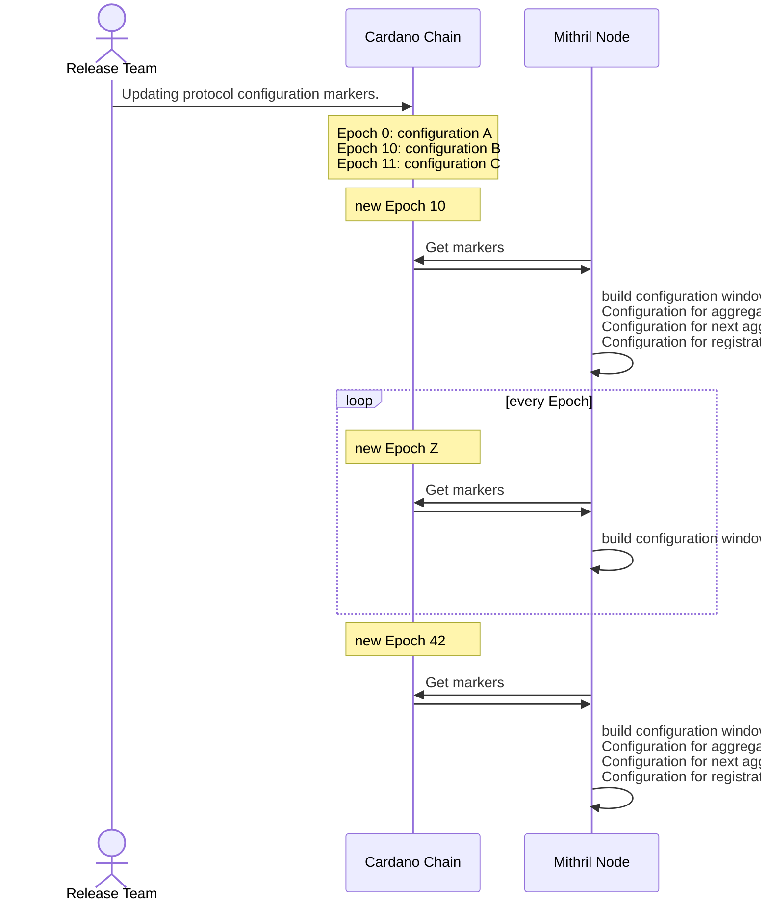

## Status

Accepted

## Context

With the aim of decentralization, we want to broadcast the Mithril network configuration without relying on the
aggregator configuration (which currently broadcasts network configuration to signers and followers aggregator
through HTTP).

## Decision

In order to synchronize the behavior of all nodes, the Release Team will define **protocol configurations** that start
at a given Cardano Epoch and last until the next defined protocol configuration's Epoch is reached. When nodes detect
an Epoch change, they refresh their configuration from the old to the new one, so all nodes transition at almost the
same time.

This mirrors the Era mechanism introduced in [ADR 4](/adr/4), applied to protocol configuration instead of node
behavior.

Markers are read from the chain using a `cardano-chain` adapter, identified by a dedicated address and verification key
so nodes can locate and authenticate marker transactions without trusting an aggregator. Publishing a marker requires
the corresponding signing key, held by the Release Team.

Legacy signers, which do not yet support reading protocol configuration from the chain, continue to obtain the current
protocol parameters from the aggregator over HTTP; they are unaffected until migrated.

## Consequences

### Release Team

The Release Team is responsible for releasing new protocol configurations for the Mithril software, and for setting the
Epoch at which protocol configurations change.

### Version monitoring

The Release Team must be aware of the software version run by signer nodes and the associated stake before scheduling a
protocol configuration change, to ensure enough of the network can read the new configuration from the chain.

### Protocol Configuration Marker

A Protocol Configuration Marker is information shared among all nodes. It represents an Epoch and its associated
configuration, such as ProtocolParameters (k, m, phi_f).

Every Protocol Configuration Marker is a transaction on the Cardano blockchain, so nodes must be able to read
blockchain transactions.

A node checks the blockchain for markers at startup and at every new Epoch. When a node detects a marker, it refreshes
its configuration window of three epochs (configuration for aggregation, next aggregation, and registration).

### Configuration Switch

Nodes must be able to switch from one configuration to another when the Epoch changes. The Mithril network
configuration carries three epoch configurations (for aggregation, next aggregation, and registration). This
configuration window is rebuilt every time the epoch switches, by looking up markers at the aggregation, next
aggregation, and registration epochs. If there is no explicit Protocol Configuration Marker at a requested epoch, this
mechanism falls back to the last known epoch's configuration.

