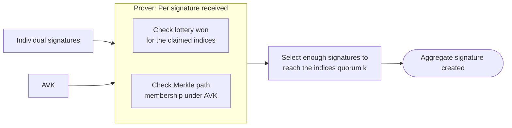
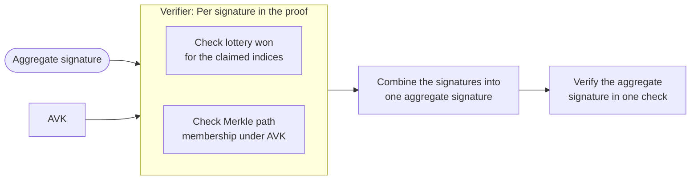

# Concatenation

The concatenation method for aggregating the signatures is the historical and most straightforward one.
It has a fast aggregation (verifying then bundling the signatures together) and verification (it uses BLS signatures for its batching capability).
However this flavor of aggregation generates large aggregate signatures (up to ~150KB).

## How aggregation is done

The prover checks the validity of the signatures received and that they correctly won the lottery with their indices.
It then verifies that the signer's leaf does belong to the [Merkle tree](../../../../glossary.md#merkle-tree) using the aggregate verification key `AVK` (the Merkle root of the tree) and the Merkle path.
Finally, the prover selects enough valid signatures to reach the quorum of `k` valid indices, and packs them together in one structure to create the aggregate signature.

## How verification is done

To verify the aggregate signature, a verifier does the same checks as the prover: that each of the signatures won its lottery for the claimed indices, and that each corresponding leaf belongs to the Merkle tree under `AVK`.
The individual signatures contain both the BLS signature and its verification key.
The signatures and the verification keys can each be batched to create a single batched aggregate signature and batched verification key.
The verifier can then perform the verification in only one pairing check using the batched values.
This saves a lot of computations since the pairing check is the expensive operation of the verification.

