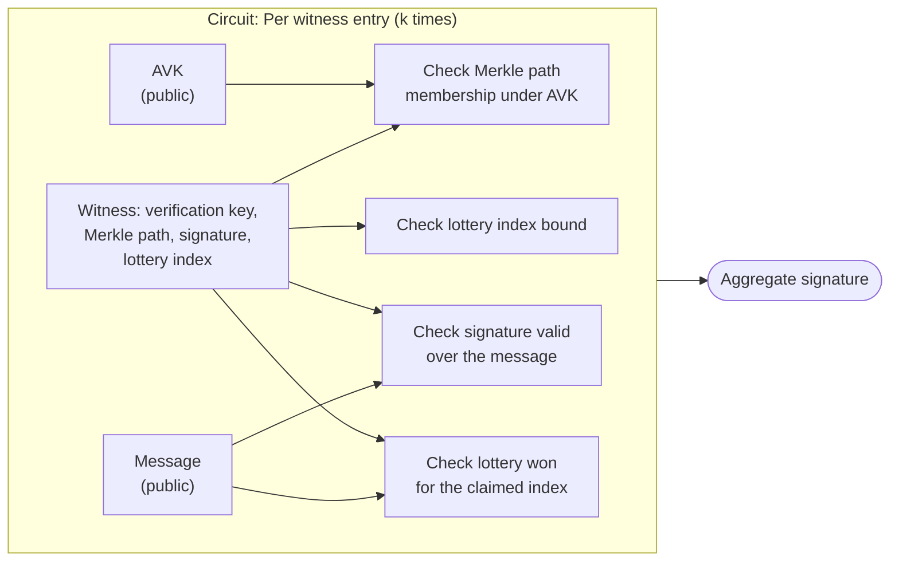

# Non-recursive SNARK

:::danger

This aggregation flavor is **unstable**.

:::

A [SNARK](../../../../glossary.md#snark) can be used to generate a succinct proof that a prover knows some signatures whose winning indices reach the quorum `k`.
It lets a prover verify signatures and aggregate those verifications into a unique small proof.
This proof can then be checked by a verifier, confirming that all the aggregated signatures are valid and that they reach the quorum.
The proof generation is a long operation but it yields a small proof that is very fast to verify.

## How aggregation is done

The aggregate signature is created using the proof generated by the SNARK.
To create this proof, one designs a circuit describing the relation to prove as constraints, for example that a signature is valid given a verification key.
For Mithril, this means running the verification algorithm for each signature inside the circuit: checking its validity, confirming the signer's Merkle tree membership, and confirming its lottery win.
To keep this efficient to prove, the signatures used are Schnorr signatures rather than BLS, and hashing uses SNARK-friendly Poseidon rather than Blake2b.

The prover selects enough valid signatures to reach the quorum `k`, and assembles them into a witness satisfying every constraint in the circuit.
The resulting proof is put in an aggregate signature and convinces a verifier that such a witness exists, without needing to reveal it: the verifier only needs this one aggregate signature, not the signatures themselves.

### What the proof attests

Given the aggregate verification key for SNARK, the root of a [Merkle tree](../../../../glossary.md#merkle-tree) committing to the stake and verification key of every registered signer, and the message being certified, the proof attests that the prover knows `k` winning lottery entries such that, for each one:

- The signer's stake and verification key form a leaf of the Merkle tree with root `AVK`, attesting it is properly registered
- The signer's signature over the message is valid under that verification key
- The signer won its lottery for the claimed index
- All `k` claimed indices are distinct and within bounds, so no lottery win is counted twice.

These conditions are encoded in a circuit that generates the SNARK proof, and verifying this proof ensures all the conditions were met.
If any condition fails, verification fails.
The circuit is publicly available, so anyone can check exactly which conditions it asserts.

## How verification is done

The aggregate signature is verified using the verification algorithm. It needs:

- The proof
- The verification key of the circuit used to create the proof
- The `AVK`
- The message

The circuit's verification key is a fixed piece of data, derived from the circuit and a one-time trusted setup, that matches the protocol parameters (`k`, `m`, `phi_f`) used to produce the proof.
It is used only for verifying the SNARK proof, fixed for a given circuit and publicly available.
The `AVK` is the root of a Merkle tree that can be recomputed by any party with access to the list of signers.
The message is what is signed by the signers, representing for example a Cardano database, a stake distribution, or a set of blocks or transactions.
