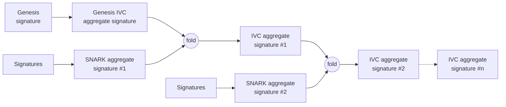
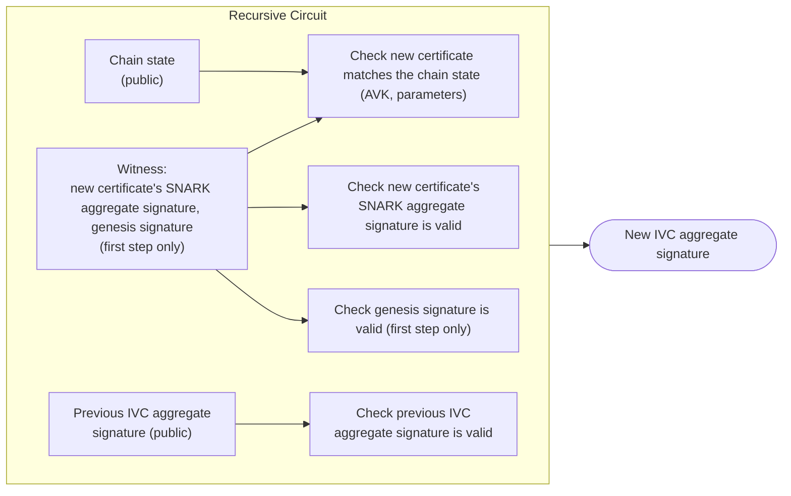

# Recursive SNARK

:::danger

This aggregation flavor is **unstable**.

:::

:::info

Verifying a single recursive aggregate signature is equivalent to verifying the whole [certificate chain](../certificates.md) from the current certificate back to the genesis certificate.

:::

A recursive [SNARK](../../../../glossary.md#snark) is a SNARK whose circuit performs the verification of other SNARK proofs, including itself.
Using such a SNARK, it is possible to build a circuit that will perform the verification of both the non-recursive SNARK aggregate signature and the recursive SNARK aggregate signature.
The recursive SNARK uses an [IVC](../../../../glossary.md#incrementally-verifiable-computation) (incrementally verifiable computation) to build a proof step by step and use this proof to create the aggregate signature.
From there, one can create a chain of aggregate signatures such that each step verifies that the chain is valid and that the newly added aggregate signature is valid.

## How aggregation is done

This method can be used to aggregate certificates into a single aggregate signature by using the non-recursive SNARK aggregate signatures of the certificates, going back to the genesis certificate.
The resulting aggregate signature attests to the validity of all accumulated SNARK aggregate signatures as well as the links between each certificate of the chain.
Checking that this aggregate signature is valid is equivalent to checking every certificate in the chain individually, back to genesis, but at the cost of verifying only one aggregate signature.

### What the aggregate signature attests

Given the chain's current state (the current epoch, its `AVK`, and the protocol parameters) and the previous step's recursive aggregate signature, the new aggregate signature attests that the prover knows a new certificate's SNARK aggregate signature such that:

- The new certificate's SNARK aggregate signature is valid, and the `AVK` it certifies matches what the previous epoch had already committed to
- The protocol parameters used by the new certificate match the ones fixed for the chain
- The previous step's recursive aggregate signature is valid, so this step vouches for the whole chain before it, not just the certificate being added
- At the very first step, a signature over the genesis message is valid under the well-known genesis key, anchoring the chain the same way the genesis certificate does today.

These conditions are encoded in a circuit that generates the aggregate signature, and verifying the aggregate signature ensures all the conditions, from the current step back to genesis, were met.
The circuit is publicly available, so anyone can check exactly which conditions it asserts.

## How verification is done

To verify a recursive aggregate signature, a verifier needs:

- The recursive proof
- The verification key of the recursive circuit
- The verification key of the non-recursive circuit
- The genesis verification key
- The chain state the proof attests to: the current epoch, its `AVK`, the message being certified, and the protocol parameters

The recursive circuit's verification key is a fixed piece of data, derived from the recursive circuit, a one-time trusted setup and the [non-recursive SNARK](./non-recursive-snark.md)'s own verification key, since each step checks a certificate proof against it.
It is fixed for a given recursive circuit and publicly available.
As mentioned at the beginning of the section, the verifier only needs to verify the recursive proof inside the recursive aggregate signature to be convinced of the validity of the certificate chain back to the genesis certificate.
